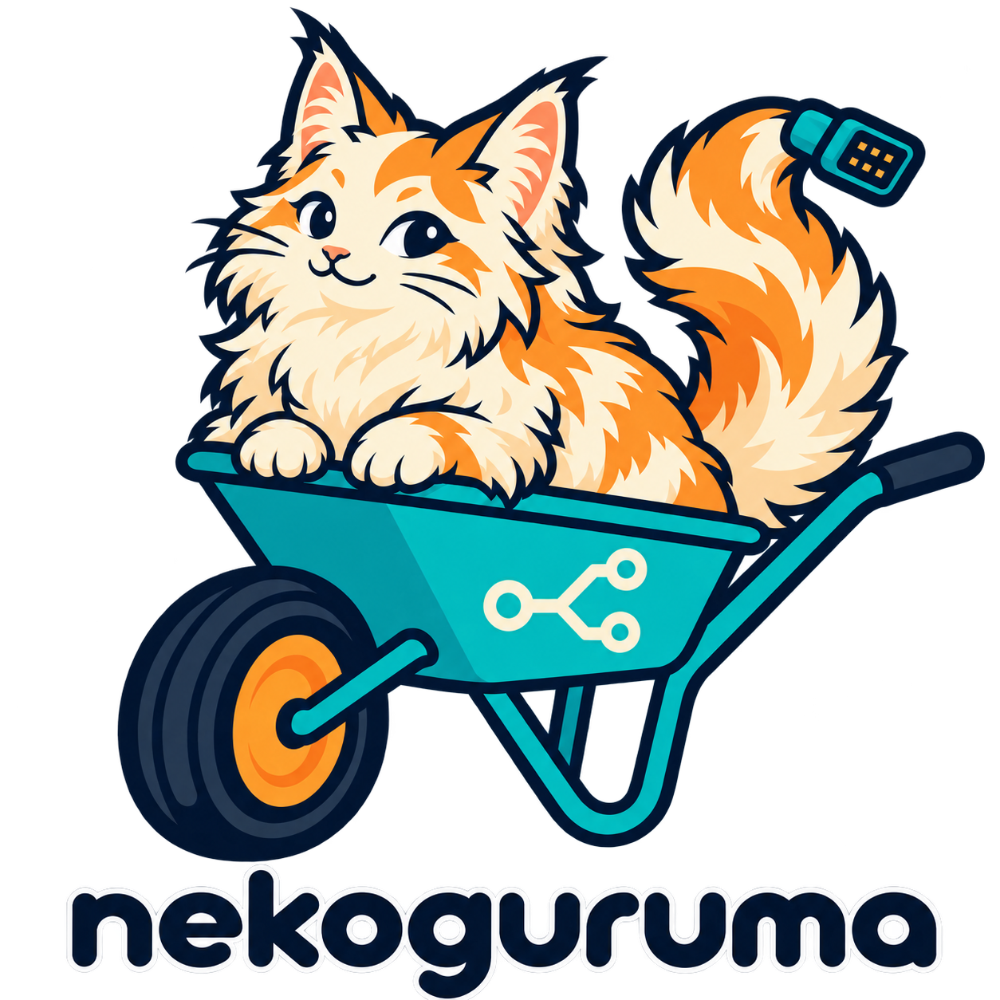

  

# Nekoguruma (NGR)

**Nekoguruma** (猫車, Japanese for "wheelbarrow"; literally "cat cart") is diagnostic software for vehicles. Its short name **NGR** stands for *Networked Gateway for Remote diagnostics*. The full lowercase name `nekoguruma` is used for file system paths and configuration directories; `ngr` is used for the command name.

## Workspace Structure

Cargo workspace corresponding to the design document `docs/system-architecture.md`, plus simulators for testing.

| Crate | Role | Design document |
|---|---|---|
| `shared-proto` | Commands, events, capabilities, job types | 5.1 / 5.3 / 9.5 |
| `shared-crypto` | Signature verification for all 3 trust layers | 11.1 |
| `diag-ir` | IR schema, bytecode, VM | 8.2 |
| `diag-frontend` | ODX/OTX parser, CSV + JS->IR conversion (server only) | 8.3 / 8.4 |
| `vendor-manifest` | Manifest parser for ECU distribution packages | 11.2 |
| `j2534-defs` | ABI-independent J2534 constants, protocol names, COMPARAM mapping | 8.5 |
| `vci-discovery` | Discovery of J2534 devices and D-PDU API implementations | 7.1 |
| `server` | Web API, jobs, distribution management, GW | 3.2 |
| `agent` | Discovery, job execution, journal; library plus the `ngr-agent` binary | 3.3 |
| `worker-host` | ABI detection from the library header, launching worker services, authenticated gRPC client | 7.3 / 7.4 |
| `iso22900*`, `j2534-0404*`, `vci-service-*` | J2534 / D-PDU API FFI, wrappers, discovery, mocks and the gRPC worker services (`docs/worker-crates.md`) | 3.4 / 7.1.2 / 7.4 |
| `sim-vci` | cdylib exposing J2534 (mock) | 13.4 |
| `sim-ecu` | Simulation of UDS responses and flash state transitions | 13.4 |

## License

MIT. See [LICENSE](LICENSE).
