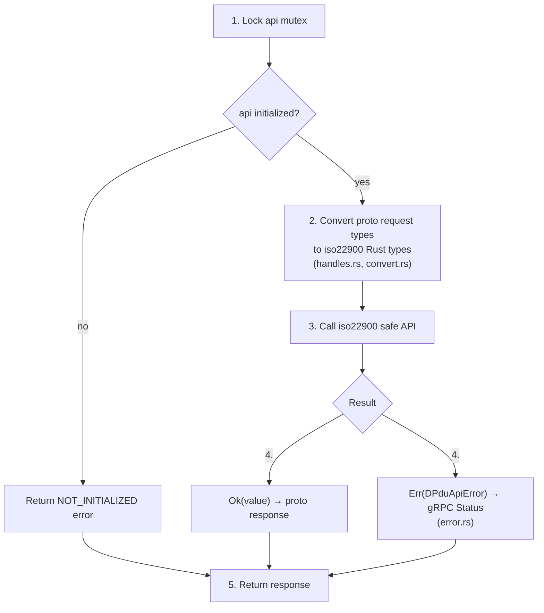
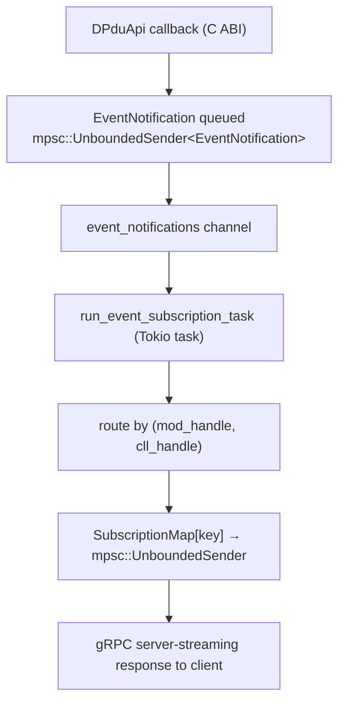

# iso22900-service Architecture

## Overview

`iso22900-service` exposes the ISO 22900-2 D-PDU API as a gRPC service by wrapping the `iso22900` safe Rust layer, which in turn loads a vendor-supplied D-PDU DLL via FFI (`iso22900-sys`). It implements all 25 RPC methods defined in `vci-service-interface/src/proto/service.proto`.

---

## Module Structure

```
iso22900-service/src/
├── main.rs              Entry point: calls vci_service_launcher::start_service::<Iso22900Service>()
├── lib.rs               Re-exports Iso22900Service and StartupConfig
├── config.rs            Startup argument parser (iso22900:<lib>?port=<u16>)
├── error.rs             Error mapping: DPduApiError / RegistryError → gRPC Status
└── service/
    ├── rpc.rs           Iso22900Service struct + VciService trait impl (all 25 RPC methods)
    ├── rpc_module.rs    Module RPCs: GetModuleIds, ModuleConnect, ModuleDisconnect
    ├── rpc_link.rs      CLL RPCs: CreateCLL, DestroyCLL, ConnectCLL, DisconnectCLL,
    │                              LockResource, UnlockResource, GetComParam, SetComParam
    ├── rpc_primitive.rs COP RPCs: StartComPrimitive, CancelComPrimitive,
    │                              GetStatus, GetEventItem
    ├── rpc_misc.rs      Misc RPCs: IoCtl, GetObjectId, GetUniqueRespIdTable,
    │                              SetUniqueRespIdTable, GetVersion, GetTimestamp,
    │                              GetResourceIds, GetResourceStatus, GetConflictingResources
    ├── events.rs        SubscribeEvent streaming + callback dispatch
    ├── handles.rs       Handle type conversions (proto ↔ iso22900 handle types)
    ├── convert.rs       Deep proto ↔ Rust type conversions (ComParam, EventItem, etc.)
    └── ioctl.rs         IOCTL command name resolution and data conversion
```

---

## Service State

`Iso22900Service` is a `Clone`able struct (cheap clone via `Arc`) held inside the Tonic gRPC runtime:

```
Iso22900Service {
    startup_config: StartupConfig,          // library name, requested port
    api: Arc<Mutex<Option<DPduApi>>>,       // the live D-PDU API handle (None = not initialized)
    event_notifications: mpsc::UnboundedSender<iso22900::EventNotification>,
    subscriptions: Arc<Mutex<SubscriptionMap>>,  // (mod_handle, cll_handle) → stream sender
    cop_tags: Arc<Mutex<CopTagMap>>,        // (mod_handle, cll_handle, cop_handle) → client-supplied cop_tag (ADR-204)
    shutdown: watch::Receiver<bool>,        // signalled when stop is requested
}
```

The `DPduApi` handle is wrapped in `Option` because initialization can fail; callers receive `PDU_ERR_PDUAPI_NOT_CONSTRUCTED` when it is `None`.

---

## RPC Dispatch Flow

Each RPC handler follows this pattern:



The `api` mutex is held only for the duration of the synchronous DPduApi call. It is released before any async work.

---

## Event Subscription Architecture



### SubscribeEvent Lifecycle

1. Client calls `SubscribeEvent(cll_handle)`.
2. Service registers an event callback on the native DLL via `iso22900::DPduApi::register_event_callback`.
3. An `mpsc::UnboundedSender` is inserted into `SubscriptionMap` keyed by `(module_handle, cll_handle)`.
4. The background `run_event_subscription_task` Tokio task routes incoming `EventNotification`s from the shared channel to the correct sender.
5. The stream stays open until:
   - The client cancels (gRPC deadline or explicit cancel).
   - The CLL is destroyed: `terminate_subscription` removes the sender; the stream receives `Status::Cancelled`.
   - The module is disconnected: `terminate_subscriptions_for_module` removes all senders for that module.

---

## Handle Lifecycle

Handles in the proto API map directly to `iso22900` Rust handle types:

| Proto message | iso22900 type | Notes |
|---------------|--------------|-------|
| `SystemHandle` | — | Used only for system-level GetEventItem / SubscribeEvent |
| `ModuleHandle { module_handle }` | `ModuleHandle(UNUM32)` | Opaque numeric ID from `PDUGetModuleIds` |
| `ComLogicalLinkHandle { module_handle, cll_handle }` | `ComLogicalLinkHandle(UNUM32)` | Compound: both IDs required |
| `ComPrimitiveHandle { module_handle, cll_handle, cop_handle }` | `ComPrimitiveHandle(UNUM32)` | Three-level compound |

Handle conversion is in `service/handles.rs`. Invalid or missing handles return `PDU_ERR_INVALID_HANDLE`.

---

## ComParam Conversion

ComParam values travel as `ParamItem` proto messages with a `oneof param_data` that covers all D-PDU data types:

```
ParamItem
├── com_param_id: uint32
├── com_param_class: PDUParamClass
└── param_data (oneof):
    ├── unum32         → iso22900::ComParamValue::Unum32
    ├── snum32         → iso22900::ComParamValue::Snum32
    ├── bytefield      → iso22900::ComParamValue::ByteField
    ├── longfield      → iso22900::ComParamValue::LongField
    └── structfield    → iso22900::ComParamValue::StructField
        ├── session_timing
        ├── access_timing
        ├── tls_version_and_cipher
        └── vendor_specific
```

Conversion is in `service/convert.rs`.

---

## Error Mapping

| iso22900 Error | gRPC Status |
|----------------|------------|
| `DPduApiError::PduStatus(PDU_ERR_INVALID_HANDLE)` | `INVALID_ARGUMENT` |
| `DPduApiError::PduStatus(PDU_ERR_CLL_NOT_CONNECTED)` | `FAILED_PRECONDITION` |
| `DPduApiError::PduStatus(PDU_ERR_RESOURCE_BUSY)` | `RESOURCE_EXHAUSTED` |
| `DPduApiError::PduStatus(PDU_ERR_INVALID_PARAMETERS)` | `INVALID_ARGUMENT` |
| `DPduApiError::PduStatus(PDU_ERR_SHARING_VIOLATION)` | `ALREADY_EXISTS` |
| Other `PduStatus` | `INTERNAL` |
| `RegistryError::NotFound` | `NOT_FOUND` |
| `RegistryError::Io` | `INTERNAL` |

Mapping logic is in `error.rs`. `map_construct_error` and `map_registry_error`
log the full underlying error (which may contain a local filesystem path or
raw OS error text, e.g. from a failed library load) via `tracing::error!` and
return a sanitized, generic message in the `Status` — see ADR-089.

---

## Startup and Shutdown

Startup is handled by `vci-service-launcher::start_service::<Iso22900Service>()`:

1. Parse startup argument: `iso22900:<library-name>?port=<u16>` (`config.rs`).
2. Initialize logging from the `config.toml` file (loaded via `vci-service-config`).
3. Call `Iso22900Service::new(config)`:
   - Resolve `<library-name>` to a DLL path via a single call to
     `iso22900_registry::resolve_library_path()`: a configured
     `config.toml` `library_path` entry
     (`config.apis.iso22900.libs.<lib>.library_path`), resolved via
     `iso22900_registry::find_library_path()`, takes priority when present;
     otherwise it falls back to `iso22900-registry`'s RDF-based lookup
     (see ADR-030, ADR-034, ADR-035).
   - Load the D-PDU DLL from the resolved path.
   - Call `PDUConstruct` to initialize the API.
   - Spawn the event notification routing task.
4. Start gRPC server (bind ephemeral or specified port).
5. Start JSON-RPC stdio control loop.

Shutdown is initiated via JSON-RPC `stop` method or stdin close:
1. `shutdown` watch channel is signalled.
2. Active `SubscribeEvent` streams receive `Status::Cancelled`.
3. gRPC server shuts down gracefully.
4. `PDUDestruct` is called to release the DLL handle.

---

## Related Documents

- `iso22900-service/docs/grpc-instance-spec.md` — JSON-RPC stdio contract
- `iso22900-service/docs/subscribe-event-shutdown.md` — SubscribeEvent termination details
- `vci-service-interface/src/proto/service.proto` — gRPC API definition
- `docs/rpc-api-guide.md` — complete RPC method reference
