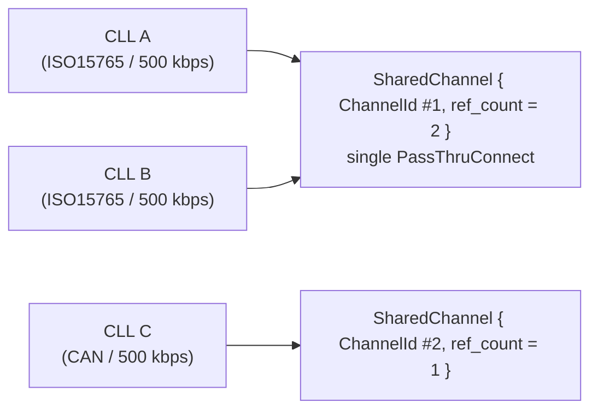
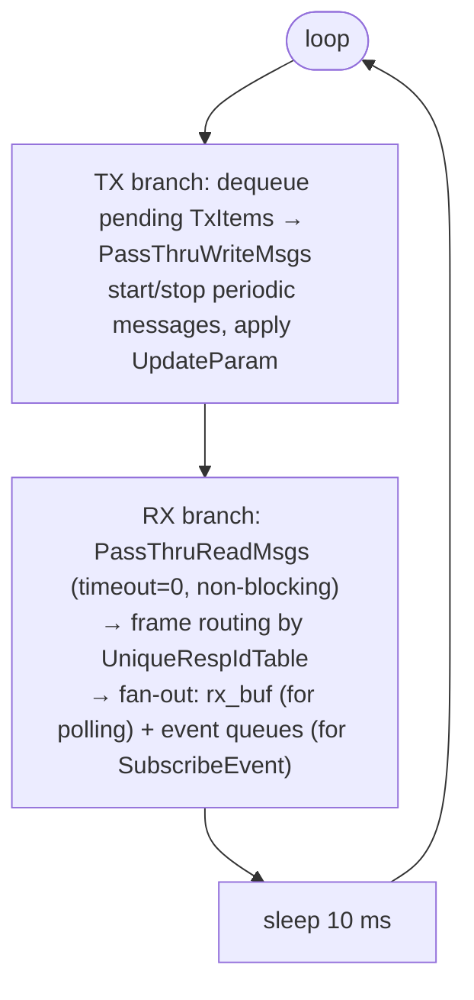

# j2534-0404-service — Adapter Design: D-PDU API → J2534

## Overview

`j2534-0404-service` is a **protocol adapter** that exposes the ISO 22900-2 D-PDU API (as a gRPC service) while using a SAE J2534-1 v04.04 DLL as the underlying hardware interface.

D-PDU API clients (which speak the VCI gRPC interface) see the full ISO 22900-2 model. The service maps each D-PDU concept onto the closest J2534-1 concept. This document explains that mapping.

---

## Concept Mapping

| D-PDU API (ISO 22900-2) | J2534-1 (SAE v04.04) | Notes |
|-------------------------|----------------------|-------|
| Module | Device | `PassThruOpen` → `ModuleHandle`. One module per configured `[[...modules]]` entry (`config.apis.j2534-0404.libs."<lib>".modules`, ADR-107; a single default module when unconfigured); at most one device open per service process at a time (not simultaneous multi-device) — `PassThruOpen`'s `pName` carries the target module's `pname` connection-target string, an out-of-spec vendor extension. |
| ComLogicalLink (CLL) | Channel | `PassThruConnect` → `ChannelId`. Multiple CLLs can share one channel. |
| ComPrimitive (COP) | Message operation | `PassThruWriteMsgs` + `PassThruReadMsgs`. No native COP concept in J2534. |
| Resource | Protocol + baud rate + pins | Represented as `(protocol_id, baud_rate)` pair on a SharedChannel. |
| ComParam | SCONFIG / PassThruIoctl config | Mapped via `comparam-mapping.md`. |
| UniqueRespIdTable | Per-CLL frame routing + TX ID/header source | Service-level routing (RX) and, since ADR-050, the source of the CAN ID / KWP / J1850 header the service builds for outgoing `cop_data` (TX); J2534 has no equivalent. |
| Event callback | Background poll task | J2534 has no async callbacks; a 10 ms Tokio task polls PassThruReadMsgs. |
| IOCTL | PassThruIoctl | Direct passthrough for most commands; some are service-managed. |

---

## Physical Channel Sharing

D-PDU allows multiple CLLs over the same physical resource. J2534 requires one `PassThruConnect` call per channel.

The service resolves this by maintaining `SharedChannel` structs keyed by `(protocol_id, baud_rate)`:



- `ConnectComLogicalLink` increments ref_count; `PassThruConnect` is only called when ref_count goes from 0 → 1.
- `DisconnectComLogicalLink` decrements ref_count; `PassThruDisconnect` is only called when ref_count reaches 0.

See ADR-005 (pass-all filter, superseded), ADR-038 (per-protocol filter type restriction),
ADR-039 (point-to-point `FLOW_CONTROL_FILTER` per ECU from `UniqueRespIdTable`; its
original zero-mask fallback for uncovered CLLs is removed, see ADR-122), ADR-040
(`CP_Can*Format` Table B.13 decoding for extended addressing / 29-bit CAN Id / flow-control
gating in that filter), ADR-041 (a second point-to-point `FLOW_CONTROL_FILTER` from
`CP_CanRespUUDTId`, sharing the same `CP_CanPhysReqId` flow-control CAN ID as the USDT
filter), ADR-048 (`ConnectComLogicalLink` builds these filters from the CLL's
`UniqueRespIdTable` as already configured at connect time, with no pass-all fallback
installed there), ADR-122 (the zero-mask pass-all fallback is removed from every
remaining lifecycle point too — an unaddressed CLL never gets a `FLOW_CONTROL_FILTER`
of its own, ever), ADR-010 (tester-present on shared channel), ADR-012 (race rollback).

---

## Background RX Polling Task

J2534 has no asynchronous notification mechanism. The service spawns one Tokio task per `SharedChannel` that loops every 10 ms:



The task also handles hard-channel errors (ERR_FAILED / lost-comm) by emitting a `PDU_ERR_EVT_LOST_COMM_TO_VCI` error event and transitioning all CLLs on the channel to `PDU_CLLST_OFFLINE`. See ADR-016→ADR-019.

---

## COP Execution Model

J2534 does not have a native ComPrimitive concept. The service models COP execution in software:

- `COPT_SENDRECV`: enqueues a `TxItem::SendRecv` on the SharedChannel. The poll task dequeues it, calls `PassThruWriteMsgs`, then watches RX frames against the `ExpectedResponse` filter until a match or timeout. See ADR-006, ADR-014, ADR-018. `cop_data` is payload-only; the service builds the ID/header prefix from ComParams and `UniqueRespIdTable` (`tx_header::build_tx_message`, ADR-050) and validates the constructed message against the SAE J2534-1 per-protocol TX message size range before it is queued (ADR-049).
- `COPT_STARTCOMM` / `COPT_STOPCOMM`: manage the tester-present periodic message via `PassThruStartPeriodicMsg` / `PassThruStopPeriodicMsg`. See ADR-010. `COPT_STOPCOMM` also transmits non-empty `cop_data` as a final message (`PassThruWriteMsgs`, resolved the same way as `COPT_SENDRECV`'s payload), after stopping the periodic message and before the CLL returns to `PDU_CLLST_ONLINE`; empty `cop_data` still transmits nothing (ADR-085). When `cop_data` is non-empty, `ComPrimitiveCtrlData.expected_response_array`/`NumReceiveCycles` are honored too (ADR-087): the final transmit is followed by the same bounded, non-cancellable receive phase `COPT_SENDRECV` runs, reporting a match via `ResultData`/`resultitem`; `NumReceiveCycles == -1` (IS-CYCLIC) is rejected synchronously, since the COP must terminate to return the CLL to `PDU_CLLST_ONLINE`. `NumReceiveCycles == 0` (the default when `cop_ctrl_data` is absent) stays fire-and-forget.
- `COPT_UPDATEPARAM`: applies working-set ComParams to the hardware channel via `PassThruIoctl(IOCTL_SET_CONFIG)`. `DATA_RATE` is excluded (cannot be changed post-connect). See ADR-011.
- `COPT_DELAY`: implemented as a timed wait inside the poll task without hardware interaction.

COP status transitions (`PDU_COPST_WAITING` → `PDU_COPST_EXECUTING` → `PDU_COPST_FINISHED`) are tracked by the `executing_cop` field on `SharedChannel`. Only one COP executes at a time per channel; others wait. See ADR-021.

---

## Response-Pending NRC Handling

When a `COPT_SENDRECV` COP receives NRC 0x78 (RequestCorrectlyReceived-ResponsePending), or 0x21/0x23 (busyRepeatRequest / uploadDownloadNotAccepted), the service automatically retries waiting for the final response without surfacing the interim NRC to the client. This is configurable via service-level ComParams. See ADR-018.

---

## ComParam Mapping

D-PDU ComParams (`CP_*`) are mapped to J2534 `SCONFIG` parameter IDs for `PassThruIoctl(IOCTL_SET_CONFIG / IOCTL_GET_CONFIG)`.

- Full mapping table: [`comparam-mapping.md`](comparam-mapping.md)
- Per-protocol support matrix: [`comparam-protocol-support.md`](comparam-protocol-support.md)

Service-level ComParams (IDs 0x8001–0x8xxx) have no J2534 equivalent and are managed internally:

| ID range | Category |
|----------|---------|
| 0x8001–0x8009 | Tester-present configuration |
| 0x8010–0x801x | Session timing (P2, P2*, P3) |
| 0x8020–0x802x | Error handling (RC-pending NRC config) |
| 0x8030+ | COM-layer parameters |

---

## Protocol Name Resolution

D-PDU clients identify protocols by name string (e.g., `"ISO_15765_3_on_ISO_15765_2_on_CAN_ISO11898_2_DWCAN"`). The service resolves these to J2534 protocol IDs via a two-step lookup:

1. **Short-name aliases** (~90 entries in `names.rs`): case-insensitive match against ISO 22900-2 Annex B.1.5 short names and common aliases.
2. **Numeric fallback**: if the name parses as a decimal integer, it is used directly as the protocol ID.

Full name-to-ID mapping: [`protocol-mapping.md`](protocol-mapping.md)

---

## Event Ordering on CLL Disconnect / Hard Error

When a CLL is disconnected or destroyed, or the channel enters a hard-error state, events are emitted in a defined order to satisfy ISO 22900-2 client expectations:

```
On DisconnectComLogicalLink / DestroyComLogicalLink:
  1. PDU_COPST_CANCELLED  (for any executing COP)
  2. PDU_CLLST_OFFLINE    (CLL status change)

On hard channel error (lost-comm):
  1. PDU_ERR_EVT_LOST_COMM_TO_VCI  (error event)
  2. PDU_COPST_CANCELLED           (for executing COP)
  3. PDU_CLLST_OFFLINE             (for each CLL on the channel)
  4. PDU_MODST_NOT_AVAIL           (module status)
```

See ADR-019 for the authoritative event ordering specification.

---

## Module State Tracking

The service tracks module state separately from individual CLL states using a `ModuleState` struct. This supports `PDU_MODST_READY` / `PDU_MODST_NOT_AVAIL` transitions on hard errors, which affect all CLLs across all shared channels on the device. See ADR-020.

---

## Known Limitations

- J2534 v05.00 is not supported by this service (out of scope per ADR-017).
- Protocols requiring J2534-specific features not in v04.04 (e.g., Ethernet-based DoIP) are not supported.
- `CP_SamplesPerBit` has no J2534 equivalent and is not applied to hardware. `CP_UartConfig` is forwarded to hardware as `DATA_BITS` for ISO9141/ISO14230 channels, but not for SCI channels; see `comparam-protocol-support.md` for the full per-protocol breakdown.
- The 10 ms poll interval introduces latency between frame reception and event delivery.
