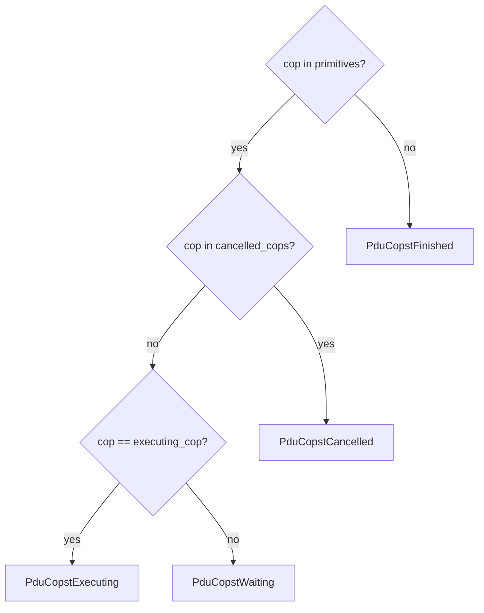

# ADR-021: PduCopstWaiting via executing_cop Tracking

**Date:** 2026-06-29  
**Status:** Superseded by ADR-117  
**Affects:**
- `j2534-0404-service/src/service.rs` (`SharedChannel.executing_cop`)
- `j2534-0404-service/src/service/events.rs` (`poll_channel_events`)
- `j2534-0404-service/src/service/rpc_link.rs` (`rpc_connect_com_logical_link`)
- `j2534-0404-service/src/service/rpc_primitive.rs` (`GetStatus(cop)`)

## Context

ISO 22900-2 §9.10.4 defines three COP statuses for in-flight operations:

| Status | Meaning |
|---|---|
| `PDU_COPST_WAITING` | In the queue, not yet started |
| `PDU_COPST_EXECUTING` | Currently being executed by the poll task |
| `PDU_COPST_CANCELLED` | Cancelled, pending poll-task acknowledgement |
| `PDU_COPST_FINISHED` | Completed (or never existed) |

ADR-002 established the `primitives` map + `cancelled_cops` set to distinguish
Cancelled from Finished.  However, ADR-002 noted:

> *"`PduCopstWaiting` (ISO 22900-2 §9.10.4) is not yet implemented; it would
> require tracking when the poll task transitions a COP from 'queued' to
> 'executing'."*

Before this fix, `GetStatus(cop)` returned `PduCopstExecuting` for all COPs
that were in `primitives` and not in `cancelled_cops`, regardless of whether
the poll task had actually begun executing them.  A client with multiple
outstanding COPs could not distinguish which one the poll task was currently
processing.

## Decision

### `SharedChannel.executing_cop`

A new field is added to `SharedChannel`:

```rust
executing_cop: Arc<Mutex<Option<u32>>>,
```

`None` when the poll task is idle between items; `Some(cop_handle)` from the
moment the poll task begins executing the item until `primitives.remove` cleanup.

The `Arc<Mutex<...>>` is created in `rpc_connect_com_logical_link` when a new
physical channel is opened, and stored in both `SharedChannel` and passed to
`spawn_channel_poll_task`.

### Poll task: set/clear protocol

In `poll_channel_events`, after the pre-flight cancellation check passes and
immediately before the `match item { ... }` dispatch:

```rust
// Set before dispatch.
*executing_cop.lock().await = Some(item_cop);

match item {
    TxItem::SendRecv { ... } => { ... }
    // ...
}

// Clear before primitives.remove (normal completion).
*executing_cop.lock().await = None;
primitives.lock().await.remove(&item_cop);
```

Items that are skipped via the explicit-cancel or implicit-cancel path never
set `executing_cop`.

### `GetStatus(cop)` — three-way distinction



`executing_cop` is looked up by finding the CLL's `channel_key` in
`logical_links`, then the `SharedChannel` in `shared_channels`.

## Race-condition analysis

| Window | GetStatus result |
|---|---|
| COP enqueued, poll task not yet at dequeue | `PduCopstWaiting` ✓ |
| Poll task dequeued, pre-flight passed, `executing_cop = Some(h)` set | `PduCopstExecuting` ✓ |
| Item handler complete, `executing_cop = None`, before `primitives.remove` | `PduCopstWaiting` (brief, negligible) |
| After `primitives.remove` | `PduCopstFinished` ✓ |
| CLL destroyed mid-flight (`cancel_link_cops` ran) | `PduCopstFinished` ✓ (removed from primitives) |
| Explicit cancel (in `cancelled_cops`, still in `primitives`) | `PduCopstCancelled` ✓ |

The brief `Waiting` window after `executing_cop` clear and before
`primitives.remove` is harmless: the COP is logically finished at that point
and a polling client that sees `Waiting` and immediately re-polls will see
`Finished`.

## Alternatives Considered

1. **`AtomicU32` instead of `Mutex<Option<u32>>`** — Lower overhead, but
   requires a sentinel value (0 or `u32::MAX`) and adds edge-case risk.
   `Mutex<Option<u32>>` is clear and consistent with the rest of the codebase.

2. **Track a `currently_executing: bool` in `LogicalLinkState`** — Would require
   the poll task to acquire `logical_links` lock for every item start/end,
   adding contention.  Per-channel `executing_cop` has no lock contention with
   the CLL map.

3. **Keep returning `PduCopstExecuting` for all queued COPs** — Simpler, but
   violates ISO 22900-2 §9.10.4.  Clients that depend on `PduCopstWaiting`
   to know when to issue additional COPs (pipeline management) would malfunction.

## Consequences

- `GetStatus(cop)` now correctly returns `PduCopstWaiting` for queued-but-not-yet-
  executing COPs, satisfying ISO 22900-2 §9.10.4.
- One `Arc<Mutex<Option<u32>>>` is added per physical channel (negligible overhead).
- ADR-002's deferred gap for `PduCopstWaiting` is now resolved.
