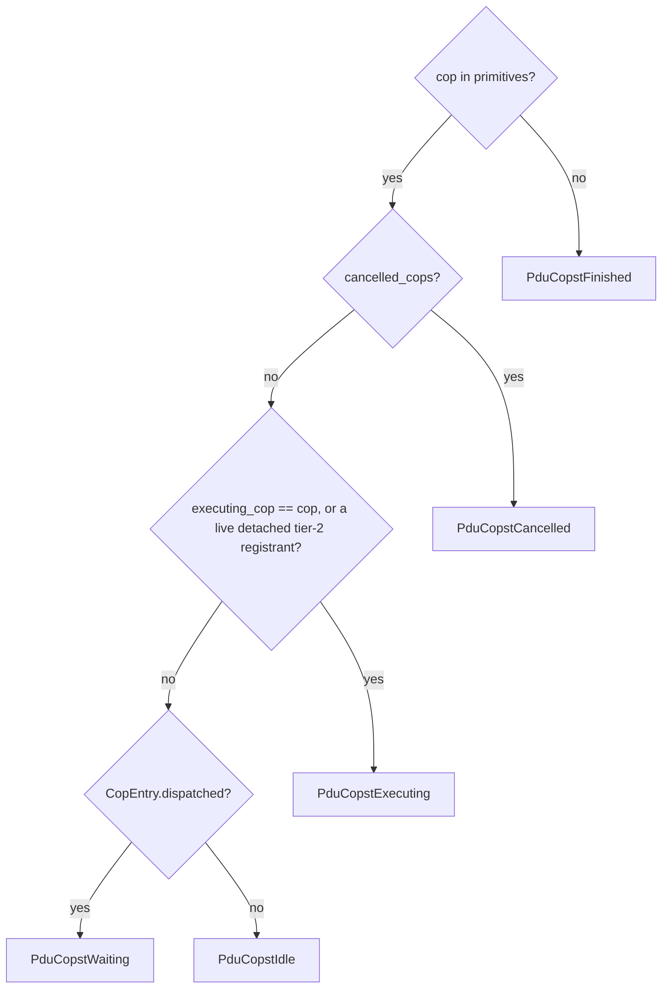

# ADR-117: PDU_COPST_IDLE vs. PDU_COPST_WAITING — CopEntry Dispatch Tracking

**Date:** 2026-07-23
**Status:** Accepted (supersedes ADR-021)
**Affects:**
- `j2534-0404-service/src/service.rs` (`J2534Service::primitives`, `CopEntry`)
- `j2534-0404-service/src/service/events.rs` (`dispatch_tx_item`)
- `j2534-0404-service/src/service/rpc_primitive.rs` (`StartComPrimitive`, `GetStatus(cop)`)

## Context

ISO 22900-2:2009(E) §D.1.4 (Table D.1, line 6264-6286) defines two distinct COP
statuses that ADR-021 conflated into one:

| Status | Meaning (D.1.4) |
|---|---|
| `PDU_COPST_IDLE` (0x8010) | queued but not yet processed — a COP the poll task has never yet dispatched. |
| `PDU_COPST_WAITING` (0x8014) | a periodic send ComPrimitive (NumSendCycles > 1) that has completed one cycle and is now idle until its next cycle is due. |

ADR-021's own Context table stated `PDU_COPST_WAITING` means "In the queue, not
yet started" and never mentioned `PDU_COPST_IDLE` at all — that is actually
`PDU_COPST_IDLE`'s meaning, not `PDU_COPST_WAITING`'s. Built on that
misreading, `GetStatus(cop)` reported `PduCopstWaiting` for two genuinely
different situations: (1) a COP freshly queued via `StartComPrimitive` that
the poll task has not yet touched, and (2) a cyclic (`NumSendCycles > 1`/`-1`)
COP resting between send cycles after having already run at least once. Only
case (2) is `PDU_COPST_WAITING` per D.1.4; case (1) is `PDU_COPST_IDLE`.

This gap was tracked as conformance-audit finding **B26** (moved there from
the audit's former A2-2, `j2534-0404-service/docs/iso22900-2-conformance-audit.md`),
which recommended revisiting ADR-021's D.1.4 citation and fixing code and ADR
together once confirmed. This ADR is that fix.

The proto already defines both variants (`vci-service-interface/src/proto/service.proto:47`,
`PDU_COPST_IDLE = 0x8010`) — no interface change was needed, only the service's
internal tracking and `GetStatus` branch.

## Decision

### `CopEntry`: fold the dispatch flag into `primitives`'s own value type

`J2534Service::primitives` (`Arc<Mutex<HashMap<u32, u32>>>`, `cop_handle ->
cll_handle`) becomes `Arc<Mutex<HashMap<u32, CopEntry>>>`:

```rust
/// Value type of `J2534Service::primitives` (`cop_handle -> CopEntry`).
///
/// `dispatched` distinguishes `PduCopstIdle` (`false` — never dispatched) from
/// `PduCopstWaiting` (`true` — a cyclic COP resting between cycles) in
/// `GetStatus`. It lives exactly as long as this `primitives` entry does, so
/// it can never leak independently of it: any `primitives.remove(...)` call
/// site across the crate discards `dispatched` along with `cll_handle`, with
/// no separate cleanup needed anywhere (ADR-117).
pub(super) struct CopEntry {
    pub(super) cll_handle: u32,
    pub(super) dispatched: bool,
}
```

`StartComPrimitive` inserts `CopEntry { cll_handle, dispatched: false }`.
`dispatch_tx_item` (`events.rs`), at the exact program point ADR-021's
mechanism used — immediately after `*ctx.executing_cop.lock().await =
Some(item_cop);`, i.e. after the `tx_suspended` siphon check, so a `TxItem`
parked in `tx_held` (`PDU_IOCTL_SUSPEND_TX_QUEUE`) is never marked dispatched
— flips `dispatched` to `true` in place via a single `primitives.get_mut`:
unconditional and idempotent, exactly as the retired side-set's insert was.

`GetStatus(cop)`'s existing three-way branch (Cancelled > Executing (incl.
ADR-100 detached tier-2) > Waiting) becomes a four-way split, reading
`cll_handle` and `dispatched` off the SAME `primitives.get(&cop_handle)`
lookup:



Priority order: **Cancelled > Executing (incl. detached tier-2, ADR-100) >
Waiting (`CopEntry.dispatched`) > Idle**.

### Cleanup: none needed, by construction

`dispatched` lives inside the same `HashMap` entry as `cll_handle`. Every one
of the many sites across this crate that finalizes a COP already calls
`primitives.remove(&cop_handle)` (or was audited to, per ADR-021/-100's own
history) to make `GetStatus` report `PduCopstFinished`. That single removal
now discards `dispatched` atomically along with `cll_handle` — there is no
second piece of per-COP state to separately track down and clear at each of
those sites, and therefore no way for a new finalization path to forget to do
so. Six call sites elsewhere in the crate read a `primitives` entry's contents
(rather than merely removing/checking membership) and needed updating to read
`CopEntry`'s two fields instead of a bare `u32`; every other `primitives` site
(`.remove`/`.is_some()`/`.contains_key()`) is unaffected by the value-type
change.

## Alternatives Considered

1. **Reuse `executing_cop`'s clear/set history instead of a new field** —
   `executing_cop` is a single `Option<u32>` per physical channel; it cannot
   remember "was this cop_handle ever Some" after being cleared or overwritten
   by a different COP, so it cannot answer the Idle-vs-Waiting question by
   itself. Rejected.

2. **A per-CLL `dispatched_cops: HashSet<u32>` side-set, mirroring
   `cancelled_cops`'s existing shape (tried, then abandoned)** — this is what
   actually shipped first, on the theory that widening `primitives`'s value
   type "would touch every `primitives` read site across the crate for one
   narrow question" and that a side-set was the smaller diff. Implemented,
   reviewed, and incrementally patched across three separate review rounds
   before being abandoned:

   | # | Site (`events.rs`) | When it runs | Cleanup added |
   |---|---|---|---|
   | 1 | `dispatch_tx_item`'s normal-completion tail | A dispatched COP finishes with no continuation and no live tier-2 registrant | `dispatched_cops.remove(&item_cop)` alongside the existing `cancelled_cops.remove(&item_cop)` |
   | 2 | `reap_cancelled_detached_registrants` | An ADR-100 tier-2 (migrated IS-CYCLIC) COP is cancelled after detaching | `dispatched_cops.remove(&cop_handle)` alongside `cancelled_cops.remove(&cop_handle)` |
   | 3 | `reap_expired_cyclic_registrants` | A tier-2 cyclic COP is reaped on `CP_CyclicRespTimeout` expiry | Same, alongside the existing `cancelled_cops.remove(&cop_handle)` |
   | 4 | `cancel_link_cops` (called from `DisconnectComLogicalLink`/`DestroyComLogicalLink`) | The whole CLL goes offline; every remaining COP on it is cancelled at once | `dispatched_cops.clear()` alongside the existing `registrants.clear()` |
   | 5 | `should_skip_cancelled_item` | A cyclic COP's *next* cycle is dequeued and found cancelled | `dispatched_cops.remove(&item_cop)` alongside the existing `cancelled_cops.remove(&item_cop)` |

   Sites 2-5 were found incrementally, each by a review pass on the sites
   already fixed, not designed in from the start: an initial version of this
   ADR implemented only site 1 and claimed it "mirrors the exact hygiene
   level already accepted for `cancelled_cops`" — wrong on inspection. Sites 2
   and 3 were caught by an edge-case-hunter review before the PR's first
   Codex round; sites 4 and 5 were each caught by a separate Codex review
   round on the PR. Even after five fixed sites, a subsequent design-advisor
   review identified **two more** sites with the identical gap
   (`schedule_continuation`'s requeue-failure branch and
   `poll_channel_events`'s teardown drains) still unfixed. Nine independent
   finalization sites needing a matching, easy-to-forget cleanup call — with
   the ninth and tenth found only after the ADR had already been merged in
   spirit and patched across three separate review passes — was the signal
   that a side-set tracking a per-`HashMap`-entry fact is the wrong shape:
   every `LogicalLinkState` lives for its CLL's entire lifetime (never
   dropped from `logical_links`), so any finalization path the side-set
   cleanup missed left a real, permanent leak, with a downstream risk of
   mislabeling a later, unrelated COP as `Waiting` instead of `Idle` if the
   global `cop_handle` counter ever wrapped onto a stale entry. Superseded by
   this ADR's `CopEntry` decision: folding `dispatched` into the SAME
   `HashMap` entry `cll_handle` already lives in means every one of those same
   nine-plus sites' pre-existing `primitives.remove` call needed no
   companion cleanup call at all, closing the entire leak class by
   construction rather than by enumeration. The "touches every read site"
   concern that motivated rejecting this approach originally turned out to be
   overstated: only six call sites in the crate actually read a `primitives`
   entry's contents (as opposed to removing it or checking membership), and
   each needed only a one-line `.1`/`.cll_handle` or `.copied()`/two-field
   read adjustment.

## Consequences

- `GetStatus(cop)` is now spec-exact for the Idle/Waiting distinction per ISO
  22900-2 §D.1.4, closing conformance-audit finding B26.
- ADR-021's own accepted "brief transient Waiting window after
  `executing_cop` clear and before `primitives.remove`" (a genuinely finished
  COP momentarily reads as if still Waiting) is unchanged by this ADR and
  remains harmless for the same reason ADR-021 already gave: a client that
  sees it and immediately re-polls will see `Finished`.
- **A2-24** (`SubscribeEvent` never emits a `PduCopstWaiting`/`PduCopstExecuting`
  notification pair around cyclic transitions, only `GetStatus` polling
  reflects them) was explicitly **out of scope** for this ADR — closed by
  ADR-118, see that ADR for the `SubscribeEvent`-visible fix.
- `GetStatus(cop)`'s `CopHandle` branch now reads `cll_handle` and `dispatched`
  off a single `primitives.lock().await.get(&cop_handle)` call, rather than
  two separately-locked reads (`primitives` then the side-set's
  `logical_links` entry). This is an improvement over the side-set design,
  not merely a refactor: it removes a lock-acquisition gap that previously
  existed between reading "which CLL owns this COP" and "has this COP ever
  been dispatched," even though that gap was never shown to be exploitable in
  practice for the side-set design (sites 4/5's `primitives.remove`-before-
  side-set-cleanup ordering meant a concurrent `GetStatus` landing in the gap
  always saw `Finished` first, per the analysis this ADR previously
  documented and has since removed as no-longer-relevant history).
- `tests/grpc_mock/cop_ctrl_cycles.rs` pins: a queued-but-never-dispatched COP
  reading `Idle`; a 2-cycle cyclic COP's full
  `Idle -> Executing -> Waiting -> Executing -> Finished` walk; a COP held
  in `tx_held` via `PDU_IOCTL_SUSPEND_TX_QUEUE` before ever being dispatched
  still reading `Idle`, not `Waiting`; a cyclic COP parked `Waiting` and then
  cancelled by `DisconnectComLogicalLink` reporting `Finished`, with a fresh
  COP after reconnect reading `Idle`; and the same parked-then-cancelled walk
  via explicit `CancelComPrimitive` instead of a disconnect. These tests pin
  observable gRPC behavior and are unchanged in structure/assertions by this
  ADR's `CopEntry` rewrite — only their doc comments were updated to describe
  the current mechanism instead of the retired side-set.
- This supersedes ADR-021: the `executing_cop` tracking mechanism and its
  Cancelled/Executing/Waiting three-way split are retained unchanged, but its
  Context table's misreading of D.1.4 (and its resulting Idle-omitting
  two-state model) is corrected by this ADR's four-way split.
- A pre-existing, separate gap in `cancelled_cops` (not `dispatched_cops`,
  and not introduced by this ADR) — `schedule_continuation`'s requeue-failure
  branch and `poll_channel_events`'s teardown drains don't clean it up either
  — was found during this ADR's design-advisor review and left unfixed here,
  since `cancelled_cops` is a separate, older mechanism than the one this ADR
  revises. It was later closed by the PR #78 edge-case-hunter follow-up
  (`drain_cancelled_cop_if_finalized`, folded into `emit_terminal_if_live`
  and `cancel_link_cops`).
