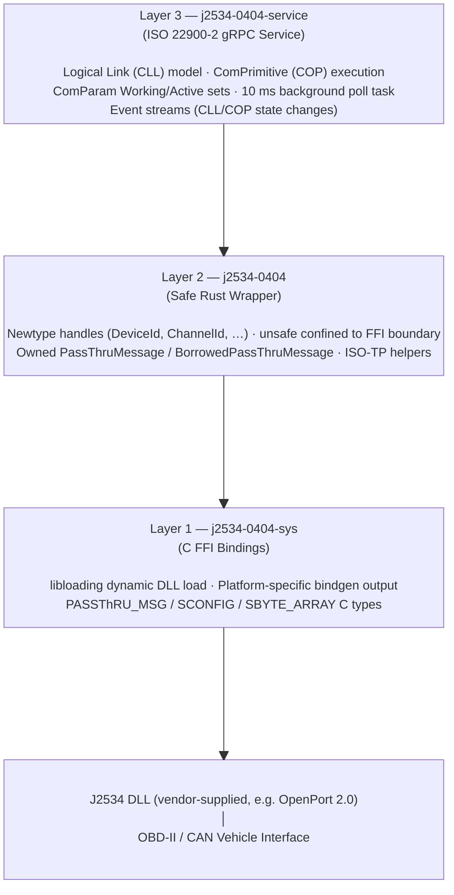
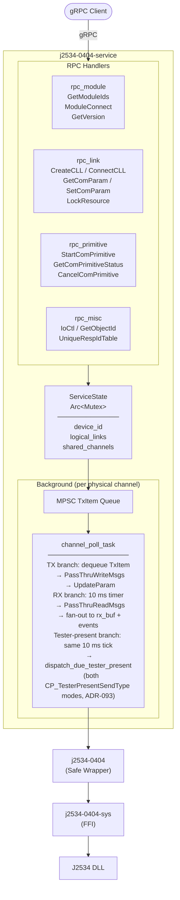
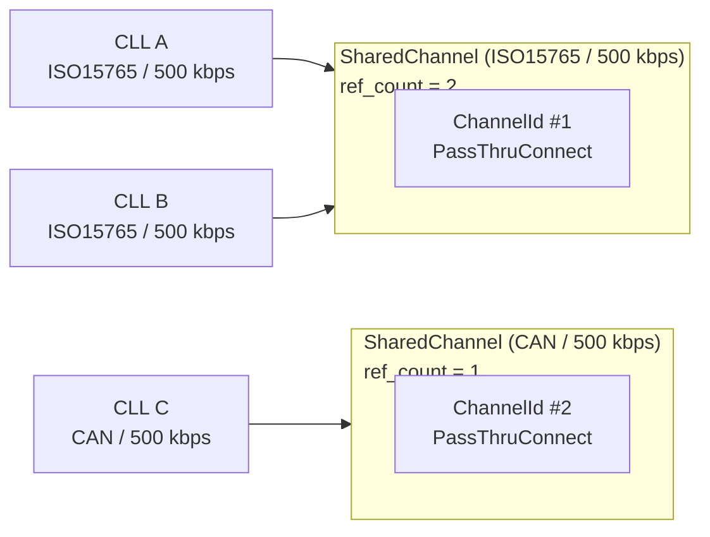
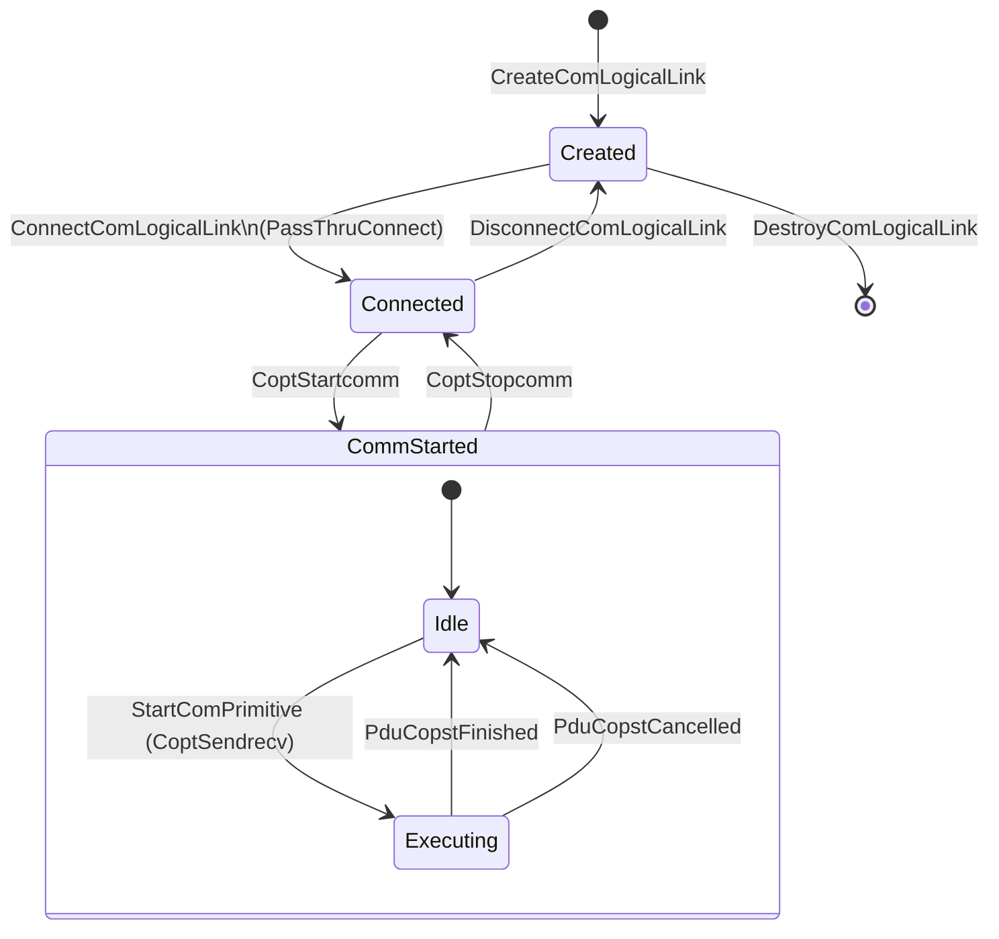
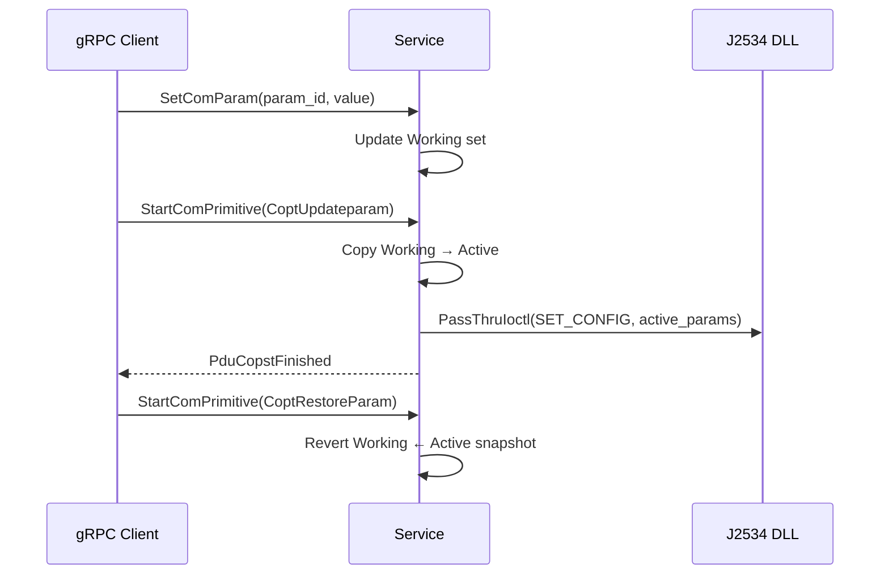
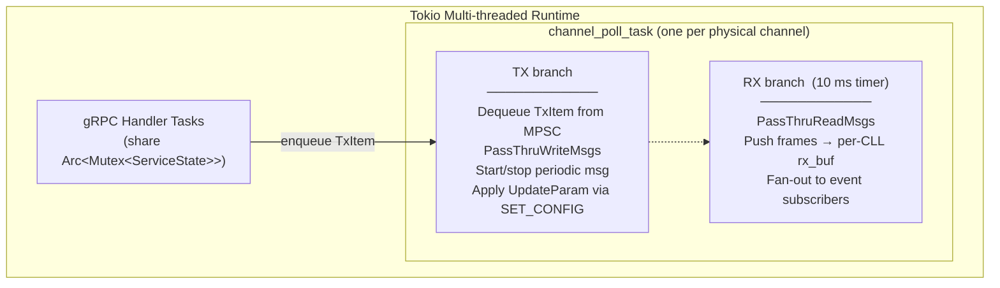
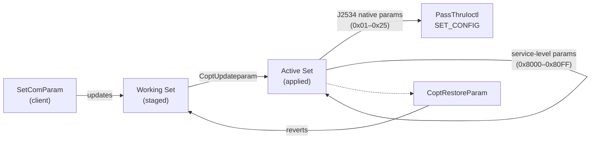
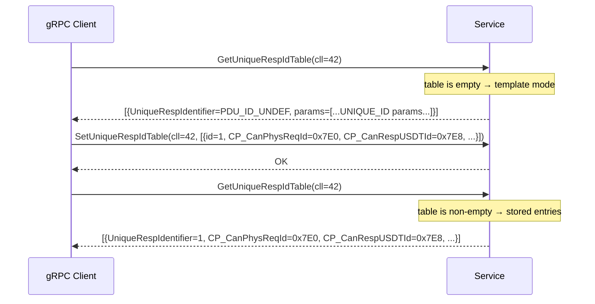
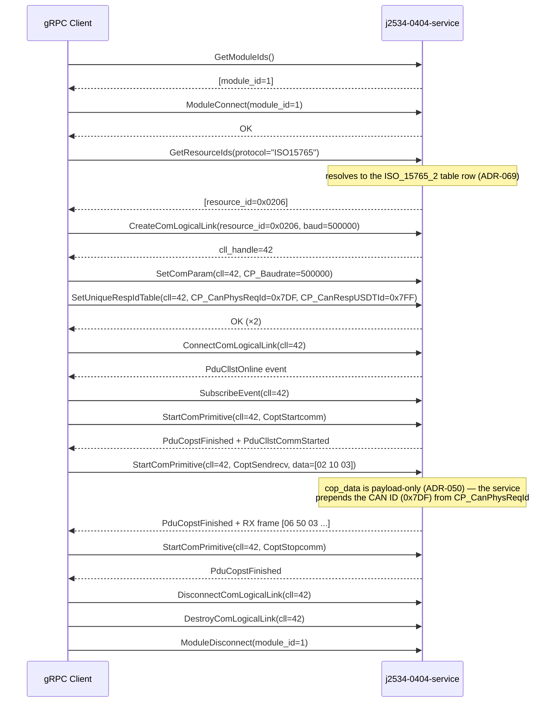

# J2534 v04.04 Subsystem — Architecture & Implementation

> Target spec: SAE J2534-1 (DEC2004) / ISO 22900-2:2022  
> Date: 2026-06-28

---

## Table of Contents

1. [Overview](#1-overview)
2. [Directory Structure](#2-directory-structure)
3. [Architecture](#3-architecture)
4. [Crate Details](#4-crate-details)
   - [j2534-0404-sys — FFI Layer](#j2534-0404-sys--ffi-layer)
   - [j2534-0404 — Safe Wrapper](#j2534-0404--safe-wrapper)
   - [j2534-0404-service — gRPC Service](#j2534-0404-service--grpc-service)
   - [j2534-0404-mock — Test Mock](#j2534-0404-mock--test-mock)
   - [j2534-0404-registry — Registry Lookup](#j2534-0404-registry--registry-lookup)
5. [Key Data Structures](#5-key-data-structures)
6. [Protocol Support](#6-protocol-support)
7. [ComParam System](#7-comparam-system)
8. [Implementation Status](#8-implementation-status)
9. [Design Decisions](#9-design-decisions)
10. [Testing](#10-testing)
11. [Usage](#11-usage)

---

## 1. Overview

The J2534 v04.04 subsystem provides a Rust implementation of the SAE J2534-1 (DEC2004) vehicle diagnostics interface. It follows a three-layer architecture that spans from raw C FFI bindings up to an ISO 22900-2 (D-PDU API) compliant gRPC service.

**Scope:**
- Full Rust wrapper for all 14 SAE J2534-1 PassThru functions
- ISO 22900-2:2022 logical link / primitive / ComParam model over gRPC
- Physical channel sharing across multiple Logical Links (CLLs)
- Async RX polling and event delivery via Tokio background tasks

---

## 2. Directory Structure

```
crates/
├── j2534-0404-sys/              # Low-level C FFI bindings (unsafe)
│   ├── src/
│   │   ├── lib.rs
│   │   ├── bindings.rs          # bindgen output include
│   │   ├── libloading.rs        # Dynamic DLL loader
│   │   └── bindings/
│   │       ├── j2534_v0404.h    # C API header definition
│   │       └── {target}.rs      # one per target (docs/worker-crates.md)
│   ├── docs/implementation-notes.md
│   └── examples/read_version_0404_sys.rs
│
├── j2534-0404/                  # Safe Rust wrapper
│   ├── src/
│   │   ├── lib.rs               # Public API entry point
│   │   ├── error.rs             # Error types & status codes
│   │   ├── message.rs           # Message wrappers (owned/borrowed)
│   │   ├── iso15765.rs          # ISO-TP frame builder helpers
│   │   └── ioctl.rs             # IOCTL command trait
│   ├── docs/implementation-notes.md
│   ├── examples/
│   │   ├── read_version_0404.rs
│   │   ├── read_registry_library_0404.rs
│   │   ├── channel_read_write_0404.rs
│   │   └── iso15765_send_0404.rs
│   └── tests/
│       ├── live_smoke.rs
│       ├── live_channel.rs
│       └── live_iso15765.rs
│
├── j2534-0404-service/          # ISO 22900-2 gRPC service
│   ├── src/
│   │   ├── lib.rs
│   │   ├── main.rs
│   │   ├── config.rs            # Startup configuration parser
│   │   ├── error.rs
│   │   └── service/
│   │       ├── rpc_module.rs    # Module RPCs (GetModuleIds, GetVersion, …)
│   │       ├── rpc_misc.rs      # IoCtl, GetObjectId, UniqueRespIdTable
│   │       ├── rpc_link.rs      # CLL lifecycle (Create/Connect/Disconnect)
│   │       ├── rpc_primitive.rs # COP operations (SendRecv, StartComm, …)
│   │       ├── events.rs        # Event subscription & background poll task coordinator
│   │       ├── events_timestamp.rs      # Module clock helpers (GetTimestamp)
│   │       ├── events_event_senders.rs  # Notification builders & CLL/COP/error/system/module status senders
│   │       ├── events_rx_routing.rs     # route_frame family & build_cll_rx_entries
│   │       ├── events_concat.rs         # ADR-148 concat-buffer finalize/deliver/discard
│   │       ├── events_*_tests.rs        # events.rs's 15 test modules, split out one file per module
│   │       ├── names.rs         # Protocol / object name resolution (~90 aliases)
│   │       ├── protocol.rs      # ChannelProtocol service-level abstraction (ADR-023)
│   │       ├── can_mode.rs      # CanChannelMode config parsing & channel mapping (ADR-046, ADR-047 "auto")
│   │       ├── isotp.rs         # Software ISO 15765-2 transport engine (ADR-046, extended addressing ADR-047)
│   │       ├── tx_header.rs     # TX message ID/header construction from ComParams/UniqueRespIdTable (ADR-050, functional addressing ADR-054, single-frame-only ADR-055, tester-present's own addressing source ADR-138)
│   │       ├── service_params.rs    # Service-level ComParam ID consts (0x8000-0x80FF) & lock masks
│   │       └── comparam_support.rs  # ComParam validation & mapping
│   ├── examples/                # Real-hardware gRPC client demos (pure client, no embedded server)
│   │   ├── common/mod.rs        # Shared connect/lifecycle/event-wait boilerplate (see module doc)
│   │   ├── grpc_can.rs          # Raw CAN (ISO_11898_RAW)
│   │   ├── grpc_iso15765.rs     # ISO 15765-2 / UDS-on-CAN (ISO_15765_2)
│   │   ├── grpc_iso9141.rs      # ISO 9141-2 K-line
│   │   ├── grpc_iso14230.rs     # ISO 14230-4 KWP2000 K-line
│   │   ├── grpc_j1850vpw.rs     # SAE J1850 VPW
│   │   ├── grpc_j1850pwm.rs     # SAE J1850 PWM
│   │   ├── grpc_sci.rs          # SAE J2610 SCI (all 4 configs, CLI-selectable)
│   │   ├── grpc_uart_echo_byte.rs # SAE J2534-2 clause 12 UART Echo Byte
│   │   ├── grpc_honda_diagh.rs  # SAE J2534-2 clause 13 Honda DIAG-H
│   │   ├── grpc_j1708.rs        # SAE J2534-2 clause 17 SAE J1708
│   │   ├── grpc_j1939.rs        # SAE J2534-2 clause 16 SAE J1939
│   │   ├── grpc_tp2_0.rs        # SAE J2534-2 clause 19 TP2.0
│   │   ├── grpc_gm_uart.rs      # SAE J2534-2 clause 11 GM UART
│   │   └── grpc_ethernet_ndis.rs # SAE J2534-2 clause 24 Ethernet_NDIS (connect-only)
│   └── docs/
│       ├── implementation-notes.md
│       ├── protocol-mapping.md
│       ├── comparam-mapping.md
│       └── comparam-protocol-support.md
│
├── j2534-0404-mock/             # In-process mock J2534 DLL for testing
│   └── src/lib.rs
│
└── j2534-0404-registry/         # Windows registry discovery
    └── src/lib.rs
```

---

## 3. Architecture

### Layer Overview



### Component Interaction



### Physical Channel Sharing



### CAN Channel Operating Modes (ADR-046, ADR-047, ADR-160)

How CAN-family CLLs (raw CAN and every ISO 15765-2 based protocol) map onto
J2534 physical channels is selected per library with the `can_channel_mode`
key in `config.toml`, read via `vci-service-config`:

```toml
[config.apis.j2534-0404.libs."OpenPort2"]
can_channel_mode = "dual-channel"   # or "single-channel" / "software-isotp" / "auto" / "native-mixed" / "native-mixed-all-frames"
```

| Mode | ISO15765-family CLL uses | UUDT reception | Software ISO-TP | Notes |
|------|--------------------------|----------------|-----------------|-------|
| `single-channel` (default) | 1× `ISO15765` channel | ADR-041 UUDT `FLOW_CONTROL_FILTER` workaround (device-dependent) | — | Pre-ADR-046 behaviour. Raw CAN needs a separate CAN CLL; whether both connect at once depends on the J2534 library. |
| `dual-channel` | 1× `ISO15765` channel + on-demand companion `CAN` channel | Companion channel, routed by `CP_CanRespUUDTId` | — | Companion opens when the UniqueRespIdTable configures a `CP_CanRespUUDTId`; shared (`shared_channels`) with raw-CAN CLLs at the same baud. Requires 2 simultaneous channels. |
| `software-isotp` | 1× raw `CAN` channel | Same channel (routed by `CP_CanRespUUDTId`) | USDT segmentation / reassembly / FlowControl in `service/isotp.rs` + `events.rs`; normal *and* extended addressing | For libraries with absent/unreliable `ISO15765` channels. Classic CAN only (no CAN FD). |
| `auto` | Probed once, then behaves as `dual-channel` or `single-channel` | Per the resolved mode | — | First ISO15765-family connect tries to also open a companion `CAN` channel; success → `dual-channel`, failure → `single-channel`. Never resolves to `software-isotp`. See ADR-047. |
| `native-mixed` | 1× `ISO15765` channel, `SET_CONFIG(CAN_MIXED_FORMAT, ON)` (SAE J2534-2 clause 8) issued once at creation | A `PASS_FILTER` on the same channel, narrowed to the UUDT id, using the clause 8.1 paired raw-CAN `ProtocolID` (e.g. `CAN_PS` for `ISO15765_PS`) | — | Requires a device that actually implements clause 8; `ERR_NOT_SUPPORTED` fails the connect outright, no silent fallback. Unqualified (non-pin-selected/`_CHx`) links only; excludes any FD-substituted link (ADR-159), which keeps the `single-channel`-style fallback. A UUDT/USDT `FLOW_CONTROL_FILTER` match-key collision on the shared channel is rejected (connect and `SetUniqueRespIdTable`/`CoptUpdateparam`), not silently misrouted. See ADR-160, ADR-162. |
| `native-mixed-all-frames` | Same as `native-mixed`, but `SET_CONFIG(CAN_MIXED_FORMAT, ALL_FRAMES)` (value 2) instead of `ON` | Same `PASS_FILTER` mechanism as `native-mixed` | — | Same connect-time/qualified-link/FD-exclusion rules as `native-mixed`. The one behavioral difference: clause 8's `FLOW_CONTROL_FILTER`/`PASS_FILTER` evaluation runs in parallel per frame rather than either/or (Figure 2, not Figure 1), so a UUDT/USDT match-key collision that `native-mixed` rejects is instead servable — the device delivers both interpretations as separate native messages. Whether a client COP observes both depends on its own `NumReceiveCycles`: an unbounded receive style (`-1`/`-2`) sees both; an ordinary bounded `CoptSendrecv` only accepts up to its own target match count, so it sees at most one, non-deterministically. The ADR-162 collision check does not apply to this mode; every other native-mixed behavior is unchanged. See ADR-217. |

See ADR-046 (mode selection, hardware workarounds), ADR-047 (`auto` probing,
extended addressing), ADR-160 (`native-mixed`, SAE J2534-2 clause 8),
ADR-162 (`native-mixed`'s UUDT/USDT collision rejection), and ADR-217
(`native-mixed-all-frames`, `CAN_MIXED_FORMAT_ALL_FRAMES`, and why the
ADR-162 collision check stays scoped to `native-mixed` only) for the full
rationale and edge cases.

Key internals:

- `LogicalLinkState::hw_protocol_id` holds the J2534 protocol actually used
  for `PassThruConnect` / `ChannelKey` / filters / ADR-028 SET_CONFIG gating;
  in `software-isotp` mode it is `CAN` while the service-level protocol stays
  ISO15765-family. All physical-resource lock comparisons use it.
- `J2534Service::effective_can_channel_mode()` resolves `can_channel_mode` to
  a concrete `DualChannel`/`SingleChannel`/`SoftwareIsoTp`/`NativeMixed`
  decision, reading the `auto` capability-probe cache
  (`resolved_can_channel_mode`) when needed (`auto` never resolves to
  `NativeMixed`); every dual-vs-single-vs-native-mixed check (companion
  channel open/close, ADR-041 filter skip, the native-mixed `PASS_FILTER`
  substitution) goes through it rather than comparing `can_channel_mode`
  directly.
- RX fan-out is a single `poll_rx_inner` pass; per-CLL `RxEntryKind`
  (`Hardware` / `Companion` / `SoftwareIsoTp`) decides routing and transport
  processing. Reassembled messages keep the `[4-byte CAN ID][payload]`
  layout internally, so expected-response matching and event encoding are
  mode-agnostic. Before the frame reaches the client, `poll_rx_inner` splits
  off a leading header and, where applicable, a trailing footer into
  `ResultData.extra_info.header_bytes`/`footer_bytes`, leaving
  `ResultData.data_bytes` payload-only — mirroring ADR-050's payload-only
  `cop_data` on the TX side (ADR-051):

  | Protocol | Header | Footer |
  |---|---|---|
  | CAN | 4 bytes of CAN ID | — |
  | ISO15765 | 4 bytes of CAN ID | — |
  | ISO15765 (extended addressing) | 4 bytes of CAN ID, 1 Address Extension byte | — |
  | ISO9141 / ISO14230 | 1-4 bytes, parsed per-frame from the KWP2000 format byte (or a fixed 3 bytes for CARB/ISO9141-2 exception addressing, `format & 0xC0 == 0x40`, ADR-167) | whatever trails the header's declared payload length (e.g. a 1-byte checksum) for the two self-describing address modes; always empty for CARB (ADR-167) |
  | J1850PWM | 3 bytes (format/priority + target + source) | the native `ExtraDataIndex`-reported trailing In-Frame-Response byte count (0 or more), defensively clamped against an out-of-range value; no CRC byte is ever present (ADR-171) |
  | J1850VPW | 3 bytes (format/priority + target + source) | always empty — VPW has no IFR mechanism, so `ExtraDataIndex` is ignored unconditionally rather than trusted even when in-range (ADR-171) |
  | SCI | — | — |

  The ISO15765 extended-addressing widening only applies to a frame taken
  directly off the wire; an already-reassembled software ISO-TP payload
  never carries an AE byte to split (consumed during reassembly), so it
  always gets the plain 4-byte header. SCI is a no-op: `data_bytes` stays
  the raw frame and `extra_info` stays `None`.

  `ResultData.rx_flag` is a 4-byte ISO 22900-2 `RxFlag` buffer: byte 3 bits
  0-4 mirror the source J2534 `RxStatus`'s 5 low bits (`TX_MSG_TYPE`,
  `START_OF_MESSAGE`, `RX_BREAK`, `TX_INDICATION`, `ISO15765_PADDING_ERROR`)
  whenever any is set (ADR-098, extending ADR-097). Byte 1 carries two
  further bits this service synthesizes/forwards outside that mechanism:
  bit 1 (`ECU_TIMING_CHANGE`, ADR-146) is `true` only for a qualifying
  `CP_ModifyTiming` Access Timing response; bit 0 (`SW_CAN_HV_RX`, ADR-191)
  is `true` only for a genuine SW-CAN-family frame whose native `RxStatus`
  carries bit 16. `Vec::new()` when none of these apply (a Normal Message
  with neither byte-1 bit set) — every other `RxFlag` bit ISO 22900-2
  defines stays unreported/zero. A frame is excluded from `ExpectedResponse`/pending-RC
  matching only if one of the 4 indication-type bits (SOM, TxDone, RxBreak,
  Loopback) is set; RxPadError alone does **not** exclude a frame, since it
  tags a genuine non-empty ISO15765 response (e.g. an unpadded `7F SS 78`
  response-pending NRC) — see ADR-098's Correction for why a blanket
  RxPadError exclusion was wrong, and ADR-097/ADR-098 for the full
  bit-derivation history and the Loopback/pending-RC-collision edge case.

  `ResultData.tx_msg_done_timestamp`/`start_msg_timestamp` are populated
  independently from the same `RxStatus` bits: `Some(frame.timestamp)` iff
  `TX_INDICATION`/`START_OF_MESSAGE` respectively is set, with no
  combination validation (ADR-143); both are `None` for the synthetic
  fast-init response frame (`rx_status_flags` always 0).
- **Response attribution (`bind_frame`, ADR-100)**: every content frame that
  survives the indication-frame exclusion above (plus every indication frame,
  for tester-present's own signature check specifically) is run through one
  explicit precedence table, per CLL, replacing the pre-ADR-100 model of a
  single ephemeral `MatchProbe` checked before a separate, always-secondary
  tester-present discard. First match wins; no further step runs once a
  frame binds:
  1. Indication frames (SOM/TxDone/RxBreak/Loopback) never reach steps
     2/4/5 — they are binding candidates only for step 3.
  2. **Tier-1 (active Send/Receive), non-vacuous claims** — the executing
     one-shot COP, periodic SendRecv COPs, and an IS-CYCLIC COP before its
     first positive response, in COP registration order, restricted to a
     descriptor with a non-empty mask/pattern or the COP's own pending-RC
     (0x7F/0x21/0x23/0x78) detection. When the claiming registrant has
     `concat_enabled` (`CP_EnableConcatenation`, ADR-148 — KWP/J1850
     protocols only, and never an IS-CYCLIC or created-receive-only
     registrant), a frame whose `(unique_resp_identifier, source_id, SID)`
     matches ANY already-open buffer in the registrant's `concat:
     Vec<ConcatBuf>` (ADR-148 Amendment: a linear scan over every open
     buffer, not just one — needed so IS-MULTIPLE's several distinct ECUs
     can each have their own buffer open at once without their interleaved
     segments cross-contaminating). `source_id`, the key's middle component
     (ADR-148 third Amendment, Fix 1), is derived per-frame from the frame's
     OWN split header (ADR-051) — `Some(header_bytes[2])` (the source-address
     byte) for KWP/J1850 when the header is long enough, else `None` — never
     from `unique_resp_identifier`: a no-`UniqueRespIdTable` CLL (or a
     table-configured CLL with no `CP_EcuRespSourceAddress`-keyed entries —
     wildcard RX delivery either way) delivers `unique_resp_identifier == 0`
     for every frame, so without `source_id` two distinct ECUs answering the
     same broadcast/functional request with the same SID would collide into
     one corrupted buffer. (As of
     [ADR-203](adr/ADR-203-kwp-j1850-source-address-rx-routing.md), a
     table-configured CLL that DOES have `CP_EcuRespSourceAddress`-keyed
     entries instead gets a real, distinct per-ECU `unique_resp_identifier`
     from `events_rx_routing.rs::route_frame`'s own KWP/J1850 matching tier —
     see that ADR and `route_frame`'s own doc comment; `source_id` remains
     the correct concat-buffer key regardless, since concat can be enabled
     on a wildcard-mode CLL too.) A `None` `source_id` (headerless/too-short
     frame)
     groups with every other `None`-keyed frame sharing the same
     `(unique_resp_identifier, SID)` — an accepted residual, since no
     ECU-identifying data is physically available at this layer for such a
     frame. A matching frame is absorbed into that buffer instead of
     completing a match here — **but only when this
     step's own non-vacuous classification matches the buffer's own
     `opened_vacuous` flag** (ADR-148 second Amendment: `opened_vacuous` is
     fixed at the moment the buffer was opened, from the admitting
     descriptor's vacuousness; a buffer opened by a *vacuous* descriptor
     does NOT absorb here in step 2, so it cannot pre-empt a differently-
     registered, non-vacuous claimant the way ADR-100's precedence table
     requires — it only absorbs during step 4's vacuous pass instead). When
     the buffer's own scan-gate check fails, the frame falls through to the
     registrant's descriptor match, which is checked only to open a *new*
     buffer (or, if the descriptor match happens to hit an already-open
     same-key buffer — possible when a registrant carries both the opening
     vacuous descriptor and a separately-matching non-vacuous one — absorb
     into that existing buffer instead of opening a duplicate), gated on the
     quota invariant `matches_got + concat.len() < matches_needed` (for a
     finite `matches_needed`, and only for a genuinely new buffer — absorbing
     into an existing one never consumes quota) AND, ADR-148 third
     Amendment's Fix 3, `concat.len() < CONCAT_MAX_OPEN_BUFFERS` (32, an
     internal non-configurable cap bounding how many distinct buffers one
     registrant may hold open at once — closes an unbounded-buffer-count gap
     the quota gate alone leaves open when `matches_needed` is `None`,
     IS-MULTIPLE) — so a new buffer never opens once either bound is
     reached. An absorbed frame is not delivered on its own — a buffer is
     finalized and delivered as one logical match when the receive-phase
     deadline expires (all currently-open buffers finalize together, in one
     pass, in first-opened-first order), when an empty-payload match arrives
     (which force-finalizes every open buffer first), or — ADR-148 third
     Amendment's Fix 2 — immediately, inline, when absorbing a segment would
     push that ONE buffer's `data.len()` over `CONCAT_MAX_BUF_BYTES` (4128,
     `j2534_0404::MAX_MESSAGE_DATA`) or its own segment count over
     `CONCAT_MAX_BUF_SEGMENTS` (256, closing the degenerate case where a
     SID-only 1-byte payload adds `0` bytes per segment) — both internal,
     non-configurable caps that force-finalize only the ONE triggering
     buffer, never any other buffer open on the same registrant. A
     differing-key frame is NOT, by itself, a finalize trigger (ADR-148
     Amendment — the original design's "differing key force-finalizes the
     sole open buffer" rule caused a P1 data-corruption bug under
     IS-MULTIPLE and was removed; see the ADR's Amendment section).
  3. **Tester-present's own reply/SOM-herald/TX-echo signature**
     (`CP_TesterPresentReqRsp`, ADR-088/093/099) — matched against any
     still-open window in the CLL's `open_tp_discards` list (each window an
     independently elicited send, not first-match-wins); a match is
     **discarded outright**. This rank beats a *vacuous* Tier-1 claim (step
     4) but a *specifically-expected* client response (step 2) always wins
     first — closing the field bug ADR-088 originally left open (a vacuous
     `CoptSendrecv` capturing a tester-present reply meant for nobody). See
     "Tester-Present Dispatch" (§5) for the discard-window/identity-signature
     matching mechanics, and ADR-100/ADR-137 for the precedence history.
  4. **Tier-1, vacuous claims** (empty mask/pattern descriptor), in COP
     registration order. For a `concat_enabled` registrant, this is also the
     step where a continuation matching an open buffer whose own
     `opened_vacuous` flag is `true` is absorbed (see step 2's note, ADR-148
     second Amendment) — deferred here specifically so a non-vacuous
     claimant (step 2) and tester-present's discard signature (step 3) both
     get first refusal, mirroring how the buffer's own opening segment was
     originally attributed.
  5. **Tier-2 (Receive Only list)**: `NumSendCycles == 0` COPs (ADR-059), and
     IS-CYCLIC COPs that migrated here after their first positive response
     (freeing their CLL for other COPs — the fix for the historical
     IS-CYCLIC wedge); vacuous descriptors permitted (this tier's
     spec-sanctioned broad-monitoring use case). A created-receive-only
     registrant with `NumReceiveCycles == -1` OR a positive `N` (ADR-182
     widened this from `-1`-only) is inserted directly into this tier with
     the same immediate CLL-freeing treatment, so more than one such
     monitor may be live on a shared channel simultaneously without
     blocking each other or any other queued COP. `NumReceiveCycles == -2`
     (IS-MULTIPLE) created-receive-only is unaffected by that widening — it
     is tier-2 from creation too but keeps running inline/blocking,
     `CP_P2Max`-governed.
  6. **Unbound.** A content frame reaching this step is discarded outright —
     not buffered, not delivered as unsolicited `ResultData` (a client-visible
     behavior change from the pre-ADR-100 deliver-everything-unbound
     default — the migration path is a `NumSendCycles == 0` receive-only COP
     with a broad `expected_response`, step 5 above). An indication frame
     reaching this same step is unaffected and keeps its pre-existing
     unsolicited `ResultData` delivery (`cop_handle: None`), per ADR-098's
     carve-out — except that a pure SOM or TxDone indication is additionally
     gated per CLL by `CP_StartMsgIndEnable`/`CP_TransmitIndEnable`
     (default disabled, matching ISO 22900-2's spec default): with the
     governing ComParam off, the indication is dropped here instead of
     delivered. RxBreak and a loopback echo are unaffected by either
     ComParam and always deliver unconditionally (ADR-151).

  See ADR-100 for the full precedence derivation and accepted residuals.
- The software TX driver waits for the ECU's FlowControl via `FcCapture`
  (honouring BS / STmin / Wait / Overflow and the `CP_Bs` N_Bs timeout;
  ADR-098: a CONFIG_LOOPBACK echo of our own transmitted FlowControl frame,
  `RX_TX_MSG_TYPE` set, is never captured as the ECU's). Consecutive
  `FS_WAIT` frames within one FlowControl-wait cycle are counted
  against an internal defensive bound (not `CP_CanMaxNumWaitFrames` -- see
  ADR-124, which supersedes ADR-121's earlier, incorrect-direction attempt to
  tie this to that comparam), resetting on `FS_CONTINUE_TO_SEND`; exceeding
  it aborts the COP with `PduErrEvtProtErr`. The RX side answers
  FirstFrames with a FlowControl built from
  `CP_BlockSize` / `CP_StMin`, sent to the `CP_CanPhysReqId` paired with the
  sender's `CP_CanRespUSDTId` in the UniqueRespIdTable, and abandons
  reassembly on `CP_Cr` (N_Cr) expiry.
- Extended addressing (`isotp::Addressing::Extended(ae)`, ADR-047) is
  resolved per UniqueRespIdTable entry from the same `CP_Can*Format` bit 3 /
  `CP_Can*ExtAddr` pair the hardware `FLOW_CONTROL_FILTER` path already
  reads: `CP_CanPhysReqFormat`/`ExtAddr` addresses this service's own
  outgoing frames, `CP_CanRespUSDTFormat`/`ExtAddr` addresses the ECU's.
  Extended addressing reduces each frame's payload capacity by 1 byte.

### CLL / COP State Machine



### ComParam Working / Active Flow



---

## 4. Crate Details

### j2534-0404-sys — FFI Layer

Provides raw, unsafe C FFI bindings to the J2534-1 v04.04 DLL. The C API header (`src/bindings/j2534_v0404.h`) is the single source of truth; per-target Rust bindings are pre-generated via `bindgen`.

**PassThru functions (all 14):**

| Function | Purpose |
|----------|---------|
| `PassThruOpen` | Open a J2534 device |
| `PassThruClose` | Close a J2534 device |
| `PassThruConnect` | Connect a protocol channel |
| `PassThruDisconnect` | Disconnect a channel |
| `PassThruReadMsgs` | Receive messages from a channel |
| `PassThruWriteMsgs` | Transmit messages on a channel |
| `PassThruStartPeriodicMsg` | Start a periodic (tester-present) message |
| `PassThruStopPeriodicMsg` | Stop a periodic message |
| `PassThruStartMsgFilter` | Add a receive message filter |
| `PassThruStopMsgFilter` | Remove a message filter |
| `PassThruSetProgrammingVoltage` | Apply programming voltage to a pin |
| `PassThruReadVersion` | Read firmware / DLL / API version strings |
| `PassThruGetLastError` | Retrieve the last error description |
| `PassThruIoctl` | Generic IOCTL (config get/set, buffer clear, init, …) |

**Supported platforms:**

| Target | Status |
|--------|--------|
| `x86_64-pc-windows-gnullvm` | Full support |
| `i686-pc-windows-gnullvm` | Full support |
| `x86_64-pc-windows-msvc` | Builds, but not a worker target (ADR-227) |
| `x86_64-unknown-linux-gnu` | FFI bindings only (no vendor DLL) |
| `armv5te-unknown-linux-gnueabi` | FFI bindings only |

**J2534-2 constants (mostly dormant):** the header also carries every SAE
J2534-2 ProtocolID/IOCTL/`SCONFIG`/error-code constant and new struct
(ADR-152, `docs/j2534-2-support-plan.md` Phase 0) — added up front so later
phases don't repeatedly re-touch this layer. The six new error codes
(Phase 0) and the Discovery Mechanism's `SPARAM`/`SPARAM_LIST` structs and
`GET_DEVICE_INFO`/`GET_PROTOCOL_INFO` IOCTLs (Phase 1, ADR-153) are the only
ones referenced above this layer so far — see
`j2534-0404-service/docs/implementation-notes.md`'s Discovery section for
what Phase 1 actually does with them (an internal-only, not-yet-consumed
cache). Every other new symbol remains dormant.

---

### j2534-0404 — Safe Wrapper

Wraps the raw FFI with a type-safe Rust API. All `unsafe` is confined to FFI call sites in `lib.rs`.

**Design policy:**
- Newtype handles prevent handle-type confusion at compile time
- Flat API with explicit handle parameters — no hidden state
- Owned `PassThruMessage` and borrowed `BorrowedPassThruMessage` reduce data copying
- Explicit close/disconnect required; no implicit `Drop` behaviour
- Message payload validated against the 4128-byte `PASSTHRU_MSG` limit

**`J2534Api0404` public API:**

| Category | Methods |
|----------|---------|
| Device lifecycle | `open`, `close`, `read_version`, `set_programming_voltage` |
| Channel lifecycle | `connect`, `disconnect` |
| Message I/O | `read_messages`, `write_messages` |
| Periodic messages | `start_periodic_message`, `stop_periodic_message` (kept in this wrapper crate; `j2534-0404-service` itself no longer calls either — ADR-093 moved tester-present dispatch fully to software) |
| Filters | `start_message_filter`, `stop_message_filter` |
| IOCTL config | `get_config`, `set_config` |
| IOCTL diagnostics | `read_vbatt`, `read_prog_voltage` |
| IOCTL initialization | `five_baud_init`, `fast_init` |
| Buffer management | `clear_rx_buffer`, `clear_tx_buffer`, `clear_periodic_messages`, `clear_message_filters` |
| J1850 functional msg | `add_to_functional_msg_lookup_table`, `delete_from_functional_msg_lookup_table` |
| Vendor extension | `ioctl` (unsafe, trait-based) |

**Handle newtypes:**

```rust
pub struct DeviceId(pub u32);           // returned by PassThruOpen
pub struct ChannelId(pub u32);          // returned by PassThruConnect
pub struct PeriodicMessageId(pub u32);  // returned by PassThruStartPeriodicMsg
pub struct MessageFilterId(pub u32);    // returned by PassThruStartMsgFilter
```

**Message types:**

```rust
pub struct PassThruMessage(PASSTHRU_MSG);       // owned; used for write_messages
pub struct BorrowedPassThruMessage<'a>(...);    // read-only view; returned by read_messages
```

**ISO-TP helpers (`iso15765` module):**

| Function | Description |
|----------|-------------|
| `single_frame(can_id, data)` | Build a CAN-ID-prefixed native-ISO15765 write for an 11-bit CAN ID (adapter inserts ISO-TP framing) |
| `single_frame_extended(can_id, data)` | Same, for a 29-bit CAN ID (not ISO15765 extended addressing, which this helper does not support) |
| `with_padding(msg)` | Set `TX_ISO15765_FRAME_PAD` so the device zero-pads the transmitted CAN frame(s); does not modify the `Data` buffer |

---

### j2534-0404-service — gRPC Service

An ISO 22900-2 (D-PDU API) compatible gRPC service that exposes J2534 hardware through the logical link / primitive / ComParam model.

**Start the service:**

```bash
j2534-0404-service "j2534-0404:OpenPort2?port=50051"
```

The startup argument carries a **library name**, not a path (see
`j2534-0404-service/docs/startup-spec.md`). That name is resolved to an
actual DLL/`.so` path in one of two ways, checked in order:

1. A `library_path` entry for that name in `config.toml`, read via
   `vci-service-config` (see
   [`vci-service-config/docs/logging-config.md`](../crates/vci-service-config/docs/logging-config.md#library-path-overrides)) — lets deployers add
   libraries the registry doesn't know about, or override its result, and is
   the only resolution path on non-Windows.
2. Otherwise, the Windows registry, via `j2534-0404-registry` (below).

#### Service Model

| Concept | Description |
|---------|-------------|
| Module | One module per configured `[[...modules]]` entry (`config.apis.j2534-0404.libs."<lib>".modules`, ADR-107), each a `(label, pname)` pair; `module_handle` is the entry's 1-based config-order position. When `modules` is absent, a single default module (`DEFAULT_MODULE_HANDLE = 1`, no `pname`) is synthesized, matching pre-ADR-107 behavior. Regardless of how many modules are configured, at most one device is open at a time (not simultaneous multi-device); a device is opened lazily (on `ModuleConnect` or first CLL creation) using the target module's `pname` as `PassThruOpen`'s `pName` (an out-of-spec vendor extension — see ADR-107), and connecting a different module while one is already open is rejected until `ModuleDisconnect`. |
| ComLogicalLink (CLL) | ISO 22900-2 logical link abstraction over a J2534 channel. Multiple CLLs with the same `(hw_protocol_id, baud_rate, pin_select)` share one physical channel (ADR-156, partially superseding ADR-023's original 2-factor key). `pin_select` is `0` for every non-`_PS` link, reproducing the pre-ADR-156 2-factor sharing exactly for every existing protocol; for a SAE J2534-2 clause 6 Pin Selection (`_PS`) link, `pin_select` is the caller-chosen DLC pin bitmask, so two `_PS` links resolving to the same hardware protocol and baud rate but requesting *different* DLC pins get distinct physical channels rather than sharing one. |
| ComPrimitive (COP) | Unit of work queued on a CLL: SendRecv, StartComm, StopComm, Delay, UpdateParam, RestoreParam. |
| ComParam | Per-CLL configuration split into a **Working set** (staged) and an **Active set** (applied to hardware). |

#### RPC Methods

**rpc_module.rs** — Module operations:

| RPC | Description |
|-----|-------------|
| `GetModuleIds` | Return one row per configured module entry (or the single synthetic entry when none are configured, ADR-107). `module_status` is `self.module_state.status` (the same value `GetStatus` reports) for the row matching whichever handle is currently open, `PDU_MODST_AVAIL` for every other row (ADR-132, closing ADR-107 Accepted Residual #1) |
| `ModuleConnect` | Open the J2534 device for the requested module (lazy); rejected with `PDU_ERR_RESOURCE_BUSY` if a *different* module is already open (ADR-107); rejected with `PDU_ERR_FCT_FAILED` if the SAME module is already open but its tracked status is `PduModstNotAvail` (a hard channel error) — that already-open no-op path never revalidates the device, so `ModuleDisconnect` then `ModuleConnect` is the only recovery sequence (ADR-131) |
| `ModuleDisconnect` | Close the device and terminate all subscriptions |
| `GetVersion` | Read FW / DLL / API version strings |
| `GetTimestamp` | Return `events::module_timestamp_us()` — a monotonic microsecond clock (`Instant`-backed, wraps at 2^32 µs / ~71.6 min), zeroed at process start and rebased to (approximately) zero again on `PDU_IOCTL_RESET` (`events::reset_module_clock()`, called from `rpc_misc.rs::ioctl_reset`, ADR-120 amendment). J2534 v04.04 has no module-clock IOCTL to read, so this is synthesized; the same function backs the synthetic status/error event timestamps below, so `GetTimestamp` and `GetStatus`/error events share one time base (ISO 22900-2 §9.1.6.1/§9.4.31.1). RX-frame timestamps (`GetEventItem`'s frame data) are a *different*, unrelated clock — the raw native `PASSTHRU_MSG.Timestamp` device value, deliberately left untouched (ADR-120). |

**rpc_link.rs** — Logical link lifecycle:

| RPC | Description |
|-----|-------------|
| `GetResourceStatus` | Query whether a protocol/resource is currently in use (accepts a table resource ID/name or a legacy raw/extended `ChannelProtocol` value/name, ADR-069) |
| `GetResourceIds` | List resource IDs (ADR-069's opaque `0x0200`-namespace table, §6) matching a protocol/bus-type/pin filter |
| `GetConflictingResources` | Report resource-table rows that share a DLC pin, or sit on the same physical controller (same `bus_type_id`), with a given resource, computed statically from the table (independent of CLL/connection state, ADR-106) |
| `CreateComLogicalLink` | Allocate a CLL handle from a resource ID/name (table row, or legacy raw/extended `ChannelProtocol` fallback, ADR-069); defers `PassThruConnect` |
| `DestroyComLogicalLink` | Free the CLL and cancel any queued COPs |
| `ConnectComLogicalLink` | Call `PassThruConnect`, apply params, spawn poll task |
| `DisconnectComLogicalLink` | Disconnect the channel and release locks |
| `LockResource` | Acquire `LOCK_PHYSICAL_TX_QUEUE` or `LOCK_PHYSICAL_COM_PARAMS`; `LOCK_PHYSICAL_TX_QUEUE` additionally rejects if the physical resource (any CLL, including the requester itself) has an active transmission in flight (ADR-123) |
| `UnlockResource` | Release a previously acquired lock |
| `GetComParam` | Read a parameter from the Working set |
| `SetComParam` | Write a parameter to the Working set (with protocol validation) |

**rpc_primitive.rs** — ComPrimitive operations:

| RPC | Description |
|-----|-------------|
| `StartComPrimitive` | Enqueue a COP for execution |
| `GetStatus` | Poll the current status of a Module, CLL, or COP |
| `CancelComPrimitive` | Cancel a queued or executing COP |

**COP types:**

| Type | Behaviour |
|------|-----------|
| `CoptSendrecv` | Transmit a request and run its receive phase; cyclic send / multi-response receive via `PDU_COP_CTRL_DATA` (ADR-053) |
| `CoptStartcomm` | Start communication (init sequence + tester-present setup) |
| `CoptStopcomm` | Stop communication and tester-present |
| `CoptDelay` | Sleep for N milliseconds |
| `CoptUpdateparam` | Promote Working params → Active and apply to hardware |
| `CoptRestoreParam` | Revert Working params from the Active snapshot |

`CoptUpdateparam` calls `PassThruIoctl SET_CONFIG`, as does `CoptSendrecv`/
`CoptStartcomm` when `temp_param_update` is set.

**Lock effects on COP execution (ADR-043/044/045/110/123).**
`LOCK_PHYSICAL_COM_PARAMS` never synchronously rejects a call (ADR-044's
rejection is superseded by ADR-110, per ISO 22900-2 §9.4.16 d)'s event-based
model): a non-owning CLL's `CoptUpdateparam` still applies every
non-conflicting ComParam (excluding only the `PDU_PC_BUSTYPE`-class ones this
lock protects from both the hardware push and promotion), reports at most one
`PDU_ERR_EVT_RSC_LOCKED` event, and finishes normally; `SetComParam`
(Working-buffer-only) is never affected by this lock. `LOCK_PHYSICAL_TX_QUEUE`
likewise never synchronously rejects `CoptSendrecv`/`CoptStartcomm`/
`CoptStopcomm` (non-empty `cop_data`) — the COP always enqueues and, if a
sibling CLL holds the lock on the same physical resource, sits queued
(`PDU_COPST_IDLE`) until it releases, then dispatches (ADR-123, ISO 22900-2
§9.4.13.3 use case 1's SUSPEND_TX_QUEUE/RESUME_TX_QUEUE semantics). A
receive-only `CoptSendrecv` (`NumSendCycles == 0`, ADR-059) is exempt — since
it never transmits, it dispatches immediately regardless of a held lock.
Empty-data `CoptStopcomm` is affected by neither lock (`temp_param_update` is
a hardware no-op for it, ADR-066). Independently of either lock, a
`temp_param_update=1` call on any of these three COP types is rejected
synchronously with `PDU_ERR_TEMPPARAM_NOT_ALLOWED` — no enqueue, no side
effects — if Working differs from Active on any `PDU_PC_BUSTYPE`-class
ComParam (ADR-067).

`LOCK_PHYSICAL_TX_QUEUE`'s queue-and-resume mechanism reuses the per-CLL
TX-suspend machinery built for the client-driven `PDU_IOCTL_SUSPEND_TX_QUEUE`/
`RESUME_TX_QUEUE` IOCTLs (`LogicalLinkState.tx_held`, a FIFO backlog drained
in order on resume): `tx_suspended_by_ioctl` and `tx_suspended_by_lock` are
independent flags so a client's own IOCTL and a sibling's held lock can never
clobber each other (a CLL is suspended whenever either is `true`). A
`recompute_lock_tx_suspensions` sweep recomputes every CLL's
`tx_suspended_by_lock` from scratch on every `LockResource`/`UnlockResource`/
`ConnectComLogicalLink`/`DisconnectComLogicalLink`/`DestroyComLogicalLink`
call, and wakes any CLL whose effective suspension just cleared. A
newly-connecting CLL that joins a physical resource already under a
sibling's `LOCK_PHYSICAL_TX_QUEUE` starts suspended immediately, per ISO
22900-2 §9.4.13.3 use case 1.

**`CP_SuspendQueueOnError` is a third, content-triggered TX-suspend source
(ADR-147)**, alongside the two call-triggered sources above. It has its own
flag, `tx_suspended_by_error`, OR'd into `tx_suspended()` the same way, with
the same transmitting-items-only gating as `tx_suspended_by_lock`. Unlike
`tx_suspended_by_lock`, it has no cross-CLL inputs — set and cleared
entirely within its own CLL:

- **Triggers.** A COP's response timing out (`PduErrEvtRxTimeout`) with live
  Active `CP_SuspendQueueOnError == 1`; or a bound `0x7F`-led negative
  response, echoing this COP's own request SID, whose NRC the RC engine (§7
  below) was not asked to auto-handle (an NRC outside RC21/RC23/RC78, or one
  of those with its `CP_RCxxHandling` currently `0`). Classified at bind time
  and folded per poll-pass with last-frame-wins semantics (a later positive
  response in the same pass overrides an earlier suspend-worthy frame). A
  bound `0x7F`-led frame that cannot be confirmed against this COP's own SID/
  RC config declines to classify rather than defaulting to a resume; only a
  frame genuinely not `0x7F`-led at all classifies `Positive`.
- **Clears.** `PDU_IOCTL_RESUME_TX_QUEUE`; a `CoptUpdateparam` promotion
  landing Active `CP_SuspendQueueOnError == 0` — specifically exempted from
  the TX-held-backlog's own FIFO no-overtake rule (narrowly, to
  `TxItem::UpdateParam` whose own queued snapshot reads the ComParam
  disabled) so it isn't stuck behind its own precondition; a later positive
  response in the same poll pass, subject to the staleness guard below; or a
  hard channel error taking the CLL offline. `PDU_IOCTL_CLEAR_TX_QUEUE`
  cancels held items but does not itself clear this (or any) suspend source.
- **Staleness guard.** A batch's frames are exposed to the client mid-pass,
  before that pass's own end-of-pass classification apply runs, so a
  synchronous `tx_suspended_by_error` change can land in that exposure gap
  and silently undo or be undone by a stale classification. Two independent
  per-CLL sequence counters close it, because `Suspend` and `Positive` need
  different anchors and one shared counter cannot correctly serve both:
  `error_clear_seq` (bumped unconditionally on every clear) is compared
  against a `Suspend` classification's exposure-time capture
  (`CllRxEntry.suspend_seq`); `error_set_seq` (bumped only by the timeout
  trigger) is compared against a `Positive` classification's pre-read-batch
  capture (`CllRxEntry.set_seq_at_read`, taken before that pass's own
  `PassThruReadMsgs` call starts, since a positive response can only
  genuinely resume a suspension it postdates on the wire). Neither
  classification's own apply bumps either counter.
- **Accepted residuals** (still-true current limitations, not fully
  closeable, and asymmetric between the two directions): an explicit clear
  landing after a `Suspend`-worthy frame was exposed, but not actually in
  reaction to it, is indistinguishable from a genuine reaction and
  invalidates the classification anyway — but this loss is usually not
  permanent, since a tier-1 receive phase that saw the discarded NRC and
  never receives a positive response eventually times out and re-suspends
  independently through its own `PduErrEvtRxTimeout` trigger. A `Positive`
  whose containing batch's pre-read snapshot preceded an unrelated bump is
  discarded even when it was a legitimate resume signal — this direction has
  **no equivalent self-healing path**: a discarded `Positive` does not
  automatically retry itself, so the suspension can persist until an
  explicit `PDU_IOCTL_RESUME_TX_QUEUE`. See ADR-147 (and its amendments) for
  the full derivation, including the fail-open bug the unconditional-bump
  design fixes and the complete residual writeup.

Whether a given negative response is "handled" is judged against the COP's
own frozen `rc_cfg` snapshot (ADR-067's call-time binding); whether it
should suspend the queue is judged against the live Active ComParam at
classification-apply time — the same live-read carve-out ADR-110 already
makes for `LOCK_PHYSICAL_COM_PARAMS`, applied here to a link-scoped policy
question instead of a hardware-conflict one.

**ComParams bind to the ComPrimitive at `StartComPrimitive` call time
(ADR-067),** not live at poll-task execution time (superseding
ADR-063/064/066's design). Every `CoptSendrecv` — addressing (`tx_header`,
including `CP_RequestAddrMode`), TxFlags, ISO-TP framing/timeout, and the
response phase's `CP_P2Max`/RC handling — resolves *once*, synchronously,
when `StartComPrimitive` is called, from whichever ComParam set applies
(Active normally, or Working when `temp_param_update` is set) — this bound
snapshot is reused for the COP's entire life, including every cycle of a
cyclic send. `CP_P3Func`/`CP_P3Phys` is the one exception, since it protects
the shared bus across every CLL, not just this COP, and always reads the
live Active set at the moment of each transmit. A resolution failure (bad
addressing, size, or framing) is a synchronous `StartComPrimitive
INVALID_ARGUMENT`, exactly like any other malformed request — there is no
execution-time deferral. Since resolution binds at call time, a
`SetComParam`/`CoptUpdateparam`/`CoptRestoreParam` issued *after* the
`StartComPrimitive` call returns cannot retroactively affect an
already-started COP, regardless of how the poll task's FIFO queue happens to
drain relative to it.

`CoptStartcomm` resolves the same way (ADR-067): tester-present message/
interval/TxFlags/addressing and the K-line fast-init frame's TxFlags are all
resolved once, at `StartComPrimitive` call time. Fast-init (ADR-075) also
builds the KWP2000 wakeup header at call time from
`tx_header::build_tx_message` (`cop_data` payload-only, ADR-050); the
response gets the same header/footer split as ordinary RX frames (ADR-051).
An empty `cop_data` skips the init sequence, **except** when
`CP_InitializationSettings` is explicitly `2` on a K-line link (ADR-077): a
wakeup-only fast-init runs instead (`FAST_INIT` with a NULL input) and
delivers no response. 5-baud init splits into two call-time-resolved paths
(ADR-076): the spec-mandated path (`CP_InitializationSettings == 1`) sources
the target address from `CP_5BaudAddressFunc`/`Phys` (`cop_data` must be
empty), delivers the raw `[KB1, KB2]` response only when `NumReceiveCycles
== 1` (`0`/absent still runs the init but suppresses delivery; any other
value is rejected synchronously), and writes the negotiated baud rate back
to Working/Active `CP_Baudrate`; the legacy heuristic path (`CP_InitializationSettings`
absent) is unchanged for ISO9141/ISO14230 — address from `cop_data[0]`, key
bytes always delivered. For `PROTOCOL_UART_ECHO_BYTE_PS`, whose only
reachable init path is this legacy heuristic (`CP_InitializationSettings` is
outside its ComParam allowlist, ADR-170 Decision 3), the legacy path instead
follows the spec-mandated path's own `NumReceiveCycles` gating —
`1` delivers, `0`/absent suppresses, any other value is rejected
synchronously — while still sourcing the address from `cop_data[0]`
(ADR-183). Under `temp_param_update`, hardware is pushed with the bound
Working set for the init transaction only, then unconditionally reverted to
live Active before the periodic tester-present message is ever built (which
always resolves from Active, never Working, since it outlives the COP as a
persistent side effect); a failed temporary push fails the COP outright,
after reverting.

On a **non-K-line link (CAN/J1850, ADR-111)**, a non-empty `cop_data` is
instead the optional `CoptStartcomm` request message ISO 22900-2 §9.2.6.3.2
b) describes: resolved eagerly through the same pipeline as
`CoptSendrecv`/`CoptStopcomm` (honoring `temp_param_update`), transmitted,
and — when `NumReceiveCycles != 0` — awaited for a matching response,
**cancellable throughout** (unlike `CoptStopcomm`'s non-cancellable analog).
An RX timeout here is non-fatal (the CLL still reaches
`PDU_CLLST_COMM_STARTED`); a transmit failure is fatal (no `COMM_STARTED`,
surfaced via whatever `PduErrorEvent` the transmit produced, never
`PduErrEvtInitError`). `NumReceiveCycles == -1` (IS-CYCLIC) is rejected
synchronously, mirroring `CoptStopcomm`. See ADR-075/ADR-076/ADR-077/ADR-111
for the full rationale and conformance-audit history behind each path.

**Working writeback (ADR-067):** immediately after a successful
`temp_param_update=1` call — for any of `CoptSendrecv`/`CoptStartcomm`/
`CoptStopcomm`, including `CoptStopcomm`, which writes no hardware config at
all — Working is written back from Active (`GetComParam` afterward shows
Working == Active). This supersedes ADR-063's "Working is never reset"
invariant: `temp_param_update` stages a one-off override for this one COP,
not a permanent fork of Working from Active. A caller wanting the change to
persist must call `CoptUpdateparam` *before* the COP that needs it.

`CoptSendrecv` honours the ISO 22900-2 `PDU_COP_CTRL_DATA` cycle fields
(ADR-053): `Time` is the cyclic-send cycle time (`0` = re-enqueue each
follow-up cycle at the back of the TX queue, at lower priority),
`NumSendCycles` the number of send cycles (`0` no send at all — a
receive-only capture, a single non-repeating pass; `n > 0` exactly `n`
sends; `-1` infinite — ADR-059), `NumReceiveCycles` the per-send receive
phase (`0` no response required — the cycle completes right after the write
(or right away, if `NumSendCycles` is also `0`) with no receive phase at
all; `n > 0` exactly `n` matching responses — for a `NumSendCycles != 0`
(SEND-AND-RECEIVE) COP this stays `CP_P2Max`-governed as described below,
but for a created-receive-only (`NumSendCycles == 0`) COP with a positive
`n`, ADR-182 detaches it into the per-CLL tier-2 (Receive Only) registry at
creation too, exactly like the `-1` subtype below, and `CP_CyclicRespTimeout`
(not `CP_P2Max`) governs its completion entirely; `-1` IS-CYCLIC — waits
inline for the first matching response only, then detaches into the per-CLL
tier-2 (Receive Only) registry and returns, freeing this CLL/channel for
other COPs, per ADR-100 Decision §2/§3 (S5); no longer "receive
indefinitely, blocking every other COP on the channel until cancelled" as
before ADR-100 — see "Response attribution (`bind_frame`, ADR-100)" above
and `LogicalLinkState::registrants` below; `-2` IS-MULTIPLE until the window
closes — ADR-058, unaffected by ADR-182 even when `NumSendCycles == 0`).  An
empty `expected_response_array` with `NumReceiveCycles > 0` is not a special
case: nothing can ever match, so the phase naturally times out (for a
SEND-AND-RECEIVE COP, via `CP_P2Max`; for a created-receive-only COP with a
positive `n`, via `CP_CyclicRespTimeout` if configured — otherwise it never
finishes on its own).  For a SEND-AND-RECEIVE COP, the response window is
`CP_P2Max` (µs; default 50 ms) from the ComParam set bound at this COP's
`StartComPrimitive` call time (Active normally, or Working when
`temp_param_update` is set, ADR-067), restarted after each accepted
response — see `docs/rpc-api-guide.md` for the field-by-field client
contract, including `CP_CyclicRespTimeout` (ADR-100 Decision §4, S6, scope
widened from `-1`-only to also cover a positive `n` by ADR-182) for a
created-receive-only COP.

**rpc_misc.rs** — Miscellaneous operations:

| RPC | Description |
|-----|-------------|
| `IoCtl` | Execute the 4 legacy buffer-management IOCTLs by raw J2534 ID (CLEAR_RX_BUFFER, CLEAR_TX_BUFFER, CLEAR_PERIODIC_MSGS, CLEAR_MSG_FILTERS), plus the 25 D-PDU `PDU_IOCTL_*` commands (17 from ADR-079, SW_CAN_HS/SW_CAN_NS from ADR-164 Decision 3/Phase 4, START/QUERY/STOP_REPEAT_MESSAGE from ADR-165/Phase 12, READ_J1962PIN_VOLTAGE from Phase 13, and GET_DEVICE_CONFIG/SET_DEVICE_CONFIG from ADR-176/Phase 14) — module-level: RESET, READ_VBATT, SET_PROG_VOLTAGE, READ_PROG_VOLTAGE, GENERIC, GET_CABLE_ID, READ_IGNITION_SENSE_STATE, READ_J1962PIN_VOLTAGE, GET_DEVICE_CONFIG, SET_DEVICE_CONFIG; per-CLL: CLEAR_TX_QUEUE, SUSPEND_TX_QUEUE, RESUME_TX_QUEUE, CLEAR_RX_QUEUE, SET_BUFFER_SIZE, START_MSG_FILTER, STOP_MSG_FILTER, CLEAR_MSG_FILTER, SET_EVENT_QUEUE_PROPERTIES, SEND_BREAK, SW_CAN_HS, SW_CAN_NS, START_REPEAT_MESSAGE, QUERY_REPEAT_MESSAGE, STOP_REPEAT_MESSAGE (GENERIC/GET_CABLE_ID/SEND_BREAK/READ_IGNITION_SENSE_STATE reject as unsupported — no underlying J2534 v04.04 capability; SW_CAN_HS/SW_CAN_NS reject on a non-SW link and no-op on a shared channel, ADR-164 Consequences; START/QUERY/STOP_REPEAT_MESSAGE reject with `PDU_ERR_ID_NOT_SUPPORTED` on a module not opted into SAE J2534-2, and QUERY/STOP additionally validate the caller-supplied `MsgId` against this CLL's own tracked set before forwarding, ADR-165 Decision 4; READ_J1962PIN_VOLTAGE rejects pins 4/5 and any pin outside 1-16 with `PDU_ERR_MUX_RSC_NOT_SUPPORTED`, relying entirely on the native/mock layer rather than any service-side pin allowlist, mirroring SET_PROG_VOLTAGE's existing convention (this rejection, and SET_PROG_VOLTAGE's own pin-9 Short-to-Ground case, may now surface earlier via ADR-185's Discovery-cache fail-fast check on a J2534-2-opted-in module instead — same `PduError`, only the outer gRPC `Code`/latency differ, see `docs/rpc-api-guide.md`'s Discovery-cache fail-fast note); GET_DEVICE_CONFIG/SET_DEVICE_CONFIG reject with `PDU_ERR_ID_NOT_SUPPORTED` on a module not opted into SAE J2534-2 like START/QUERY/STOP_REPEAT_MESSAGE, batch-read/write the ten `NON_VOLATILE_STORE_1`..`_10` device-level slots via a hand-packed byte payload in the pre-existing `bytearray_data` `DataItem` variant (ADR-176; byte layout per ADR-178, since the original `IODeviceConfigList`/`IODeviceConfigEntry` proto messages were reverted), and likewise rely entirely on the native/mock layer for `parameter_id` range validation (also subject to the same ADR-185 Discovery-cache fail-fast possibility)) |
| `GetObjectId` | Resolve a protocol / BUSTYPE / PINTYPE / ComParam / resource / IO_CTRL name to a numeric ID (`OBJT_RESOURCE`, `OBJT_PROTOCOL`, and `OBJT_BUSTYPE` all resolve through the resources table first, ADR-069, §6, before falling back to the legacy alias maps; `OBJT_IO_CTRL` resolves the 25 `PDU_IOCTL_*` shortnames via `map_ioctl_name`, ADR-079/ADR-164/ADR-165/ADR-176); an unrecognized shortname is rejected with `PDU_ERR_INVALID_PARAMETERS` for every object type except `OBJT_PROTOCOL` (ADR-078), which also rejects an *ambiguous* table match with `PDU_ERR_INVALID_PARAMETERS` distinct from its unrecognized-name `not_found` case |
| `GetUniqueRespIdTable` | Retrieve the per-CLL ECU unique-response-ID table |
| `SetUniqueRespIdTable` | Update the per-CLL ECU unique-response-ID table |

#### Concurrency Model



**Lock order** (`J2534Service`'s state locks, `service.rs`): `device_id` is
the outermost lock among the nested set (`logical_links`, `shared_channels`,
`primitives`, `subscriptions`, `module_state`, `api`) — see `device_id`'s own
doc comment for that hierarchy. Independently, within the CLL event-queue/
subscription machinery specifically (ADR-115): `logical_links` ->
`subscriptions` -> a per-CLL queue lock (`CllEventQueue`'s own `Mutex`, i.e.
`LogicalLinkState::rx_buf`). Any site may skip levels; never reverse an order
two of these locks are held in together. Load-bearing for
`rpc_subscribe_event`/`rpc_create_com_logical_link`'s atomic insert-under-
`subscriptions` critical sections and for `terminate_subscription`/
`terminate_all_subscriptions` — see ADR-115's "Correction (round 6, ...)"
section for the current (co-resident-`live_sender`) design. `deliver_or_enqueue`
holds a per-CLL queue lock for its whole push-then-drain duration and must
NEVER acquire `subscriptions` while holding it (the one direction that would
deadlock against the order above); it does not need to, since
`CllEventQueue::live_sender` is read fresh under that same lock instead of
being captured from `subscriptions` ahead of time. A second, independent edge
(ADR-140): `primitives` -> the same per-CLL queue lock, added when
`send_cop_status` was wired into this queue — every call site resolves its
queue target from `logical_links` *before* acquiring `primitives`, so the
queue lock ends up nested inside `primitives`, never the reverse; see
`J2534Service::logical_links`'s doc comment (`service.rs`) for the full,
call-site-level statement. A third, independent edge, `logical_links` ->
the same per-CLL queue lock directly (skipping `primitives`):
`ioctl_set_event_queue_properties` (`rpc_misc.rs`) holds `logical_links`
across its `pdu_connect_begun()` gate check and its queue policy write +
cap-trim loop, nesting the queue lock inside that same critical section
(ADR-140 follow-up, second Codex review round on PR #3, restoring
ADR-126's check-and-write atomicity).

#### Event Types

| Event | Meaning |
|-------|---------|
| `PduCllstOnline` | CLL has been connected |
| `PduCllstOffline` | CLL has been disconnected |
| `PduCllstCommStarted` | Communication has started on the CLL |
| `PduCopstExecuting` | COP has begun executing |
| `PduCopstFinished` | COP completed successfully |
| `PduCopstCancelled` | COP was cancelled |
| `PduErrorEvent` | An error occurred |
| `PDU_EVT_DATA_LOST` | A CLL's event queue (`rx_buf`) reached its configured capacity and dropped an entry — sent only to a live `SubscribeEvent` subscriber, never as a `GetEventItem` queue item (ADR-115). Single-consumer semantics: a live subscriber opportunistically drains `rx_buf`, but the cap/mode policy is enforced on every push regardless of subscriber state, so a stale backlog can still cross the cap on the next push and fire one `Lost` even to a healthy, actively-draining subscriber — this is rare in practice (the queue empties every cycle for a keeping-up subscriber) but not structurally impossible |

---

### j2534-0404-mock — Test Mock

An in-process mock J2534 DLL for testing service logic without hardware.

**Implemented behaviour:**
- Device open / close
- Channel connect / disconnect
- `PASSTHRU_MSG` read / write simulation via ring buffer
- Mocked version strings, VBATT, and PROG_VOLTAGE values

---

### j2534-0404-registry — Registry Lookup

Discovers installed J2534 devices from the Windows registry. `j2534-0404-service`
only queries this when the requested library name has no `library_path`
configured in `config.toml` (see "j2534-0404-service" above).

**Registry key:** `HKEY_LOCAL_MACHINE\SOFTWARE\PassThruSupport.04.04`

**Returns:** device name, DLL library path, architecture.

**Examples:**

```bash
# List all installed 04.04 devices
cargo run -p j2534-0404 --example read_registry_library_0404

# Query a specific device key
cargo run -p j2534-0404 --example read_registry_library_0404 -- "ACME Interfaces-Flasher"
```

---

## 5. Key Data Structures

### LogicalLinkState — per-CLL state

```rust
struct LogicalLinkState {
    channel_id: Option<ChannelId>,
    protocol: ChannelProtocol,                     // service-level protocol (may differ from J2534 hardware ID)
    hw_protocol_id: u32,                           // J2534 protocol used for PassThruConnect (ADR-046)
    software_isotp: bool,                          // service performs ISO-TP itself (ADR-046)
    uudt_channel_id: Option<ChannelId>,            // dual-mode UUDT companion CAN channel (ADR-046)
    uudt_channel_key: Option<ChannelKey>,
    isotp_rx: Arc<Mutex<HashMap<u32, isotp::Reassembly>>>, // software ISO-TP RX state per CAN ID
    connected: bool,
    comm_started: bool,
    connect_generation: u64,                       // bumped by finalize_connected_link on every ConnectComLogicalLink,
                                                    // including a same-channel reconnect; distinguishes a reconnect
                                                    // from a continuous connection when channel_id matches again (ADR-086)
    stop_comm_pending: bool,                       // true while a CoptStopcomm is in flight (ADR-085 amendment)
    channel_key: Option<ChannelKey>,               // (hw_protocol_id, baud_rate, pin_select, fd_data_phase_rate)
                                                    // (ADR-156; widened to a 4-tuple by ADR-158's PR #30 Correction)
    pin_select: Option<u32>,                       // ADR-156: Some(0x0000PPSS) for a SAE J2534-2 clause 6
                                                    // Pin Selection (_PS) link, packed by
                                                    // names.rs::compute_pin_select; None otherwise
    channel_index: Option<u32>,                    // ADR-156 Decision 3/Phase 2b: Some(1..=128), the resolved
                                                    // index for a SAE J2534-2 clause 7 Additional Channels
                                                    // (_CHx) link, decoded from a directly-named _CHx hardware
                                                    // protocol id, or (SAE J2610 SCI only) parsed from a
                                                    // compound-name grammar suffix (ADR-178's own field-based
                                                    // route was removed, then a Codex-review fix on that same
                                                    // PR added the compound-name route for SCI specifically);
                                                    // mutually exclusive with pin_select; None otherwise
    base_hw_protocol_override: Option<u32>,        // ADR-157/ADR-156 Decision 3 addendum: the correctly-
                                                    // resolved base hw protocol id for a _PS or _CHx link
                                                    // (Some exactly when pin_select or channel_index is
                                                    // Some); base_hw_protocol_id() gates on THIS field's
                                                    // own presence, not on either qualifier field
    rx_buf: Arc<Mutex<CllEventQueue>>,             // per-CLL event queue: received frames, async
                                                    // error events, CLL status, AND (ADR-140) COP
                                                    // status transitions share one FIFO in `.items`
                                                    // (ADR-105 revision); single-consumer (ADR-115
                                                    // correction): only accumulates while no live
                                                    // SubscribeEvent subscriber is attached -- one
                                                    // attaching drains it live, FIFO; overflow while
                                                    // unattended emits PDU_EVT_DATA_LOST, never a
                                                    // GetEventItem item. `.live_sender` (ADR-115
                                                    // round 6) is this CLL's current live
                                                    // SubscribeEvent sender, if any -- written by
                                                    // SubscribeEvent under this same lock and read
                                                    // fresh, under this same lock, by every producer
                                                    // (poll_rx_inner, send_error_event, send_cop_status,
                                                    // handle_start_comm) at the point of delivery, so
                                                    // there is no separate captured-then-possibly-
                                                    // stale subscriber reference for a concurrent
                                                    // subscription replacement to race against.
                                                    // `send_cop_status`'s queue target is resolved from
                                                    // `logical_links` before its callers acquire
                                                    // `primitives`, adding the lock-order edge
                                                    // `primitives -> queue` (ADR-140); see
                                                    // `J2534Service::logical_links`'s doc comment
                                                    // (`service.rs`) for the full table.
    working: ComParamSet,                          // user-staged parameters
    active: ComParamSet,                           // hardware-applied parameters
    tester_present_state: TesterPresentState,      // armed by the last CoptStartcomm/CoptUpdateparam (ADR-083/ADR-084/ADR-093)
    tester_present_base_tx_flags: u32,             // base_tx_flags CoptStartcomm resolved tester-present with, reused by a later live re-arm (ADR-084)
    open_tp_discards: Vec<ResidualTesterPresentDiscard>, // still-open tester-present response/TX-echo discard
                                                    // windows (ADR-137): lives independently of
                                                    // tester_present_state, since a window's lifetime is
                                                    // per-send while tester_present_state's is
                                                    // per-configuration; pushed on every successful send
                                                    // (never on failure), pruned of expired entries at every
                                                    // push, deduplicated by signature -- a same-signature push
                                                    // extends an existing entry's deadline rather than
                                                    // appending a duplicate; no numeric cap; cleared on a full
                                                    // teardown (Disconnect/Destroy) but deliberately NOT by
                                                    // CoptStopcomm (a delayed reply to a pre-stopcomm send is
                                                    // still tester-present garbage, and self-expires anyway)
    working_unique_resp_id_table: Vec<EcuUniqueRespEntry>, // staged by SetUniqueRespIdTable (ADR-068)
    active_unique_resp_id_table: Vec<EcuUniqueRespEntry>,  // reflected by installed FLOW_CONTROL_FILTERs / RX routing / TX addressing (ADR-068)
    cancelled_cops: HashSet<u32>,
    held_lock_mask: u32,                           // LOCK_PHYSICAL_TX_QUEUE | LOCK_PHYSICAL_COM_PARAMS
    last_error: Option<TrackedError>,              // most recent error + when it was recorded + the COP it pertained to, if any; feeds ErrorDetail.error_event_data on the next failing RPC for this CLL (ADR-105, formerly read by the removed GetLastError RPC, ADR-004; COP attribution added by ADR-112)
    registrants: Vec<CopRegistrant>,               // response-binding registry consulted every poll pass by
                                                    // bind_frame/bind_registrant (ADR-100 Decision §1/§3)
    next_registrant_seq: u64,                      // monotonic per-CLL counter -> CopRegistrant::registration_seq,
                                                    // the intra-tier attribution tie-break (ADR-100 Decision §3, resolved (a))
}

enum TesterPresentState {
    None,                                     // not configured, or not yet started
    Armed {                                   // both CP_TesterPresentSendType modes (ADR-093: no
                                               // more PassThruStartPeriodicMsg/PeriodicMessageId)
        resolved: ResolvedTesterPresent,       // resolved.send_type (0|1) is the mode discriminator
        interval: Duration,
        armed_at: Instant,                    // this CLL's own arm time, not the shared channel clock
        last_fired: Option<Instant>,          // Some from construction (ADR-084): arming sends the first frame synchronously
        framed_data: Vec<u8>,                 // cached ISO-TP-framed payload, computed once at arm time
    },
    Cleared {                                 // explicitly disarmed via PDU_IOCTL_CLEAR_PERIODIC_MSGS;
                                               // distinct from None so an unrelated CoptUpdateparam
                                               // cannot resurrect it (ADR-093)
        resolved: ResolvedTesterPresent,       // carried forward as the re-arm gate's same_wire_behavior
                                               // baseline -- reconfiguring after a clear is a re-enable
        cleared_at: Instant,
    },
    Disarmed {                                 // the CP_TesterPresentHandling=0 live-disarm counterpart
                                               // to Cleared; deliberately carries NO `resolved` (unlike
                                               // Cleared) so a later 0->1 promotion's re-arm-gate baseline
                                               // is None and always re-arms
        disarmed_at: Instant,                 // mirrors Cleared's cleared_at, for token identity
    },
}

// ResidualTesterPresentDiscard: one entry in LogicalLinkState.open_tp_discards
// (ADR-137) -- self-contained enough to be matched against an incoming frame
// independently of tester_present_state: freezes exactly what
// build_cll_rx_entries needs (pos/neg via `window`, target_can_ids, tx_can_id)
// without the full resolved/framed_data an Armed state needs for a FUTURE
// send. Pushed on every successful send (never on failure) at all three write
// sites (dispatch_due_tester_present, handle_start_comm, handle_update_param's
// re-arm); build_cll_rx_entries discards a frame matching ANY still-open entry
// in the list, not just the first -- each entry is an independently elicited
// send, not a precedence chain.
struct ResidualTesterPresentDiscard {
    window: DiscardWindow,
    target_can_ids: Option<TesterPresentTargetCanIds>,
    tx_can_id: Option<u32>,
}

// Attribution registrant (ADR-100 Decision §1/§2) -- one per outstanding COP
// with a receive phase, snapshotted per poll pass into a CllRxEntry and
// scanned by bind_frame/bind_registrant (events.rs). `tier` is dynamic:
// ActiveSendReceive (tier-1, RC detection enabled) for the executing/periodic
// SendRecv COP and an IS-CYCLIC COP before its first match; ReceiveOnly
// (tier-2, RC detection disabled per the 7F clause) for a created-receive-only
// (NumSendCycles == 0) COP and an IS-CYCLIC COP after its first match
// (migrate_registrant_to_receive_only, S5).
struct CopRegistrant {
    cop_handle: u32,
    registration_seq: u64,
    tier: RegistrantTier,                      // ActiveSendReceive | ReceiveOnly
    expected: Vec<ExpectedResponse>,
    vacuous: bool,                              // every descriptor has an empty mask/pattern
    rc_cfg: Option<RcHandlingConfig>,           // Some only for tier-1 (ADR-100 Decision §2)
    request_sid: Option<u8>,                    // first byte of this COP's own request (ADR-100 Decision §3, resolved (b))
    matches_needed: Option<u32>,                // None = unbounded (IS-CYCLIC/IS-MULTIPLE)
    matches_got: u32,
    pending_rc: Option<u8>,
    connect_generation: u64,                    // ADR-086 staleness gate, moved from MatchProbe to per-registrant
    cyclic_deadline: Option<Instant>,            // CP_CyclicRespTimeout deadline (ADR-100 Decision §4, S6;
                                                  // -1 or positive NumReceiveCycles, widened from -1-only by ADR-182)
    cyclic_timeout_ms: Option<u32>,
    concat_enabled: bool,                        // CP_EnableConcatenation resolved at creation (ADR-148); tier-1-at-creation,
                                                  // KWP/J1850 protocols only, never IS-CYCLIC/created-receive-only
    concat: Vec<ConcatBuf>,                       // open segment-merge buffers, one per distinct (unique_resp_identifier,
                                                  // source_id, SID) key mid-accumulation -- not a HashMap, single-digit
                                                  // cardinality expected (IS-MULTIPLE's distinct ECUs), capped at
                                                  // CONCAT_MAX_OPEN_BUFFERS (32, ADR-148 third Amendment Fix 3); empty
                                                  // when nothing is open (ADR-148 Amendment)
    concat_segments_got: u32,                     // monotone absorbed-segment count, delta-merged like matches_got (ADR-148)
}

// CP_EnableConcatenation segment-merge accumulator (ADR-148, amended three
// times), one entry in CopRegistrant::concat, keyed on (unique_resp_
// identifier, source_id, SID) of the segment that opened it. `source_id`
// (ADR-148 third Amendment, Fix 1) is the frame's own split-header
// source-address byte (`Some(header_bytes[2])` for KWP/J1850 when the header
// is long enough, else `None`) -- NOT derived from `unique_resp_identifier`,
// which is `0` for every frame on a no-`UniqueRespIdTable` CLL (the only
// working RX mode for KWP/J1850 today) and would otherwise collide two
// distinct ECUs' responses into one buffer. A later segment extends a buffer
// only when its own key matches THIS buffer's key -- bind_registrant scans
// every open buffer in `concat`, not just one, so several distinct ECUs
// (IS-MULTIPLE) can each have their own buffer open at once. A differing key
// is never, by itself, a finalize trigger (ADR-148 Amendment: the original
// "differing key force-finalizes the sole open buffer" rule caused
// interleaved-segment data corruption under IS-MULTIPLE); a buffer finalizes
// on an empty-payload match (finalizes every open buffer first), the
// receive-phase deadline expiring (finalizes every open buffer together, in
// one pass), or -- ADR-148 third Amendment, Fix 2 -- inline, immediately,
// the moment an absorb pushes THIS ONE buffer's `data.len()` over
// CONCAT_MAX_BUF_BYTES (4128) or its own `segments` count over
// CONCAT_MAX_BUF_SEGMENTS (256); neither cap ever force-finalizes a
// different, sibling buffer. Delivered metadata (timestamp, header_bytes,
// unique_resp_identifier, acceptance_id, rx_status_flags) comes from the
// first segment; footer_bytes from the last; data is the first segment's
// full payload followed by each later segment's payload[1..]. opened_vacuous
// records the admitting descriptor's own vacuousness at open time (never
// mutated afterward) -- ADR-148 second Amendment: gates the continuation
// fast path against the current AttributionScan pass, so a vacuous-opened
// buffer's continuations still yield to a non-vacuous claimant (and to
// tester-present's discard signature) during the earlier scan passes,
// preserving ADR-100's non-vacuous-first precedence.
struct ConcatBuf {
    key: (u32, Option<u8>, u8),
    timestamp: u32,
    header_bytes: Vec<u8>,
    unique_resp_identifier: u32,
    acceptance_id: u32,
    rx_status_flags: u8,
    data: Vec<u8>,
    footer_bytes: Vec<u8>,
    opened_vacuous: bool,
    segments: u32,                                // ADR-148 third Amendment Fix 2: segments absorbed into THIS buffer
}
```

#### Tester-Present Dispatch

Both `CP_TesterPresentSendType` modes are dispatched by this service's own
software poll loop (ADR-093) through the single `Armed` variant above,
discriminated by `resolved.send_type`. Mode 0 ("periodic") fires strictly
every `interval` since its own last fire/arm, never deferred by other bus
traffic. Mode 1 ("idle-triggered") fires once the shared channel has been
idle for `interval`, measured from `max(last_bus_activity,
last_fired.unwrap_or(armed_at))` (see `last_bus_activity` below) — a CLL's
own arming never resets the shared clock, so it cannot push out a sibling
CLL's already-counting idle window, and mode 0 never reads that clock at
all. One function, `dispatch_due_tester_present`, dispatches both modes
per poll tick via a single mode-aware due-check formula
(`tester_present_due_reference`).

**Immediate first send, and live re-arm (ADR-084, extended to mode 0 by
ADR-093).** Both modes send their first frame synchronously, P3-gated and
non-cancellable, at arm time — `armed_at` and `last_fired` are the same
instant on construction, so there is no window where a CLL is "armed but
has never sent." Two trigger points arm/re-arm: `CoptStartcomm` (as above),
and `handle_update_param`'s live re-arm — a `CoptUpdateparam` that promotes
Working→Active on an already `comm_started` CLL re-resolves tester-present
from the newly-promoted Active set and, if the result describes genuinely
different on-wire behavior than what's currently armed
(`ResolvedTesterPresent::same_wire_behavior`) or the CLL had none armed at
all, immediately sends and re-arms the same way — for either mode. A
`CoptUpdateparam` that leaves tester-present's own resolved output unchanged
(the common case — promoting an unrelated ComParam) is a no-op for
`tester_present_state`.

**Discard-window identity-signature matching (ADR-088/093/099/137).** Every
successful tester-present send opens an entry in
`LogicalLinkState.open_tp_discards` (`ResidualTesterPresentDiscard`, above),
scoped to a `CP_P2Max` deadline; `bind_frame`'s tier-3 (see "Response
attribution" under "CAN Channel Operating Modes" above) matches an incoming
frame against ANY still-open entry, not first-match-wins, since each entry
is an independently elicited send. Three ways a frame matches: (a)
**content** — payload starts with `CP_TesterPresentExpPosResp`/
`CP_TesterPresentExpNegResp` (only when a response was expected); (b) a
`START_OF_MESSAGE` herald of that response; (c) a
`TX_DONE`/`TX_INDICATION`/`CONFIG_LOOPBACK` echo of tester-present's own
outgoing send (independent of whether a response is expected). `RX_BREAK`
is never treated as a tester-present artifact. Cases (a)/(b) are restricted
to the CLL's own tester-present target's physical response CAN ID(s)
(`target_can_ids`, frozen at arm/re-arm; functional/broadcast addressing
does not restrict them); case (c) is restricted to tester-present's own
frozen outgoing TX CAN ID (`tx_can_id`). A match is discarded outright.

**Addressing source (ADR-138).** Tester-present's addressing is resolved
independently, via `CP_TesterPresentAddrMode` — not `CP_RequestAddrMode`,
which every other TX construction site uses — see "TX Message
Construction" (§6) for the header-construction table this feeds.

**Bus-gap participation (ADR-058/060/083/093).** Every tester-present send
(both modes) participates in the same `CP_P3Func`/`CP_P3Phys` inter-request
gap enforcement as `CoptSendrecv`, classified by `CP_TesterPresentReqRsp`
rather than `NumReceiveCycles`; mode 1 additionally drives a separate
per-shared-channel `last_bus_activity` clock (stamped on TX and RX) for its
own idle-triggered dispatch — mode 0 never reads it. See "Service-Level
Parameters" (§7) for the full gap-state model.

### ComParamSet — parameter storage

```rust
struct ComParamSet {
    unum32: HashMap<u32, u32>,     // 32-bit numeric parameters
    bytes:  HashMap<u32, Vec<u8>>, // byte-field parameters (e.g. J1939 NAME)
}
```

### TxItem — transmit queue element

Every ComParam-dependent field below is resolved once, at `StartComPrimitive`
call time (call-time binding, ADR-067 — see "COP types" above for the full
rule); the poll task performs no ComParam resolution of its own for `TxItem`
dispatch. The one exception is `handle_update_param` (`CoptUpdateparam`),
which re-resolves tester-present live against the just-promoted Active set,
to decide whether an already comm-started CLL's tester-present should re-arm
(ADR-084) — a live re-arm decision, not a `TxItem`'s own dispatch-time
resolution.

```rust
enum ParamBinding {
    Plain(ComParamSet),                                     // temp_param_update unset: the call-time Active snapshot
    Temp { effective: ComParamSet }, // temp_param_update set: Working bound at call time; the hardware
}                                    // revert reads the live Active set at revert time (ADR-067)

struct SendRecvTx {
    data: Vec<u8>, tx_flags: u32,
    isotp_tx: Option<SoftIsoTpTx>, can_functional: Option<bool>,
}   // fully resolved, eagerly, by rpc_start_com_primitive (ADR-067); reused unchanged by every cycle

struct OneShotCommTx {
    send: SendRecvTx,                        // the one-shot message itself, same resolution pipeline as SendRecv's tx
    expected_response: Vec<ExpectedResponse>, // parsed from cop_ctrl_data.expected_response_array, same as SendRecv
    num_receive_cycles: i32,                  // 0 = fire-and-forget (default); n > 0 or -2 (IS-MULTIPLE) run a receive
                                               // phase; -1 (IS-CYCLIC) rejected synchronously by rpc_start_com_primitive
    response_timeout_ms: u32,                 // bound CP_P2Max, same snapshot as `send`
    rc_cfg: RcHandlingConfig,                 // RC21/23/78 auto-handling config, same bound snapshot
}   // ADR-085/ADR-087 (CoptStopcomm's final message) + ADR-111 (CoptStartcomm's optional CAN/J1850
    // message, renamed from StopCommTx): bundles SendRecvTx with the optional receive-phase config so
    // "receive config without a transmit" is structurally unrepresentable; all fields resolved eagerly
    // at call time. CoptStopcomm resolves always against the call-time Active snapshot (temp_param_update
    // is a no-op there); CoptStartcomm resolves against binding.resolved() (Working if temp), since its
    // Temp binding is genuinely pushed to hardware for the transaction.

enum TxItem {
    SendRecv    { cop_handle, cll_handle, protocol_id, tx: SendRecvTx, binding: ParamBinding,
                  expected_response: Vec<ExpectedResponse>, response_timeout_ms,
                  connect_generation: u64 },        // same call-time capture as StartComm's, below (ADR-086);
                                                    // compared by handle_send_recv's still_on_this_channel guards
                                                    // (and wait_for_expected_response's per-pass check) -- never
                                                    // recaptured for a cyclic follow-up cycle
    StartComm   { cop_handle, cll_handle, protocol_id,
                  tester_present: ResolvedTesterPresent,   // always resolved from the call-time Active snapshot
                  init_tx_flags: u32,                      // resolved from binding.resolved() (Working if temp)
                  five_baud: Option<FiveBaudInit>,         // resolved 5-baud init (address + keybyte-delivery flag), call time (ADR-076); None = no 5-baud init runs
                  fast_init: Option<FastInit>,              // WakeupOnly (ADR-077) or WithRequest(KWP header + cop_data) (ADR-075), call time; None for non-K-line, five_baud.is_some(), or the legacy empty-cop_data "skip init" case
                  tx: Option<OneShotCommTx>,                // ADR-111: Some when cop_data was non-empty at call time AND the
                                                            // link is non-K-line (CAN/J1850) -- mutually exclusive with
                                                            // five_baud/fast_init; the optional CoptStartcomm request message
                                                            // (ISO 22900-2 §9.2.6.3.2 b)), transmitted (and, if
                                                            // NumReceiveCycles != 0, awaited) by handle_start_comm's
                                                            // `else if let Some(tx) = tx` branch, cancellable throughout
                  binding: ParamBinding,
                  connect_generation: u64 },               // LogicalLinkState.connect_generation captured at call time; compared
                                                            // against the live value by handle_start_comm's still_on_this_channel
                                                            // guards to catch a same-channel reconnect since accepted (ADR-086)
    StopComm    { cop_handle, cll_handle, protocol_id,
                  tx: Option<OneShotCommTx>,        // Some when cop_data was non-empty at call time: resolved eagerly, same
                                                    // pipeline as SendRecv's tx, always against the call-time Active
                                                    // snapshot (never Working); also carries the optional receive-phase
                                                    // config since ADR-087; None = pre-ADR-085 behavior (no transmit, no receive)
                  connect_generation: u64 },        // same call-time capture as StartComm's, above; compared by
                                                    // handle_stop_comm's still_on_this_channel guards (ADR-086/ADR-087)
    Delay       { cop_handle, cll_handle, delay_ms },
    UpdateParam  { cop_handle, cll_handle, params: ComParamSet,   // Working snapshot at CoptUpdateparam call time (ADR-067)
                   unique_resp_id_table: Vec<EcuUniqueRespEntry>, // Working table snapshot, same call time (ADR-068)
                   connect_generation: u64 },        // same call-time capture as StartComm's, above (ADR-086);
                                                    // compared by handle_update_param's still_on_this_channel guards
                   // on promotion success, also live-re-arms tester-present if comm_started and its resolved output changed (ADR-084)
    RestoreParam { cop_handle, cll_handle },
}
```

`CoptSendrecv`/`CoptStartcomm` resolve TX addressing against
`active_unique_resp_id_table`, snapshotted at the same `StartComPrimitive`
call time as `binding` above -- but, unlike `ParamBinding`, **unconditionally**
Active even when `temp_param_update` is set: the table has no Working-side
COP binding to borrow (ADR-068, amending ADR-067 §G).

---

## 6. Protocol Support

### J2534 Protocol ID Table

| ID | J2534 Name | ISO Standard | Family | Supported |
|----|-----------|-------------|--------|-----------|
| 0x01 | J1850VPW | SAE J1850 VPW | J1850 | ✅ |
| 0x02 | J1850PWM | SAE J1850 PWM | J1850 | ✅ |
| 0x03 | ISO9141 | ISO 9141-2 (KWP1) | KWP | ✅ |
| 0x04 | ISO14230 | ISO 14230-1 (KWP2000) | KWP | ✅ |
| 0x05 | CAN | ISO 11898-1 | CAN | ✅ |
| 0x06 | ISO15765 | ISO 15765-2 (ISO-TP) | CAN | ✅ |
| 0x07 | SCI_A_ENGINE | SCI-A Engine | SCI | ✅ |
| 0x08 | SCI_A_TRANS | SCI-A Transmission | SCI | ✅ |
| 0x09 | SCI_B_ENGINE | SCI-B Engine | SCI | ✅ |
| 0x0A | SCI_B_TRANS | SCI-B Transmission | SCI | ✅ |
| 0x0B | SCI_MODE | SCI Mode Select | SCI | ✅ |

### TX Message Construction (ID/Header from ComParams, ADR-050, ADR-054, ADR-075, ADR-138)

`CoptSendrecv`'s `cop_data` is **payload-only** — the client never embeds a
CAN ID or protocol header. The service builds the full
`PassThruMessage.Data` buffer (ID/header prefix + payload) from ComParams
(the Active set) and the connecting CLL's `UniqueRespIdTable` before the
primitive is queued (`tx_header::build_tx_message`); only the table's
*first* entry is consulted when more than one is configured — outgoing
requests always target that entry's ECU.

`CP_RequestAddrMode` (`1` = physical, `2` = functional; absent or any other
value defaults to physical) selects which addressing is built for
`CoptSendrecv` requests and the K-line fast-init optional request frame.
Functional (broadcast) addressing is a COM-class ComParam (ADR-042), not
per-ECU, so it is read directly from the Active set and never consults the
`UniqueRespIdTable` (ADR-054).

`CoptStartcomm`'s tester-present message (below) is the one exception: its
addressing is selected independently, by `CP_TesterPresentAddrMode` (`1` =
functional, anything else including absent defaults to physical) — a
distinct, spec-defined ComParam (ISO 22900-2 Table B.20), not
`CP_RequestAddrMode` (ADR-138). `tx_header`'s internal `AddrModeSource`
selector (`Request` vs. `TesterPresent`) picks which ComParam a given
`build_tx_message`/`resolve_can_addressing` call reads; every call site
other than tester-present's own passes `Request`, unchanged from before
ADR-138.

| Protocol | Physical prefix constructed from | Functional prefix constructed from | Notes |
|---|---|---|---|
| CAN / ISO15765 | `UniqueRespIdTable[0]`'s `CP_CanPhysReqId` (+ `CP_CanPhysReqFormat`/`CP_CanPhysReqExtAddr` for extended addressing) | `CP_CanFuncReqId` (+ `CP_CanFuncReqFormat`/`CP_CanFuncReqExtAddr`) | **Required** — rejected with `Status::invalid_argument` if the selected addressing's CAN ID ComParam is not set |
| ISO9141 / ISO14230 | `CP_PhysReqFormatPriorityType` (format byte, default `0x80`), `UniqueRespIdTable[0]`'s `CP_EcuRespSourceAddress` or else `CP_PhysReqTargetAddr` (target, default `0x10`) | `CP_FuncReqFormatPriorityType` (format byte, default `0xC0`), `CP_FuncReqTargetAddr` (target, default `0x33`) | Both add `NODE_ADDRESS` (tester source, default `0xF1`) plus an explicit length byte — always a 4-byte header; no checksum byte is appended, relies on the vendor DLL |
| J1850PWM / J1850VPW | `CP_PhysReqFormatPriorityType` (format/priority byte, default `0x68` VPW / `0x61` PWM — the standard OBD-II priority bytes), same target/source resolution as KWP | `CP_FuncReqFormatPriorityType` (format/priority byte, same protocol-based default as physical), `CP_FuncReqTargetAddr` (target, default `0x10`) | Both — a 3-byte header; no CRC byte is appended, relies on the vendor DLL |
| SCI | none | none | `cop_data` is forwarded unchanged; SCI has no addressing ComParam |

`CoptStartcomm`'s tester-present payload (`CP_TesterPresentMsg`) is built
the same way when non-empty, from the Active snapshot bound at
`StartComPrimitive` call time (ADR-067) — except its addressing is resolved
via `AddrModeSource::TesterPresent`/`CP_TesterPresentAddrMode`, not
`CP_RequestAddrMode` (ADR-138); see above. Its init payload (`cop_data`,
called `init_data` in ISO 22900-2) is likewise payload-only for fast-init
(ADR-075) and its response gets the same header/footer split as ordinary RX
frames (ADR-051); 5-baud init has no header/footer concept. See "COP types"
(§4) above for the full fast-init/5-baud call-time resolution rules
(ADR-075/ADR-076/ADR-077).

### TxFlags (SAE J2534-2, ADR-062; raw layout ADR-116)

`PASSTHRU_MSG.TxFlags` bits are not simply whatever the client requests via
`ComPrimitiveCtrlData.tx_flag`. `WAIT_P3_MIN_ONLY`/`ISO15765_FRAME_PAD`
(and, in software-ISO-TP mode, the latter is stripped before reaching the
raw CAN channel, ADR-046) come from the client as requested — whether via
named `TxFlagBits` or the `tx_flag_raw` oneof variant, which is the ISO
22900-2 D.2.1 (Table D.4) 4-byte `TxFlag` byte-array layout (byte 0 first),
decoded bit-by-bit into these two J2534 positions rather than treated as an
already-native J2534 `TxFlags` u32 (ADR-116); the raw layout's
`CAN_29BIT_ID`/`ISO15765_ADDR_TYPE` positions are never decoded, for the
same reason those two named bits are overridden next.
`CAN_29BIT_ID`/`ISO15765_ADDR_TYPE` are instead computed authoritatively
from the same `CP_CanPhysReqFormat`/`CP_CanFuncReqFormat` resolution used to
build the message body above — overriding rather than merely supplementing
whatever the client requested for those two bit positions, since they
describe objective facts about the message already being built, not caller
preference. `SCI_MODE`/`SCI_TX_VOLTAGE` (no proto `TxFlagBit` exists for
either) are computed from `CP_SCITransmitMode`/`CP_SCISetProgVoltage`:
`SCI_MODE` set when `CP_SCITransmitMode != 0`; `SCI_TX_VOLTAGE` set when
`CP_SCISetProgVoltage` is anything other than its seeded `0xFFFF_FFFF`
("no override") default. Both apply to every message a `CoptStartcomm`
sends too, including the recurring tester-present periodic message (not
just its one-shot fast-init frame).

### TX Message Size Range (SAE J2534-1)

The *constructed* message (see above) is validated against the SAE J2534-1
`PassThruMessage.Data` length range for the CLL's protocol before the
primitive is queued; a message outside range is rejected with
`Status::invalid_argument` (`ChannelProtocol::tx_message_size_range`,
ADR-049). This check (and message header construction) resolves the range
from a `ChannelProtocol::from_raw(hw_protocol_id)` view of the link's actual
connected hardware, not its service-level `protocol` field directly (a
PR-review fix on ADR-070) — needed because `protocol.j2534_protocol_id()`
stays fixed at the *initial candidate* for the two `SAE_J1850` bus-agnostic
protocols even after the VPW/PWM auto-detect probe lands on PWM (ADR-070),
and is a single shared value for all four `SAE_J2610_on_SAE_J2610_SCI`
`hw_protocol_override` rows (pin-typing amendment) — so a PWM-detected link
is validated with PWM's range, not VPW's. The one exception is
software-ISO-TP mode (ADR-046): there this check deliberately keeps using
service-level `protocol` (still ISO15765-family), since `hw_protocol_id` is
the raw CAN channel underneath and the buffer being validated is the
*logical* pre-segmentation ISO15765 message, not what literally reaches
`PassThruWriteMsgs`. For a SAE J2534-2 Pin Selection (`_PS`) link
(ADR-156/157), the raw `hw_protocol_id` is the `_PS` variant id, which
`from_raw` would otherwise fail to map to any known family — this call site
uses `ChannelProtocol::from_raw(resources::base_protocol_id(hw_protocol_id))`
instead, normalizing to the base protocol id first so a `_PS` link's size
range resolves identically to its non-`_PS` counterpart's:

| Protocol | Min Tx | Max Tx | Notes |
|---|---|---|---|
| CAN | 4 | 12 | 4-byte CAN ID + up to 8 data bytes |
| ISO15765 | 4 | 4099 | 4-byte CAN ID + up to 4095 data bytes |
| ISO15765 (extended addressing) | 5 | 4100 | 4-byte CAN ID + 1 AE byte + up to 4095 data bytes |
| J1850PWM | 3 | 10 | 3 header bytes + up to 7 data bytes |
| J1850VPW | 1 | 4128 | |
| ISO9141 | 1 | 4128 | |
| ISO14230 | 1 | 259 | 1-4 header bytes + up to 255 data bytes |
| SCI | 1 | 4128 | |

In software-ISO-TP mode, the size check applies to the *logical*
`[4-byte CAN ID][payload]` buffer the poll task segments into raw CAN
frames — that buffer never carries an AE byte regardless of addressing (the
poll task's own frame builders add it per-frame from `SoftIsoTpTx`), so the
Normal range always applies to it; the real per-frame capacity reduction
under extended addressing is enforced separately by
`isotp::Addressing`. RX (`PassThruReadMsgs`) is not validated. ISO14230's
"Manual Checksum" 260-byte variant is not implemented by this service.

### Functional Addressing Is Single-Frame-Only (ISO15765, ADR-055)

ISO 15765-2 requires a functionally addressed (`CP_RequestAddrMode = 2`)
request to fit in one Single Frame — with no specific target ECU, there is
no way to negotiate FlowControl for a multi-frame exchange with whichever
ECU happens to answer first. On top of the size-range check above,
`CoptSendrecv` separately rejects a functionally addressed ISO15765
`cop_data` whose length exceeds `isotp::Addressing::max_sf_payload()` (7
bytes Normal / 6 bytes Extended addressing) with `Status::invalid_argument`,
before the primitive is queued. This applies uniformly to the Classic
hardware ISO15765 channel path and to software-ISO-TP mode, so neither the
vendor DLL nor this service's own software ISO-TP engine ever attempts to
segment an oversized functional request into FirstFrame/ConsecutiveFrames
and wait on an ambiguous FlowControl reply. `PDU_IOCTL_START_REPEAT_MESSAGE`
(SAE J2534-2 clause 14, ADR-165) used to enforce the identical rule against
its own `repeat_msg_data` payload, mirroring `CoptSendrecv`'s check exactly
(ADR-169), but ADR-186's later periodic-message DataSize cap (SAE J2534-1
§7.2.7, 7/6 payload bytes for ISO15765) admits no more than this Single
Frame check ever did — 7/6 for Classic and for FD at the minimum staged
`CP_CANFDTxMaxDataLength`, strictly less at any larger staged value — and
runs first, so the inlined duplicate check at that call site was fully
subsumed and has been deleted; only `CoptSendrecv`'s own check (described
in this section) remains. A native `FD_ISO15765_PS` link
(ADR-159) is the one exception (ADR-169): its real adapter runs the actual
ISO15765 state machine with genuine CAN FD frame capacity, so its limit
instead tracks the link's staged `CP_CANFDTxMaxDataLength` via
`isotp::Addressing::fd_max_sf_payload`, widening past 7/6 bytes per
ADR-169's Decision-section table. Raw `CAN` protocol needs no equivalent
guard: its own `4..=12`-byte TX size range already caps every message at 8
payload bytes.

### Protocol Name Aliases (ISO 22900-2)

All name resolution is **case-insensitive**. Numeric fallback is supported (`"6"` → `0x06`).

The 11 native J2534 protocol names each accept a handful of aliases (ISO/SAE
spelling variants, punctuation variants, and common shorthand) — e.g. `CAN`
also accepts `ISO11898`/`ISO-11898`/`ISO_11898_RAW`; `ISO15765` also accepts
`ISO-TP`/`ISOTP`/`ISO15765-4`; `ISO14230` also accepts `KWP2000`/`KWP2`. The
same function additionally resolves the ISO 22900-2 composite/service-level
protocol names below — most with a single canonical spelling, though
`SAE_J2610_ON_SAE_J2610_SCI` is an exception with its own aliases
(`sci`/`sci_mode`/`sci_mode_select`). The full mapping — ~92 accepted
spellings resolving to 33 distinct `ChannelProtocol` values across both
categories — is maintained in code, not duplicated here — see
`j2534-0404-service/src/service/names.rs`'s `map_protocol_name`.

### ISO 22900-2 Annex B.1.5 Short Names (supported)

Service-level extended protocols that map onto an underlying J2534 channel. Each is a distinct `ChannelProtocol` at the service level even when two share the same J2534 hardware protocol ID.

| ISO 22900-2 Short Name | Underlying J2534 ID |
|------------------------|---------------------|
| `SAE_J2610_ON_SAE_J2610_SCI` (also `sci`, `sci_mode`, `sci_mode_select`) | 0x0B |
| `ISO_15765_3_ON_ISO_15765_2` | 0x06 |
| `ISO_14229_3_ON_ISO_15765_2` | 0x06 |
| `ISO_14230_3_ON_ISO_15765_2` | 0x06 |
| `SAE_J2190_ON_ISO_15765_2` | 0x06 |
| `ISO_15031_5_ON_ISO_15765_4` | 0x06 |
| `ISO_14229_3_ON_ISO_15765_2_WITH_ISO_11783_5` | 0x06 |
| `ISO_14230_3_ON_ISO_14230_2` | 0x04 |
| `SAE_J2190_ON_ISO_14230_2` | 0x04 |
| `ISO_15031_5_ON_ISO_14230_4` | 0x04 |
| `SAE_J2190_ON_ISO_9141_2` | 0x03 |
| `ISO_15031_5_ON_ISO_9141_2` | 0x03 |
| `SAE_J2190_ON_SAE_J1850_VPW` | 0x01 |
| `ISO_15031_5_ON_SAE_J1850_VPW` | 0x01 |
| `SAE_J2190_ON_SAE_J1850_PWM` | 0x02 |
| `ISO_15031_5_ON_SAE_J1850_PWM` | 0x02 |
| `ISO_11783_12_ON_ISO_11783_5` | 0x05 |
| `ISO_14229_3` (standalone, not `_ON_ISO_15765_2`-qualified) | 0x06 |
| `ISO_15765_3` (standalone, not `_ON_ISO_15765_2`-qualified) | 0x06 |
| `ISO_15031_5_ON_ISO_9141_2_AND_ISO_14230_4` (combined K-line) | 0x03 |
| `SAE_J2190_ON_ISO_9141_2_AND_ISO_14230_2` (combined K-line) | 0x03 |
| `SAE_J2190_ON_SAE_J1850` (bus-agnostic VPW/PWM) | 0x01 |
| `ISO_15031_5_ON_SAE_J1850` (bus-agnostic VPW/PWM) | 0x01 |

Short names that require protocols outside J2534-1 DEC2004 (DoIP) are intentionally not mapped — SAE J1708 (ADR-175/Phase 11) and SAE J1939 (ADR-179/Phase 5) are both now implemented; DoIP remains genuinely out of scope. The last 6 rows above are the extended `ChannelProtocol` variants ADR-069 added to back the resource table below; `ISO_14229_3`/`ISO_15765_3` map identically to their `_ON_ISO_15765_2`-qualified counterparts because ISO_14229_3 supersedes ISO_15765_3 and offers the same feature set.

### GetResourceIds / CreateComLogicalLink Resource Table (ADR-069)

`GetResourceIds` and `CreateComLogicalLink` no longer treat "resource ID" as
a bare J2534/`ChannelProtocol` value. Instead, `resources.rs` defines a
static table in two **opaque** namespaces, disjoint from every
`ChannelProtocol` value and not standardized by ISO 22900-2 or J2534 — MDF-style
handles a caller discovers via `GetResourceIds` and passes back to
`CreateComLogicalLink` verbatim:

- **Resource IDs:** `0x0201..=0x0260` (96 rows as of Phase 8/ADR-189),
  one per ISO 22900-2 resource (protocol × bus type × typed
  DLC pins) or, for a SAE J2534-2-only family with no ISO 22900-2 anchor at
  all, per native protocol id. Full per-phase breakdown (closing the P3
  backlog item that tracked this bullet's own staleness): 37 rows through
  `0x0225` (ADR-069); 10 SWCAN rows, `0x0226`-`0x022F` (ADR-164/Phase 4); 10
  FT-CAN rows, `0x0230`-`0x0239` (ADR-168/Phase 6); 1 UART Echo Byte row,
  `0x023A` (ADR-170/Phase 9); 1 Honda DIAG-H row, `0x023B` (ADR-174/Phase
  10); 1 SAE J1708 row, `0x023C` (ADR-175/Phase 11); 32 Analog Input rows,
  `0x023D`-`0x025C` (ADR-177/Phase 15), one per independent native
  `PROTOCOL_ANALOG_IN_x` id, all 32 sharing one `ChannelProtocol::ANALOG_IN`
  identity (see the Analog Inputs paragraph below); 2 SAE J1939 rows,
  `0x025D`-`0x025E` (ADR-179/Phase 5), one per ISO 22900-2 protocol-name
  preset (`ISO_OBD_on_SAE_J1939_73`/`SAE_J1939_73_on_SAE_J1939_21`), both
  sharing one `ChannelProtocol::J1939_PS` identity and the new standalone
  `SAE_J1939_11_DWCAN` bus type (not a CAN-family variant — see the SAE
  J1939 paragraph below); 1 TP2.0 row, `0x025F` (ADR-188/Phase 7 Stage 7a),
  `SAE_J2819_TP2_0`, sharing no preset with any other row (TP2.0 has no ISO
  22900-2 preset at all) and using the new standalone `TP2_0_DWCAN` bus
  type (see the TP2.0 paragraph below); 1 GM UART row, `0x0260`
  (ADR-189/Phase 8), `GM_UART`, sharing no preset with any other row
  (clause 11 has no ISO 22900-2 preset either) and using the new standalone
  `GM_UART_UART` bus type (see the GM UART paragraph below) — the first
  standalone (non-CAN-family) protocol to also support clause 7 Additional
  Channels (`_CHx`).
- **Bus type IDs:** `0x0301..=0x0311` (17 rows) — includes the newest
  addition, the standalone `GM_UART_UART` bus type (`0x0311`, ADR-189/Phase
  8).

Several resource IDs are **alias rows** that intentionally share one
`ChannelProtocol` under a distinct `resource_id`/`protocol_name` (e.g.
`ISO_OBD_on_K_Line` and `ISO_15031_5_on_ISO_9141_2_and_ISO_14230_4`) — ISO
22900-2 gives them distinct short names even though they describe the same
channel. `SAE_J2610_SCI` expands to **four** resource IDs
(`0x0222`-`0x0225`, renumbered by the pin-typing amendment, formerly
`0x021F`-`0x0222`), one per `configuration` (`SCI_A_ENGINE`/`SCI_A_TRANS`/
`SCI_B_ENGINE`/`SCI_B_TRANS`), since J2534 selects that configuration via the
connect-time `ProtocolID` itself, not a post-connect ComParam.
`SAE_J2610_on_SAE_J2610_SCI` expands the same way (`0x021E`-`0x0221`, pin-
typing amendment) but keeps one shared `ChannelProtocol`
(`SAE_J2610_ON_SAE_J2610_SCI`) across all four rows for identity/ComParam
purposes -- `ResourceDef::hw_protocol_override` carries the actual connect
protocol per row instead (`SCI_A_ENGINE`/`_A_TRANS`/`_B_ENGINE`/`_B_TRANS`),
selected by DLC pin wiring exactly like the bare `SAE_J2610_SCI` rows.
`SCI_MODE` is therefore no longer used as a connect protocol by any table
row (only by a legacy direct-value create with no matching resource row).
Since the four `SAE_J2610_on_SAE_J2610_SCI` rows share one `ChannelProtocol`,
an unqualified name match is ambiguous unless `dlc_pin_data` narrows it to
one row (`CreateComLogicalLink`'s ambiguity rule now checks
`ChannelProtocol` *or* `hw_protocol_override` differing; `GetResourceIds`'s
pin filtering is row-based on each row's own typed `dlc_pins`, replacing the
old generic protocol-family/pin-type check). The combined
K-line bus (`ISO_9141_2_UART_and_ISO_14230_1_UART`) fixes one concrete
connect protocol (`ISO9141`) with no probing — the *connect* protocol is
still fixed this way (ADR-069), but the 5-baud-vs-fast-init choice at
`CoptStartcomm` time is no longer hardcoded: it is now driven by
`CP_InitializationSettings` (ADR-074), resolving the limitation ADR-069
documented per the ADR-017 principle. The combined J1850 bus, **renamed `SAE_J1850`** (dropping the
never-released `SAE_J1850_VPW_and_SAE_J1850_PWM` name, no legacy alias), is
the exception: `J1850VPW` is only the initial connect candidate for its two
bus-agnostic resources (`0x021A`/`0x021C`/`0x021D`) — `ConnectComLogicalLink`
runs a VPW-first active-probe sequence that resolves the actual flavor and
reconnects on a PWM win, caching the result per module (ADR-070).

| Resource ID | Protocol Name (Config) | `ChannelProtocol` | Bus Type ID | Bus Type Name |
|---|---|---|---|---|
| `0x0201` | `ISO_11898_RAW` | `CAN` | `0x0301` | `ISO_11898_2_DWCAN` |
| `0x0202` | `ISO_14229_3` | `ISO_14229_3` | `0x0301` | `ISO_11898_2_DWCAN` |
| `0x0203` | `ISO_14229_3_on_ISO_15765_2` | `ISO_14229_3_ON_ISO_15765_2` | `0x0301` | `ISO_11898_2_DWCAN` |
| `0x0204` | `ISO_14230_3_on_ISO_15765_2` | `ISO_14230_3_ON_ISO_15765_2` | `0x0301` | `ISO_11898_2_DWCAN` |
| `0x0205` | `ISO_15031_5_on_ISO_15765_4` | `ISO_15031_5_ON_ISO_15765_4` | `0x0301` | `ISO_11898_2_DWCAN` |
| `0x0206` | `ISO_15765_2` | `ISO15765` | `0x0301` | `ISO_11898_2_DWCAN` |
| `0x0207` | `ISO_15765_3` | `ISO_15765_3` | `0x0301` | `ISO_11898_2_DWCAN` |
| `0x0208` | `ISO_15765_3_on_ISO_15765_2` | `ISO_15765_3_ON_ISO_15765_2` | `0x0301` | `ISO_11898_2_DWCAN` |
| `0x0209` | `ISO_OBD_on_ISO_15765_4` (alias of `0x0205`) | `ISO_15031_5_ON_ISO_15765_4` | `0x0301` | `ISO_11898_2_DWCAN` |
| `0x020A` | `SAE_J2190_on_ISO_15765_2` | `SAE_J2190_ON_ISO_15765_2` | `0x0301` | `ISO_11898_2_DWCAN` |
| `0x020B` | `ISO_14230_3_on_ISO_14230_2` | `ISO_14230_3_ON_ISO_14230_2` | `0x0302` | `ISO_14230_1_UART` |
| `0x020C` | `ISO_14230_4` | `ISO14230` | `0x0302` | `ISO_14230_1_UART` |
| `0x020D` | `ISO_15031_5_on_ISO_14230_4` | `ISO_15031_5_ON_ISO_14230_4` | `0x0302` | `ISO_14230_1_UART` |
| `0x020E` | `SAE_J2190_on_ISO_14230_2` | `SAE_J2190_ON_ISO_14230_2` | `0x0302` | `ISO_14230_1_UART` |
| `0x020F` | `ISO_15031_5_on_ISO_9141_2` | `ISO_15031_5_ON_ISO_9141_2` | `0x0303` | `ISO_9141_2_UART` |
| `0x0210` | `ISO_9141_2` | `ISO9141` | `0x0303` | `ISO_9141_2_UART` |
| `0x0211` | `SAE_J2190_on_ISO_9141_2` | `SAE_J2190_ON_ISO_9141_2` | `0x0303` | `ISO_9141_2_UART` |
| `0x0212` | `ISO_15031_5_on_ISO_9141_2_and_ISO_14230_4` | `ISO_15031_5_ON_ISO_9141_2_AND_ISO_14230_4` | `0x0304` | `ISO_9141_2_UART_and_ISO_14230_1_UART` |
| `0x0213` | `ISO_OBD_on_K_Line` (alias of `0x0212`) | `ISO_15031_5_ON_ISO_9141_2_AND_ISO_14230_4` | `0x0304` | `ISO_9141_2_UART_and_ISO_14230_1_UART` |
| `0x0214` | `SAE_J2190_on_ISO_9141_2_and_ISO_14230_2` | `SAE_J2190_ON_ISO_9141_2_AND_ISO_14230_2` | `0x0304` | `ISO_9141_2_UART_and_ISO_14230_1_UART` |
| `0x0215` | `ISO_15031_5_on_SAE_J1850_PWM` | `ISO_15031_5_ON_SAE_J1850_PWM` | `0x0305` | `SAE_J1850_PWM` |
| `0x0216` | `SAE_J1850_PWM` | `J1850PWM` | `0x0305` | `SAE_J1850_PWM` |
| `0x0217` | `SAE_J2190_on_SAE_J1850_PWM` | `SAE_J2190_ON_SAE_J1850_PWM` | `0x0305` | `SAE_J1850_PWM` |
| `0x0218` | `ISO_15031_5_on_SAE_J1850_VPW` | `ISO_15031_5_ON_SAE_J1850_VPW` | `0x0306` | `SAE_J1850_VPW` |
| `0x0219` | `SAE_J1850_VPW` | `J1850VPW` | `0x0306` | `SAE_J1850_VPW` |
| `0x021A` | `SAE_J2190_on_SAE_J1850` | `SAE_J2190_ON_SAE_J1850` | `0x0307` | `SAE_J1850` (moved from `0x0306`, ADR-070) |
| `0x021B` | `SAE_J2190_on_SAE_J1850_VPW` | `SAE_J2190_ON_SAE_J1850_VPW` | `0x0306` | `SAE_J1850_VPW` |
| `0x021C` | `ISO_15031_5_on_SAE_J1850` | `ISO_15031_5_ON_SAE_J1850` | `0x0307` | `SAE_J1850` |
| `0x021D` | `ISO_OBD_on_SAE_J1850` (alias of `0x021C`) | `ISO_15031_5_ON_SAE_J1850` | `0x0307` | `SAE_J1850` |
| `0x021E` | `SAE_J2610_on_SAE_J2610_SCI` (hw override `SCI_A_ENGINE`) | `SAE_J2610_ON_SAE_J2610_SCI` | `0x0308` | `SAE_J2610_UART` |
| `0x021F` | `SAE_J2610_on_SAE_J2610_SCI` (hw override `SCI_A_TRANS`) | `SAE_J2610_ON_SAE_J2610_SCI` | `0x0308` | `SAE_J2610_UART` |
| `0x0220` | `SAE_J2610_on_SAE_J2610_SCI` (hw override `SCI_B_ENGINE`) | `SAE_J2610_ON_SAE_J2610_SCI` | `0x0308` | `SAE_J2610_UART` |
| `0x0221` | `SAE_J2610_on_SAE_J2610_SCI` (hw override `SCI_B_TRANS`) | `SAE_J2610_ON_SAE_J2610_SCI` | `0x0308` | `SAE_J2610_UART` |
| `0x0222` | `SAE_J2610_SCI` (`SCI_A_ENGINE`) | `SCI_A_ENGINE` | `0x0308` | `SAE_J2610_UART` |
| `0x0223` | `SAE_J2610_SCI` (`SCI_A_TRANS`) | `SCI_A_TRANS` | `0x0308` | `SAE_J2610_UART` |
| `0x0224` | `SAE_J2610_SCI` (`SCI_B_ENGINE`) | `SCI_B_ENGINE` | `0x0308` | `SAE_J2610_UART` |
| `0x0225` | `SAE_J2610_SCI` (`SCI_B_TRANS`) | `SCI_B_TRANS` | `0x0308` | `SAE_J2610_UART` |
| `0x0226` | `ISO_11898_RAW_SWCAN` | `CAN` | `0x0309` | `SAE_J2411_SWCAN` |
| `0x0227` | `ISO_14229_3_SWCAN` | `ISO_14229_3` | `0x0309` | `SAE_J2411_SWCAN` |
| `0x0228` | `ISO_14229_3_on_ISO_15765_2_SWCAN` | `ISO_14229_3_ON_ISO_15765_2` | `0x0309` | `SAE_J2411_SWCAN` |
| `0x0229` | `ISO_14230_3_on_ISO_15765_2_SWCAN` | `ISO_14230_3_ON_ISO_15765_2` | `0x0309` | `SAE_J2411_SWCAN` |
| `0x022A` | `ISO_15031_5_on_ISO_15765_4_SWCAN` | `ISO_15031_5_ON_ISO_15765_4` | `0x0309` | `SAE_J2411_SWCAN` |
| `0x022B` | `ISO_15765_2_SWCAN` | `ISO15765` | `0x0309` | `SAE_J2411_SWCAN` |
| `0x022C` | `ISO_15765_3_SWCAN` | `ISO_15765_3` | `0x0309` | `SAE_J2411_SWCAN` |
| `0x022D` | `ISO_15765_3_on_ISO_15765_2_SWCAN` | `ISO_15765_3_ON_ISO_15765_2` | `0x0309` | `SAE_J2411_SWCAN` |
| `0x022E` | `ISO_OBD_on_ISO_15765_4_SWCAN` (alias of `0x022A`) | `ISO_15031_5_ON_ISO_15765_4` | `0x0309` | `SAE_J2411_SWCAN` |
| `0x022F` | `SAE_J2190_on_ISO_15765_2_SWCAN` | `SAE_J2190_ON_ISO_15765_2` | `0x0309` | `SAE_J2411_SWCAN` |

Per-configuration typed DLC pins for `SAE_J2610_UART` (identical for the
`_on_` and bare rows): `SCI_A_ENGINE` `[(6,TX),(7,RX)]`, `SCI_A_TRANS`
`[(14,TX),(7,RX)]`, `SCI_B_ENGINE` `[(12,TX),(7,RX)]`, `SCI_B_TRANS`
`[(9,TX),(15,RX)]` -- the pin wiring itself is what selects the
configuration, so there is no single bus-wide pin set for `0x0308`.

**SWCAN rows (`0x0226`-`0x022F`, ADR-164/Phase 4):** ten rows mirroring
every dual-wire-CAN row above that sits on `0x0301` (`0x0201`-`0x020A`,
including `0x0209`'s alias relationship, reproduced here as `0x022E`
aliasing `0x022A`) -- same `ChannelProtocol` per row (ISO 22900-2 Annex G
models SWCAN as the same client-selectable application-layer identity on a
different bus type, not a new protocol), but each row's `protocol_name` is
its dual-wire sibling's name plus a `_SWCAN` suffix, a deliberate departure
from every other bus-type variant in this table (which reuse the sibling's
exact name) -- reusing the exact name here would make `CreateComLogicalLink`
ambiguity resolution treat every one of these ten pre-existing, previously
unambiguous dual-wire names as newly ambiguous for any caller not supplying
`dlc_pin_data`. `bus_type_id`/`dlc_pins` still disambiguate physically
either way; only the string key differs. `hw_protocol_override` is the `_PS`
id directly (`PROTOCOL_SW_CAN_PS` for `0x0226`, `PROTOCOL_SW_ISO15765_PS`
for the other nine) since clause 9 defines no unqualified base SWCAN id to
override *from*, unlike every `_on_`-qualified row elsewhere in this table.

**Bus types** (`0x0300` namespace) and their typed DLC pins (pin type IDs
are the `map_pintype_name` 2000-range logical IDs: `HI`=2000, `LOW`=2001,
`K`=2002, `L`=2003, `TX`=2004, `RX`=2005, `PLUS`=2006, `MINUS`=2007):

| Bus Type ID | Bus Type Name | DLC Pins |
|---|---|---|
| `0x0301` | `ISO_11898_2_DWCAN` | (6,HI), (14,LOW) |
| `0x0302` | `ISO_14230_1_UART` | (7,K), (15,L) |
| `0x0303` | `ISO_9141_2_UART` | (7,K), (15,L) |
| `0x0304` | `ISO_9141_2_UART_and_ISO_14230_1_UART` | (7,K), (15,L) |
| `0x0305` | `SAE_J1850_PWM` | (2,PLUS), (10,MINUS) |
| `0x0306` | `SAE_J1850_VPW` | (2,PLUS) |
| `0x0307` | `SAE_J1850` (renamed from `SAE_J1850_VPW_and_SAE_J1850_PWM`, ADR-070; auto-detects VPW vs. PWM at connect) | (2,PLUS), (10,MINUS) |
| `0x0308` | `SAE_J2610_UART` | per configuration, see above |
| `0x0309` | `SAE_J2411_SWCAN` (ADR-164/Phase 4) | (1,HI) — pin 1 only, clause 9.2.1; no secondary pin |
| `0x0311` | `GM_UART_UART` (ADR-189/Phase 8) | (9,K) — pin 9 only, clause 11.2.2; no secondary pin |

`GetResourceIds` AND-filters candidate rows across whatever selectors the
caller supplies (protocol id/name, bus type id/name, pin type, pin number)
and returns the intersection in table order. Each id/name selector tries a
table match first and only falls back to the legacy pre-table interpretation
— a row's *effective* J2534 hardware id, `hw_protocol_override` when the row
has one (the SW/FD/FT `_PS`-qualified rows and the SCI configuration rows)
else its `ChannelProtocol`'s `j2534_protocol_id()` — when nothing in the
table matches by name/value at all, so a caller still filtering by a bare
legacy protocol ID or name (e.g. `protocol_id = 6`, `protocol_name =
"ISO15765"`) keeps working, and a caller filtering by a raw qualified id
(e.g. `protocol_id = PROTOCOL_FT_CAN_PS`) now correctly resolves the rows
that connect with it, not an empty list (pre-existing bug predating every
`hw_protocol_override` row, fixed alongside ADR-168/Phase 6).
Pin filtering is **row-based** (pin-typing amendment): a requested
`PinData` with a pin number narrows candidates to rows containing that
`dlc_pin_number`, additionally matching the row's declared pin type there
when a type is also supplied; a pin type with no usable number matches any
row with a pin of that type at all. This replaced the previous two-part
generic protocol-family/pin-type check entirely.
**`protocol_id` always takes a `ChannelProtocol`/J2534 protocol value here,
never an opaque resource ID** — `GetResourceIds` has no "look up by resource
ID" selector (that is `CreateComLogicalLink`'s `resource_id` field); passing
a resource ID (e.g. `0x0206`) as `protocol_id` matches nothing, since the two
namespaces are disjoint by construction.
`CreateComLogicalLink` resolves a `resource_id`/`resource_name` through this
table first, falling back to `ChannelProtocol::from_raw`/`map_protocol_name`
for values not present in it (this is what keeps a raw/extended
`ChannelProtocol` value usable directly, unchanged since before this table).
A name matching several rows that differ in `ChannelProtocol` **or**
`hw_protocol_override` (e.g. `"SAE_J2610_SCI"`'s four SCI configurations, or
`"SAE_J2610_on_SAE_J2610_SCI"`'s four hardware overrides, pin-typing
amendment) is rejected with `invalid_argument` naming the available
configurations, rather than silently resolving to the first match --
unless the `RscData` request also supplies `dlc_pin_data` that narrows the
match to exactly one row (a `ResourceName`, being a bare string, cannot
carry pins and so never gets this narrowing). When a table row matches
unambiguously, its own `bus_type_name`/`protocol_name` — not whatever
`RscData` fields the caller separately supplied — drive the initial Working
ComParam defaults; `comparam_defaults.rs` has an entry for every row's
canonical name reachable this way, including the combined-bus-type and
per-configuration-SCI rows. `GetResourceStatus` resolves its own
`resource_id`/`resource_name` input the same table-first way (falling back
to `ChannelProtocol::from_raw`/legacy name mapping), so a resource ID or
name round-tripped from `GetResourceIds` reports accurate status; unlike
`CreateComLogicalLink`, an ambiguous name here matches any of its
`ChannelProtocol`s rather than erroring, since it is a filter, not a
creation request. `GetResourceStatus` (one entry per query) echoes the
queried row's own ID for a direct table-name match (preferring whichever
row has an active link when the name matched several, e.g.
`"SAE_J2610_SCI"`), or the table-order-tie-break ID for a protocol resolved
only via legacy name mapping (e.g. `"ISO15765"` → `0x0206`), falling back
to the raw `ChannelProtocol` value for a protocol with no table row at all.

`GetConflictingResources` (ADR-106) resolves `resource_id` via a direct
table lookup only (`resources::find_by_resource_id`, no
`ChannelProtocol::from_raw` fallback) and `resource_name` via
`names::find_table_rows_by_name` only (no legacy name-mapping fallback) --
an unmapped legacy ID or unrecognized name yields an empty conflict list,
not an error, since no pin/bus metadata exists to compute a static conflict
from either way. An ambiguous name still matches every row it resolves to
(same filter semantics as `GetResourceStatus`), unioning their conflicts and
deduplicating by `resource_id`. The response has one entry per
resource-table row that statically conflicts with the queried row(s) --
sharing a DLC pin number *or* sitting on the same physical controller
(`bus_type_id` used as the controller-group proxy; the `SAE_J2610_UART` SCI
rows are the concrete case with disjoint-pin same-controller wirings), while
*not* being the same electrical configuration on that controller (identical
`bus_type_id` and `dlc_pins`, which is spec-legal channel sharing, not a
conflict) -- echoing that conflicting row's own `resource_id` directly; no
live CLL/connection state is consulted. `GetObjectId(OBJT_RESOURCE, shortname)`
(`rpc_misc.rs`) resolves the same table-first way (`names::find_table_row_by_name`),
returning that row's resource ID for a unique match, rejecting an ambiguous
name (`"SAE_J2610_SCI"`, or `"SAE_J2610_on_SAE_J2610_SCI"` -- `GetObjectId`
has no pin data to narrow with) with `invalid_argument` exactly like
`CreateComLogicalLink`'s own rejection (unlike `GetResourceStatus`/
`GetConflictingResources`, this is a name→ID lookup, not a filter, so there
is no "match any" reading available), and falling back to
`find_resource_id_for_protocol`/the raw `ChannelProtocol` value for a
legacy-only name, same as the others. A shortname matching none of the
above is rejected with `PDU_ERR_INVALID_PARAMETERS` (ADR-078), superseding
the `0`-fallback this section previously described. See ADR-069 for the full
design rationale.

### BUSTYPE (Physical Layer) Resolution — Legacy Fallback

This is the pre-ADR-069 `map_bustype_name()` mapping, still consulted as the
**fallback** path when a `GetResourceIds` `bus_type_name` selector matches no
row's `bus_type_name` in the table above (§ GetResourceIds / CreateComLogicalLink
Resource Table). It resolves straight to a J2534 hardware protocol ID, not a
bus type ID:

| ISO 22900-2 BUSTYPE Name | J2534 ID | Description |
|--------------------------|---------|-------------|
| `ISO_11898_2_DWCAN` | 0x05 | DW-CAN (standard CAN) |
| `ISO_11898_3_DWFTCAN` | 0x05 | DW-FTCAN (CAN FD) |
| `ISO_11992_1_DWCAN` | 0x05 | Truck CAN (ISO 11992) |
| `SAE_J1850_VPW` | 0x01 | SAE J1850 VPW |
| `SAE_J1850_PWM` | 0x02 | SAE J1850 PWM |
| `SAE_J2610_SCI` | 0x0B | Chrysler SCI |

**Unmapped physical layers** (no J2534 DEC2004 equivalent):
- `SAE_J1939_11_DWCAN` — heavy-duty CAN + J1939 application layer
- `SAE_J1708_UART` — heavy-duty UART
- `SAE_J2411_SWCAN` — single-wire CAN
- `TP2_0_DWCAN` — VW/Audi TP2.0 connection-oriented transport (SAE J2819)

### PINTYPE Resolution (ISO 22900-2 Annex B.2/B.5)

| ISO Pin Type Name | Logical ID |
|-------------------|-----------|
| `HI` | 2000 |
| `LOW` | 2001 |
| `K` | 2002 |
| `L` | 2003 |
| `TX` | 2004 |
| `RX` | 2005 |
| `PLUS` | 2006 |
| `MINUS` | 2007 |
| `SINGLE` | 2008 |
| `IGN` / `IGNITION_CLAMP` | 2009 |
| `PROGV` | 2010 |

---

## 7. ComParam System

### Working / Active Parameter Sets



### J2534 Native Parameters (0x01–0x25)

Forwarded to hardware via `PassThruIoctl(SET_CONFIG)` at `ConnectComLogicalLink` and `CoptUpdateparam` time — but only when the channel's J2534 protocol supports that CONFIG ID (ADR-028). `ConnectComLogicalLink` (a brand-new physical channel) still respects `LOCK_PHYSICAL_COM_PARAMS` synchronously (ADR-045); `CoptUpdateparam` instead resolves a lock conflict per-param at execution time, excluding only the `PDU_PC_BUSTYPE`-class rows and reporting one `PDU_ERR_EVT_RSC_LOCKED` event, never rejecting the call (ADR-044 superseded by ADR-110). `CoptSendrecv`/`CoptStartcomm` with `temp_param_update` never forward a `PDU_PC_BUSTYPE`-class row at all, lock or no lock (ADR-110).

For the ~35 native-equivalent parameters, the ComParam ID and the J2534
`CONFIG_*` ID are numerically identical by convention — but the two spaces
are distinct Rust types (`ComParamId` vs. the plain `u32` accepted by
`j2534_0404::set_config_u32`/`get_config_u32`). A ComParam ID may only reach
`set_config`/`get_config` via `ComParamId::to_j2534_config_id(j2534_protocol_id)`,
an explicit whitelist translation that also checks the channel's J2534
protocol (`None` for any ID with no native equivalent, including every
service-level ID, or unsupported on that protocol); `P1_MIN`, `P2_MIN`,
`P2_MAX`, `P3_MAX`, `P4_MAX` have no `SET_CONFIG`/`GET_CONFIG` support for
any protocol and are never forwarded. The full per-CONFIG-ID
protocol-support table and the CP_\*-to-CONFIG_ID name mapping are the
source of truth in code/docs, not duplicated here — see
`j2534-0404-service/src/service/comparam_id.rs`
(`ComParamId::to_j2534_config_id`) and
`j2534-0404-service/docs/comparam-mapping.md`. See ADR-027/ADR-028.

Several parameters also need transformation beyond ID translation, applied
at both hardware-forwarding call sites (`rpc_link.rs::apply_j2534_params`,
`events.rs::apply_params_to_hardware`), in a fixed pipeline over the
already-ID-translated `(config_id, value)` list: `expand_uart_config` runs
first, then `expand_tidle`, then `to_j2534_config_value` last, once over
the final expanded list (so a derived entry is converted exactly once). The
first two are structural **expansion** stages (below); the last is the
**numeric** conversion, passing every CONFIG ID not covered by it
(including `DATA_BITS`) through unchanged — values landing exactly on a
representable native step convert exactly, others round to the nearest step
(ties favor the larger candidate):

- **`CP_UartConfig` decode (ADR-071, expansion stage, runs first):**
  `CP_UartConfig` (`0x20`, numerically overlapping `DATA_BITS`) encodes ISO
  22900-2's combined data-bits/parity/stop-bits value (`0..=17`); only the 6
  fully-representable values (`0,1,2,6,7,8`) are accepted at `SetComParam`.
  `expand_uart_config` rewrites a `CP_UartConfig`-derived `DATA_BITS` entry
  into `DATA_BITS` + `PARITY`, unless the collection also carries an
  explicit `CP_Parity`, which wins instead.
- **`CP_TIdle` fan-out (ADR-072, expansion stage, runs second):** `CP_TIdle`
  (`0x13`) has no single native counterpart — `expand_tidle` appends a `W0`
  (ISO9141) or `W5` (ISO14230) entry with `TIdle`'s value, unless the
  collection already has an explicit `W0`/`W5` entry, which wins instead.
- **`STMIN_TX` (ADR-037, value conversion):** `CP_StMinOverride` is
  microseconds (1 us resolution); native `STMIN_TX` uses the ISO 15765-2
  STmin byte encoding (`0x00`-`0x7F` = 0-127 ms, `0xF1`-`0xF9` = 100-900 us,
  `0xFFFF` = "use the vehicle-reported value").
- **K-line/KWP and SCI timing (ADR-072, value conversion):** 17 more IDs
  (`P1_MAX`, `P3_MIN`, `P4_MIN`, `W0`-`W5`, `TIDLE`, `TINIL`, `TWUP`,
  `T1_MAX`-`T5_MAX`) convert microsecond ComParam values to native 0.5 ms
  (`P1_MAX`/`P3_MIN`/`P4_MIN`) or 1 ms (the rest) resolution via
  `us_to_half_ms`/`us_to_ms`.

See ADR-037/ADR-071/ADR-072 for the full rationale behind each conversion.

### Service-Level Parameters (0x8000–0x80FF)

Stored at the CLL level; not forwarded to hardware.

| Range | Purpose |
|-------|---------|
| 0x8001–0x8009 | Tester-present (message bytes / interval / address mode) |
| 0x8010–0x8019 | Timing (P2* / session timing / CAN transmit time) |
| 0x8020–0x802A | Error handling (RC 0x21 / 0x23 / 0x78, retry counts) |
| 0x8030–0x8037 | COM configuration (speed-change control, performance test mode) |
| 0x8040–0x804F | Transport-layer frame timings (N_Ar/N_As/N_Br/N_Bs/N_Cr/N_Cs) |
| 0x8060–0x806F | CAN addressing (physical / functional / USDT request & response IDs) |
| 0x8070–0x808C | ECU addressing (target / source address, header format, J1939) |
| 0x8090–0x8093 | Init parameters (init settings, SCI mode, J1939 preferred address) |
| 0x8094–0x8097 | J1939 NAME fields (64-bit identifier byte-fields) |
| 0x80A0–0x80A9 | Physical layer (ECU-side sample point, samples per bit, termination) |
| 0x80AA–0x80AD | CAN FD physical layer (baudrate, bit sample point, sync jump width) and J1850 IFR control |
| 0x80AE–0x80C3 | Protocol-layer service params (checksum control, KWP init, P3Func/P3Phys for CAN, CAN FD max data length, J1939/J1587 TP timers, SCI prog voltage) |

`CP_P2Star` (0x8011) is the RC78 (response-pending) auto-handler's
per-occurrence reload window: each 0x78 reloads the response deadline to
`now + CP_P2Star` (ISO 14229-2 §7.3 P2*client semantics, ADR-102).
`CP_RC78CompletionTimeout` (0x8026, ADR-018) is reinstated (ADR-102) as a
separate, independent total-duration ceiling for the whole RC78 sequence,
anchored once at the first 0x78 — no longer inert (ADR-056).

`CP_P3Func`/`CP_P3Phys` (0x80B3/
0x80B4) are get/settable on CAN/ISO15765 channels, both by raw numeric ID
and by name — previously unreachable by either (ADR-056) — and now enforce
an actual minimum inter-request gap on the shared physical channel: before a
functionally- or physically-addressed `CoptSendrecv` transmits, the poll
task waits, if necessary, until `CP_P3Func`/`CP_P3Phys` has elapsed since
the channel's last send of the same addressing, when either that previous
send or (functional only) this upcoming send had `NumReceiveCycles == 0`
(ADR-058's "no response required," not "wait for one") — `CP_P3Phys` has no
symmetric "upcoming" condition (ADR-060). Every tester-present send also
participates in this same gap state (classified by `CP_TesterPresentReqRsp`
rather than `NumReceiveCycles`) and mode 1 additionally drives its own
idle-triggered dispatch off a separate `last_bus_activity` clock — see
"Tester-Present Dispatch" (§5) for the full detail. Every
`CP_RC{21,23,78}CompletionTimeout`/`CP_RC{21,23}RequestTime` value is
microsecond-denominated (like `CP_P2Min`/`CP_P2Max`) and, per response
code, is a fixed ceiling anchored at that code's first occurrence in the
COP — a repeat of the same code no longer pushes the deadline out further
(ADR-057).

### CP_ModifyTiming Live-Exchange Mechanisms (ADR-146, ADR-150)

`CP_ModifyTiming` (0x8010) gates two sibling passive-observation mechanisms,
sharing one implementation in `events.rs` (`TimingChangeConfig`,
`observe_registrant_timing_change`, `bind_registrant`'s pairing logic,
`store_combined_timing_change`) dispatched on the connected protocol:

- **KWP Access Timing (ADR-146)**: on a channel where
  `ChannelProtocol::kwp_access_timing_applies()` holds (bare `ISO14230`,
  `ISO_14230_3_ON_ISO_14230_2`, and `ISO_15031_5_ON_ISO_14230_4` --
  NOT the wider ISO14230 hardware-channel family; ADR-150's round-3
  correction has the exact set and rationale), observes a client-issued
  ISO 14230-2 Access Timing Parameter exchange (SID 0x83 request / 0xC3
  positive response) riding the normal `CoptSendrecv` TX path, deriving
  `CP_P2Min`/`CP_P2Max`/`CP_P2Star`/`CP_P3Min`/`CP_P4Min` and recording the
  ECU's reported values into `CP_AccessTiming_Ecu`.
- **UDS Session Timing (ADR-150)**: on a channel where
  `ChannelProtocol::uds_session_timing_applies()` holds (bare `ISO15765`
  and the specific ISO 14229-3/ISO 15765-3 service-level protocols --
  NOT the wider ISO15765 hardware-channel family, which also carries
  non-UDS services like SAE J2190/OBD/KWP-over-CAN), observes a UDS
  DiagnosticSessionControl exchange (SID 0x10 request / 0x50 positive
  response), deriving `CP_P2Max`/`CP_P2Star` (each the response's own
  timing field plus `CP_CanTransmissionTime`) and recording into
  `CP_SessionTiming_Ecu`, optionally redirected by the read-only
  `CP_SessionTimingOverride`.

`j2534-0404-service` never originates either request itself — both are
purely passive, and neither has an equivalent on the other's protocol (KWP
has no UDS-style session control; UDS has no Access Timing Parameter
service). See ADR-146 and ADR-150 for the full per-mechanism design,
including addressing-combination rules, the `WorkingTimingSnapshot`
concurrent-write guard, and the ISO15765 UUDT-companion-channel interaction
ADR-150 had to close that ADR-146's KWP-only scope never needed.

### Bus Type and Protocol Name Default ComParams

`CreateComLogicalLink`'s Working ComParam set is pre-populated in two stages
(both implemented in `comparam_defaults.rs`):

1. **Bus-type defaults** (`bustype_default_params`) — keyed on a bus type
   name. Populates baud rate, bit timing, and any bus-type-specific physical
   layer params (e.g. `CP_CANFDBaudrate`, `CP_J1850IFRCtrl`).

2. **Protocol-name defaults** (`protocol_default_params`) — keyed on a
   protocol name (case-insensitive). Applied *on top of* bus-type defaults
   via `HashMap::extend`, so protocol values override bus-type values where
   they overlap. Covers all 21 D-PDU protocol names from ISO 22900-3 Table B
   (e.g. `ISO_15031_5_on_ISO_15765_4`, `SAE_J1939_73_on_SAE_J1939_21`,
   `SAE_J2610_on_SAE_J2610_SCI`).

Both stages pre-populate `unum32`, `bytes` (Bytefield), and `structfield`
(Structfield) map entries. Callers may still override any default via `SetComParam`
before `ConnectComLogicalLink`.

**Since ADR-069, the two keying names come from whichever resolution path
matched:** when the resource field resolves to a resource-table row (by
`ResourceId`, `ResourceName`, or `RscData`), the row's own canonical
`bus_type_name`/`protocol_name` feed both stages — so even a bare numeric
`ResourceId` now gets correct defaults. Only the legacy fallback path (the
resource field did not match any table row — a raw/extended `ChannelProtocol`
value or name) falls back to the pre-ADR-069 behavior of reading
`RscData.BusTypeName`/`RscData.ProtocolName` directly, which is empty (and
therefore an empty Working set) for a bare `ResourceId`/`ResourceName` with no
`RscData` names attached.

### UniqueRespIdTable and PDU_PC_UNIQUE_ID Class ComParams

Some ComParams carry per-ECU addressing information (CAN IDs, source addresses, J1939 NAME) that must vary independently for each ECU on the same physical channel. These belong to the `PDU_PC_UNIQUE_ID` class and are **managed exclusively through `GetUniqueRespIdTable` / `SetUniqueRespIdTable`**. They cannot be used with `GetComParam` or `SetComParam` (ISO 22900-2 §9.3.3.6) — enforced in both directions by `comparam_support::is_param_allowed` / `unique_id_params` (ADR-042).

**Working/Active split (ADR-068).** Like `ComParamSet`'s `working`/`active` sets (ADR-067), the UniqueRespIdTable is split into `working_unique_resp_id_table` (written by `SetUniqueRespIdTable`, read by `GetUniqueRespIdTable`) and `active_unique_resp_id_table` (the table actually reflected by installed ISO15765 `FLOW_CONTROL_FILTER`s, RX routing, and COP TX-addressing resolution). `SetUniqueRespIdTable` performs **no hardware I/O**: it only stages Working, after validating the `PDU_PC_UNIQUE_ID` class boundary and — on ISO15765 — checking `LOCK_PHYSICAL_COM_PARAMS` (ADR-043; the check stays at Set time even though the hardware I/O itself now happens later). Promotion (Working → Active, plus the `FLOW_CONTROL_FILTER` install/remove, pass-all-fallback resync, and dual-channel-mode UUDT companion-channel resync) happens at exactly two points: this CLL's own `ConnectComLogicalLink` (every connecting CLL, not just the physical channel's creator — FC filters are per-CLL, ADR-039), and `CoptUpdateparam` execution (`J2534Service::promote_unique_resp_id_table`, diff-gated: a table snapshot unchanged from the current Active table does no filter I/O). A `CoptSendrecv`/`CoptStartcomm` always resolves TX addressing against the ACTIVE table, snapshotted at `StartComPrimitive` call time — unconditionally, even when `temp_param_update=1` (unlike `ParamBinding`, there is no Working-side table for a temp COP to borrow). `CoptRestoreParam` copies Active back into Working for the table too, with no filter I/O.

#### Sentinel Constants

| Constant | Value | Meaning |
|----------|-------|---------|
| `PDU_HANDLE_UNDEF` | `0xFFFFFFFF` | Unassigned handle (module / CLL / COP handle) |
| `PDU_ID_UNDEF` | `0xFFFFFFFE` | Unassigned unique-response identifier in the UniqueRespIdTable |

These are distinct values; confusing them leads to silent failures in table parsing.

#### PDU_PC_UNIQUE_ID Params by Protocol Family

| Protocol Family | unum32 Params | bytes Params |
|-----------------|--------------|--------------|
| CAN / ISO 15765 | `CP_CanPhysReqExtAddr` (0x8060), `CP_CanPhysReqFormat` (0x8061), `CP_CanPhysReqId` (0x8062), `CP_CanRespUSDTExtAddr` (0x8063), `CP_CanRespUSDTFormat` (0x8064), `CP_CanRespUSDTId` (0x8065), `CP_CanRespUUDTExtAddr` (0x8066), `CP_CanRespUUDTFormat` (0x8067), `CP_CanRespUUDTId` (0x8068), `CP_EcuRespSourceAddress` (0x8070), `CP_FuncRespFormatPriorityType` (0x8073), `CP_FuncRespTargetAddr` (0x8074), `CP_PhysRespFormatPriorityType` (0x8077), `CP_MidRespId` (0x8085) | — |
| KWP (ISO 9141 / ISO 14230) | `CP_EcuRespSourceAddress` (0x8070), `CP_FuncRespFormatPriorityType` (0x8073), `CP_FuncRespTargetAddr` (0x8074), `CP_PhysRespFormatPriorityType` (0x8077), `CP_MidRespId` (0x8085) | — |
| J1850 PWM / VPW | `CP_EcuRespSourceAddress` (0x8070), `CP_FuncRespFormatPriorityType` (0x8073), `CP_FuncRespTargetAddr` (0x8074), `CP_PhysRespFormatPriorityType` (0x8077), `CP_MidRespId` (0x8085, surplus — ADR-202) | — |
| J1939 (`J1939_PS`) | `CP_J1939SourceAddress` (0x808B) | — |
| SCI / other | — | — |

`CP_CanFuncReqId` (0x806B) is **not** a `PDU_PC_UNIQUE_ID` param — it is a shared functional address set once per channel, not per ECU. `CP_J1939SourceName` (0x8096) is likewise **not** `PDU_PC_UNIQUE_ID` class for any protocol family (ADR-184): it remains a plain settable ComParam on a J1939 CLL, but RX frames are never matched against it — see `events_rx_routing.rs::route_frame`'s own doc comment (`docs/adr/ADR-184-j1939-unique-resp-id-source-address-matching.md`).

Point-to-point hardware `FLOW_CONTROL_FILTER`s installed from this table (ISO15765
CLLs only) are built from `CP_CanPhysReqId`/`CP_CanPhysReqExtAddr` (flow-control
CAN ID) paired with `CP_CanRespUSDTId`/`CP_CanRespUSDTExtAddr` and/or
`CP_CanRespUUDTId`/`CP_CanRespUUDTExtAddr` (response CAN ID) — see ADR-039,
ADR-040, and ADR-041. `ConnectComLogicalLink` promotes `working_unique_resp_id_table`
to `active_unique_resp_id_table` for THIS CLL, then builds these filters
directly from the just-promoted Active table (including a table configured
via `SetUniqueRespIdTable` before connecting); there is no pass-all fallback
at connect, so a CLL that connects with an empty table has no filter of its
own until it is addressed and promoted (ADR-048, ADR-068). **There is no
pass-all `FLOW_CONTROL_FILTER` fallback at any point in a CLL's lifecycle**
— the zero-mask fallback ADR-039 originally introduced (installed
dynamically whenever a CLL sharing the channel was not yet covered by a
point-to-point filter) was itself spec-non-conformant and has been removed
entirely, from `CoptUpdateparam` promotion and `CLEAR_MSG_FILTERS` alike
(ADR-122), completing what ADR-048 started at `ConnectComLogicalLink`. An
unaddressed CLL sharing a channel gets no `FLOW_CONTROL_FILTER` of its own,
ever; it still observes whatever traffic another CLL's own point-to-point
filter lets through, via the unrelated software-routing broadcast policy in
`events_rx_routing.rs::route_frame`.

#### Template Behavior (before SetUniqueRespIdTable)

When `GetUniqueRespIdTable` is called before `SetUniqueRespIdTable` has been used on the CLL, `working_unique_resp_id_table` on `LogicalLinkState` is empty (Get always reads Working, ADR-068). The service returns a **single template entry** instead of an empty list:

- `unique_resp_identifier` is set to `PDU_ID_UNDEF` (`0xFFFFFFFE`)
- `params` lists all `PDU_PC_UNIQUE_ID` class params for the CLL's protocol family, each populated with its current Working Set value (or `0` / empty if unset)

Clients use this template to discover which params to populate before calling `SetUniqueRespIdTable`. Once `SetUniqueRespIdTable` has been called the table is non-empty, and subsequent `GetUniqueRespIdTable` calls return the stored entries verbatim.



---

## 8. Implementation Status

### Layer 2 — j2534-0404

| Feature | Status |
|---------|--------|
| Device lifecycle (`open` / `close` / `read_version`) | ✅ Done |
| Channel lifecycle (`connect` / `disconnect`) | ✅ Done |
| Message I/O (`read_messages` / `write_messages`) | ✅ Done |
| Periodic messages | ✅ Done |
| Message filters | ✅ Done |
| IOCTL config (`get_config` / `set_config`) | ✅ Done |
| IOCTL diagnostics (VBATT / PROG_VOLTAGE) | ✅ Done |
| IOCTL initialization (5BAUD / FAST_INIT) | ✅ Done |
| Buffer management (`clear_*`) | ✅ Done |
| J1850 functional message lookup table | ✅ Done |
| ISO-TP single-frame helpers | ✅ Done |
| Error mapping (25+ named status codes) | ✅ Done |
| Vendor-extension IOCTL (unsafe trait) | ✅ Done |

### Layer 3 — j2534-0404-service

| Feature | Status |
|---------|--------|
| Module operations (GetModuleIds / Connect / Version) | ✅ Done |
| Resource operations (GetResourceStatus / Ids / Conflicts) | ✅ Done |
| CLL lifecycle (Create / Connect / Disconnect / Destroy) | ✅ Done |
| All 6 COP types | ✅ Done |
| ComParam get / set with protocol validation | ✅ Done |
| Object ID resolution (Protocol / BUSTYPE / PINTYPE) | ✅ Done |
| Unique response ID table | ✅ Done |
| Event subscription (async stream) | ✅ Done |
| Lock / unlock resource | ✅ Done |
| Physical channel sharing with ref-counting | ✅ Done |
| Tester-present automation | ✅ Done |
| 10 ms background RX poll | ✅ Done |
| Working / Active ComParam set management | ✅ Done |
| `can_channel_mode` selection (single / dual / software-isotp / auto / native-mixed / native-mixed-all-frames, ADR-046, ADR-047, ADR-160, ADR-217) | ✅ Done |
| Software ISO-TP engine (normal + extended addressing, classic CAN) | ✅ Done |
| Dual-mode UUDT companion CAN channel | ✅ Done |
| Auto-mode dual-channel-capability probing | ✅ Done |
| Native-mixed mode UUDT `PASS_FILTER` (SAE J2534-2 clause 8, ADR-160) | ✅ Done |
| Functional (broadcast) TX addressing via `CP_RequestAddrMode` (ADR-054) | ✅ Done |
| ISO15765 functional-addressing Single-Frame-only enforcement (ADR-055) | ✅ Done |
| Tester-present's own addressing mode via `CP_TesterPresentAddrMode`, independent of `CP_RequestAddrMode` (ADR-138) | ✅ Done |
| `SAE_J1850` bus VPW/PWM auto-detect at `ConnectComLogicalLink` (ADR-070) | ✅ Done |

### Out of Scope

| Item | Reason |
|------|--------|
| J2534 v05.00+ | Separate crate |
| DoIP | No J2534-1 DEC2004 protocol constants; not part of the J2534-2 optional-features plan either — SAE J1708 (ADR-175/Phase 11) and SAE J1939 (ADR-179/Phase 5) are both now implemented on the J1962 connector; the dedicated SAE J1708/SAE J1939-13 connectors remain deferred, see the SAE J1708/SAE J1939 Protocol paragraphs below. Ethernet_NDIS (clause 24, ADR-194/Phase 16, see its own paragraph below) binds a raw NDIS/RNDIS Ethernet adapter only — adjacent infrastructure a future DoIP implementation could build on, not DoIP message-level support itself; no DoIP implementation, branch, or plan exists in this repository |
| K-line 5-baud-vs-fast-init auto-detection for the combined K-line bus | J2534-1 has no `PassThruConnect` argument meaning "auto-detect between two protocol IDs"; unlike the `SAE_J1850` bus (ADR-070), there is no decoded-RX discriminator available here (ADR-069, ADR-017) |

J2534-2 (SWCAN, J1939, J1708, CAN FD, TP2.0, and 15 other optional feature
areas) has now been substantially brought into scope — see
[docs/j2534-2-support-plan.md](j2534-2-support-plan.md) for the full
per-feature-area status and ADR list. The table above reflects only the
residual protocol-level exclusions (DoIP, J2534 v05.00+, and the K-line
auto-detect case). **CAN FD (clause 21) is no longer
entirely out of scope:** its core connect-time mechanics — the
`_PS`-only `PROTOCOL_FD_CAN_PS` substitution inferred from staged Working
ComParams, and the mandatory `CONFIG_FD_CAN_DATA_PHASE_RATE`-before-
`CONFIG_J1962_PINS` `SET_CONFIG` ordering — are implemented per
[ADR-158](adr/ADR-158-j2534-2-can-fd-connect-time-protocol-selection.md)
(Phase 3 Stage 3a). **ISO15765-on-CAN-FD (clause 22) is also no longer out
of scope:** the same connect-time substitution mechanism now covers
ISO15765-family links too (`PROTOCOL_FD_ISO15765_PS`), and three existing
ISO 22900-2 ComParams (`CP_CANFDTxMaxDataLength`, `CP_Cr`, `CP_CanFillerByte`)
gain native `SET_CONFIG` forwarding on that protocol specifically per
[ADR-159](adr/ADR-159-j2534-2-iso15765-on-can-fd.md) (Phase 3 Stage 3b).
**Mixed-Format CAN (clause 8) is also no longer out of scope:** a fourth
`CanChannelMode` variant, `"native-mixed"`, lets an ISO15765 channel's
UUDT response ids ride a genuine `PASS_FILTER` (per the clause 8.1 paired
raw-CAN `ProtocolID`) instead of the ADR-041 `FLOW_CONTROL_FILTER`
workaround, distinguished from ISO15765 traffic per-frame by native
`ProtocolID` tagging, per
[ADR-160](adr/ADR-160-j2534-2-mixed-format-can-native-mixed-mode.md) (Phase
3 Stage 3c) — orthogonal to CAN FD entirely (a Classic-CAN feature; an
FD-substituted link is excluded and keeps ADR-159's fallback). A
`UniqueRespIdTable` whose UUDT key's native filter would overlap (match the
same physical frame as) a USDT `FLOW_CONTROL_FILTER` key's filter on the
same channel — in either direction, a new id against one already installed
by any CLL sharing that channel, where a normal-addressed key's filter
always overlaps an extended-addressed one at the same id regardless of the
extension byte (clause 8's `CAN_MIXED_FORMAT_ON` always resolves such a
match to the ISO15765 path, never the UUDT `PASS_FILTER`) — is rejected
under `"native-mixed"` (`CAN_MIXED_FORMAT_ON`) at both connect and
`SetUniqueRespIdTable`/`CoptUpdateparam` time, per
[ADR-162](adr/ADR-162-native-mixed-client-filter-and-uudt-usdt-collision.md).
A fifth `CanChannelMode` variant, `"native-mixed-all-frames"`
(`CAN_MIXED_FORMAT_ALL_FRAMES`), was added by
[ADR-217](adr/ADR-217-can-mixed-format-all-frames.md): under `ALL_FRAMES`
the `FLOW_CONTROL_FILTER`/`PASS_FILTER` evaluation clause 8 runs in
parallel per frame rather than either/or, so the same match-key overlap is
no longer a hazard — both interpretations are independently deliverable —
and the ADR-162 collision check does not apply to this sub-mode; every
other native-mixed mechanic (connect-time gating, the `PASS_FILTER`
installer, qualified/FD-link exclusions) is identical between the two
sub-modes.
CAN FD Additional Channels (`_CHx` for either FD family) were closed by
[ADR-213](adr/ADR-213-can-fd-additional-channels.md) — a `_CHx`-connected
classic `CAN_CHx`/`ISO15765_CHx` link staging FD ComParams now promotes to
`FD_CAN_CHx`/`FD_ISO15765_CHx` at `ConnectComLogicalLink` time
(`apply_fd_mode`, index-aware), and reverts symmetrically; direct naming of
either `_PS` or `_CHx` FD id stays rejected outright, unchanged.
CAN-FD-sized software-ISO-TP segmentation remains out of scope.

**Single Wire CAN (SWCAN/GMLAN, clause 9) is also no longer out of scope:**
unlike CAN FD, clause 9 defines only the two `_PS` protocol ids
(`PROTOCOL_SW_CAN_PS`/`PROTOCOL_SW_ISO15765_PS`, no unqualified base id) as
their *own* independently client-selectable D-PDU resources rather than a
ComParam-inferred substitution — ten new resource-table rows
(`0x0226`-`0x022F`, §6 above) mirror every dual-wire-CAN row this table
already carries, on a new `SAE_J2411_SWCAN` bus type (`0x0309`) with a
single default pin (`(1, PIN_HI)`, clause 9.2.1 — pin 1 only, no secondary
pin). Connect always issues an explicit `SET_CONFIG(CONFIG_J1962_PINS)`,
the same way a genuine Pin Selection connect does, since clause 9 leaves
the physical layer pin-unassigned until that call regardless of whether the
caller supplied custom pins. `is_sw_protocol_id()`/new `base_protocol_id()`
arms let the rest of the service treat an SW link as its base `CAN`/
`ISO15765` family for free (the same funnel ADR-157 established for every
other `_PS`/`_CHx` id). Three of the five `CP_ChangeSpeed*` ComParams ADR-017
originally rejected now translate to native `CONFIG_SW_CAN_HS_DATA_RATE`/
`_SPEEDCHANGE_ENABLE`/`_RES_SWITCH` on an SW link specifically; all five
(plus `CP_SwCan_HighVoltage`, wired as a per-message `TX_FLAG_SW_CAN_HV_TX`
TxFlags bit, not a `SET_CONFIG` param) are accepted family-wide on CAN.
`SW_CAN_HS`/`SW_CAN_NS` ride the existing `IoCtl` RPC as two new `L`-scoped
ADR-079 commands. SW Additional Channels (`_CHx`) are now supported (ADR-212);
FD-on-SW substitution remains out of scope. Of the RxStatus SW-mode-transition bits
(`SW_CAN_HV_RX`/`SW_CAN_HS_RX`/`SW_CAN_NS_RX`, bits 16-18) this phase left
deferred: a later conformance audit found bits 17/18 were being actively
mishandled as ordinary content, closed by
[ADR-172](adr/ADR-172-swcan-speed-transition-frame-withhold.md) (which
withholds the frame rather than delivering it, since no `RxFlag` tag
exists for it — still true today, unaffected by the update below); and
[ADR-191](adr/ADR-191-j2534-2-rxstatus-16-18-rxflag-forwarding.md) later
forwards bit 16 (`SW_CAN_HV_RX`) into `RxFlag` byte 1 bit 0, while
narrowing bits 17/18's own forwarding question to its own deferred item
(a genuine ISO `SPD_CHG_EVENT` equivalence, not yet implemented). See
[ADR-164](adr/ADR-164-j2534-2-single-wire-can-phase4.md) (Phase 4) for the
full design rationale, including why this shape differs from both the
Pin-Selection and CAN-FD precedents.

**Fault-Tolerant CAN (ISO 11898-3, clause 20) is also no longer out of
scope:** clause 20's own text is unusually short — it treats `FT_CAN_PS`/`FT_CAN_CHx`
as the same as `CAN_PS`/`CAN_CHx` apart from the differences it names explicitly
(likewise `FT_ISO15765_PS`/`_CHx` vs. `ISO15765_PS`/`_CHx`) — and ISO
22900-2 models `ISO_11898_3_DWFTCAN` as its own bus type, the same shape
SWCAN's clause 9 has, so this phase mirrors ADR-164's SWCAN pattern
directly: ten new resource-table rows (`0x0230`-`0x0239`) mirror every
dual-wire-CAN row on a new `ISO_11898_3_DWFTCAN` bus type (`0x030A`).
Unlike SWCAN's single default pin, FTCAN is a genuine CAN-high/CAN-low
differential pair (like DWCAN), so its rows carry a two-pin default (pin
1/HI, pin 9/LOW, clause 20.2.1's first-listed pin-pair) — the clause's
other documented pair (pins 3/11) is reachable via ordinary Pin Selection
override. Connect always issues an explicit `SET_CONFIG(CONFIG_J1962_PINS)`,
same as SWCAN. `is_ft_protocol_id()`/`base_protocol_id()` arms let the rest
of the service treat an FT link as its base `CAN`/`ISO15765` family for
free, the same ADR-157 funnel every other `_PS`/`_CHx` id already uses. No
new ComParam translations or IOCTLs this phase — clause 20 calls out none,
unlike clause 9's `CP_ChangeSpeed*` requirement. `apply_fd_mode` gained
explicit FT reject arms (mirroring its pre-existing SWCAN ones) after an
implementation-time finding that the same `base_protocol_id` funnel needed
for ComParam routing would otherwise let a staged-FD-ComParams FT link
silently substitute to `FD_CAN_PS`/`FD_ISO15765_PS` — an ADR-168
correction, not part of its original Decision. The same `base_protocol_id`
funnel also exposed `GetResourceStatus`'s occupancy check to the identical
false-"in use" hazard ADR-164's own "Bug 1" fix addressed for SWCAN
(`rpc_link.rs::matches_status_hw_id` only checked `is_sw_protocol_id`, not
the new `is_ft_protocol_id`) — a second ADR-168 correction, fixed the same
way. A third correction (Codex review, P2): a raw `FT_CAN_PS`/`FT_ISO15765_PS`
connect that bypasses the resource table entirely (no matching row) with no
`dlc_pin_data` was silently assigned the table row's own default pins even
though clause 20.2.1 has no default at all — `resolve_pin_selection` now
requires an actual resource-table row match before applying that default,
rejecting otherwise; the identical pre-existing bug in the SW arm was fixed
the same way, in the same commit. A fourth correction (Codex review, P2):
the third correction's own fix broke raw-protocol-id `GetResourceStatus`
queries — a pre-existing (ADR-157-era) query-side fallback normalizes an
un-tabled `ResourceId` down to its base protocol, discarding the SW/FT
qualifier the second correction's guard then needs to match a connected
link, so a raw FT/SW-id status query falsely reported the link idle while
a plain dual-wire sibling could satisfy it instead — fixed by preserving
the raw id as the query candidate's own override for SW/FT ids specifically,
the identical pre-existing bug in the SW arm fixed the same way. FT Additional Channels
(`_CHx`) were deferred this phase but later closed by
[ADR-211](adr/ADR-211-ft-can-additional-channels-and-can-collapse-family-infrastructure.md)
— see that ADR for the shared CAN-collapse-family infrastructure fix it
required (`resources::base_protocol_id`'s `_CHx`-normalization recursion,
`names.rs::resolve_channel_selection`'s raw-row-id `_CHx` computation) and
`resources::is_ft_family_protocol_id`, the new range-inclusive predicate that
replaced `is_ft_protocol_id` at every family-wide (non-arm-gate) call site.
`LINK_FAULT` (RxStatus bit 17)
forwarding into `RxFlag` was decided against outright by
[ADR-191](adr/ADR-191-j2534-2-rxstatus-16-18-rxflag-forwarding.md) — the
message is genuine, already-delivered content (per Table 86), so only the
fault annotation itself is missing, recorded there as a closed, accepted
residual rather than an open item.
[ADR-172](adr/ADR-172-swcan-speed-transition-frame-withhold.md)
deliberately does not touch `LINK_FAULT`'s own bit 17 meaning on FT-CAN —
its withhold check is scoped to SW-CAN links only, so FT-CAN's content
eligibility here is unaffected. See
[ADR-168](adr/ADR-168-j2534-2-fault-tolerant-can-phase6.md) (Phase 6) for
the full design rationale.

**Repeat Messaging (clause 14) is also no longer out of scope:** unlike the
protocol-substitution/resource-table phases above, clause 14's autonomous
retransmission, interval timing, and mask/pattern evaluation are explicitly
the *interface*'s job, not the API caller's — this service is purely a thin
forwarder, mirroring the position `ioctl_sw_can_hs` already occupies for
ADR-164. Three new `ChannelID`-scoped (`L`) `IoCtl` commands,
`START`/`QUERY`/`STOP_REPEAT_MESSAGE` (`PDU_IOCTL_BASE + 0x14`/`+0x15`/
`+0x16`), resolve `cll_handle → channel_id → PassThruIoctl(*_REPEAT_MESSAGE)`
the same one-hop way every other CLL-scoped IOCTL does, gated on the
connecting module's SAE J2534-2 opt-in (clause 5) since clause 14 applies
channel-wide, not per-protocol. `START`'s input (`PDU_IT_IO_REPEAT_MESSAGE_
SETUP`, a new `DataItem` oneof variant) carries the repeat message's own
D-PDU payload plus the interval/stop-`Condition`; the service composes the
native `RepeatMsgData[0]` frame the same way an ordinary `CoptSendrecv` TX
is built, and prepends this CLL's own expected-response header/ID bytes to
the client's payload-scoped mask/pattern before forwarding, keeping the
mask/pattern surface payload-only like every other D-PDU-facing mechanism
in this service (mirroring ADR-006/ADR-051's expected-response convention).
The device assigns `MsgId` at `START` time; `QUERY`/`STOP` validate a
caller-supplied `MsgId` against this CLL's own tracked set first (a `MsgId`
belonging to a sibling CLL sharing the same physical channel is rejected
service-side, since the device itself has no notion of CLL identity on a
shared channel), and a live, unstopped slot is best-effort stopped on this
CLL's own `DestroyComLogicalLink`/`DisconnectComLogicalLink`. `poll_rx_
inner`/the existing tester-present dispatch mechanism are untouched — repeat
responses flow through the ordinary poll/filter/COP-attribution path as
unsolicited RX, exactly like any other device-originated frame. See
[ADR-165](adr/ADR-165-j2534-2-repeat-messaging-phase12.md) (Phase 12) for
the full design rationale, including why this phase needed no new
software-timer/RX-evaluation mechanism despite the codebase's existing
autonomous-periodic-TX precedent (ADR-083) initially looking like a natural
fit. The stop-`Condition` pairing ADR-165 originally described was inverted
relative to clause 14.2.2.1 — `Condition == 0` (`REPEAT_MESSAGE_UNTIL_MATCH`)
retransmits through silence and stops only on a matching received frame;
`Condition == 1` (`REPEAT_MESSAGE_WHILE_MATCH`) stops on the first
non-matching frame or on a silent interval, whichever comes first — see
[ADR-173](adr/ADR-173-repeat-messaging-condition-semantics-correction.md)
for the correction, which also makes response-header resolution and
mask/pattern length/size validation unconditional for both conditions
(both now evaluate mask/pattern against incoming traffic, not just
`Condition == 1`), and retains a self-terminated slot (`QUERY` reporting
status 1 live / 0 terminated-but-valid) until an explicit `STOP`.

**UART Echo Byte Protocol (clause 12) is also no longer out of scope:**
architecturally unlike every protocol-substitution phase above (Mixed-
Format CAN, SWCAN, FT-CAN, and the earlier CAN FD phases not shown here),
which each reuse the existing `ChannelProtocol::CAN`/`ISO15765` identity
via a resource row's `hw_protocol_override` since their own spec clauses
frame them as CAN-family equivalents, clause 12 defines a wholly distinct
K-line UART message format (a byte-echo handshake between tester and ECU)
with no such relationship to any protocol this service already models —
so this phase adds a genuinely new, standalone `ChannelProtocol::
UART_ECHO_BYTE_PS` (self-mapping, `hw_protocol_override: None`) instead,
the same category `ISO9141`/`J1850PWM` already occupy. One new resource-
table row (`0x023A`), not ten like SWCAN/FT-CAN, since no OBD-family/
service-composite spec exists for this protocol to mirror; default pin 7
(the VW/Audi convention clause 12.2.2 names), always issuing an explicit
`SET_CONFIG(CONFIG_J1962_PINS)` on connect. A narrow ComParam allowlist
(only `DATA_RATE`/`LOOPBACK`, matching clause 12.3.4.1's closed parameter
list) makes both `CP_TesterPresentSendType` and `CP_InitializationSettings`
permanently unreachable for this protocol. The ten `UEB_T0_MIN`-`UEB_T9_MIN`
timing parameters clause 12 defines had no ISO 22900-2 ComParam equivalent
and no client-facing access path at all through Phase 9 (accepted residual,
Codex review + design-advisor consult, PR #57 — no generic native
`SET_CONFIG`/`GET_CONFIG` passthrough existed to reach them through, so
every link ran at the native adapter's own spec-mandated defaults, Table
36) — closed by [ADR-216](adr/ADR-216-native-only-comparam-exposure-analog-uart-echo-byte.md),
which mints ten project-minted `CP_UebT0Min`-`CP_UebT9Min` ComParams
(`0x80DA`-`0x80E3`), native-verbatim whole milliseconds rather than the ISO
µs convention, applying the general "mint a fresh id when genuinely
native-only" mechanism ADR-178 established for `CP_AnalogSampleRate`.
Repeat Messaging (the phase above) is explicitly rejected
for this protocol on all three of `START`/`QUERY`/`STOP_REPEAT_MESSAGE`,
per clause 12.3.3.1's own exclusion. `CoptStartcomm`'s `cop_data` must be
exactly one byte for this protocol (the 5-baud init address), synchronously
rejected otherwise — clause 12 defines only an enhanced `FIVE_BAUD_INIT`,
never a fast-init or an init-less start, unlike ISO9141/ISO14230 where
skipping init is a legitimate client choice; a `design-advisor` consult
settled this after two successive `edge-case-hunter` findings on the same
init-sequencing mechanism. Additional Channels (`_CHx`) were later closed by
ADR-207; Discovery-cache connect-time wiring is also now wired (ADR-185
Stage 1). See [ADR-170](adr/ADR-170-j2534-2-uart-echo-byte-phase9.md)
(Phase 9) for the full design rationale.

**Honda DIAG-H Protocol (clause 13) is also no longer out of scope:** the
second standalone, non-CAN-family J2534-2 protocol shipped, adding
`ChannelProtocol::HONDA_DIAGH_PS` the same way UART Echo Byte does above.
One new resource-table row (`0x023B`); default pin 14 (the pin Honda's own
diagnostic application always targets, clause 13.2.4), always issuing an
explicit `SET_CONFIG(CONFIG_J1962_PINS)` on connect. Unlike every prior
closed-set pin case (SWCAN: one pin; FT-CAN: two pin-pairs), clause 13.2.4
documents exactly two valid *single* pins (1 and 14) — `resolve_pin_selection`
gains a closed-set check accepting either and rejecting every other single
pin. A ComParam allowlist narrower than the universal default (`LOOPBACK`/
`P1_MAX`/`P3_MIN`/`P4_MIN`, matching clause 13.3.3.1's closed parameter
list) excludes `DATA_RATE` from client-facing reach — the first J2534-2
phase to do so, since clause 13's baud rate is a fixed 9600bps, not
`SetComParam`-configurable at all; timing defaults reuse ISO9141's own
values per clause 13.3.1's explicit reuse. `DATA_RATE` is nonetheless
seeded internally at 9600bps in the bustype default so `PassThruConnect`'s
native baud-rate argument is populated correctly (Codex review finding, PR
#63) — the exclusion is from the client-facing surface only. A `design-advisor` consult settled `CoptStartcomm`'s `cop_data`
contract: unlike UART Echo Byte just above (whose mandatory 5-baud address
byte requires `is_kline == true` treatment), clause 13 defines no
initialization process at all, so `HONDA_DIAGH_PS` is deliberately excluded
from the service's `is_kline` classification — `cop_data` flows through as
a genuine optional `CoptStartcomm` message instead, the same treatment
CAN/J1850/SCI already get. Repeat Messaging needs no protocol-specific
rejection (clause 13 has no exclusion equivalent to UART Echo Byte's clause
12.3.3.1). Additional Channels (`_CHx`) and Discovery-cache connect-time
wiring remain out of scope this phase, matching every prior phase's
precedent. See [ADR-174](adr/ADR-174-j2534-2-honda-diagh-phase10.md)
(Phase 10) for the full design rationale.

**SAE J1708 Protocol (clause 17) is also no longer out of scope:** the
third standalone, non-CAN-family J2534-2 protocol shipped, adding
`ChannelProtocol::J1708_PS` the same way UART Echo Byte/Honda DIAG-H do
above — the heavy-duty-truck serial bus, 9600bps, with a device-computed
checksum unless disabled. One new resource-table row (`0x023C`); default
pin pair 3/11 on J1962, typed as a differential pair (`PIN_PLUS`/
`PIN_MINUS`) like J1850 — unlike clause 13's/clause 12's own single-pin
defaults, this pair has **no textual basis in clause 17 or clause 6** for
the J1962 connector specifically (clause 6.3.3.2's own pin table only
describes the dedicated SAE J1708 connector's numbering, which this phase
does not use — see the multi-connector note below), the least
spec-grounded default this codebase has picked so far, always issuing an
explicit `SET_CONFIG(CONFIG_J1962_PINS)` on connect. Unlike every prior
closed-set pin case (SWCAN, FT-CAN, Honda DIAG-H), clause 17 documents no
valid-pin table on J1962 at all, so `resolve_pin_selection`'s new arm has
no closed-set check — any well-formed 1-or-2-pin selection is accepted.
Its ComParam allowlist (`DATA_RATE`/`LOOPBACK`/`PARAM_MESSAGE_PRIORITY`,
clause 17.3.2.2.1) is a *superset* of the universal default, unlike Honda
DIAG-H's narrower one — J1708's baud rate genuinely is
`SetComParam`-configurable. This phase also gives `CP_MessagePriority`
(`PARAM_MESSAGE_PRIORITY`, already registered but never natively wired) its
first real translation: a new TxFlags mechanism, `MSG_PRIORITY_VALUE`
(clause 17.4.5, bits 16-19), clamped to `1..=8` with absent/out-of-range
values mapping to `8`. The `CHECKSUM_DISABLED` connect flag needed no new
code — it is bit-identical to the existing `CONNECT_FLAG_ISO9141_NO_CHECKSUM`
macro, and `rpc_link.rs`'s existing ADR-050 policy (this service never
generates/verifies these checksums itself) already covers it via its
fallback case. **Multi-connector pin space, deferred:** clause 6.3.3.2
defines three separate pin-numbering spaces (`J1962_PINS`/`J1939_PINS`/the
dedicated SAE J1708 connector's own `J1708_PINS`) and requires only "at
least one" per protocol — this phase scopes to J1962 only, per that
text; representing the other two connectors needs a `PinData`
connector-discriminator and `ChannelKey`-widening design pass ADR-156
(Phase 2a) already flagged as unresolved. Additional Channels (`_CHx`) and
Discovery-cache connect-time wiring remain out of scope this phase, matching
every prior phase's precedent. See
[ADR-175](adr/ADR-175-j2534-2-j1708-phase11.md) (Phase 11) for the full
design rationale.

**Analog Inputs (clause 10) is also no longer out of scope:** 32
independent, read-only native ProtocolIDs (`PROTOCOL_ANALOG_IN_1`..
`PROTOCOL_ANALOG_IN_32`, Phase 0), each connecting independently — unlike
every prior standalone protocol above, all 32 share ONE
`ChannelProtocol::ANALOG_IN` identity (the SAE J2610 SCI shape: one shared
identity fanning out to N native ids via each row's own
`hw_protocol_override`), not a distinct `_PS`-style identity per protocol.
32 new resource-table rows (`0x023D`-`0x025C`); no pin concept and no
`SET_CONFIG(CONFIG_J1962_PINS)` at all — clause 10's 32 channels are
enumerated directly, not `_PS`-qualified. Only `PassThruReadMsgs` works;
`PassThruWriteMsgs`/`PassThruStartPeriodicMsg`/`PDU_IOCTL_START_MSG_FILTER`
are all rejected — the write/filter rejections are enforced adapter-side
(early, service-layer rejection, not a native-error passthrough) for a
clearer client-facing error. A project-minted ComParam, `CP_AnalogSampleRate` (id `0x80C4`, no ISO
22900-2 source, ADR-178), staged via `SetComParam` on the CLL's Working
set and resolved at `ConnectComLogicalLink` time — not a
`CreateComLogicalLinkRequest` field (the ADR-177 shape this superseded,
and before that a `ResourceData`-scoped field a Codex review finding, PR
#66, found unreachable via the normal `GetResourceIds` ->
`CreateComLogicalLink(Resource::ResourceId(...))` discovery flow; both
prior shapes are gone) — carries the native clause 10.3.3.2.2 SAMPLE_RATE
acquisition parameter, required staged nonzero when connecting to an
Analog Input resource (checked at connect time, not create time), and
rejected `SetComParam`-time on any other resource (scoped to the ANALOG_IN
family allowlist, which at this point in the design accepted only this one
param — ADR-216, described below, later extended it with the family's other
seven ComParams). Applied via
`SET_CONFIG(CONFIG_SAMPLE_RATE)` immediately after `PassThruConnect`
succeeds, mirroring CAN FD's own connect-time `CONFIG_FD_CAN_DATA_PHASE_RATE`
SET_CONFIG shape (ADR-158). A second CLL joining an already-open
`ANALOG_IN_x` channel is checked against the rate actually applied to that
channel (recorded on `SharedChannel`), not any CLL's live Working state,
since the ComParam is re-stageable post-connect; a `CoptUpdateparam`
re-staging the rate on an already-connected link is rejected the same way.
See ADR-178. The other four clause 10.3.3.2 acquisition
parameters (`CP_AnalogActiveChannels`/`CP_AnalogSamplesPerReading`/
`CP_AnalogReadingsPerMsg`/`CP_AnalogAveragingMethod`) and three read-only
capability parameters (`CP_AnalogSampleResolution`/`CP_AnalogInputRangeLow`/
`CP_AnalogInputRangeHigh`) — which stayed at native/mock defaults, unexposed
to D-PDU clients, through this phase (accepted residual, matching UART Echo
Byte's own ADR-170 deferral) — are now exposed too, by
[ADR-216](adr/ADR-216-native-only-comparam-exposure-analog-uart-echo-byte.md):
the three read-only ones (this service's first read-only ComParams) reject
`SetComParam` outright and are populated only by a one-time connect-time
`GET_CONFIG` readback (also covering `CP_AnalogActiveChannels`, whose own
clause 10.3.3.2.1 default is device-dependent, and `CP_AnalogAveragingMethod`,
so a joining CLL adopts the channel's live value instead of its own seeded
default) written into both this CLL's Working and Active sets; before that
readback, all five read `0`. The `GET_CONFIG` read itself still runs before
`finalize_connected_link` (Codex review, PR #130, Finding 1: the write into
Working/Active moved INSIDE `finalize_connected_link`'s own
connected-publishing critical section, closing a race where a client
pipelining `ConnectComLogicalLink` immediately followed by
`StartComPrimitive(CoptUpdateparam)` on the same handle could otherwise have
its own update clobbered back to the readback's stale snapshot). The two
millivolt-range ComParams report SIGNED, via the proto's `Snum32` oneof arm
(this service's first signed-value-reporting ComParam) rather than `Unum32`.
`CP_AnalogSamplesPerReading`/`CP_AnalogReadingsPerMsg` are ALSO synced at
this same connect-time point (fresh connect and join alike), but from the
channel's own already-recorded `SharedChannel::applied_analog_samples_per_
reading`/`applied_analog_readings_per_msg` (mirroring `applied_analog_
sample_rate`) rather than a fresh `GET_CONFIG` — a joiner never keeps its
own seeded Working default for either one. They then share
`CP_AnalogSampleRate`'s own `CoptUpdateparam` rejection shape on an
already-connected link: rejected only when the staged value genuinely
differs from the recorded applied value, not unconditionally — an update
leaving both unchanged, or touching only
`CP_AnalogActiveChannels`/`CP_AnalogAveragingMethod`, succeeds normally, on
a joining CLL exactly as on the CLL that opened the channel, since the
connect-time sync keeps a joiner's own Working values equal to
`sc.applied_*` from the moment it joins (closing a gap the initial ADR-216
merge left open: without this sync a joiner kept the seeded default, so the
guard's own value-comparison spuriously rejected even an unrelated update on
it). `apply_params_to_hardware_locked` separately excludes both ids from its
post-connect `SET_CONFIG` forwarding permanently (alongside its existing
`DATA_RATE` exclusion), so neither a same-value re-stage nor an unrelated
update ever attempts to re-push them to hardware, where clause
10.3.3.2.3/.2.4's own rate-must-be-zero requirement would otherwise have the
device reject the forward while the rate stays connect-time-latched
nonzero. `CP_AnalogActiveChannels`/`CP_AnalogAveragingMethod` carry no such
re-stage restriction — both stay live-changeable via an ordinary
`CoptUpdateparam` — but clause 10.3.3.2.1/.2.5 also carry no rate-gate on
either, so `apply_params_to_hardware_locked`'s blanket forward on ANY
`CoptUpdateparam` would otherwise re-push whatever value a CLL happens to
have staged for either param, regardless of whether that CLL actually
touched it in this update. The connect-time readback above closes the
join-time instance of this (a joiner's own Working value already matches
the channel's live one before any update runs), but a LIVE post-connect
change by one CLL, made after a sibling already joined and synced, is a
distinct case the readback alone does not cover: `comparam_support::
strip_unchanged_analog_channel_wide_keys` (`handle_update_param`, `events.rs`;
Codex review, PR #130, Finding 2) closes it by stripping either param from a
CLL's own hardware push whenever that CLL's own staged effective value
equals its own current effective Active value — so only a CLL's own genuine
change is ever forwarded, and a sibling's unrelated `CoptUpdateparam` can
never revert another CLL's live change back to its own stale copy. ADR-216
also reorders
`connect_new_physical_channel`'s generic ComParam batch to apply BEFORE
`SET_CONFIG(CONFIG_SAMPLE_RATE)` arms the subsystem (previously the
reverse), so that `CP_AnalogSamplesPerReading`/`CP_AnalogReadingsPerMsg` can
ride the same connect-time batch as every other writable ComParam without
the device's own rate-must-be-zero rejection tripping on the
required-nonzero rate.
This service's own internal pass-all-filter
installation (every non-ISO15765 connect, ADR-008) is also skipped for an
Analog Input channel — clause 10 has no filter concept for it to install
either. ComParam allowlist now accepts `CP_AnalogSampleRate` plus the seven
ADR-216 additions (eight total: `CP_AnalogActiveChannels`/
`CP_AnalogSamplesPerReading`/`CP_AnalogReadingsPerMsg`/
`CP_AnalogAveragingMethod`/`CP_AnalogSampleResolution`/
`CP_AnalogInputRangeLow`/`CP_AnalogInputRangeHigh`), still excluding
`DATA_RATE`/`LOOPBACK`/`CP_TesterPresentSendType`, closing the latter off by
construction, the same mechanism ADR-170 Decision 3 established for UART
Echo Byte's own closed list. Additional Channels (`_CHx`) and
Discovery-cache connect-time wiring remain out of scope this phase,
matching every prior phase's precedent. See
[ADR-177](adr/ADR-177-j2534-2-analog-inputs-phase15.md) (Phase 15) and
[ADR-178](adr/ADR-178-freeze-j2534-2-dpdu-interface.md) for the full
design rationale.

**SAE J1939 Protocol (clause 16) is also no longer out of scope:** the
heavy-duty-vehicle protocol, 250kbps fixed, `CAN_29BIT_ID` only, with a
device-owned address claim/defend negotiation (SAE J1939-81) — the first
J2534-2 phase with a genuinely asynchronous, multi-round COP negotiation
rather than a single-call variant substitution. Unlike SWCAN/FT-CAN
(which reuse `ChannelProtocol::Can` via `hw_protocol_override`), J1939 gets
its own standalone `ChannelProtocol::J1939_PS` identity (the UART Echo
Byte/Honda DIAG-H/J1708 shape) — its 5-byte message framing, source-address
unique-response rule, and claim state machine are not CAN's own. Two new
resource-table rows (`0x025D`-`0x025E`), one per ISO 22900-2 protocol-name
preset (`ISO_OBD_on_SAE_J1939_73`/`SAE_J1939_73_on_SAE_J1939_21`, both
already-present-but-unwired presets from an earlier general ComParam-table
pass), sharing one new standalone bus type, `SAE_J1939_11_DWCAN`
(`0x030F`) — no default pins, connect always issues an explicit
`SET_CONFIG(CONFIG_J1962_PINS)` (per clause 16.3.2.1, the physical layer
is not connected until an explicit `SET_CONFIG` is issued). `PDU_COPT_STARTCOMM`
drives the claim when `CP_J1939AddressNegotiationRule` bit 1 requests it
(the spec default): `IOCTL_PROTECT_J1939_ADDR` per candidate in
`CP_J1939PreferredAddress`'s list, bounded by `CP_J1939AddrClaimTimeout`,
retrying the next candidate on `RX_FLAG_J1939_ADDRESS_LOST` (a native
RxStatus bit, clause 16.4.6, consumed from the ordinary RX poll path, not
a locally-synthesized event) until `RX_FLAG_J1939_ADDRESS_CLAIMED` or list
exhaustion. A per-physical-channel `address -> (cll_handle,
connect_generation)` routing map resolves each indication to its owning
CLL (tagged with the existing ADR-086 `connect_generation`, so a stale
indication surviving a disconnect/reconnect is dropped, not
misattributed) — multiple sibling CLLs sharing one channel may each hold a
distinct claim, since the device must protect at least 10 addresses. A
later spontaneous loss re-enters the same retry loop from the periodic
poll-task tick. The claimed address writes back into
`CP_TesterSourceAddress` (native `NODE_ADDRESS`) for client readback.
`CP_J1939TargetAddress == 0xFFFF` fails `StartComPrimitive` synchronously
(a spec-mandated gate, separate from the claim loop itself). Five ComParams
this codebase already had (`CP_Cr`/`CP_T5Max`/`CP_T4Max`/`CP_Bs`/`CP_Cs`)
get their first native `CONFIG_J1939_T1`-`_T4`/`_BRDCST_MIN_DELAY`
translations — non-ordinally (ISO 22900-2's own T-numbering does not match
SAE J2534-2's native J1939_T1-T4 numbering 1:1) — closing a gap PR #71 left
open, having left `CP_T3Max`/`CP_T4Max`/`CP_T5Max` unregistered due to a
shortname collision with an unrelated native SCI timer mapping; those
three ComParams are now modeled as the single ISO-defined ComParam each
actually is (one id, per-protocol default), not two Rust constants.
`ERR_ADDRESS_NOT_CLAIMED` (a >8-byte payload whose source address isn't
currently claimed) is native-authoritative, not duplicated service-side —
the service's own claim cache can be stale in the claimed-to-lost
direction, so only the device's live check can be trusted.
`PARAM_J1939_SOURCE_ADDRESS`-based RX unique-response-id routing, initially
deferred here, was later implemented by
[ADR-184](adr/ADR-184-j1939-unique-resp-id-source-address-matching.md)
(`events_rx_routing.rs::UniqueRespIdKey::matched`). Still deferred: `_CHx`
Additional Channels, `CONFIG_J1939_PINS` (the SAE J1939-13 connector, same
multi-connector deferral J1708 already flagged), NAME-based (as opposed to
address-based) target/source resolution, and `CancelComPrimitive`
cancellation of an in-flight claim wait. See
[ADR-179](adr/ADR-179-j2534-2-j1939-phase5.md) (Phase 5) for the full
design rationale.

**TP2.0 Protocol (clause 19) is also no longer out of scope, active AND
passive connections:** VW/Audi's connection-oriented transport (SAE J2819),
multiplexing up to four simultaneous logical connections over one native
`PassThruConnect(TP2_0_PS)` channel, each addressed by a 4-byte CAN-ID
prefix on the wire. Gets its own standalone `ChannelProtocol::TP2_0_PS`
identity (the UART Echo Byte/Honda DIAG-H/J1708/J1939 shape), not a
CAN-family bus-type variant. **One D-PDU CLL models one TP2.0 connection**
— the central design decision: `REQUEST_CONNECTION`/`TEARDOWN_CONNECTION`
are invoked internally from `PDU_COPT_STARTCOMM`/`PDU_COPT_STOPCOMM` (and
CLL teardown), never exposed as new client-visible `PDU_IOCTL_*` commands
— the D-PDU object model's own `CoptStartcomm`/`CoptStopcomm` verbs already
cover establish/end. Multiple CLLs share one physical channel through the
existing `ChannelKey`/`SharedChannel` machinery unchanged. One new
resource-table row (`0x025F`, `SAE_J2819_TP2_0`) on a minted standalone bus
type, `TP2_0_DWCAN` (`0x0310`); closed single pin-pair (J1962 pins 6/14,
clause 19.2.2, packed `0x0000_060E`) — unlike FT-CAN's two documented
pairs, TP2.0 has exactly one. Five minted ComParams (`CP_TP20ChannelSetupCanId`/
`_DestinationAddress`/`_TxIdProposal`/`_RxIdProposal`/`_ApplicationType`,
`0x80C9`-`0x80CD`) carry the connection-request fields `PDU_COPT_STARTCOMM`
packs into `IOCTL_REQUEST_CONNECTION`'s 11-byte request; on success, the
established TX-ID is recorded on `LogicalLinkState::tp20_connection`
(`established_tx_id`), which `tx_header.rs`'s otherwise `ComParamSet`-only
message composer takes as an explicit parameter instead of reading it back
through the client-writable `CP_TP20TxIdProposal` ComParam (Codex review
fix, PR #97: an earlier version wrote the established TX-ID back into that
same ComParam, mirroring J1939's `CP_TesterSourceAddress` write-back
precedent — but unlike that ComParam, `CP_TP20TxIdProposal` is itself the
client-settable proposal input, so a client could stage a bogus value and
have it read back as though it were the real assigned TX-ID before any
connection was ever established). RX-ID-matched delivery across sibling
CLLs reuses ADR-184's `UniqueRespIdKey`/`route_frame` machinery directly: a
synthetic per-CLL entry, sourced from the connection's own RX-ID when
`Established`, or a deliberately unmatchable sentinel (every field `None`)
otherwise — so a CLL that isn't `Established` can never fall into
`route_frame`'s empty-table wildcard-delivery fallback and wrongly receive
a sibling's own established traffic (also PR #97). **Phase 7 Stage 7b
(ADR-190) adds the interface's single passive (inbound-accepting)
connection**, individually configurable via two more minted ComParams,
`CP_TP20PassiveIdentifier`/`CP_TP20PassiveRxId` (`0x80CE`-`0x80CF`), applied
directly via native `SET_CONFIG` rather than through the generic
ComParam-translation pipeline (arming/re-arming must stay inside this
mechanism's own arm/disarm lifecycle). A CLL arms the slot via its own
`CoptStartcomm`, which completes immediately once armed ("arm-and-complete")
instead of waiting for the first inbound connection — this codebase's
single poll-task-per-physical-channel architecture rules out a waiting
model, since an unbounded wait would starve every sibling CLL's own sends/
`CoptStartcomm`s on the same physical channel. Establishment/loss then
arrives through the same `CONNECTION_ESTABLISHED`/`_LOST` indication path
active connections already use, routed to the armed CLL directly; a `Lost`
outcome re-enters a new `Listening` phase (not a terminal `Lost`), since the
device keeps auto-accepting the next inbound connection while the
`SET_CONFIG` values stay valid — the persistent routing entry this requires
survives resolution instead of being removed, unlike an active connection's.
**Phase 7 Stage 7c (ADR-192) adds clause 19's broadcast-send capability and
its periodic re-trigger.** A new per-send-scoped ComParam,
`CP_TP20BroadcastAddress` (`0x80D0`), staged via the existing
`temp_param_update` mechanism, composes a `[address] ++ payload` frame and
ORs the native `TX_FLAG_TP2_0_BROADCAST_MSG` bit in, producing the device's
own 5-frame alternating burst; a cyclic `CoptSendrecv`
(`num_send_cycles == -1`) instead maps to a real native
`PassThruStartPeriodicMsg`/`PassThruStopPeriodicMsg` pair — the only native
primitive able to reproduce the burst-then-periodic wire behavior, and a
deliberate, narrowly-scoped reintroduction of the periodic-message call this
service otherwise avoids (ADR-093). A second minted ComParam,
`CP_TP20BroadcastInterval` (`0x80D1`), wires the one Table 77 timing
parameter (`TP2_0_T_BR_INT`) this burst interval actually needs; the other
nine of Table 77's ten timing/count ComParams remain deferred (native
defaults only). Still deferred generally: `_CHx` Additional Channels. See
[ADR-188](adr/ADR-188-j2534-2-tp20-phase7-stage-7a-active-connections.md)
(Phase 7 Stage 7a),
[ADR-190](adr/ADR-190-j2534-2-tp20-phase7-stage-7b-passive-connections.md)
(Phase 7 Stage 7b), and
[ADR-192](adr/ADR-192-j2534-2-tp20-phase7-stage-7c-broadcast-frames.md)
(Phase 7 Stage 7c) for the full design rationale.

**GM UART Protocol (clause 11, SAE J2740) is also no longer out of scope:**
a master/slave UART bus where the tester must be granted bus mastership (a
poll-message/poll-response handshake, or an immediate grant on vehicles
with no bus master) before diagnostic communication can begin — but clause
11's own text makes the negotiation *logic* (when to listen, retry/
backoff, deciding a poll was missed) the client application's
responsibility, not this service's, so this phase adds no new
`events_*`-style routing module the way SAE J1939/TP2.0 needed. Gets its
own standalone `ChannelProtocol::GM_UART_PS` identity (`0x00008009`, the
UART Echo Byte/Honda DIAG-H/J1708/J1939/TP2.0 shape), not a CAN-family
bus-type variant. One new resource-table row (`0x0260`, `GM_UART`) on a
minted standalone bus type, `GM_UART_UART` (`0x0311`); closed two-single-
pin set (J1962 pin 9 primary/pin 1 secondary, clause 11.2.2), mirroring
Honda DIAG-H's own closed-two-single-pin arm exactly (only the pin numbers
and default differ). **The first standalone protocol to also support
clause 7 Additional Channels (`_CHx`):** `GM_UART_CH1..CH128` participate
in the existing arithmetic `_CHx` mapping unchanged, keyed by
`GM_UART_PS` itself since clause 11 defines no unqualified base id to key
by instead. Two new `ChannelID`-scoped IOCTLs, `PDU_IOCTL_SET_POLL_RESPONSE`/
`PDU_IOCTL_BECOME_MASTER` (the 26th/27th D-PDU commands), both thin
`PassThruIoctl` forwarders — `BECOME_MASTER`'s own ~2 second worst-case
native-side blocking wait (clause 11.3.3.2) runs inside `spawn_blocking`
(not the ordinary async-lock path every other native call uses, which
would otherwise tie up a tokio worker thread for the wait's duration),
gated on a per-channel `become_master_in_flight` reservation flag so a
sibling CLL can't join the same physical channel mid-bid (rejected
`PDU_ERR_RSC_LOCKED_BY_OTHER_CLL` while the flag is set); see ADR-189
Decision item 4/Consequences for the full mechanism and its accepted
residual (the reservation covers only the in-flight IOCTL, not the
mastership tenure afterward). Unlike every other
standalone protocol, clause 11 defines no ComParam concept at all (no
baud rate, no timing parameters), so the new `gm_uart_uart()` bustype
default seeds no non-zero values and `comparam_support.rs` gains no
protocol-specific allowlist branch. See
[ADR-189](adr/ADR-189-j2534-2-gm-uart-phase8.md) (Phase 8) for the full
design rationale.

**Ethernet_NDIS (clause 24) is also no longer out of scope:** binds a
J2534 channel to an NDIS/RNDIS Ethernet adapter — the actual Ethernet
payload traffic is routed by the spec itself entirely outside the J2534
API (onto the OS network stack, a diagnostic application's own concern,
never this pass-thru DLL caller's), so from this service's vantage point
clause 24 is one of the *simplest* J2534-2 protocols: connect, disconnect,
one info IOCTL, everything else hard-errored, a strictly smaller job than
Analog Inputs. Gets its own standalone `ChannelProtocol::ETHERNET_NDIS`
identity (`0x00008013`, the UART Echo Byte/Honda DIAG-H/J1708/J1939/TP2.0/
GM UART shape), not a CAN-family bus-type variant. One new resource-table
row (`0x0261`, `ETHERNET_NDIS`) on a minted standalone bus type,
`IEEE_802_3` (`0x0312`) — the first standalone-protocol bus type with a
real ISO 22900-2:2022 Table B.2 anchor (DoIP's own physical-layer/BUSTYPE
short name) rather than a project-chosen name. Clause 24 defines no
`_PS`/`_CHx` pin-selection mechanics at all: pin usage is chosen by
connect flag (`CONNECT_FLAG_NDIS_PINS_OPTION1`/`OPTION2`), resolved from
the new `CP_NdisPinOption` ComParam (`0` auto/default, `1` Option 1, `2`
Option 2) at `ConnectComLogicalLink` time, never `J1962_PINS`-style
resolution. `PassThruWriteMsgs`/`StartPeriodicMsg`/`StartMsgFilter` are
all rejected unconditionally, and `PassThruReadMsgs` is rejected too
(clause 24.2.5.2 — unlike Analog Inputs, whose whole point is reading);
`rpc_start_com_primitive` rejects every ComPrimitive type with no
receive-only exemption, checked ahead of the ordinary `comm_started`
pre-flight state checks so it applies unconditionally. The poll task is
still spawned uniformly (preserving the shared `SharedChannel` lifecycle);
a new `ChannelPollCtx::rx_supported` flag gates only the shared RX pass's
native `PassThruReadMsgs` call, skipping it entirely (not just discarding
its expected `ERR_NOT_SUPPORTED`) so the hard-read-error-closes-the-
channel rule never misfires moments after connect. The connect-time
internal pass-all-filter installation (every non-ISO15765 connect) is
also skipped for this protocol, the same "no filter concept at all"
reasoning Analog Inputs'/TP2.0's own exclusions use. A native
`ERR_NO_CONNECTION_ESTABLISHED` activation-line connect failure maps to
its own distinct `PDU_ERR_NO_CABLE_DETECTED`, not the generic
`PDU_ERR_FCT_FAILED` catch-all. One new `ChannelID`-scoped IOCTL,
`PDU_IOCTL_GET_NDIS_ADAPTER_INFO` (the 28th D-PDU command), a thin
forwarder hand-packing the native `NDIS_ADAPTER_INFORMATION` struct into
`bytearray_data` field-for-field (see `docs/rpc-api-guide.md` for the byte
layout). See [ADR-194](adr/ADR-194-j2534-2-ethernet-ndis-phase16.md)
(Phase 16) for the full design rationale.

---

## 9. Design Decisions

**Lazy, module-selecting device open**  
The J2534 device is not opened at service startup; it opens lazily on whichever module-scoped RPC runs first (`ModuleConnect`, `CreateComLogicalLink`, or `GetVersion`), avoiding unnecessary hardware occupancy when no logical links exist. Since ADR-107, every such RPC calls `ensure_open_device_for(module_handle)` with its own validated handle: if no device is open yet, it opens the requested handle's configured module (its `pname` connection-target string, or NULL when unconfigured); if that handle's device is already open, the call is a no-op; if a *different* handle's device is already open, the call is rejected (`PduErrResourceBusy`/`FailedPrecondition`) rather than silently opening or switching devices. Since ADR-132, every none-to-open transition — regardless of which of the three RPCs triggered it — emits `PDU_INFO_MODULE_LIST_CHG` from the single choke point where the transition actually happens (`ensure_open_device_inner`'s fresh-`PassThruOpen` branch, `service.rs`), not only an explicit `ModuleConnect`: `GetModuleIds` now reports real per-handle status that changes on open (`PDU_MODST_AVAIL` -> the tracked `module_state.status`), so a `GetVersion`/`CreateComLogicalLink`-triggered lazy open needs the same notification a subscriber relies on to know when to re-poll it. All 7 module-scoped `PDU_IOCTL_*` commands (`RESET`/`READ_VBATT`/`SET_PROG_VOLTAGE`/`READ_PROG_VOLTAGE`, plus the unsupported `GENERIC`/`GET_CABLE_ID`/`READ_IGNITION_SENSE_STATE`) are deliberately excluded from this lazy-open set (conformance-audit A2-8, ISO 22900-2 §9.4.29.2 NOTE 1/Table 12): they call `require_connected_device_for(module_handle)` instead, which rejects with `PDU_ERR_MODULE_NOT_CONNECTED` rather than opening a device on the caller's behalf unless a device is open for `module_handle` AND `module_state.status == PduModstReady` — "open" includes a device opened lazily by `GetVersion`/`CreateComLogicalLink` above, not only one opened by an explicit prior `ModuleConnect` call (ADR-107 Accepted Residual #5); the status conjunct rejects a stale-open device whose module has since been marked `PduModstNotAvail` by a hard channel error (`events::handle_channel_hard_error`), which does not close `device_id` itself. `CreateComLogicalLink` (`rpc_link.rs::rpc_create_com_logical_link`) now runs the same `module_state.status == PduModstReady` check itself, immediately after its own `ensure_open_device_for` call and while still holding that call's `device_id` guard, rejecting with `PDU_ERR_MODULE_NOT_CONNECTED` if not (ADR-131 Amendment) — without this, creating and connecting a fresh CLL on a `NotAvail` module (opening a genuinely new physical channel, since a hard error only tears down the channel that actually failed) used to silently clear `NotAvail` back to `Ready` as a side effect, bypassing `ModuleConnect`'s own rejection above entirely. `GetVersion` does not yet have this check (a lower-severity, still-deferred residual, the backlog), and `ConnectComLogicalLink` connecting a CLL created before the module went `NotAvail` still succeeds (a separate, narrower, explicitly deferred residual, same backlog) — it just no longer corrupts `module_state` by doing so.

**Deferred `PassThruConnect`**  
`CreateComLogicalLink` does not call `PassThruConnect`. J2534 requires the baud rate at connect time, but ComParams (including `CP_Baudrate`) may not be set until after CLL creation. `ConnectComLogicalLink` is the earliest safe point.

**Physical channel sharing**  
Multiple CLLs with identical `(hw_protocol_id, baud_rate, pin_select, fd_data_phase_rate)` share one J2534 channel via `SharedChannel` reference counting (ADR-156, partially superseding ADR-023's original 2-factor `ChannelKey`; widened to this 4-factor shape by ADR-158's "Correction (Codex review, PR #30)"). J2534 devices typically offer only 4–8 channels, so sharing allows many logical services over few hardware resources. `pin_select` and `fd_data_phase_rate` are both `0` for every non-`_PS`/non-FD link, so this reproduces the pre-ADR-156 2-factor sharing behavior exactly for every existing protocol; a SAE J2534-2 clause 6 Pin Selection (`_PS`) link only shares a channel with another `_PS` link that resolved to the *same* DLC pins — two `_PS` links differing only in which pins they selected get distinct physical channels — and, since the PR #30 Correction, a SAE J2534-2 clause 21 CAN FD (`FD_CAN_PS`) or clause 22 ISO15765-on-CAN-FD (`FD_ISO15765_PS`, ADR-159) link only shares a channel with another link of the *same* FD hardware protocol id that resolved to the *same* effective data-phase rate (`CP_CANFDBaudrate` if nonzero, else `DATA_RATE`); two otherwise-identical FD links differing only in data-phase rate get distinct physical channels, each carrying its own rate to hardware. The last CLL to disconnect triggers `PassThruDisconnect`.

**UniqueRespIdTable connect-time filters and Working/Active split**  
`ConnectComLogicalLink` installs no pass-all filter for an ISO15765 CLL; every connecting CLL promotes its own `working_unique_resp_id_table` to `active_unique_resp_id_table` and builds point-to-point `FLOW_CONTROL_FILTER`s directly from it (mirroring `ComParamSet`'s Working/Active split, ADR-067). See "UniqueRespIdTable and PDU_PC_UNIQUE_ID Class ComParams" (§7) for the full promotion/filter/TX-addressing rules, and ADR-048/ADR-068.

**Derived `PassThruConnect` `Flags`**  
`PassThruConnect`'s `Flags` argument is no longer hardcoded to `0`. Raw `CAN` always connects `CAN_ID_BOTH` (plus `CAN_29BIT_ID` as the priority bit from the physical-request address format) — every raw-CAN channel is a wide-open, pass-all-filtered receive channel shared by `(CAN, baud_rate)` alone, so the set of CAN-ID widths it will ever carry (including a later-joining raw-CAN CLL of a different width, or an ADR-046 UUDT companion reusing it in either creation order) is unknowable at connect time. `ISO15765` derives `CAN_29BIT_ID`/`CAN_ID_BOTH` from the connecting CLL's Working `CP_Can*Format`/`CP_CanMixedFormat` and its `UniqueRespIdTable` instead, since its steady-state filters are point-to-point (built from the exact CAN ID, ADR-048) and so are not exposed to the same width-mismatch gap. `ISO9141`/`ISO14230` derive `ISO9141_K_LINE_ONLY` from `CP_K_L_LineInit`. The flags are decided once, by the channel-creator CLL at connect time (shared-channel creator-decides rule, ADR-044), and a table or ComParam change afterward does not retroactively change them. The ADR-046 UUDT companion channel always connects `CAN_ID_BOTH` too, and `install_pass_all_filter` installs one `PASS_FILTER` per CAN-ID type actually in use so a `TxFlags`-0 filter no longer silently drops 29-bit traffic. See ADR-065.

**Serialised J2534 API access**  
All J2534 API calls are routed through a single background task per physical channel. J2534 DLLs are not guaranteed to be thread-safe; the single-task design eliminates races without requiring external locking around the DLL.

**Decoupled TX and RX**  
TX (driven by MPSC dequeue) and RX (driven by a 10 ms timer) run in the same background task but in separate branches. Neither branch blocks the other.

**Working vs Active ComParam sets**  
Staging changes in the Working set allows atomic promotion to hardware via `CoptUpdateparam`. This is essential for session-switching scenarios that require several parameters to change simultaneously.

**COP cancellation tracking**  
Cancelled COPs are recorded in `cancelled_cops`. The poll task checks this set when dequeueing and emits `PduCopstCancelled` without executing the item. COPs that are already executing cannot be recalled from the DLL and are allowed to complete naturally.

**COP terminal-status ledger (destroy on CLL-destroy, not on terminal-emission)**  
`J2534Service::terminal_cops` (`cop_handle -> (cll_handle, terminal_status)`) records every COP that reaches `PduCopstFinished`/`PduCopstCancelled`, populated centrally inside `events::send_cop_status` so every emission site is covered automatically. `CancelComPrimitive` and `GetStatus` consult it once a COP has left `primitives`, so a COP stays resolvable (Cancel succeeds as a no-op; GetStatus reports its real terminal status) until its owning CLL is actually destroyed, rather than becoming an immediate `PDU_ERR_INVALID_HANDLE` the instant its terminal status is emitted. See ADR-128 (ISO 22900-2 §9.2.6.7/§9.4.18.2 d), A2-23).

**Selectable CAN channel operating mode**  
CAN-family CLLs are mapped onto J2534 channels according to the per-library `can_channel_mode` config key: `single-channel` (default, one channel per CLL), `dual-channel` (ISO15765 channel + on-demand UUDT companion CAN channel), `software-isotp` (raw CAN channel with USDT — normal or extended addressing — performed by the service), `auto` (probes dual-channel capability once, then behaves as `dual-channel` or `single-channel`), or `native-mixed`/`native-mixed-all-frames` (SAE J2534-2 clause 8: the ISO15765 channel's own UUDT response id rides a genuine `PASS_FILTER` via `SET_CONFIG(CAN_MIXED_FORMAT, ON)` or `ALL_FRAMES)`, instead of a companion channel or the ADR-041 workaround — the two sub-modes differ only in whether an overlapping UUDT/USDT match key is rejected or servable, ADR-162/ADR-217). See the "CAN Channel Operating Modes" section, ADR-046, ADR-047, ADR-160, ADR-162, and ADR-217.

**Protocol-specific ComParam allowlisting**  
Each protocol family (CAN, KWP, J1850, SCI) has an explicit allowlist of valid parameter IDs. `SetComParam` rejects parameters that are not applicable to the CLL's protocol, catching misconfiguration at the API boundary rather than at hardware apply time.

**Automatic `PassThruGetLastError` fetch on failure**  
`J2534Api0404::check()` (used by every PassThru* call site except `PassThruGetLastError`'s own, to avoid recursion) makes a best-effort call to `PassThruGetLastError` whenever a call fails, attaching the vendor DLL's description text to `Error::ApiStatus`. See ADR-026. `j2534-0404-service` builds gRPC `Status` messages from `Error`'s `Display` output as before, and additionally (ADR-105) structures the same native `StatusCode`/description into an `ErrorDetail` (`pdu_error`/`detail_text`) attached to the `Status` via the rich error model, replacing the removed `GetLastError` RPC.

**ISO 22900-2 resource table for GetResourceIds/CreateComLogicalLink**  
`resources.rs` defines a static table in two opaque numeric namespaces (resource IDs `0x0201..=0x0260` (96 rows as of Phase 8/ADR-189), bus type IDs `0x0301..=0x0311` (17 rows, including the newest, minted `GM_UART_UART` bus type and the synthetic, non-ISO-22900-2-sourced `ANALOG_IN` bus type)), each row binding a `ChannelProtocol`, bus type, typed DLC pins, and an optional `hw_protocol_override` (used by the four `SAE_J2610_on_SAE_J2610_SCI` rows, whose shared `ChannelProtocol` needs a separate field to carry which SCI configuration actually connects; by the ten SWCAN rows, `0x0226`-`0x022F`, whose override carries the qualified `_PS` id directly since clause 9 has no unqualified base id, ADR-164/Phase 4; and, most recently, by the 32 Analog Input rows, `0x023D`-`0x025C`, whose shared `ChannelProtocol::ANALOG_IN` identity needs the same per-row override to carry which of the 32 independent native `PROTOCOL_ANALOG_IN_x` ids actually connects, ADR-177/Phase 15). Alias rows share one `ChannelProtocol` under distinct resource IDs; `SAE_J2610_SCI` and `SAE_J2610_on_SAE_J2610_SCI` each expand to 4 resource IDs (one per SCI configuration, since J2534 selects it via the connect-time `ProtocolID` or, for the latter, `hw_protocol_override`); combined bus types fix one connect protocol per row rather than modeling J2534's inability to auto-detect between two protocol IDs — except the `SAE_J1850` bus, which now auto-detects (see below). `GetResourceIds` AND-filters table rows across the caller's selectors, including row-based typed-pin matching; `CreateComLogicalLink` resolves through the table first (its `RscData` variant additionally narrows an ambiguous match by typed pins) and falls back to the legacy raw/extended `ChannelProtocol` interpretation for anything not in it. See ADR-069.

**`SAE_J1850` VPW/PWM auto-detect at ConnectComLogicalLink**  
The combined J1850 bus (`SAE_J1850`, `0x0307`, renamed from `SAE_J1850_VPW_and_SAE_J1850_PWM`) fixes `J1850VPW` only as the *initial* connect candidate for its bus-agnostic resources (`0x021A`/`0x021C`/`0x021D`). Before the channel_key/shared-channel logic in `ConnectComLogicalLink`, a VPW-first active-probe sequence (`PassThruConnect` + a canned OBD probe request where one exists, or passive listening otherwise, within a `CP_P2Max`-or-default response window) decides the real flavor; a PWM win overrides `LogicalLinkState::hw_protocol_id` and swaps the flavor-dependent Working ComParams in place. An inconclusive probe defaults to VPW rather than failing the connect. The result is cached per module so only the first such CLL pays the probe latency. See ADR-070.

**Vendor IoctlID/ConfigParameterID passthrough**  
J2534-1 reserves `0x10000`-`0xFFFFFFFF` as tool-manufacturer-specific for both `IoctlID` and `ConfigParameterID`; this subsystem forwards both by identity (ADR-219). An `IoCtl` `cmd_id >= 0x10000` not matched by one of the 28 D-PDU-style commands is forwarded raw to native `PassThruIoctl` via `j2534_0404::J2534Api0404::ioctl`'s generic `IoCtlCommand` extension point (`rpc_misc.rs::rpc_io_ctl_vendor`), using a hand-packed `flags`/`output_capacity` header in `bytearray_data` to select raw-pointer vs. `SBYTE_ARRAY` payload shape. As amended (a third Codex review round, PR #133): a per-library `vendor_ioctls` config table (`config.apis.j2534-0404.libs."<lib>".vendor_ioctls."0x<cmd_id>"`, loaded and fail-fast validated once at startup into `J2534Service::vendor_ioctls`) is the sole source of each vendor command's real native contract — `shape` (`"raw"`/`"sbyte_array"`) MUST match the client's flags bit 2 selection or the call is rejected `InvalidArgument` (a shape mismatch is an out-of-bounds write either direction), and raw mode's `input_bytes`/`output_bytes` size the backing allocations exactly (never a fixed cap, which was itself an invented bound; either field above `VENDOR_IOCTL_MAX_RAW_CONTRACT_BYTES` (16 MiB) is instead rejected at startup as an infeasible configured value, a sanity ceiling distinct from an allocation cap) and, when nonzero, mandate that direction's presence regardless of what the other direction carries; wrapped mode's `input_required`/`output_required` (also per-`cmd_id`-configured) express the identical "this direction is mandatory" requirement for `SBYTE_ARRAY` presence, since wrapped mode has no byte count of its own to double as one. **Every vendor `cmd_id` must have a `vendor_ioctls` entry — including a nominally bufferless one** (a design-advisor consult, PR #133 seventh round, reversed an earlier exemption that let a NULL/NULL request against an unconfigured `cmd_id` forward unconditionally: a vendor command's `pInput`/`pOutput` requirements are a property of the command itself, not of what a particular client request asks for, so an unconfigured command could still crash regardless of the client's own request shape). A `cmd_id` with no configured entry is rejected `FailedPrecondition` before any handle resolution or lock, whatever buffers the request carries; a genuinely bufferless command is allowlisted as `shape = "raw"` with both byte counts left at `0`. Wrapped mode's own allocation keeps a 64 KiB resource sanity cap (`VENDOR_IOCTL_MAX_WRAPPED_CAPACITY`) since its `SBYTE_ARRAY.NumOfBytes` already self-describes the real written length. An id below `0x10000` still unmatched keeps falling to `Unimplemented`, unchanged. `comparam_id.rs::to_j2534_config_id`'s catch-all now also passes an id `>= 0x10000` through by identity to native `SET_CONFIG`/`GET_CONFIG`; `GetComParam` on such an id with no Working entry performs a live, non-staging read when connected or rejects `FailedPrecondition` when not, rather than fabricating `Unum32(0)` (mirrors ADR-133's existing Bytefield/Structfield "no fabricated value" rule). `comparam_support.rs::is_param_allowed`'s per-protocol allowlist (see "Protocol-specific ComParam allowlisting" above) admits a `ComParamId::is_vendor()` id (`>= 0x10000`) unconditionally, ahead of every protocol-specific branch including the closed-list ones (Honda DIAG-H, Analog Inputs, Ethernet_NDIS, UART Echo Byte) — a same-day ADR-219 amendment; before it, a vendor id was only reachable via the allowlist's "Unknown protocol" fallback, not on a protocol this service itself recognizes. See `docs/rpc-api-guide.md`'s "IO Control" and ComParam sections for the full wire-level documentation, and ADR-219 for the design rationale (including why the vendor boundary is `0x10000`, not `0x8000` — this service's own minted ComParam ids already collide with native SAE J2534-2 config ids in that narrower window).

---

## 10. Testing

### Layer 2 Integration Tests

Set `J2534_DLL_PATH` to the target DLL path. Tests auto-skip when the variable is unset.

| Test File | Required Env Vars | Coverage |
|-----------|-------------------|---------|
| `tests/live_smoke.rs` | `J2534_DLL_PATH` | DLL load, device open, version read |
| `tests/live_channel.rs` | `J2534_DLL_PATH`, `J2534_RUN_CHANNEL_TEST=1` | Full connect → read/write → disconnect cycle |
| `tests/live_iso15765.rs` | `J2534_DLL_PATH`, `J2534_RUN_ISO15765_TEST=1` | ISO-TP helper frame build and send |

**Optional configuration for `live_channel.rs`:**

| Variable | Default | Description |
|----------|---------|-------------|
| `J2534_PROTOCOL_ID` | ISO15765 | Protocol to use |
| `J2534_CONNECT_FLAGS` | `0` | Connection flags |
| `J2534_BAUD_RATE` | `500000` | Baud rate (bps) |
| `J2534_WRITE_TIMEOUT_MS` | `200` | Write timeout (ms) |
| `J2534_READ_TIMEOUT_MS` | `50` | Read timeout (ms) |
| `J2534_REQUEST_DATA` | `00` | Request payload (comma-separated hex bytes) |

### Mock Testing

`j2534-0404-mock` provides an in-process J2534 implementation. It allows service-level logic to be tested without any physical hardware or vendor DLL.

`j2534-0404-mock/tests/protocol_config_and_tx_data.rs` calls the mock's exported `PassThru*` functions directly (in-process, no dynamic loading) to verify, per protocol, that `SET_CONFIG` parameters round-trip correctly and that transmit data built with `j2534-0404`'s message/ISO-TP helpers reaches the mock unchanged:

| Protocol | Config Parameters Covered | TX Data Covered |
|----------|---------------------------|------------------|
| CAN | `DATA_RATE`, `BIT_SAMPLE_POINT`, `SYNC_JUMP_WIDTH` | Raw extended-ID frame (4-byte header + payload) |
| ISO15765 | `ISO15765_BS`, `ISO15765_STMIN`, `BS_TX`, `STMIN_TX` | `iso15765::single_frame` / `single_frame_extended` / `with_padding` |
| ISO9141 | `P1_MIN/MAX`, `P3_MIN/MAX`, `W1`–`W5`, `TIDLE`, `TINIL`, `TWUP`, `PARITY` | K-line request frame |
| ISO14230 | `P1_MIN/MAX`, `P2_MIN/MAX`, `P3_MIN/MAX`, `PARITY` | KWP2000 physical-addressing request frame |
| J1850VPW | `NODE_ADDRESS`, `NETWORK_LINE` | Header + data frame |
| J1850PWM | `NODE_ADDRESS` | Header + data frame |

### Automated Mock-Backed Full-Sequence gRPC Test

The `grpc_mock` test target (`j2534-0404-service/tests/grpc_mock/`, one module per theme with the shared server/backdoor scaffolding in `harness.rs`) is the CI-run, mock-backed integration suite. Its `lifecycle.rs::iso15765_standard_grpc_call_sequence_round_trips_through_mock` drives the same "Typical gRPC Client Flow" (§11 below) as `live_grpc_flow.rs`, but against `j2534-0404-mock` instead of real hardware, so it runs unattended in CI: `GetModuleIds` → `ModuleConnect` → `GetVersion` → `GetStatus`/`GetTimestamp` → `GetResourceIds` → `CreateComLogicalLink` → `SetComParam` → `SetUniqueRespIdTable` → `LockResource`/`UnlockResource` → `ConnectComLogicalLink` → `SubscribeEvent` → `StartComPrimitive` (`CoptStartcomm` → `CoptSendrecv` → `CoptStopcomm`) → a second `StartComPrimitive(CoptStopcomm)` (rejected by the comm-not-started state guard, asserting the rich `ErrorDetail` via `error_detail_from_status`, ADR-105) → `DisconnectComLogicalLink` → `DestroyComLogicalLink` → `ModuleDisconnect`. The `CoptSendrecv` step is round-tripped end to end: it sets an `ExpectedResponseData` matcher (mask/pattern against the payload only, ADR-051) and injects a simulated ECU reply into the mock's RX queue via the `MockBackdoor`'s RX-injection back door (`__mock_inject_rx_msg`), then asserts the `ResultData` event delivered over the `SubscribeEvent` stream carries that reply's `unique_resp_identifier`, payload-only `data_bytes`, and the CAN ID in `extra_info.header_bytes`. The suite's `rx_header_split.rs` module covers ADR-051's other rows via the `GetEventItem` pull path (`wait_for_result_data`/`assert_result_data`): `can_protocol_splits_can_id_header_into_extra_info`, `iso15765_hardware_extended_addressing_widens_rx_header_to_five_bytes`, `iso14230_protocol_parses_variable_length_kwp_header_on_rx` (all four KWP header lengths, 1-4 bytes, plus a trailing-checksum footer case), `iso9141_protocol_splits_kwp_header_and_checksum_footer_on_rx`, `j1850vpw_protocol_splits_header_and_crc_footer_on_rx`, and `sci_protocol_is_unaffected_by_the_header_footer_split`.

### Mock-Backed UniqueRespIdTable Response-Distribution Tests (ADR-007 / ADR-014)

The suite's `response_distribution.rs` module verifies, through the same gRPC + mock-injection setup, that `poll_rx` distributes responses read from the J2534 library to CLLs according to each CLL's `UniqueRespIdTable` (the mock's RX-injection back door bypasses its recorded filters, so any drop these tests observe is the service's routing decision): `iso15765_shared_channel_routes_responses_only_to_the_matching_cll` (two CLLs sharing one physical channel each receive only the frames whose CAN ID is in their own table; a frame in neither table is dropped for both), `iso15765_unique_resp_id_table_attributes_frames_to_matching_entry_identifiers` (per-entry `unique_resp_identifier` attribution within one CLL, plus silent drop of unmatched CAN IDs on a non-empty table), `iso15765_uudt_response_can_id_routes_to_the_matching_table_entry` (`CP_CanRespUUDTId` matches route on the default single-channel setup, alongside `CP_CanRespUSDTId`), `iso15765_cll_without_table_receives_all_frames_with_identifier_zero` (no-table wildcard mode is per-CLL, not per-channel), and `iso15765_sendrecv_unique_resp_ids_filter_gates_expected_response_matching` (ADR-014: `ExpectedResponseData.unique_resp_ids` restricts which routed ECU may finish a `CoptSendrecv`, while frame delivery itself stays unaffected).

The suite's `cop_ctrl_cycles.rs` module pins the `PDU_COP_CTRL_DATA` cycle semantics on `CoptSendrecv` (ADR-053): out-of-range cycle counts are rejected, `NumSendCycles` repeats the request (with `Time > 0` spacing the cycles and `-1` running until `CancelComPrimitive`), `NumReceiveCycles = n` requires that many matching responses, `-2` (IS-MULTIPLE) collects every response until the `CP_P2Max` window closes without a spurious `PduErrEvtRxTimeout`, and `-1` (IS-CYCLIC) keeps accepting responses indefinitely once matching, ending only via `CancelComPrimitive`, hard error, reconnect-driven staleness, or `CP_CyclicRespTimeout` (ADR-100 Decision §4). Post-ADR-100 (S5/S6), the module also covers the CLL-freeing detachment itself: `sendrecv_is_cyclic_detach_lets_a_sibling_cll_execute`/`_a_same_cll_second_cop_execute` (another COP runs while the cyclic COP keeps matching in the background — the wedge fix), `sendrecv_is_cyclic_detached_registrant_keeps_matching_and_reports_executing` (attribution and `GetStatus` both still see the detached registrant), `sendrecv_is_cyclic_cancel_after_detach_removes_registrant`/`_detach_registrant_cleared_by_disconnect` (teardown paths), and the `receive_only_cyclic_*` tests (`CP_CyclicRespTimeout` finish-on-timeout, disabled-by-default, and per-match deadline restart, for a created-receive-only `NumReceiveCycles = -1` COP). ADR-182 widened this `-1`-only `CP_CyclicRespTimeout`/detach scope to also cover a created-receive-only positive `NumReceiveCycles = n`, covered by the `receive_only_finite_n_default_timeout_stays_executing_past_old_p2max_window_then_cancels_cleanly`/`_cyclic_timeout_errors_then_finishes_with_suspend_queue_hook`/`_cyclic_deadline_restarts_on_match_then_count_completion_wins`/`_count_completion_latency_bounded_by_poll_interval`/`_cancel_after_detach_yields_single_cancelled_status` tests, plus a `-2` (IS-MULTIPLE) regression (`receive_only_is_multiple_created_cop_is_tier_two_registration_order_precedence_unaffected_by_adr_182`) confirming that subtype is unaffected. `response_distribution.rs` additionally covers ADR-100's response-attribution precedence and its unbound-frame discard (Decision §5, S8): `iso15765_unbound_content_frame_is_discarded`, `iso15765_receive_only_vacuous_com_primitive_still_receives_an_otherwise_unbound_frame` (the ADR-059 receive-only migration path), and `iso15765_vacuous_tier1_registrant_still_receives_an_otherwise_unbound_frame` (contrast: a vacuous tier-1 claim still wins before step 6 is reached). `receive_only_monitors_do_not_wedge_sibling_cops_or_each_other` directly regression-tests the immediate-detach fix for a created-receive-only `NumReceiveCycles = -1` registrant (ADR-100 Decision §2/§4, S6/S8): a permanently-unmatched monitor never blocks a same-CLL sibling COP's dispatch/completion, and two such monitors can be armed back-to-back on a shared physical channel with neither blocking the other.

### Layer 3 — Manual Live gRPC Integration Test

`j2534-0404-service/tests/live_grpc_flow.rs` drives the full "Typical gRPC Client Flow" (§11 below) against a **real** J2534 device and vehicle, through the actual gRPC surface (`VciServiceClient` → `J2534Service`), rather than against `j2534-0404-mock`. It is opt-in and excluded from normal/CI runs: it no-ops unless `J2534_LIVE_SERVICE_TEST=1` is set, and further requires a connection target via `J2534_DLL_PATH` (writes a temporary `config.toml` `library_path` override, same mechanism as the `grpc_mock` suite; debug builds only, since the runtime `VCI_CONFIG_PATH` override is compiled out of release builds — ADR-073) or `J2534_LIVE_LIBRARY_NAME` (an already-registered library name; works in both profiles).

Primarily targets CAN-family protocols, since its `SetUniqueRespIdTable` addressing uses `CP_CanFuncReqId`/`CP_CanPhysReqId`/`CP_CanRespUSDTId`, which are `PDU_PC_UNIQUE_ID`-class only for the CAN protocol family (ADR-042). K-line (ISO9141/ISO14230) is also driven, with reduced coverage: each `SetComParam` call that uses a CAN-class ComParam falls back to the equivalent KWP-class one (`CP_FuncReqTargetAddr`, `CP_PhysReqTargetAddr` — ADR-050/ADR-054) when the CAN-class call is rejected, so the same flow drives either family given the right `J2534_LIVE_*` overrides below. `SetUniqueRespIdTable`'s `CP_CanRespUSDTId` has no KWP fallback in this harness, so a K-line `SetUniqueRespIdTable` call is rejected and the harness leaves the table empty (no-table "deliver unconditionally" mode) rather than installing a `CP_EcuRespSourceAddress`-only entry. As of [ADR-203](adr/ADR-203-kwp-j1850-source-address-rx-routing.md), `events_rx_routing.rs::route_frame` RX routing DOES have a real matching tier for `CP_EcuRespSourceAddress` on KWP (ISO9141/ISO14230) and J1850 (VPW/PWM), in addition to `CP_CanRespUSDTId`/`CP_CanRespUUDTId`/`CP_J1939SourceAddress` — before that ADR, `build_cll_rx_entries` unconditionally filtered a `CP_EcuRespSourceAddress`-only entry out of `unique_resp_ids` entirely (so RX routing fell back to the same no-table wildcard delivery either way, and such an entry could never cause a drop); now such an entry is retained and routed for real on a KWP/J1850 CLL, restricting delivery to frames whose source address matches. This harness still leaves the table empty on a K-line rejection rather than installing an SA-keyed entry — a simplification (the no-table wildcard already exercises the flow end-to-end without needing to know the target ECU's real K-line source address up front), not a workaround for a routing gap that no longer exists. TX addressing is unaffected, since it falls back to `CP_PhysReqTargetAddr` when no table entry sets `CP_EcuRespSourceAddress`. SCI still uses different addressing ComParams and is not covered.

| Variable | Default | Meaning |
|---|---|---|
| `J2534_LIVE_SERVICE_TEST` | (unset = skip) | Opt-in flag; must be `1`/`true` to run |
| `J2534_DLL_PATH` | — | Vendor DLL/`.so` path (config override target; debug builds only, ADR-073) |
| `J2534_LIVE_LIBRARY_NAME` | — | Pre-registered library name (used as-is if `J2534_DLL_PATH` unset) |
| `J2534_LIVE_PROTOCOL_NAME` | `ISO_14229_3_on_ISO_15765_2` | Protocol name passed to `GetResourceIds` |
| `J2534_LIVE_BUS_TYPE_NAME` | `ISO_11898_2_DWCAN` | Bus type name passed to `GetResourceIds` (e.g. `ISO_14230_1_UART` for K-line) |
| `J2534_LIVE_PIN_1_NAME` / `J2534_LIVE_PIN_1_NUMBER` | `HI` / `6` | First DLC pin (name/number) passed to `GetResourceIds`; number `0` omits the pin |
| `J2534_LIVE_PIN_2_NAME` / `J2534_LIVE_PIN_2_NUMBER` | `LOW` / `14` | Second DLC pin (name/number); number `0` omits the pin |
| `J2534_LIVE_BAUD_RATE` | `500000` | `CP_Baudrate` |
| `J2534_LIVE_PHYS_REQ_ID` | `0x7E0` | `CP_CanPhysReqId` / `CP_PhysReqTargetAddr` |
| `J2534_LIVE_RESP_ID` | `0x7E8` | `CP_CanRespUSDTId` / `CP_EcuRespSourceAddress` |
| `J2534_LIVE_FUNC_REQ_ID` | `0x7DF` | `CP_CanFuncReqId` / `CP_FuncReqTargetAddr` (tester's functional request id) |
| `J2534_LIVE_REQUEST_DATA` | `22,F1,90` | `CoptSendrecv` payload (comma-separated hex bytes) |
| `J2534_LIVE_FUNC_REQUEST_DATA` | `01,00` | functional `CoptSendrecv` payload, comma-separated hex bytes |
| `J2534_LIVE_INIT_DATA` | (empty) | `CoptStartcomm` init payload (K-line only) |
| `J2534_LIVE_INIT_SETTING` | `2` | `CP_InitializationSettings` (K-line init sequence selection, ADR-074) |
| `J2534_LIVE_RESPONSE_TIMEOUT_MS` | `2000` | Response window (sets `CP_P2Max`, ADR-053) and client-side event wait |

Defaults target ECU #1 on UDS-on-CAN (`ISO_14229_3_on_ISO_15765_2`): the run first sends a functionally addressed, legislated OBD-II request (`CP_RequestAddrMode` set to functional, `temp_param_update = 1`, default CAN ID `0x7DF`, Mode 1 PID 0), which runs unmodified against nearly any OBD-II-legislated vehicle, then a physically addressed UDS `ReadDataByIdentifier` request for DID `0xF190`/VIN (request `0x7E0`, response `0x7E8`), which requires UDS support on the target ECU — override `J2534_LIVE_REQUEST_DATA`/`J2534_LIVE_PROTOCOL_NAME` for a legacy-OBD-only ECU:

```sh
J2534_LIVE_SERVICE_TEST=1 J2534_DLL_PATH=/path/to/vendor.dll \
cargo test -p j2534-0404-service --test live_grpc_flow -- --nocapture
```

---

## 11. Usage

### Layer 2 — Direct API Usage

```rust
use j2534_0404::{J2534Api0404, PassThruMessage};

let api = J2534Api0404::from_path("C:\\path\\to\\j2534.dll")?;

let device_id = api.open()?;
let (fw, dll, api_ver) = api.read_version(device_id)?;
println!("FW: {fw}  DLL: {dll}  API: {api_ver}");

// ISO-TP channel at 500 kbps
let channel = api.connect(device_id, 0x06 /* ISO15765 */, 0, 500_000)?;

let mut msg = PassThruMessage::new(0x06, 0, 0, 0, 0, &[0x02, 0x10, 0x03])?;
api.write_messages(channel, &mut [msg], 200)?;

let rx = api.read_messages(channel, 10, 100)?;
for m in &rx {
    println!("RX: {:02X?}", m.data());
}

api.disconnect(channel)?;
api.close(device_id)?;
```

### Layer 2 — ISO-TP Helper

```rust
use j2534_0404::iso15765;

// Standard 11-bit CAN single-frame (CAN ID 0x7DF, payload 02 01 00)
let msg = iso15765::single_frame(0x7DF, &[0x02, 0x01, 0x00])
    .map(iso15765::with_padding)?;

api.write_messages(channel, &mut [msg], 200)?;
```

### Layer 3 — Typical gRPC Client Flow



---

*This document covers `j2534-0404-sys`, `j2534-0404`, `j2534-0404-service`, `j2534-0404-mock`, and `j2534-0404-registry`.*
