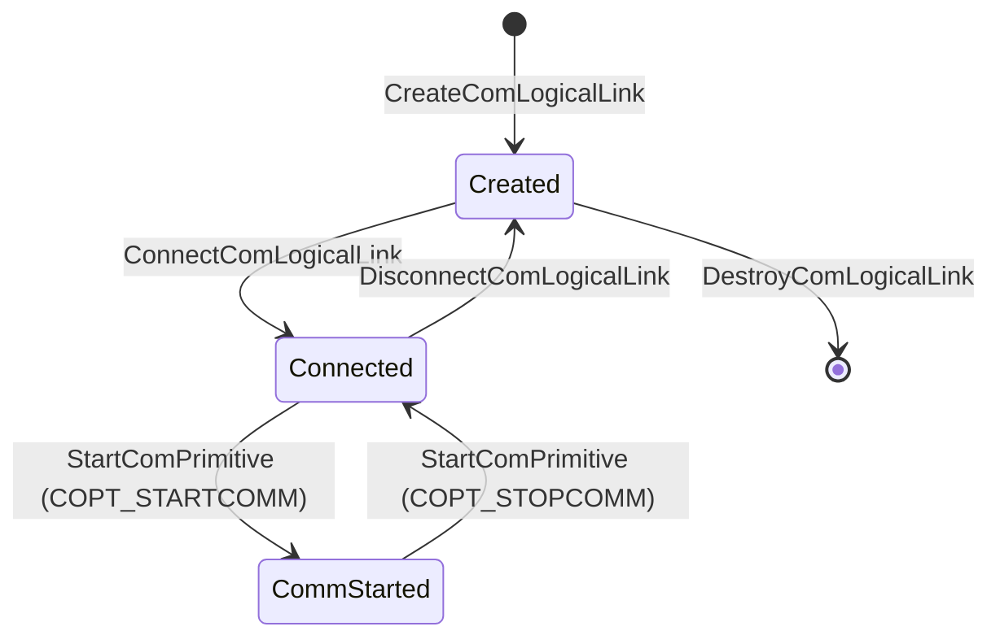
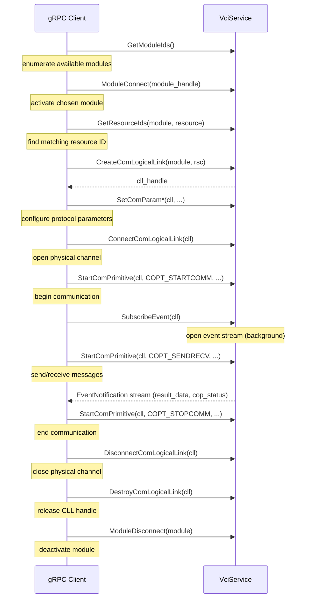

# VCI Service gRPC API Guide

> Proto source: `vci-service-interface/src/proto/service.proto`  
> Generated bindings: `vci-service-interface/src/bindings/vci.service.rs`

---

## Overview

`VciService` is a single gRPC service that exposes the ISO 22900-2 D-PDU API over the network. It defines **25 RPC methods** across eleven functional groups. `iso22900-service` (native D-PDU DLL) and `j2534-0404-service` (J2534 v04.04 adapter) implement the same service interface with real logic.

---

## Connecting & Authentication

The agent connects directly to a running worker's own `grpc_endpoint`, which the worker reports in its `get_status` reply on the stdio control channel; nothing proxies gRPC traffic (ADR-221). Every RPC on this interface, native or gRPC-Web, requires a bearer token signed with the per-instance key the agent provisioned (`set_auth_key`), sent as gRPC metadata:

```
authorization: Bearer <token>
```

A missing, malformed, expired, or wrong-instance token is rejected with `UNAUTHENTICATED` before any RPC below is dispatched. gRPC-Web clients (browsers) are served by the same listener via `tonic-web` and are subject to the identical requirement.

---

## Handle Hierarchy

Handles are nested and must be obtained in order. Each handle is required by the methods below it.

```
SystemHandle          (implicit — no ID)
└── ModuleHandle      (uint32: module_handle)
    └── ComLogicalLinkHandle  (module_handle + cll_handle)
        └── ComPrimitiveHandle  (module_handle + cll_handle + cop_handle)
```

**Lifecycle rule:** always destroy in reverse acquisition order. Destroying a parent handle implicitly destroys all children.

---

## Method Reference

### Module Management

| RPC | Request | Response | Description |
|-----|---------|----------|-------------|
| `GetModuleIds` | `GetModuleIdsRequest` | `ModuleIdsResponse` | List all available VCI modules with their handles and status |
| `ModuleConnect` | `ModuleConnectRequest` | `Response` | Activate a module (required before any link operations) |
| `ModuleDisconnect` | `ModuleDisconnectRequest` | `Response` | Deactivate a module; optionally force-clean all its CLLs |

**Typical sequence:**

```
GetModuleIds → (pick a ModuleHandle with PDU_MODST_AVAIL) → ModuleConnect
```

**Multiple modules (`j2534-0404-service`):** `GetModuleIds` can now return more than one row — one per `config.apis.j2534-0404.libs."<lib>".modules` entry pre-declared in `config.toml` (a single default row when none are configured), see ADR-107. `ModuleConnect` still opens at most one underlying device at a time: connecting a handle other than the one already open is rejected (`PDU_ERR_RESOURCE_BUSY`) until `ModuleDisconnect` runs first. A repeat `ModuleConnect` for the SAME handle after that module lost communication (hard channel error, `module_state.status` marked `PduModstNotAvail`) is also rejected — with `PDU_ERR_FCT_FAILED`, not success — since that path never re-opens or revalidates the device; the client must call `ModuleDisconnect` then `ModuleConnect` again to recover (ADR-131). `GetVersion`, `ConnectComLogicalLink`, and every path that opens or joins a companion CAN channel reject the same `PduModstNotAvail` state too — with `PDU_ERR_MODULE_NOT_CONNECTED` — rather than lazily succeeding on an already-open-but-stale device (ADR-134). `iso22900-service` is unaffected — it always reports whatever the native D-PDU DLL enumerates.

`GetModuleIds`'s `module_status` field (`j2534-0404-service`) reports the real tracked status — `self.module_state.status`, the same value `GetStatus` returns for that handle — for whichever row is currently open, and `PDU_MODST_AVAIL` for every other row, matching the "pick a handle with `PDU_MODST_AVAIL`" flow above literally rather than aspirationally (ADR-132, closing ADR-107 Accepted Residual #1). A row that has never been connected cannot be distinguished from one that is configured but physically absent — J2534 v04.04 has no enumeration primitive to probe a closed device with, so `PDU_MODST_AVAIL` there means "detected per config," not "confirmed reachable."

---

### Version and Information

| RPC | Request | Response | Description |
|-----|---------|----------|-------------|
| `GetVersion` | `GetVersionRequest` | `VersionResponse` | Read firmware/hardware/API version strings from the module |
| `GetTimestamp` | `GetTimestampRequest` | `TimestampResponse` | Read the module's clock (microseconds, `UNUM32`, wraps at 2^32) |

**Clock source differs by service:** `iso22900-service` passes the vendor DLL's native `PDUGetTimestamp` hardware clock straight through. `j2534-0404-service` has no equivalent J2534 v04.04 IOCTL to read, so it synthesizes a monotonic microsecond clock (`events::module_timestamp_us()`, shared with its `GetStatus`/error-event timestamps — see ADR-120), zeroed at process start and rebased to (approximately) zero again on `PDU_IOCTL_RESET` (`events::reset_module_clock()`, ADR-120 amendment). Both satisfy ISO 22900-2 §9.1.6.1's unit and boot/reset-relative semantics, but the two services never share the same clock values.

---

### Resource Management

Resources represent physical bus channels (e.g., CAN 500 kbps on pin 6).

| RPC | Request | Response | Description |
|-----|---------|----------|-------------|
| `GetResourceIds` | `GetResourceIdsRequest` | `ResourceIdsResponse` | Enumerate resource IDs matching a protocol/bustype/pin filter |
| `GetResourceStatus` | `GetResourceStatusRequest` | `ResourceStatusResponse` | Query lock and availability state for specific resources |
| `GetConflictingResources` | `GetConflictingResourcesRequest` | `ConflictingResourcesResponse` | Find which resource-table entries conflict with a given resource, by shared DLC pin wiring or shared physical controller (ADR-106) |

`GetConflictingResources` is a **static resource-table query** (ISO 22900-2
§9.4.26): it compares the queried resource against every other row in the
resource table and is computable before any CLL exists — unlike
`GetResourceStatus`, it consults no live connection state at all.
- `input_module_list` must be present with at least one entry naming the
  (single supported) module handle to get a non-empty result; it is present
  but empty returns an empty result, and entirely absent is rejected with
  `PDU_ERR_INVALID_PARAMETERS`.
- Two resources sharing the same protocol/baud on one physical channel
  (ordinary CLL channel sharing, see "Logical Link Management" above) is
  *not* reported as a conflict — only rows that share a DLC pin number, or
  sit on the same physical controller (`bus_type_id` used as the
  controller-group proxy — e.g. the `SAE_J2610_UART` SCI rows, whose four
  alternate wirings can share no pin yet still occupy one shared
  transceiver), and are not the identical electrical configuration on that
  controller, are. `GetResourceStatus` remains the RPC for live in-use/lock
  state.
- `GetResourceStatus` rejects a `ResourceName` that matches neither the
  resources table nor a legacy protocol-name alias with
  `PDU_ERR_INVALID_PARAMETERS`, rather than reporting `resource_id: 0`/
  `resource_status: 0` for it — indistinguishable from a real query for an
  idle, unlocked resource.

---

### Logical Link Management

A ComLogicalLink (CLL) represents one logical view of a physical bus channel. Multiple CLLs can share one physical channel when they resolve to the same hardware protocol and baud rate — and, since ADR-156, the same DLC pin selection (`pin_select`, `0` for every CLL not using SAE J2534-2 Pin Selection, so this reproduces the pre-ADR-156 protocol/baud-rate-only sharing for every such CLL). See "SAE J2534-2 Pin Selection" below for what `pin_select` is and when it differs from `0`.

| RPC | Request | Response | Description |
|-----|---------|----------|-------------|
| `CreateComLogicalLink` | `CreateComLogicalLinkRequest` | `ComLogicalLinkResponse` | Create a CLL handle for a protocol/resource combination |
| `ConnectComLogicalLink` | `ConnectComLogicalLinkRequest` | `Response` | Open the underlying physical channel (PassThruConnect) |
| `DisconnectComLogicalLink` | `DisconnectComLogicalLinkRequest` | `Response` | Close the physical channel (stops communication) |
| `DestroyComLogicalLink` | `DestroyComLogicalLinkRequest` | `Response` | Release the CLL handle |

**No CLL-scoped correlation tag (ADR-204):** `CreateComLogicalLinkRequest`
does not accept a client-supplied tag echoed back on CLL-scoped events. An
earlier revision of this proto briefly carried one (`cll_tag`) but it was a
complete no-op end to end (no service ever read it back onto an event) and
was removed outright rather than wired up: `cll_handle` is always already
known to the client before any action that could produce a CLL-scoped event
(the `CreateComLogicalLink` response itself delivers it), so handle-based
correlation is sufficient here and no tag is needed. Contrast with
`cop_tag` below, which exists precisely because the equivalent handle-based
argument does *not* hold for `StartComPrimitive`.

**CLL state machine:**



**CLL creation flags** (`CllCreateFlag`, ADR-196 Phase 1, extended by ADR-198
Phase 2 and ADR-200 Phase 3): set via `CreateComLogicalLinkRequest.cll_create_flag_bits`
(named `CllCreateFlagBit` values) or `cll_create_flag_raw` (the ISO 22900-2:2022
Table D.6 byte-array layout: byte 0 bit 6 ChecksumMode, byte 0 bit 7
RawMode, every other bit Unused). Any bit outside those two positions — in
either representation, including an out-of-range/unrecognized named enum
value — is rejected `INVALID_ARGUMENT` at `CreateComLogicalLink`.

- `CLL_CREATE_FLAG_RAW_MODE` — when set, `cop_data`/`CP_TesterPresentMsg` is
  treated as the literal `PassThruMessage.Data` the client already
  assembled (CAN ID in bytes 0-3 for CAN/ISO15765; the client's own KWP
  header — and, iff ChecksumMode is OFF, its own checksum byte — for
  K-line; the client's own 3-byte J1850 header; the client's own 4-byte
  29-bit CAN ID for SAE J1939, see below), instead of this service building
  a header from ComParams: TX header construction is skipped entirely, the
  `TX_FLAG_CAN_29BIT_ID`/`TX_FLAG_ISO15765_ADDR_TYPE` `TxFlag` bits become
  client-authoritative instead of service-derived (CAN/ISO15765 only), and
  a received frame is delivered whole in `ResultData.data_bytes` with
  `extra_info` absent (no header/footer split). RawMode=ON is accepted for
  a base CAN or hardware ISO15765 CLL (ADR-196 Phase 1), a hardware K-line
  (ISO9141/ISO14230) CLL (ADR-198 Phase 2), a SAE J1850 (VPW/PWM) CLL, and
  a SAE J1939 CLL (both ADR-200 Phase 3); Analog Inputs/SCI accept it as a
  no-op (their TX/RX paths are already unaffected by the header/footer
  split either way). Every other protocol (UART-family protocols other
  than K-line, SAE J1708, TP2.0), and any CLL resolving to software ISO-TP,
  rejects RawMode=ON at `CreateComLogicalLink` (`PDU_ERR_ID_NOT_SUPPORTED`)
  rather than silently no-opping it. **TP2.0 is a PERMANENT exclusion, not
  a residual** (ADR-200): ISO 22900-2:2022 defines no RawMode wire shape
  for TP2.0 at all, and this service's own dispatch logic rewrites the
  live, service-negotiated TX-ID at every send, which is fundamentally
  incompatible with a client-owned raw header — including its broadcast
  path, whose own `TP2_0_BROADCAST_MSG` TxFlag is itself ComParam-derived.
  - **SAE J1850 (VPW/PWM)** additionally REQUIRES `CLL_CREATE_FLAG_CHECKSUM_MODE`
    ON (rejected `PDU_ERR_ID_NOT_SUPPORTED`, with a message distinguishing
    this from the general protocol-allowlist rejection, if ChecksumMode is
    OFF) — SAE J2534-1 v04.04 has no J1850 CRC-suppression connect flag, so
    the interface unconditionally computes/verifies/strips J1850's CRC
    regardless of ChecksumMode; only the ChecksumMode=ON (interface-managed)
    semantics is honestly achievable. Otherwise, J1850 RawMode behaves
    identically to CAN/ISO15765 RawMode — TX/RX pass the client's own bytes
    through unchanged, with no protocol-specific service mechanism.
  - **SAE J1939** uses a DIFFERENT client-visible wire shape than every
    other RawMode protocol, because the D-PDU raw contract (ISO
    22900-2:2022 line 774/Table 80: 4-byte 29-bit CAN ID + payload) and the
    native SAE J2534-2 wire format (§16.4.3/Table 62: 4-byte CAN ID +
    1-byte destination address (DA) + payload) genuinely differ for this
    protocol. The client's `cop_data`/`mask_data`/`pattern_data` are always
    the 4-byte-CAN-ID shape (no DA byte) — this service derives and inserts
    the DA byte on TX (mechanically, from the client's own CAN-ID PF/PS
    bytes: PF < 240 sets DA to the PS byte, matching SAE J1939-21's PDU1
    peer-to-peer addressing; PF >= 240 sets DA = `0xFF`, BAM/broadcast) and
    drops it back out on RX before delivery — the DA byte never reaches
    `ResultData.data_bytes`. A `cop_data` shorter than 4 bytes is rejected
    (no CAN-ID prefix to derive a DA from). ChecksumMode is inert for
    J1939 (CAN-based, no message-level checksum concept). What a real
    vendor DLL reports as the CAN ID for a reassembled multi-frame J1939 RX
    response is unspecified by clause 16.4.5 and passed through untouched —
    an accepted residual, see ADR-200's Consequences section.
- `CLL_CREATE_FLAG_CHECKSUM_MODE` — read and format-validated at create
  time for every CLL, but only meaningful for a RawMode=ON hardware K-line
  (ISO9141/ISO14230) CLL (ADR-198 Phase 2) or a RawMode=ON SAE J1850 CLL
  (ADR-200 Phase 3, where it is REQUIRED ON rather than merely meaningful —
  see above; Table D.6 defines it as ignored whenever RawMode is OFF or
  for a checksumless protocol, and CAN/ISO15765/SAE J1939/Analog
  Inputs/SCI have no checksum concept, so it stays inert for every other
  RawMode-eligible CLL). ON (the default when unset) means the D-PDU
  API/vendor interface still manages the checksum even under RawMode
  (native `CONNECT_FLAG_ISO9141_NO_CHECKSUM` stays clear at connect time,
  same as RawMode=OFF, for K-line; this service never sets any connect
  flag for J1850, since v04.04 has none); OFF means the client manages its
  own checksum byte on K-line (`CONNECT_FLAG_ISO9141_NO_CHECKSUM` is set,
  and this service's message-size validation for ISO14230 widens by 1 byte
  per SAE J2534-1 §8.3's "Manual Checksum" row — ISO9141's own row already
  comfortably accommodates the extra byte with no widening needed) — OFF is
  REJECTED outright for J1850 (see above), since it cannot be honestly
  honored there. Two K-line CLLs with disagreeing effective values of this
  bit cannot share one physical channel (`ConnectComLogicalLink` rejects
  the join, `PDU_ERR_FCT_FAILED`-shaped). This service never computes or
  verifies a K-line or J1850 checksum itself in any mode — the difference
  is entirely in the native connect flag (K-line only) and the message-size
  bound (K-line only).

**`ResourceData.dlc_pin_data`'s two roles (`CreateComLogicalLink`):** `dlc_pin_data`
(a `repeated PinData`, each a pin number and/or pin type) narrows which
resource `CreateComLogicalLink` resolves to, but the effect differs by how
the resource's protocol was specified:
- **Existing-resource disambiguation.** When `resource_data.protocol_name`
  matches a canonical ISO 22900-2 name already in the static resource table
  (e.g. `"ISO_15765_2"`), or the request otherwise resolves through that
  table, `dlc_pin_data` narrows an ambiguous name to one specific,
  fixed-wiring row (e.g. disambiguating `"SAE_J2610_SCI"`'s four
  configurations) — an all-or-nothing match against that row's own DLC
  pins, unrelated to Pin Selection below. Narrowing to zero rows is
  rejected `INVALID_ARGUMENT`; narrowing to exactly one resolves it
  regardless of any other row differences (see `resources.rs`/`names.rs` in
  `j2534-0404-service/docs/implementation-notes.md`).
- **SAE J2534-2 Pin Selection.** When the resource resolves via
  `protocol_id`, or a `protocol_name` that does *not* match any resource
  table row (a generic protocol alias, e.g. `"can"`/`"iso15765"`), supplying
  `dlc_pin_data` that differs from the resolved protocol's default DLC pins
  requests clause 6 Pin Selection instead — see below (ADR-156's
  Corrections explain why the two routes don't share one resolution rule).
  A `protocol_id` naming a `_PS` hardware protocol variant directly (e.g.
  `PROTOCOL_CAN_PS`) is treated the same way and always requires
  `dlc_pin_data` — `CreateComLogicalLink` rejects `INVALID_ARGUMENT` for a
  `_PS` `protocol_id` with no `dlc_pin_data` at all, since a `_PS` channel
  has no default pins to fall back to. The bare `resource_id`/`resource_name`
  request fields (no `dlc_pin_data` at all) reject the same way when their
  value numerically names a `_PS` id — that route can never supply pins
  either. When `dlc_pin_data` *is* supplied for a directly-named `_PS` id
  and structurally matches the base protocol's own default pins, the
  request canonicalizes to an ordinary base-protocol connect (no Pin
  Selection, sharing its physical channel with any other default-pins
  connect of the same protocol) rather than opening a distinct `_PS`
  channel on the caller's behalf.

**SAE J2534-2 Pin Selection (`ConnectComLogicalLink`, ADR-156):** a caller on
a module opted into SAE J2534-2 (its configured `pname` carrying the
`"J2534-2:"` prefix, clause 5) may request non-default DLC pins for a
scoped set of protocols by supplying `dlc_pin_data` as described above.
`CreateComLogicalLink` resolves this to a `_PS` hardware protocol variant
and a packed `pin_select` bitmask; a module not opted into J2534-2 gets
`INVALID_ARGUMENT` from `CreateComLogicalLink` itself for any non-default
pin request, before any connect is ever attempted. `CreateComLogicalLink`
also rejects `INVALID_ARGUMENT` when the requested pins are not a
physically complete selection for the resolved protocol (ADR-201): CAN,
ISO15765, SAE J1850 PWM, and SAE J2610 (all four SCI configurations) each
require both a primary and a secondary DLC pin, so a single-pin request is
rejected; SAE J1850 VPW is genuinely single-wire, so a two-pin request (or
any secondary-typed pin) is rejected; ISO9141/ISO14230 (K-line) accept
either a single (K-only) or a full two-pin (K+L) selection, since the
secondary L-line is genuinely optional for that bus. When such a CLL is
later connected, `ConnectComLogicalLink` issues an internal native
`PassThruIoctl(SET_CONFIG, CONFIG_J1962_PINS = pin_select)` call
immediately after `PassThruConnect`, inside the same rollback-protected
connect sequence used for ComParam application and filter installation — a
native failure at either step fails the RPC and disconnects the channel.
This is entirely internal to the one `ConnectComLogicalLink` call: the
client never observes an unpinned-but-connected channel, and
`CONFIG_J1962_PINS` has no ComParam equivalent (it is never settable or
gettable via `SetComParam`/`GetComParam`). A CLL joining an already-open
physical channel with matching `pin_select` never re-issues this call. See
**pin_select**/**Pin Selection** in `docs/glossary.md` and
`j2534-0404-service/docs/implementation-notes.md`'s "SAE J2534-2 Pin
Selection (ADR-156, Phase 2a)" section for the resolution/connect-sequence
details.

**SAE J2534-2 Additional Channels (`CreateComLogicalLink`/`ConnectComLogicalLink`,
ADR-156 Decision 3/Phase 2b; field-based route removed by ADR-178):** a
caller selects one of up to 128 same-protocol vendor-connector channels
through one of two routes — direct `_CHx` id naming, or (for one family
only) a compound resource name — instead of the removed
`ResourceData.channel_index` field.

- **Direct `_CHx` naming** (six of the seven in-scope families): name a
  `_CHx` hardware protocol id directly, via `protocol_id` (or a bare
  `resource_id`/`resource_name`, e.g. numerically) — accepted and decomposed
  to its base protocol and index (unlike a bare `_PS` id on the same routes,
  which is rejected for missing pin data — a `_CHx` id is fully
  self-describing). Works for J1850VPW, J1850PWM, ISO9141, ISO14230, CAN,
  and ISO15765; a `_CHx` id from any other protocol family is rejected
  `INVALID_ARGUMENT` (every id recognized as `_CHx`-shaped decomposes to a
  valid `1..=128` index by construction — the only rejection left is
  "recognized `_CHx` region, but an out-of-scope family", not an in-range
  numeric check).
- **Compound resource name** (SAE J2610 / Chrysler SCI specifically): SAE
  J2610 has four distinct native hardware ids (`SCI_A_ENGINE`/`SCI_A_TRANS`/
  `SCI_B_ENGINE`/`SCI_B_TRANS`) that all collapse onto one shared `_CHx`
  numeric block, so a bare numeric `_CHx` id cannot say which variant is
  meant. Instead, `resource_name` (or `RscData.protocol_name`) accepts
  `"<name>_CH<n>"` (case-insensitive, `n` a decimal `1..=128`) — e.g.
  `"SCI_B_TRANS_CH3"` — tried only after the plain name fails to resolve on
  its own, so `"SCI_B_TRANS"` alone still means what it always has. The
  `<name>` head is resolved through the same name lookup every other
  canonical-name request uses, so it preserves the exact SCI variant; only
  the numeric `_CHx` connect id itself is ambiguous (opaque per the spec, not
  a bug). This is the only family that needs this route — for the other six,
  the direct numeric `_CHx` id is fully sufficient. `ResourceId`/`protocol_id`
  (the numeric routes) do not accept this grammar — only the two `string`
  fields do.

Naming a `_CHx` id or a compound name requires the connecting module to have
opted into SAE J2534-2 (the same `"J2534-2:"` `pname` prefix, clause 5) —
rejected `INVALID_ARGUMENT` otherwise, before any connect is attempted.
Supplying both a directly-named `_CHx` id and a compound name (e.g. a
compound name whose head itself resolves to a raw `_CHx` id) is rejected as
double qualification, even when the two would agree.

**Mutual exclusion with `dlc_pin_data`:** an Additional Channel qualifier
(either route) and Pin Selection are mutually exclusive — clause 7 channels
live on vendor connectors, never on J1962/J1939/J1708 pins. Either route
combined with a non-default `dlc_pin_data` (a genuine Pin Selection request,
as described above) is rejected `INVALID_ARGUMENT`.

Once resolved, no further client-visible sequencing is needed at
`ConnectComLogicalLink` time — unlike Pin Selection, a `_CHx` channel needs
no internal `SET_CONFIG` call (clause 7 channels are vendor-connector-based,
never pin-gated). `GetResourceStatus` reports a `_CHx` link as occupying
its base resource (consistent with Pin Selection); a literal query naming
the exact `_CHx` id matches only that specific index. See
`j2534-0404-service/docs/implementation-notes.md`'s "SAE J2534-2 Additional
Channels (ADR-156, Phase 2b)" section for the resolution/capacity-precheck
details, and ADR-156/ADR-178 for the design.

**SAE J2534-2 Analog Inputs (`CreateComLogicalLink`/`SetComParam`/
`ConnectComLogicalLink`, ADR-177/Phase 15, revised by ADR-178):** the native
clause 10.3.3.2.2 SAMPLE_RATE acquisition parameter for one of the 32
independent, read-only `ANALOG_IN_1`..`ANALOG_IN_32` resources (D-PDU
resource IDs `0x023D`-`0x025C`) is carried by a project-minted ComParam,
`CP_AnalogSampleRate` (id `0x80C4`, no ISO 22900-2 source — see ADR-178's
Decision section for why this is the one case where minting a new
service-level ComParam id was necessary), staged via `SetComParam` on the
CLL's Working set and resolved at `ConnectComLogicalLink` time — not a
`CreateComLogicalLinkRequest` field (the ADR-177 shape this superseded, and
before that a `ResourceData`-scoped field a Codex review finding, PR #66,
found unreachable via the normal `GetResourceIds` ->
`CreateComLogicalLink(Resource::ResourceId(...))` discovery flow; both prior
shapes are gone). `is_param_allowed`'s ANALOG_IN allowlist accepts exactly
this one ComParam for one of the 32 `ANALOG_IN_x` resources and rejects it
`INVALID_ARGUMENT` (`PDU_ERR_COMPARAM_NOT_SUPPORTED`) for every other
resource at `SetComParam` time — structurally, with no separate exclusivity
check needed elsewhere. Required and must be staged nonzero before
`ConnectComLogicalLink` on one of these 32 resources — clause 10.3.3.2.2's
own zero default means the acquisition subsystem would be disabled, so a
still-zero/unstaged value at connect time is rejected `INVALID_ARGUMENT`
(a connect-time rejection, not a create-time one — a client polling
`CreateComLogicalLink`'s own success no longer signals "the resource is
valid" for a missing rate specifically). Applied via a native `SET_CONFIG`
immediately after `PassThruConnect` succeeds; a device rejection fails the
whole connect. Every one of the 32 resources requires the connecting module
to have opted into SAE J2534-2 (the same `"J2534-2:"` `pname` prefix,
clause 5), the same as every other SAE J2534-2 protocol resource in this
table — rejected `INVALID_ARGUMENT` otherwise, before any connect is
attempted.

The rate actually applied to a physical channel via `SET_CONFIG` is
recorded on that channel at creation time; a second CLL joining the same
already-open `ANALOG_IN_x` channel is checked against this recorded APPLIED
rate, not against any CLL's live Working ComParam state — a staged
`CP_AnalogSampleRate` is re-stageable post-connect at any time, so comparing
live state again would let an owner's post-connect re-stage (with no
reconnect) silently desync the join check from what hardware is actually
running. For the same reason, a `CoptUpdateparam` that would change an
already-connected analog link's `CP_AnalogSampleRate` away from the applied
rate is rejected outright (`INVALID_ARGUMENT`), mirroring the CAN FD
`CoptUpdateparam` guard's own "reject rather than silently ignore" pattern —
disconnect and reconnect with the desired rate staged, or `CoptRestoreParam`
to discard the pending change.

Clause 10 has no pin concept at all (unlike every other resource family
above), so `dlc_pin_data`/`channel_index`/Pin Selection/Additional Channels
do not apply to these 32 resources — a non-default `dlc_pin_data` on one of
them is rejected `INVALID_ARGUMENT`. Only `PassThruReadMsgs`-equivalent
reads work on these resources: a write (`CoptSendrecv`/`CoptStartcomm`/a
non-empty `CoptStopcomm cop_data`) or `PDU_IOCTL_START_MSG_FILTER` on a
connected Analog Input link is rejected `INVALID_ARGUMENT` with
`PDU_ERR_ID_NOT_SUPPORTED` — clause 10 defines this protocol as read-only
with no filter concept, and this service enforces both adapter-side
(service-layer rejection) rather than relying on every possible adapter's
own native-error passthrough.

**Remaining Analog Inputs parameters (ADR-216):** clause 10.3.3.2's other
seven acquisition/capability parameters are also project-minted ComParams,
no ISO 22900-2 source, following `CP_AnalogSampleRate`'s own naming/id-range
convention — allowed only for one of the 32 `ANALOG_IN_x` resources, the
same allowlist `CP_AnalogSampleRate` uses. `CP_AnalogActiveChannels`
(`0x80D3`), `CP_AnalogSamplesPerReading` (`0x80D4`), `CP_AnalogReadingsPerMsg`
(`0x80D5`), and `CP_AnalogAveragingMethod` (`0x80D6`) are writable via
`SetComParam`; `CP_AnalogReadingsPerMsg` is range-checked to `1..=0x408`
(1032) and `CP_AnalogSamplesPerReading` must be `>= 1` — clause
10.3.3.2.3/.2.4's own zero-value special case (disarming the acquisition
subsystem entirely) is intentionally not offered through either ComParam;
`CP_AnalogSampleRate` remains the sole arming/disarming knob.
`CP_AnalogSampleResolution` (`0x80D7`), `CP_AnalogInputRangeLow` (`0x80D8`),
and `CP_AnalogInputRangeHigh` (`0x80D9`) are genuinely read-only — the first
read-only ComParams in this codebase — and reject any `SetComParam` attempt
outright with `INVALID_ARGUMENT`/`PDU_ERR_COMPARAM_NOT_SUPPORTED`, matching
clause 10.3.3.2.6-.2.8's own native `ERR_INVALID_IOCTL_PARAM_ID` rejection
for the same operation. `CP_AnalogInputRangeLow`/`CP_AnalogInputRangeHigh`
report their millivolt value SIGNED, via the proto's `Snum32` oneof arm
rather than the `Unum32` arm every other numeric ComParam in this service
uses — the first signed-value-reporting ComParam in this codebase.

All five of `CP_AnalogActiveChannels`/`CP_AnalogSampleResolution`/
`CP_AnalogInputRangeLow`/`CP_AnalogInputRangeHigh`/`CP_AnalogAveragingMethod`
are populated by a one-time `GET_CONFIG` readback at `ConnectComLogicalLink`
time (both a fresh physical-channel connect and a CLL joining an
already-open `ANALOG_IN_x` channel), not by any live `GetComParam`-time
hardware read — before a CLL's first successful connect, all five read `0`
("not yet known"), a client must not assume this means the underlying
hardware genuinely reports a zero channel mask/resolution/range/method.
`CP_AnalogActiveChannels`/`CP_AnalogAveragingMethod` are included in this
readback (not just the three genuinely read-only params) because clause
10.3.3.2.1's own default for `CP_AnalogActiveChannels` is device-dependent —
a freshly-connected link's staged/default value would otherwise be stale
relative to what the device actually reports — and because a joining CLL
must adopt `CP_AnalogAveragingMethod`'s live value rather than its own
seeded default, or its own later `CoptUpdateparam` would silently clobber
the channel's actual hardware value back to that default (clause 10.3.3.2.5
carries no rate-gate on this param, unlike SamplesPerReading/ReadingsPerMsg
below).

`CP_AnalogSamplesPerReading`/`CP_AnalogReadingsPerMsg` are ALSO synced at
this same connect-time point, fresh connect and join alike — but from the
channel's own already-recorded applied value rather than a fresh
`GET_CONFIG`, since these two are exactly the ComParams the
`CoptUpdateparam` guard below compares against. A joining CLL never keeps
its own seeded Working default for either one.

`CP_AnalogSamplesPerReading`/`CP_AnalogReadingsPerMsg` are rejected via
`CoptUpdateparam` on an already-connected analog link only when the staged
value genuinely differs from the value applied at connect time — extending
`CP_AnalogSampleRate`'s own `CoptUpdateparam` guard above with the identical
value-comparison shape. Because the connect-time sync above keeps a
joiner's own Working values equal to the channel's applied ones from the
moment it joins, this holds for a joining CLL exactly as it already did for
the CLL that opened the channel: an update that leaves both unchanged, or
that touches only `CP_AnalogActiveChannels`/`CP_AnalogAveragingMethod` (or
neither ComParam at all), succeeds normally on either CLL; only a genuine
attempted change is rejected — disconnect and reconnect with the desired
values staged, or `CoptRestoreParam` to discard the pending change.
`CP_AnalogActiveChannels`/`CP_AnalogAveragingMethod` carry no such re-stage
rejection — both stay live-changeable via an ordinary `CoptUpdateparam`. But
neither is unconditionally forwarded to hardware on every `CoptUpdateparam`
a CLL issues: this service forwards only a value the calling CLL is
genuinely changing right now (its own currently-staged value differs from
its own current reported value), never a value that CLL never touched. This
matters across sibling CLLs sharing a channel — without it, a CLL that never
touched either param would still re-push its own outdated copy on every
unrelated `CoptUpdateparam` it issues, silently reverting a live change a
sibling CLL just made elsewhere on the same channel. See
`j2534-0404-service/docs/implementation-notes.md`'s "SAE J2534-2 Analog
Inputs (ADR-177, Phase 15)" section and ADR-177/ADR-178/ADR-216 for the full
design. A residual of this design: a sibling CLL's own `GetComParam` for
either param can still report a stale value for a time after another CLL
changes it live — this service does not push a live change into every
sibling's own per-CLL bookkeeping, only avoid re-forwarding a sibling's own
stale copy to hardware.

A joiner's own already-staged value for any of the four writable Analog
Inputs ComParams (`CP_AnalogActiveChannels`/`CP_AnalogSamplesPerReading`/
`CP_AnalogReadingsPerMsg`/`CP_AnalogAveragingMethod`) is silently overwritten
by the channel's actual applied/live value at connect time — the same "live
value wins" precedent this subsystem already establishes elsewhere (the
`CP_Baudrate` write-back, the join-time sample-rate check), reflecting
clause 10.3.3.2's own framing of this configuration as belonging to the
acquisition subsystem as a whole, not to any one CLL. `CP_AnalogSampleRate`
is the deliberate exception: it must be staged before connecting, and a
re-stage attempt that would change it on an already-connected link is
rejected outright rather than silently overwritten (ADR-178).

---

### Resource Locking

| RPC | Request | Response | Description |
|-----|---------|----------|-------------|
| `LockResource` | `LockResourceRequest` | `Response` | Reserve a resource exclusively for a CLL |
| `UnlockResource` | `UnlockResourceRequest` | `Response` | Release the exclusive reservation |

`LOCK_PHYSICAL_COM_PARAMS` (mask bit `0x01`) blocks other CLLs sharing the
same physical resource from:
- calling `SetUniqueRespIdTable` on ISO15765 — the RPC itself only stages the
  Working UniqueRespIdTable and performs no hardware I/O (ADR-068), but the
  check still runs at Set/stage time, since the staged table will eventually
  drive real hardware I/O (installing/removing `FLOW_CONTROL_FILTER`s) once
  promoted (ADR-039, ADR-043, ADR-068);
- calling `ConnectComLogicalLink` to establish a brand-new physical channel
  (the first CLL on a given protocol/baud-rate pair), which also writes the
  Working ComParam set via `SET_CONFIG` — this includes the pre-connect
  reservation case, where `LockResource` was called before the lock holder
  itself connected (ADR-045).

`SetComParam` (Working-buffer-only write) and `StartComPrimitive` with
`COPT_SENDRECV`/`COPT_STARTCOMM`+`temp_param_update` are **not** blocked by
this lock (ADR-044's synchronous rejection for these is superseded by
ADR-110 per ISO 22900-2 §9.4.16 d)'s event-based model — see above).
`StartComPrimitive(COPT_UPDATEPARAM)` is also never synchronously rejected
by this lock; instead, at execution time, a `PDU_PC_BUSTYPE`-class ComParam
this lock protects is excluded from the hardware push and from promotion
(reporting one `PDU_ERR_EVT_RSC_LOCKED` error event) while every other
ComParam — and the Working UniqueRespIdTable promotion, reconciling
`FLOW_CONTROL_FILTER`s (ADR-068) — still applies normally.

Independently of this lock, a separate, unconditional guard on
`temp_param_update` itself (ADR-067, below) synchronously rejects any
`PDU_PC_BUSTYPE`-class ComParam mismatch between Working and Active before
the COP is ever enqueued — `temp_param_update` can never stage a physical
ComParam change in the first place, lock or no lock (ADR-110).

`LOCK_PHYSICAL_TX_QUEUE` (mask bit `0x02`) does **not** synchronously reject
other CLLs' transmitting COPs (ADR-123, superseding the prior hard-reject
behavior). Instead, `StartComPrimitive(COPT_SENDRECV/COPT_STARTCOMM)` and
`COPT_STOPCOMM` with non-empty `cop_data` from a non-holding CLL always
return a COP handle and queue: the COP sits at `PDU_COPST_IDLE` until the
lock releases, then dispatches, exactly as ISO 22900-2 §9.4.13.3's use case 1
("SUSPEND_TX_QUEUE"/"RESUME_TX_QUEUE") describes. A CLL that connects to a
physical resource while a sibling already holds `LOCK_PHYSICAL_TX_QUEUE`
starts in this same suspended state.

Granting `LOCK_PHYSICAL_TX_QUEUE` itself can still fail: `LockResource`
rejects with `PDU_ERR_FCT_FAILED` if another CLL sharing the resource
currently has an actively-transmitting COP in flight (a queued-but-
not-yet-dispatched COP does not count). `LOCK_PHYSICAL_COM_PARAMS`-only
requests are not subject to this check (an in-flight transmission does not
block a ComParam lock, per §9.4.13.3 use case 2).

**`LockResource`/`UnlockResource` return codes (ADR-123):**
- `LockResource` rejects a `lock_mask` bit already held by another CLL with
  `PDU_ERR_RSC_LOCKED` (not `PDU_ERR_RSC_LOCKED_BY_OTHER_CLL`, which Table 21
  of the spec does not list as a legal `PDULockResource` return).
- `UnlockResource` rejects atomically (no partial unlock) if any requested
  bit is not held by the calling CLL: `PDU_ERR_RSC_LOCKED_BY_OTHER_CLL` if
  another CLL holds it, `PDU_ERR_RSC_NOT_LOCKED` if no one does.
- Both RPCs reject a `lock_mask` that is zero or contains any bit outside
  `LOCK_PHYSICAL_COM_PARAMS | LOCK_PHYSICAL_TX_QUEUE` with
  `PDU_ERR_INVALID_PARAMETERS` — no silent narrowing of an over-broad mask.

---

### Communication Parameters

ComParams configure timing, addressing, and protocol behavior for a CLL. They must be set before `ConnectComLogicalLink`.

| RPC | Request | Response | Description |
|-----|---------|----------|-------------|
| `GetComParam` | `GetComParamRequest` | `ComParamResponse` | Read a single ComParam by ID |
| `SetComParam` | `SetComParamRequest` | `Response` | Write a single ComParam value |

Both a ComParam's id and its value are carried in `ParamItem`:
- `id` (`oneof`) — `param_id` (numeric) or `param_name` (shortname, e.g.
  `"CP_StMin"`), resolved server-side (ADR-103). Name resolution is
  CLL-independent — the same name always resolves to the same id
  regardless of which CLL it is used on; whether the resolved id is
  actually usable on *this* CLL's protocol is checked separately, after
  resolution. An unresolvable `param_name` is rejected with
  `INVALID_ARGUMENT` rather than falling back to any other id.
  `GetComParamRequest` has its own, separate `oneof param {param_id,
  param_name}` at the request level (`ComParamResponse.param_item` always
  reports back `param_id`, never `param_name`); `SetComParamRequest` and
  `SetUniqueRespIdTableRequest` both accept either form directly on the
  `ParamItem`(s) they carry.
- `param_data` (`oneof`) — the value:
  - `unum32` — unsigned integer (UNUM8/16/32)
  - `snum32` — signed integer (SNUM8/16/32)
  - `bytefield` — raw byte array
  - `longfield` — array of uint32
  - `structfield` — complex types (session timing, access timing, TLS config)

`SetComParam` additionally accepts `com_param_class` left as
`PDU_PC_SPECIFIED` (unspecified): `iso22900-service` fills it in from the
param's current class (via `GetComParam`) before calling the underlying
`PDUSetComParam`, since the real D-PDU API expects a concrete class;
`j2534-0404-service` does not use the client-supplied `com_param_class` on
`SetComParam` at all (its allowlist keys purely off protocol + ComParam id,
see `comparam_support::check_param_allowed`).

On the `GetComParam` response side, `j2534-0404-service` reports
`com_param_class` for the two ISO 22900-2 Annex B.3.2 classes it can
determine from a verified spec citation: `PDU_PC_BUSTYPE` for physical-layer
ComParams (`comparam_support::is_bustype_param`) and `PDU_PC_TESTER_PRESENT`
for `CP_TesterPresentxxx` params. Every other ComParam reports
`PDU_PC_SPECIFIED` (0) — not a real ISO 22900-2 class (the ISO `E_PDU_PC`
enum only defines values 1-7), but the proto's required zero value, meaning
"unclassified/not reported": the in-workspace ISO 22900-2:2009(E) text's
only per-param class source (Tables B.10/B.11) is flagged unreliable by its
own conversion note and internally inconsistent where checked, so a full
TIMING/INIT/COM/ERRHDL classification cannot currently be verified (ADR-133,
conformance-audit finding A2-17). `PDU_PC_UNIQUE_ID` never appears in a
`GetComParam` response, since those params are rejected outright (see
below). `GetComParam` also now reports the correct empty `Bytefield`/
`Structfield` oneof variant — instead of a misleading `Unum32(0)` — for a
Bytefield- or Structfield-typed ComParam with no seeded value on the
connected protocol (ADR-133, conformance-audit finding A2-18; extends
ADR-130's identical fix for `CP_CanBaudrateRecord`).

**STRUCTFIELD support (ADR-218).** `structfield`'s three typed list variants
(`session_timing`/`access_timing`/`tls_version_and_cipher`) map 1:1 onto the
three ISO 22900-2 standard `ComParamStructType`s
(`PDU_CPST_SESSION_TIMING`/`PDU_CPST_ACCESS_TIMING`/
`PDU_CPST_TLS_VERSION_AND_CIPHER`, values `0x1`-`0x3`), in both directions —
no configuration needed. Every other `ComParamStructType` is vendor-specific
and uses the `vendor_specific` variant (`ParamVendorSpecificStruct`):

- `type_url` carries the `ComParamStructType` discriminant as
  `"pdu-cpst:0x<8 lowercase hex digits>"` (e.g. `"pdu-cpst:0x00000005"`).
  Mandatory on `SetComParam`; `iso22900-service` fills it in on read from the
  native call's own struct-type context. A `type_url` whose decoded value is
  `0x1`-`0x3` is rejected `INVALID_ARGUMENT` under this variant — use the
  typed `session_timing`/`access_timing`/`tls_version_and_cipher` variant for
  those instead.
- `value` is the vendor's native in-memory struct layout verbatim —
  `iso22900-service` neither reinterprets nor re-encodes these bytes (ISO
  22900-2:2022 §B.3.3.2 NOTE 3 guarantees only even-byte alignment for a
  struct entry). `SetComParam` rejects `INVALID_ARGUMENT` unless
  `value.len() == size_of_entry * count_of_entry`, and unless
  `size_of_entry > 0` whenever `count_of_entry > 0`.

**Entry-size resolution (ADR-218, as amended).** A vendor struct type's
`size_of_entry` is resolved from a per-library `vendor_struct_types` table in
`config.toml` alone — see
[vci-service-config/src/lib.rs](../crates/vci-service-config/src/lib.rs)'s
`find_vendor_struct_type_size` doc comment for the exact
`[config.apis.iso22900.libs."<lib>".vendor_struct_types]`/
`[config.apis.iso22900.arch.<arch>.libs."<lib>".vendor_struct_types]` table
shape (each key is the same `"0x<8 lowercase hex digits>"` string as
`type_url`'s suffix, each value the entry size in bytes). A value above
`VENDOR_STRUCT_TYPE_MAX_ENTRY_SIZE_BYTES` (64 KiB) fails startup (naming the
offending key) and is also filtered out of every per-request lookup as
"not configured at this level" — a sanity ceiling on the configured value
itself, not a cap on any allocation it produces, mirroring `vendor_ioctls`'s
identical `VENDOR_IOCTL_MAX_RAW_CONTRACT_BYTES` ceiling (ADR-218/ADR-219,
both as amended). Unlike `vendor_ioctls` (loaded once at startup),
`vendor_struct_types` is re-read from `config.toml` on every lookup, so this
ceiling is enforced at both points rather than startup alone. Config is the SOLE
source, used identically on both `GetComParam`/`GetUniqueRespIdTable` (read)
and `SetComParam`/`SetUniqueRespIdTable` (write) — there is no
process-lifetime cache or "write it once first" fallback; an earlier design
had one, removed after Codex review found it let a client poison a later
read with an unverified, self-declared entry size (a successful native
`PDUSetComParam` never validates the caller's declared size against the
connected library's real layout, so a size learned from a write was never
more trustworthy than the write itself — see ADR-218's amendment for the
full analysis).

- **Read:** for a table with `ParamActEntries > 0`, an unconfigured struct
  type fails `FAILED_PRECONDITION`, naming the struct type and the remedy
  (configure `vendor_struct_types` for this library). A table with
  `ParamActEntries == 0` always reports `count_of_entry: 0, value: []`
  unconditionally — an empty table has no entry whose size needs to be
  known.
- **Write:** for a non-empty write (`count_of_entry > 0`), an unconfigured
  struct type fails `FAILED_PRECONDITION` the same way; a configured struct
  type requires the request's `size_of_entry` to equal the configured value
  exactly, or the write is rejected `INVALID_ARGUMENT` naming both the
  declared and configured sizes. An empty write (`count_of_entry == 0`)
  needs no size resolution in either direction and is accepted
  unconditionally, regardless of `size_of_entry`'s value — this closes the
  exploit path above at its source: an empty write can no longer poison
  anything, since nothing is ever learned from a write to begin with.

See ADR-218 for the full design rationale.

Separately, `j2534-0404-service` forwards a J2534 `ConfigParameterID` in the
SAE J2534-1 §7.2.14.3 tool-manufacturer-specific range (`0x10000`-
`0xFFFFFFFF`) to native `PassThruSetConfig`/`PassThruGetConfig` by identity
(ADR-219 Decision item 3) — `SetComParam`/`GetComParam` treat a vendor id
exactly like any other Unum32 ComParam once staged into Working (no
namespacing/offset scheme; the value round-trips unchanged). The per-protocol
ComParam allowlist (`comparam_support.rs::is_param_allowed`) admits such an id
unconditionally, on every protocol, ahead of every protocol-specific
allowlist rule (ADR-219 amendment) — not just an unrecognized protocol. One read-path
difference: `GetComParam` on a vendor id never staged on this link (no prior
`SetComParam` for it) performs a live `PassThruGetConfig` read instead of
reporting `Unum32(0)` — if the CLL is connected, the live value is returned
without inserting it into Working (a mere read never mutates staged state);
if the CLL is not connected, the call rejects `FAILED_PRECONDITION`
(`PDU_ERR_CLL_NOT_CONNECTED`) — this service has no legitimate default to
fabricate for an id it does not itself recognize. `com_param_class` always
reports `PDU_PC_SPECIFIED` (unclassified) for a vendor id, the same policy
ADR-133 already applies to every id this service cannot otherwise classify;
`param_data` is `Unum32` only (native `SCONFIG.Value` is always a plain
`u32`). The `0x8000`-`0xFFFF` SAE J2534-2 range is deliberately NOT included
in this passthrough — it is already double-booked by this service's own
minted ComParam ids (e.g. `CP_AccessTiming_Ecu`/`CP_AccessTimingOverride` at
`0x804E`/`0x804F` share their numeric value with native
`CONFIG_TP2_0_IDENTIFER`/`_RXIDPASSIVE`), so those two stay `None`/rejected
exactly as before this ADR. See ADR-219 for the full design rationale
(including the SAE J2534-1 vendor IOCTL passthrough this same ADR adds,
documented in "IO Control" below).

See `j2534-0404-service/docs/comparam-mapping.md` for ComParam ID reference.

`PDU_PC_UNIQUE_ID` class ComParams (per-ECU addressing such as
`CP_CanPhysReqId`, `CP_CanRespUSDTId`, `CP_CanRespUUDTId`, `CP_MidRespId`,
`CP_J1939SourceAddress`, ...) are rejected by `GetComParam` / `SetComParam`
with `INVALID_ARGUMENT` — ISO 22900-2 §9.3.3.6 reserves them for
`GetUniqueRespIdTable` / `SetUniqueRespIdTable` exclusively (see
"Unique Response ID Table" below, and ADR-042) — on whichever protocol
classifies them that way. The classification is per-protocol, not universal:
`CP_J1939SourceAddress` is `PDU_PC_UNIQUE_ID` class for J1939 only (ADR-184;
routes received frames by responding ECU source address via
`SetUniqueRespIdTable`), not for CAN/ISO15765 or any other protocol. See
`j2534-0404-service/docs/comparam-protocol-support.md` (the `U` legend entry)
for the full per-protocol list.

Note the deliberate asymmetry with KWP/J1850: `CP_EcuRespSourceAddress` and
its three companion response-format params are likewise `PDU_PC_UNIQUE_ID`
class there (ADR-202) and accepted by `SetUniqueRespIdTable`, but only two of
the four are actually consumed by this service on TX — `CP_EcuRespSourceAddress`
and `CP_PhysRespFormatPriorityType` feed TX-side response-header composition
(`tx_header.rs`'s `ecu_addr`/`response_header_bytes`); `CP_FuncRespFormatPriorityType`/
`CP_FuncRespTargetAddr` are staged and echoed but never read anywhere, since
`response_header_bytes` rejects functional addressing outright for KWP/J1850
(K-line/J1850 has no functional-response composition path in this service at
all) — the identical, pre-existing situation KWP's own copies of these two
params have always been in, unaffected by ADR-202. On RX, as of
[ADR-203](adr/ADR-203-kwp-j1850-source-address-rx-routing.md),
`CP_EcuRespSourceAddress` IS consulted too: a table entry keyed by it gives
received frames from that source address a real, distinct
`unique_resp_identifier` instead of the wildcard `0`, so
`ExpectedResponseData.unique_resp_ids` restrictions now work on KWP/J1850
CLLs that configure such entries — a table-mode CLL that receives a frame
from an unconfigured (or source-less) address drops it rather than
delivering it under the wildcard identifier. A CLL with no
`CP_EcuRespSourceAddress`-keyed entries at all is unaffected: RX still
wildcards at `unique_resp_identifier == 0` for every frame, exactly as
before. See ADR-203.

**SAE J2534-2 UART Echo Byte remaining timing parameters (ADR-216):**
clause 12.3.4.1's ten remaining native `SET_CONFIG`/`GET_CONFIG` timing
parameters are project-minted ComParams, no ISO 22900-2 source, allowed only
for a `UART_ECHO_BYTE_PS`/`_CHx` link (`CP_UebT0Min` `0x80DA` through
`CP_UebT9Min` `0x80E3`, matching the native `CONFIG_UEB_*` id order). Their
values are native-verbatim whole milliseconds — **not** the 1 µs resolution
every ISO-sourced `CP_*` timing ComParam in this service otherwise uses
(`CP_P1Max`, `CP_W1Max`, etc.) — a client staging one of these ten must not
apply the usual µs-to-native conversion assumption.

---

### Communication Primitives

A ComPrimitive (COP) is a single communication operation on a CLL.

| RPC | Request | Response | Description |
|-----|---------|----------|-------------|
| `StartComPrimitive` | `StartComPrimitiveRequest` | `ComPrimitiveResponse` | Start a COP and return its handle |
| `CancelComPrimitive` | `CancelComPrimitiveRequest` | `Response` | Request cancellation of a running COP |

**COP types** (`ComOperationType`):

| Type | Hex | Description |
|------|-----|-------------|
| `COPT_STARTCOMM` | 0x8001 | Send tester-present / start communication |
| `COPT_STOPCOMM` | 0x8002 | Stop communication |
| `COPT_UPDATEPARAM` | 0x8003 | Apply working-set ComParams to active set |
| `COPT_SENDRECV` | 0x8004 | Send a message and wait for response |
| `COPT_DELAY` | 0x8005 | Wait for a specified time |
| `COPT_RESTORE_PARAM` | 0x8006 | Restore working-set ComParams from active set |

**Event correlation (`cop_tag`, ADR-204):** `StartComPrimitiveRequest.cop_tag`
is an optional, opaque `bytes` value the client chooses and the service
never interprets — only stores and echoes back. Set it at `StartComPrimitive`
and read it back off `EventItem.cop_tag` (see "Per-service echo coverage"
below for exactly which event types carry it on each backend); no buffering
or ordering assumptions are needed to attribute a *carrying* event to the
call that started it, even one that arrives before the
`StartComPrimitiveResponse` itself does. This matters because the COP handle
returned in that response is the only other way to make the same
attribution, and a client that pipelines several `StartComPrimitive` calls
on one CLL has no way to match an early event to `cop_handle` alone until
its own matching response has resolved — gRPC's per-call correlation
resolves that ambiguity eventually, but only once the response arrives.
`cop_tag` removes the ordering dependency entirely: a client that always
sets its own correlation key up front and reads it back verbatim needs no
event-buffering/reconciliation logic at all.

`cop_tag` is echoed on `EventItem.cop_tag` verbatim, iff `EventItem.cop_handle`
is also present on that event (mirrors the native D-PDU API's own
"undefined COP handle" carve-out) — an event with no COP handle (a CLL- or
module/system-scoped event) never carries a `cop_tag`, tag or no tag
supplied. A tag is never required; when none was supplied at
`StartComPrimitive`, `EventItem.cop_tag` is simply absent on every event for
that COP. The maximum tag size is documented per service (64 bytes as of
this writing, generous enough for a UUID or a compact string key — see each
service's own `MAX_COP_TAG_LEN`); a `StartComPrimitive` call with an
oversized `cop_tag` fails synchronously with `INVALID_ARGUMENT` naming the
limit, and the COP is never created.

**Per-service echo coverage:** both `iso22900-service` and
`j2534-0404-service` echo `cop_tag` on every `EventItem` variant that carries
a `cop_handle` (`result_data`/`cop_status`/`error_data`) uniformly, per
ADR-204's Decision item 1. Per ADR-205, the tag is always captured from
`CopEntry::cop_tag` (`primitives`, ADR-021) at the point some code already
holds a live, current read of the COP's entry -- never re-resolved later,
after that critical section has ended, since a concurrent cancellation or
teardown could have already removed the entry by then. On
`j2534-0404-service`, `result_data` captures the tag when a received frame
is bound to its COP (once per poll pass, alongside the registrant
snapshot); `error_data` captures it wherever the caller already reads the
COP's state to decide an error should fire at all, and passes it into
`send_error_event` as a parameter -- `send_error_event` itself performs no
lookup of its own. `CreateComLogicalLinkRequest` has no equivalent
CLL-scoped tag -- see "No CLL-scoped correlation tag" above for why one
isn't needed there.

`COPT_UPDATEPARAM` writes the Working ComParam set to hardware
(`PassThruIoctl SET_CONFIG`); so does `COPT_SENDRECV` when
`ComPrimitiveCtrlData.temp_param_update` is set (ISO 22900-2 §9.4.3), and so
does `COPT_STARTCOMM` when `temp_param_update` is set, for the duration of
its init transaction (ADR-066). None of these are synchronously rejected by
`LOCK_PHYSICAL_COM_PARAMS` (ADR-044's rejection is superseded by ADR-110, per
ISO 22900-2 §9.4.16 d)'s event-based model): `COPT_UPDATEPARAM` always
creates the COP, applies every non-conflicting ComParam, and emits at most
one `PDU_ERR_EVT_RSC_LOCKED` error event for a `PDU_PC_BUSTYPE`-class
ComParam another CLL's lock protects — the COP still finishes normally
(`PDU_COPST_FINISHED`). `temp_param_update` never touches a physical
ComParam at all regardless of lock state (a `PDU_PC_BUSTYPE`-class ComParam
can never be staged through it — see the synchronous `PDU_ERR_TEMPPARAM_NOT_ALLOWED`
rejection below), so it is unaffected by this lock. `SetComParam` itself
(Working-buffer-only write) is never rejected by this lock either — Table 25
(§9.4.16.5) has no lock-related return code, and the lock's effect is only
visible at `COPT_UPDATEPARAM` execution time as described above.
`COPT_STOPCOMM` writes no hardware ComParam config regardless of
`temp_param_update` and is never blocked by this lock. This is specifically
about `SET_CONFIG`/ComParam writes, not payload transmission: `COPT_STOPCOMM`
with non-empty `cop_data` does transmit that payload as a final message
before the CLL returns to `PDU_CLLST_ONLINE` (ADR-085, see below) — that
transmit joins `LOCK_PHYSICAL_TX_QUEUE`, a separate lock from
`LOCK_PHYSICAL_COM_PARAMS`, the same way `COPT_SENDRECV`/`COPT_STARTCOMM`
already do; `COPT_STOPCOMM` with empty `cop_data` stays exempt from both
locks.

**Final message on stop-comm (ADR-085):** `COPT_STOPCOMM` with non-empty
`cop_data` transmits it as a single fire-and-forget message (no response is
awaited), resolved through the same header-construction/validation pipeline
`COPT_SENDRECV` uses (ADR-049/ADR-050/ADR-055), always against the Active
ComParam snapshot — never Working, regardless of `temp_param_update`. The
poll task's ordering is: stop the periodic tester-present message (if any) →
transmit the final message → clear `comm_started` and emit
`PDU_CLLST_ONLINE`/`PDU_COPST_FINISHED`. A resolution failure (missing
addressing ComParam, an out-of-range TX message size, an oversized
functionally-addressed ISO15765 payload) is a synchronous
`StartComPrimitive` `INVALID_ARGUMENT`, and the COP is never enqueued — same
contract as `COPT_SENDRECV`. `COPT_STOPCOMM` with empty `cop_data` is
unaffected: no transmit, and it stays exempt from `LOCK_PHYSICAL_TX_QUEUE`
(see above) exactly as before ADR-085.

**Final-message receive phase (ADR-087):** when `cop_data` is non-empty,
`ComPrimitiveCtrlData.expected_response_array`/`NumReceiveCycles` are now
honored instead of silently ignored: after the transmit, the poll task runs
the same bounded receive phase `COPT_SENDRECV` runs — matching received
frames against `expected_response_array`, restarting the `CP_P2Max` window
per match, and applying RC21/23/78 auto-handling — before clearing
`comm_started` and emitting `PDU_CLLST_ONLINE`/`PDU_COPST_FINISHED`. A
matching response is reported via `ResultData`/`resultitem` with
`acceptance_id`/`cop_handle` attribution exactly like `COPT_SENDRECV`;
`PDU_ERR_EVT_RX_TIMEOUT` fires when the required count does not arrive, but
the stop-comm teardown still completes (best-effort, unchanged from
ADR-085). The receive phase is non-cancellable, extending ADR-085's
non-cancellable-transmit rule to the whole post-teardown tail.
`NumReceiveCycles == -1` (IS-CYCLIC) is rejected synchronously with
`INVALID_ARGUMENT`: it would contradict a COP that must terminate to return
the CLL to `PDU_CLLST_ONLINE`. `0` (the default when `cop_ctrl_data` is
absent), `n > 0`, and `-2` (IS-MULTIPLE) are accepted; `< -2` is rejected
the same way `COPT_SENDRECV` rejects it. `COPT_STOPCOMM` with empty
`cop_data` is unaffected: these fields are still ignored, since nothing was
transmitted for a response to answer.

`comm_started` stays `true` for the CLL's entire stop-comm sequence (not
just the periodic-message teardown), so a SECOND `COPT_STOPCOMM` call on the
same CLL while the first is still queued or executing is now rejected
synchronously with `FAILED_PRECONDITION` ("a CoptStopcomm is already in
progress for this ComLogicalLink"), instead of being accepted and racing the
first (ADR-085 amendment). A `COPT_STOPCOMM` issued after the CLL's
stop-comm sequence has fully completed and returned to
`PDU_CLLST_ONLINE` is unaffected.

`COPT_UPDATEPARAM` also promotes the Working UniqueRespIdTable to Active
(`J2534Service::promote_unique_resp_id_table`), reconciling ISO15765
`FLOW_CONTROL_FILTER`s against hardware — diff-gated against the previous
Active table, so a `COPT_UPDATEPARAM` that only changed plain ComParam
values does no filter churn. `COPT_RESTORE_PARAM` likewise copies the Active
UniqueRespIdTable back into Working, alongside the ComParam set, with no
filter I/O (Active, and therefore hardware, is unchanged). See "Unique
Response ID Table" below and ADR-068.

**`can_channel_mode = "native-mixed"` (ADR-160) can reject this table
promotion with a `PDU_ERR_EVT_PROT_ERR` error event instead of applying
it** — see "Unique Response ID Table" below for the full collision
condition and ADR-162. `"native-mixed-all-frames"` (ADR-217) does not
reject this promotion; the same table is servable there instead.

**ComParams bind to the ComPrimitive at `StartComPrimitive` call time
(ADR-067).** Every ComParam-dependent element of a `COPT_SENDRECV` —
addressing, message construction, TX size validation, TxFlags, ISO-TP
framing, and the response phase's `CP_P2Max`/RC21/23/78 handling — is
resolved once, synchronously, when `StartComPrimitive` is *called*, from
whichever ComParam set applies (Active normally, or Working when
`temp_param_update` is set, including `CP_RequestAddrMode`). That bound
snapshot is used for the COP's entire life, including every cycle of a
cyclic send — a `SetComParam`/`CoptUpdateparam`/`CoptRestoreParam` issued
*after* the `StartComPrimitive` call returns can never retroactively affect
an already-started COP; a new `StartComPrimitive` call is required to pick
it up. Consequently, an addressing/size/framing resolution failure is a
synchronous `StartComPrimitive` `INVALID_ARGUMENT`, as for any other
malformed request — there is no execution-time deferral to wait for.
`CP_P3Func`/`CP_P3Phys` is the one exception: since it protects the shared
physical bus across every CLL, not just this COP, it always reads the live
Active set at the moment of each transmit, regardless of what this COP
bound at call time.

The UniqueRespIdTable used for that addressing is a second, separate
exception to the Working-substitution rule above: `COPT_SENDRECV`/
`COPT_STARTCOMM` always snapshot the **Active** UniqueRespIdTable at
`StartComPrimitive` call time — unconditionally, even when `temp_param_update`
is set. Unlike `ComParamSet`, the table has no Working-side snapshot for a
temp COP to borrow (ADR-068, amending ADR-067 §G). See "Unique
Response ID Table" below.

`COPT_STARTCOMM` resolves the same way (ADR-067): its tester-present message
content/interval/TxFlags/addressing and its K-line init frame's TxFlags are
resolved once, synchronously, at `StartComPrimitive` call time. The periodic
tester-present is always resolved from the call-time **Active** snapshot,
never Working, even when `temp_param_update` is set: unlike `COPT_SENDRECV`'s
one-shot transmit, it is a persistent side effect that outlives the COP's
own transaction, so it must never be built from a value that gets reverted
before the COP even finishes. A tester-present resolution failure (e.g. a
missing addressing ComParam) is a synchronous `INVALID_ARGUMENT`.

**`CP_TesterPresentMessage` length validation (ADR-215).** Two independent
length constraints apply. First, at `SetComParam` time, ISO 22900-2's own
declared `ParamMaxLen = 12` for this Bytefield ComParam is enforced
synchronously, mode- and protocol-independent — a write over 12 raw payload
bytes is rejected `INVALID_ARGUMENT` before it is stored. Second, at
`COPT_STARTCOMM`/`COPT_UPDATEPARAM` resolution time, the composed message
(header + payload) is validated against the same SAE J2534-1 per-protocol TX
message size range `COPT_SENDRECV` already enforces (ADR-049) — CAN and
J1850PWM in particular have a narrower composed-message ceiling than ISO
22900-2's 12-byte payload cap alone would allow (8 and 7 payload bytes
respectively). An FD-connected `FD_CAN_PS` link's composed message is padded
to the next DLC-legal length with `CP_CanFillerByte`, mirroring
`COPT_SENDRECV`'s identical FD padding (ADR-159). A software-ISO-TP tester-present message must fit in a single ISO 15765-2
frame regardless of addressing mode; a hardware ISO15765 tester-present
message must fit in a single frame only when functionally addressed
(ADR-055). Any of these resolution-time
violations surfaces as a synchronous `INVALID_ARGUMENT` from `COPT_STARTCOMM`,
or as an async `PduErrEvtTesterPresentError` from a `COPT_UPDATEPARAM` re-arm
(the same dual sync/async pattern this function already uses for
`CP_TesterPresentSendType`/`CP_TesterPresentTime` validation).

**Fast-init client contract (ADR-075).** For a K-line (ISO9141/ISO14230)
`COPT_STARTCOMM` whose bound `CP_InitializationSettings` selects fast-init
(`= 2`, or the legacy multi-byte-`init_data` heuristic when the ComParam is
absent, ADR-074), `StartComPrimitiveRequest.cop_data` ("`init_data`") is
**payload-only** — the same contract `COPT_SENDRECV`'s `cop_data` already has
(ADR-050). The service builds the KWP2000 wakeup header (format/target/
source/length bytes) from ComParams and the UniqueRespIdTable, at
`StartComPrimitive` call time (the same call-time resolution as the init
frame's TxFlags above), so the client no longer hand-builds it. Because the
header goes through the same `build_tx_message` as `COPT_SENDRECV`, a link
configured for functional addressing (`CP_RequestAddrMode = 2`, ADR-054)
gets a functionally addressed init header
(`CP_FuncReqFormatPriorityType`/`CP_FuncReqTargetAddr`) too — keep the
default physical addressing for a conventional point-to-point
StartCommunication wakeup. The constructed frame is validated against the
SAE J2534-1 per-protocol TX message size range, exactly like
`COPT_SENDRECV`'s constructed message (ADR-049) — an oversized `init_data`
is a synchronous `INVALID_ARGUMENT`, not an async init failure. Both the
construction and this rejection apply only when the bound ComParams select
fast-init; the 5-baud path (below) has a wholly different `cop_data` contract
and is never rejected over a fast-init frame it would not send. The adapter's
StartCommunication response is delivered the same way any other received KWP
frame is (ADR-051): the payload lands in `ResultData.data_bytes`, and any
header/footer bytes land in `ResultData.extra_info`. An empty `cop_data`
means "skip the init sequence entirely" for fast-init -- **except** when
`CP_InitializationSettings` is **explicitly** `2` (ADR-077): the D-PDU API
spec makes the fast-init service request OPTIONAL, so an explicit `= 2` with
empty `cop_data` on a K-line link instead runs a **wakeup-only** fast-init --
only the wakeup pattern is sent (`PassThruIoctl(FAST_INIT)` with a NULL input
message, no KWP header built), and because no request was sent, no response
is delivered at all: no `ResultData` event, no receive-buffer entry. This
exception applies only to the explicit value; the legacy heuristic (the
ComParam absent from the bound set) keeps meaning "skip init entirely" for
empty `cop_data`, unchanged.

**5-baud init client contract (ADR-076).** For a K-line `COPT_STARTCOMM` whose
bound `CP_InitializationSettings` is explicitly `1`, the target ECU address no
longer comes from `cop_data` — it is resolved from ComParams at
`StartComPrimitive` call time: `CP_5BaudAddressFunc` (`0x807F`, default
`0x33`) when `CP_RequestAddrMode == 2` (functional), else
`CP_5BaudAddressPhys` (`0x8080`, default `0x01`). Either value must fit in a
single address byte (`0x00`-`0xFF`); `SetComParam` rejects an out-of-range
value up front, and `StartComPrimitive` rejects it again at call time.
`cop_data` ("`init_data`") **must be empty**: it is the D-PDU "optional
message" for this COP, and since the address now comes from ComParams, any
payload would be redundant — a non-empty `cop_data` is a synchronous
`INVALID_ARGUMENT`. Unlike fast-init, an empty `cop_data` does **not** skip
the init here — the init runs; "skip" is instead expressed by setting
`CP_InitializationSettings = 3` (`InitSequence::None`, ADR-074).
`PDU_COP_CTRL_DATA.NumReceiveCycles` gates key-byte delivery: `1` delivers the
adapter's raw `[KB1, KB2]` result as a `ResultData` event
(`data_bytes = [KB1, KB2]`, no `extra_info` — 5-baud has no header/footer
concept); `0` or absent still runs the init but delivers nothing. Any other
value is a synchronous `INVALID_ARGUMENT`. After a successful init (this path
or the legacy path below), `GetComParam(CP_Baudrate)` returns the baud rate
the adapter calculated during the sequence — the service reads it back from
the adapter and stores it in both the Working and Active sets. Keep-alive
tester-present starts the same way as any other `COPT_STARTCOMM`, per
`CP_TesterPresentMsg`.

**Legacy 5-baud path (unchanged for ISO9141/ISO14230, ADR-074/075).** When
`CP_InitializationSettings` is absent and the ComParam-bound legacy heuristic
selects 5-baud init (a single-byte `cop_data` on a K-line link), the prior
contract still applies for compatibility: the target address is `cop_data[0]`,
an empty `cop_data` skips the init entirely, and the `[KB1, KB2]` response is
always delivered regardless of `NumReceiveCycles`. **Exception:
`PROTOCOL_UART_ECHO_BYTE_PS` (ADR-183).** This legacy path is that protocol's
*only* reachable 5-baud-init path (`CP_InitializationSettings` is outside its
ComParam allowlist, ADR-170 Decision 3), so it instead follows the
spec-mandated path's own `NumReceiveCycles` contract described above:
`1` delivers the `[KB1, KB2]` result, `0`/absent still runs the init but
suppresses delivery, and any other value is a synchronous
`INVALID_ARGUMENT`. The address still comes from `cop_data[0]` (unchanged;
`CP_5BaudAddressPhys`/`Func` remain unsettable for this protocol) and an
empty `cop_data` is still rejected rather than treated as "skip" (ADR-170
Decision 8).

**Optional message on a non-K-line link (ADR-111, fixes conformance-audit
finding A1-4).** For a CAN/J1850 (non-K-line) `COPT_STARTCOMM` — where no
init sequence ever runs, so none of the fast-init/5-baud `cop_data` contracts
above apply — a non-empty `cop_data` is now transmitted as the optional
request message ISO 22900-2 §9.2.6.3.2 b) describes, instead of being
silently discarded. It is resolved through the same header-construction/
validation pipeline `COPT_SENDRECV`/`COPT_STOPCOMM` use (ADR-049/050/055),
against `binding.resolved()` — Working when `temp_param_update` is set, since
(unlike `COPT_STOPCOMM`) this Temp binding is genuinely pushed to hardware
for the transaction. When `ComPrimitiveCtrlData.NumReceiveCycles != 0`, the
poll task also runs a bounded receive phase after the transmit — the same
engine `COPT_SENDRECV`/`COPT_STOPCOMM`'s own receive phases use — delivering
a matching response via `ResultData`/`resultitem` with
`acceptance_id`/`cop_handle` attribution. Unlike `COPT_STOPCOMM`'s
non-cancellable final-message receive phase (ADR-087), this one IS
cancellable: nothing has committed CLL state yet at this point, so a
`CancelComPrimitive` here produces `PDU_COPST_CANCELLED` and the CLL never
reaches `PDU_CLLST_COMM_STARTED`. `NumReceiveCycles == -1` (IS-CYCLIC) is a
synchronous `INVALID_ARGUMENT`, mirroring `COPT_STOPCOMM`'s identical
rejection. Timeout/failure semantics deliberately diverge by direction: an
unanswered response (`PDU_ERR_EVT_RX_TIMEOUT`) is non-fatal — the CLL still
reaches `PDU_CLLST_COMM_STARTED`, per the spec's unconditional state-change
wording — but a failed transmit IS fatal (no `COMM_STARTED`), and never
emits `PDU_ERR_EVT_INIT_ERROR` (that event is specific to the K-line init
sequence, which this path never runs). An empty `cop_data` on a non-K-line
link is unaffected: no transmit, no receive, byte-for-byte the pre-existing
"periodic tester-present only" behavior.

**`CP_ExtendedTiming` is not mapped to hardware (deferred, see the
`j2534-0404-service` backlog; ADR-076).** J2534-1 v04.04 has no dedicated
extended-timing `SET_CONFIG` equivalent, so this ComParam is get/settable but
never forwarded. ISO 22900-2 does define extended timing for ISO 14230-2
(key-byte-gated), so adapter-layer support is legitimate scope, not ruled
out -- implementation is deferred pending additional information (key-byte
inspection to detect extended-timing support, and the mapping onto J2534
`SET_CONFIG` timing parameters), tracked as a P2 item in
`j2534-0404-service/docs/implementation-notes.md`. Until then, a client whose
key bytes indicate extended timing must override the concrete timing
ComParams itself (e.g. `CP_P2Max`), which do map to real `SET_CONFIG`
parameters.

When `temp_param_update` is set on `COPT_SENDRECV`/`COPT_STARTCOMM`, the
Working substitution has two further effects:

- **Hardware scope (`COPT_STARTCOMM` only, but the same shape as
  `COPT_SENDRECV`'s per-cycle push):** Working is pushed to hardware, the
  transaction runs against it (each cycle of a cyclic send for
  `COPT_SENDRECV`; the init sequence only for `COPT_STARTCOMM`), then
  hardware is unconditionally reverted to the **live Active set read at
  revert time** — on both success and failure. (The revert target is a
  restoration duty, not a COP-bound param, so it is the one deliberate
  exception to call-time binding: a `COPT_UPDATEPARAM` queued ahead of the
  temp COP must not be undone by the revert.) If the temporary `SET_CONFIG`
  push itself fails, the COP fails outright (reverting first) instead of
  silently proceeding.
- **Working writeback:** immediately after a successful call (for any of
  `COPT_SENDRECV`/`COPT_STARTCOMM`/`COPT_STOPCOMM` with `temp_param_update`
  set — including `COPT_STOPCOMM`, which writes no hardware config at all),
  Working is written back from Active (`GetComParam` afterward shows Working
  == Active) — `temp_param_update` stages a one-off override for this one
  COP, not a permanent fork of Working from Active. A caller wanting the
  change to persist must still call `COPT_UPDATEPARAM` *before* the COP that
  needs the change, not rely on the staged Working value surviving it.

**`PDU_PC_BUSTYPE` guard (ADR-067):** a `temp_param_update=1` call on any of
`COPT_SENDRECV`/`COPT_STARTCOMM`/`COPT_STOPCOMM` is rejected synchronously
with `PDU_ERR_TEMPPARAM_NOT_ALLOWED` if Working differs from Active on any
`PDU_PC_BUSTYPE`-class ComParam (`CP_Baudrate`, CAN bit timing/sample point,
UART config, termination, network line — see
`j2534-0404-service/docs/comparam-protocol-support.md`'s "Physical Layer
ComParams (BUSTYPE class)" table) — no enqueue, no lock check, no writeback,
no side effects. This rejects a CLL's own attempt to smuggle in a
bus-physical change through `temp_param_update`, regardless of any lock; it
is the only physical-ComParam guard `temp_param_update` is subject to —
`LOCK_PHYSICAL_COM_PARAMS` never blocks a `temp_param_update` call at all
(ADR-110): a `PDU_PC_BUSTYPE`-class ComParam can never reach hardware
through `temp_param_update` regardless of lock state, so there is nothing
left for that lock to protect against on this path.

`COPT_UPDATEPARAM` itself snapshots Working at its own `StartComPrimitive`
call time (ADR-067): a `SetComParam` issued after that call must not be
promoted by it. The Active promotion still happens at execution time, only
on hardware success, unchanged from before ADR-067.

`COPT_STOPCOMM` writes no hardware ComParam config (`SET_CONFIG`) either way;
it accepts `temp_param_update` as a no-op with respect to hardware, but (per
the writeback rule above) still writes Working back from Active on success.
It does now read ComParams when `cop_data` is non-empty (ADR-085, "Final
message on stop-comm" below) — always the Active snapshot, never Working,
regardless of `temp_param_update` — to resolve that payload into an
on-wire message for transmission, the same reading `COPT_SENDRECV` already
does; that is a ComParam *read* driving a bus transmit, not a ComParam
*write*, so it does not change any of the "writes no hardware config" claims
above.

**`ComPrimitiveCtrlData` (PDU_COP_CTRL_DATA) on `COPT_SENDRECV`** (ADR-053):

| Field | Meaning |
|-------|---------|
| `time` | Cycle time in ms between cyclic sends (for `COPT_DELAY`: the delay itself). `0` re-enqueues each follow-up cycle at the back of the TX queue, at lower priority than other queued ComPrimitives. **Not** the response timeout — that is the `CP_P2Max` ComParam (µs; default 50 ms), from the ComParam set bound at this COP's `StartComPrimitive` call time: Active normally, or Working when `temp_param_update` is set (ADR-067). |
| `num_send_cycles` | Send cycles to perform: `0` = no transmission at all — a receive-only capture, a single non-repeating pass (ADR-059); `n > 0` = exactly `n` sends; `-1` = infinite cyclic send (ends only via `CancelComPrimitive` / disconnect). Values below `-1` → `INVALID_ARGUMENT`. **Callers that want the previous default single-send behaviour must now set this to `1` explicitly** — an omitted `cop_ctrl_data` or an unset field is indistinguishable from an explicit `0` and now means receive-only, not "send once." A COP created with `num_send_cycles == 0` is a **Receive Only** registrant in the ADR-100 attribution registry (below), the spec-sanctioned mechanism for broad bus-monitoring (a vacuous `expected_response_array` is this case's intended use, not a misconfiguration). |
| `num_receive_cycles` | Receive cycles per send: `0` = no response required — the cycle completes right after the write, with no receive phase at all, regardless of `expected_response_array` (ADR-058); `n > 0` = exactly `n` matching responses (for a `num_send_cycles != 0` SEND-AND-RECEIVE COP, still governed by the `CP_P2Max` window described above, restarted per response, same as always; for a created-receive-only, `num_send_cycles == 0` COP, see the `CP_CyclicRespTimeout` sentence below — ADR-182, `CP_P2Max` no longer applies to it at all); `-1` (IS-CYCLIC) = wait inline for the first matching response only, then detach into the Receive Only registry and free this CLL/channel for other COPs (ADR-100 Decision §2/§3 — no longer "receive indefinitely, blocking everything until cancelled"; see "COP Response Attribution" below); `-2` (IS-MULTIPLE) = collect every matching response from one or more ECUs until the `CP_P2Max` window (restarted after each response) closes — unaffected by ADR-182 even when `num_send_cycles == 0`. Values below `-2` → `INVALID_ARGUMENT`. A created-receive-only (`num_send_cycles == 0`) COP with `num_receive_cycles == -1` OR a positive `n` additionally honors `CP_CyclicRespTimeout` (ADR-100 Decision §4, scope widened from `-1`-only to also cover positive `n` by ADR-182) as its SOLE completion-timing mechanism, replacing `CP_P2Max` entirely for this shape: nonzero finishes the COP (`PDU_COPST_FINISHED`) after that many µs with no match, restarted per accepted match; `0` (default, every protocol preset) disables it, so the COP runs until its target count is reached (positive `n` only — `-1` has no count) or `CancelComPrimitive`/hard error/reconnect ends it — it does **not** time out on its own. For the positive-`n` subtype specifically, a `CP_CyclicRespTimeout` expiry with the target count still unmet additionally raises `PDU_ERR_EVT_RX_TIMEOUT` before finishing (mirroring a normal receive timeout); reaching the target count always finishes the COP with no error, even if a `CP_CyclicRespTimeout` deadline is also concurrently running. Count-completion for this detached shape has up to one internal maintenance-tick's latency after the completing match (not immediate). |

`PDU_COPST_EXECUTING` is emitted via `SubscribeEvent` at the start of
*every* send cycle, not just the first (ADR-118); `PDU_COPST_WAITING` is
likewise emitted via `SubscribeEvent` after each non-final cycle's receive
phase, before the next cycle's `PDU_COPST_EXECUTING`; `PDU_COPST_FINISHED`
is emitted once, after the last cycle's receive phase — there is no
`PDU_COPST_WAITING` event before that final `PDU_COPST_FINISHED`. Between
cycles, `GetStatus` polling also reports `PDU_COPST_WAITING` (ADR-117,
unaffected by ADR-118 — this was already correct). An IS-CYCLIC COP that has
detached into the Receive Only registry (above) also reports
`PDU_COPST_EXECUTING` via `GetStatus` for as long as it keeps matching in the
background. `PDU_ERR_EVT_RX_TIMEOUT` is
emitted when a receive phase's window closes short of the required matches
(for IS-MULTIPLE, only when no response at all arrived). `num_receive_cycles
== 0` makes each send cycle fire-and-forget; an empty
`expected_response_array` with `num_receive_cycles > 0` is not a
fire-and-forget shortcut — nothing can ever match, so the phase runs out its
window and ends in `PDU_ERR_EVT_RX_TIMEOUT` instead (ADR-058).

**COP Response Attribution and Unbound Frames (ADR-100).** Every received
frame is attributed to at most one outstanding ComPrimitive, per ISO
22900-2 §9.2.6.3.4's ordered scan: (1) indication frames (SOM/TxDone/
loopback/RxBreak) bypass attribution entirely and are handled separately
(see `RxStatus / RxFlag` in the glossary); (2) active Send/Receive COPs with
a non-vacuous (specifically-expected) `expected_response_array`; (3) the
service's own tester-present reply/SOM-herald/TX-echo signature, when
`CP_TesterPresentReqRsp = 1` — a match here is discarded, per spec, and
never reaches the client; (4) active Send/Receive COPs with a vacuous
(empty mask/pattern) descriptor; (5) the Receive Only registry (`num_send_cycles
== 0` COPs, and IS-CYCLIC COPs that have detached per above), vacuous
descriptors permitted; (6) **unbound — the frame is discarded.** A frame
that binds to nothing at any of the preceding steps is dropped: it is
**not** buffered and **not** delivered as unsolicited `ResultData` — a
client-visible behavior change from the previous blanket
deliver-everything-unbound behavior. A client that needs to observe frames
with no specifically-expected COP outstanding (e.g. bus monitoring) should
register a `num_send_cycles == 0` Receive Only COP with a broad/vacuous
`expected_response_array` (step 5 above) — the spec's own mechanism for
this use case, unaffected by the discard flip. A `NumReceiveCycles == -1`
OR positive-`n` Receive Only COP (ADR-182 widened this from `-1`-only) frees
its physical channel immediately on registration (it has no
active-send-and-receive phase to wait out, unlike a migrated IS-CYCLIC COP,
which frees the channel at its first accepted match instead) — more than
one such monitor may be registered on CLLs sharing one physical channel,
and none of them blocks dispatch of any other queued COP on that channel.
A `NumReceiveCycles == -2` (IS-MULTIPLE) Receive Only COP is unaffected by
this widening and keeps its pre-ADR-182 inline/blocking,
`CP_P2Max`-governed execution shape.

**COP status** (`PDUComPrimitiveStatus`):

| Status | Description |
|--------|-------------|
| `PDU_COPST_IDLE` | Queued but never yet dispatched by the poll task (ISO 22900-2 §D.1.4) |
| `PDU_COPST_WAITING` | A cyclic COP (`num_send_cycles > 1`/`-1`) resting between send cycles: it has been dispatched at least once and is not currently executing (ISO 22900-2 §D.1.4; ADR-117) |
| `PDU_COPST_EXECUTING` | Actively transmitting / awaiting response |
| `PDU_COPST_FINISHED` | Completed successfully |
| `PDU_COPST_CANCELLED` | Cancelled before completion |

**TxFlag bits** for `COPT_SENDRECV`:
- `TX_FLAG_SUPPRESS_POS_RESP` — suppress positive response (ISO 14229-3)
- `TX_FLAG_ENABLE_EXTRA_INFO` — include raw header/footer in result
- `TX_FLAG_WAIT_P3_MIN_ONLY` — ISO14230 timing shortcut (RAW_MODE only)
- `TX_FLAG_ISO15765_FRAME_PAD` — frame padding (RAW_MODE only)

`TX_FLAG_CAN_29BIT_ID`/`TX_FLAG_ISO15765_ADDR_TYPE` are **not** settable via
either representation: `j2534-0404-service` computes them itself from the
CLL's resolved `CP_CanPhysReqFormat`/`CP_CanFuncReqFormat`, overriding
whatever value a client requests for these two bit positions — they
describe objective facts about the message already built from ComParams,
not caller preference (ADR-062).

`ComPrimitiveCtrlData.tx_flag_raw` (the raw-bytes representation) is the
**ISO 22900-2 D.2.1 (Table D.4) 4-byte `TxFlag` byte-array layout, byte 0
first** — not a native J2534 `TxFlags` u32. `j2534-0404-service` decodes it
bit-by-bit into the equivalent J2534 `TxFlags` position (byte 2 bit 1 →
`TX_FLAG_WAIT_P3_MIN_ONLY`, byte 3 bit 6 → `TX_FLAG_ISO15765_FRAME_PAD`);
the D.2.1 `CAN_29BIT_ID`/`ISO15765_ADDR_TYPE` raw positions are ignored for
the same override reason as their named-bit counterparts above, and
`SUPPRESS_POS_RESP`/`ENABLE_EXTRA_INFO` (D.2.1 byte 0) have no J2534
`TxFlags` equivalent (ADR-116).

---

### Status and Events

| RPC | Request | Response | Description |
|-----|---------|----------|-------------|
| `GetStatus` | `GetStatusRequest` | `StatusResponse` | Poll current status of a Module, CLL, or COP |
| `GetEventItem` | `GetEventItemRequest` | `EventItemResponse` | Dequeue one event item from the event queue |
| `SubscribeEvent` | `SubscribeEventRequest` | `stream EventNotification` | Server-streaming: push all event items as they arrive |

#### `SubscribeEvent` Streaming Behavior

`SubscribeEvent` registers an internal callback on the native API and opens a server-sent stream. Each callback invocation drains all pending `EventItem`s via `GetEventItem` and pushes them to the stream.

**Stream lifetime:**
- The stream stays open until the client cancels it or the associated CLL is destroyed/disconnected.
- On CLL destruction: the server sends a final `PDU_CLLST_OFFLINE` status event, then closes the stream with `Status::Cancelled`.
- Clients must cancel the stream before destroying the CLL handle, or accept `Cancelled` as a normal terminal status.

**Single-consumer queue semantics (`j2534-0404-service`, ADR-115):** a CLL's event queue (`rx_buf`, drained by `GetEventItem`) has its capacity/mode policy (`PDU_IOCTL_SET_EVENT_QUEUE_PROPERTIES`) enforced on every incoming item, regardless of whether a `SubscribeEvent` subscriber is attached — matching the native D-PDU model, where a registered callback doesn't grant a queue unlimited capacity. When a subscriber IS attached, it opportunistically drains the queue live: any already-buffered backlog streams out first (FIFO), then the new item, all within the same push. For a subscriber that keeps up in real time, this means the queue is emptied every cycle and never observably fills — but a backlog that built up *before* the subscriber attached (or during a period with no subscriber) is still subject to the cap: the first item pushed after attaching can still cross the cap against that stale backlog, evicting/discarding per queue mode and firing exactly one `Lost` even though the subscriber is healthy and successfully draining. A `GetEventItem` poll made while a live subscription is active will typically find nothing to dequeue once any backlog has drained — the intended contract (a mixed poll+subscribe client gets everything via the live stream instead of double-delivery), not a bug. A poll-only client (no subscription) is unaffected: the queue fills/evicts/discards exactly per `PDU_IOCTL_SET_EVENT_QUEUE_PROPERTIES`, as before.

**`PDU_IOCTL_SET_EVENT_QUEUE_PROPERTIES` is pre-Connect-only (ADR-126):** per ISO 22900-2 §9.5.16, it can only be called before `ConnectComLogicalLink`; calling it on a connected CLL is rejected with `PDU_ERR_CLL_CONNECTED` (`Code::FailedPrecondition`) and applies no change. A client must `DisconnectComLogicalLink` before reconfiguring an already-connected CLL's event queue.

**`EventItem` data variants:**

| Variant | When fired |
|---------|-----------|
| `result_data` | COP completed with RX data, or a matched-but-unattributed indication frame (`cop_handle: None`, see "COP Response Attribution and Unbound Frames" above) — a content frame that binds to no COP is discarded instead and never produces a `result_data` item (ADR-100) |
| `module_status` | Module availability changed |
| `cll_status` | CLL connected/disconnected/comm-started — queued in `rx_buf` for `GetEventItem` pollers, not just live `SubscribeEvent` subscribers (ADR-105 P2 follow-up, `CllQueueItem::Status`) |
| `cop_status` | COP state transition — queued in `rx_buf` for `GetEventItem` pollers, not just live `SubscribeEvent` subscribers (ADR-140, `CllQueueItem::Status(StatusEvent::Cop)`); resolved from `logical_links` before `send_cop_status`'s callers acquire `primitives`, so ADR-128's `primitives`/`terminal_cops` atomicity guarantee is unaffected |
| `error_data` | Hardware or protocol error — `EventItem.cop_handle` (ADR-112) is set when the error originated from a specific ComPrimitive's own execution (e.g. an ECU timeout), `None` when module- or CLL-scoped |
| `info_data` | Module list, resource lock, or ComParam change notification |

**`LostEventItemNotification`** is sent when the service detected that event items were dropped (queue overflow) — `SubscribeEvent` subscribers only; there is no `GetEventItem` equivalent (ISO 22900-2's `PDU_EVT_DATA_LOST` is defined as a callback-only signal never stored in the event queue). In `j2534-0404-service` (ADR-115): the queue's `event_queue_cap`/`event_queue_mode` policy is enforced on every item regardless of subscriber state (see "Single-consumer queue semantics" above) — a `Limited`-mode CLL sends `Lost` *instead of* the dropped item's own notification once the queue is full; a `Circular`-mode CLL sends `Lost` *in addition to* the newly-arrived item's own notification, marking the loss of the evicted older item. In practice this means a healthy, actively-draining subscriber almost never sees `Lost` (the queue empties every cycle, so it rarely reaches capacity) — but it is not structurally impossible: a stale backlog from before the subscriber attached can still cross the cap on the very next push, firing one honest `Lost` even to a subscriber whose own live sends are all succeeding. A client that only calls `GetEventItem` (no live subscription) receives no loss signal at all, by design.

**No `GetLastError` RPC (ADR-105).** A client that needs to observe an
asynchronously-detected error for a Module/CLL handle (e.g. a background
hard-channel-error event) with no RPC currently in flight for that handle
must subscribe via `SubscribeEvent`/drain via `GetEventItem` and watch for
the `error_data` variant above — there is no independent polling RPC for
this anymore. See "Error Handling" below for how a *synchronous* RPC
failure reports its error instead.

---

### IO Control

| RPC | Request | Response | Description |
|-----|---------|----------|-------------|
| `IoCtl` | `IoCtlRequest` | `IoCtlResponse` | Execute an IOCTL command on a System, Module, or CLL handle |

IOCTL commands are identified by ID or name string. `input_data` and `output_data` carry typed payloads (`DataItem` oneof).

**Vendor IOCTL passthrough (ADR-219 Decision item 2).** A raw J2534
`IoctlID` in the SAE J2534-1 §7.2.14.3 tool-manufacturer-specific range
(`0x0001_0000`-`0xFFFFFFFF`) that is not one of the 28 D-PDU-style commands
below is forwarded raw to native `PassThruIoctl`, via
`j2534_0404::J2534Api0404::ioctl`'s generic `IoCtlCommand` extension point.
An id below `0x10000` that still isn't recognized (neither a D-PDU-style
command nor one of the 4 legacy raw ids) continues to reject
`Unimplemented`/`PDU_ERR_ID_NOT_SUPPORTED`, unchanged from before this ADR —
only ids `>= 0x10000` reach this new passthrough, since SAE defines no
structure or service-tracked state for any of them (an id below `0x10000`
that this service does not implement may still have SAE-defined structure
this untyped bypass would violate).

- **Handle.** `module_handle` resolves to the native `DeviceID` (module must
  already be connected — `PDU_ERR_MODULE_NOT_CONNECTED` otherwise, like
  every other module-level IOCTL above); `cll_handle` resolves to the live
  channel id (CLL must be connected — `PDU_ERR_CLL_NOT_CONNECTED`
  otherwise); `system_handle` is rejected `INVALID_ARGUMENT` — a J2534
  IOCTL always targets a device or a channel natively, never this service's
  own top-level system handle.
- **`input_data` header.** Required even when there is no payload of its
  own: `bytearray_data` (`IOBytearray`) carrying a hand-packed
  little-endian header, `u32 flags` then `u32 output_capacity`, then raw
  input bytes:
  - `flags` bit 0 — input present. `0`: no input pointer at all (native
    `pInput` is `NULL`), and any trailing bytes past the 8-byte header are
    rejected `INVALID_ARGUMENT` as malformed. `1`: the trailing bytes
    (however many, including zero) are the input.
  - `flags` bit 1 — output requested. Rejected `INVALID_ARGUMENT` if set
    while `output_capacity == 0`.
  - `flags` bit 2 — payload mode: `0` = raw pointer (`pInput`/`pOutput`
    point directly at the byte buffer, e.g. for a vendor IOCTL expecting a
    direct-value pointer like `u32 *`); `1` = `SBYTE_ARRAY`-wrapped
    (`pInput`/`pOutput` each point at a native `SBYTE_ARRAY` struct). A
    present-but-zero-length input always passes `NULL` in raw mode (no way
    to represent "empty but present" distinct from "absent" there); in
    wrapped mode it passes a genuine, non-null, zero-length `SBYTE_ARRAY`.
  - Every other bit must be `0` — `INVALID_ARGUMENT` otherwise (reserved,
    so a future mode can be added by a new flag bit with no ID-space
    change).
  - `output_capacity` — `0` means no output pointer is passed; otherwise
    the service allocates a zeroed buffer before the native call, sized per
    the "Operator config is the sole native-contract source" rule below.
- **`output_data`.** `None` when `output_capacity == 0`; otherwise
  `bytearray_data` carrying: in raw mode, the entire allocated
  `output_capacity`-sized buffer as-is (raw mode has no length-reporting
  convention of its own, so the service cannot know how many bytes the
  native call actually wrote); in wrapped mode,
  `min(NumOfBytes, output_capacity)` bytes — the `SBYTE_ARRAY`'s own
  self-reported length, read back after the native call.
- **Operator config is the sole native-contract source (ADR-219, as
  amended).** Two Codex review rounds found that a raw-pointer vendor IOCTL
  communicates no capacity to the native side at all, and that the flags
  bit 2 shape selector is client-controlled — so a client can request either
  shape for any `cmd_id` regardless of what that command's real native
  contract expects, and a shape mismatch is an out-of-bounds write either
  way (a raw-contract command driven through the small embedded
  `SBYTE_ARRAY` struct field corrupts neighboring memory; an unbounded fixed
  cap for raw mode is itself an invented bound with no basis in any
  specific command's real needs). The fix: a per-library
  `[config.apis.j2534-0404.libs."<lib>".vendor_ioctls."0x<cmd_id>"]` table
  (grammar mirrors ADR-218's `vendor_struct_types`) declares each vendor
  IOCTL command's real contract, loaded and fail-fast validated once at
  startup (mirroring `modules`/`can_channel_mode`):
  - `shape` — `"raw"` or `"sbyte_array"`; MUST match the request's flags
    bit 2 selection exactly, or the whole call is rejected
    `INVALID_ARGUMENT` naming the mismatch — the configured shape decides,
    never the client's guess.
  - `input_bytes`/`output_bytes` (`shape = "raw"` only) — the exact number
    of bytes the vendor DLL reads from `pInput`/writes to `pOutput`; `0`
    means that direction takes no buffer, and a request omitting it (or
    sending an explicitly empty input for the input side) is rejected
    `INVALID_ARGUMENT` whenever the configured byte count is nonzero — a
    configured direction with a nonzero byte count is mandatory regardless
    of what the other direction carries. Raw mode's backing allocations are
    sized to exactly these values (client input shorter than `input_bytes`
    is zero-padded up; `output_capacity` greater than `output_bytes`, or
    input longer than `input_bytes`, is rejected `INVALID_ARGUMENT`). Either
    field above `VENDOR_IOCTL_MAX_RAW_CONTRACT_BYTES` (16 MiB) is rejected
    at startup — a sanity ceiling on the configured value itself, not a cap
    on the allocation it produces: a value within it is honored exactly as
    configured, unchanged.
  - `input_required`/`output_required` (`shape = "sbyte_array"` only,
    default `false`) — whether this command's native contract always
    expects a non-NULL `SBYTE_ARRAY` in that direction; the wrapped-mode
    counterpart to `input_bytes`/`output_bytes` implying the identical
    requirement, since wrapped mode has no byte count of its own to double
    as one (its `SBYTE_ARRAY.NumOfBytes` self-describes the real written
    length instead, so its allocation only needs a resource sanity cap: 64
    KiB, `INVALID_ARGUMENT` above it — an ADR-chosen bound on a single
    client-driven allocation, not a J2534 spec requirement, and not applied
    to raw mode at all). A present-but-empty wrapped input still satisfies
    `input_required` (it becomes a real non-NULL `SBYTE_ARRAY` with
    `NumOfBytes: 0`) — unlike raw mode's presence check, this is a
    pointer-presence requirement, not a byte-count one. Setting
    `input_bytes`/`output_bytes` on a `"sbyte_array"` entry, or
    `input_required`/`output_required` on a `"raw"` entry, is a startup
    error (each shape has its own way to express a mandatory direction; the
    other shape's fields are never consulted for it).
  - **Every vendor `cmd_id` must have a `vendor_ioctls` entry, with no
    exception for a nominally bufferless one.** A request against a `cmd_id`
    with no configured entry is unconditionally rejected `FAILED_PRECONDITION`
    naming the remedy (configure `vendor_ioctls` for this library), even one
    carrying no input and requesting no output — this reverses an earlier
    version of this design that exempted a bufferless request from needing
    any configuration at all; a vendor `cmd_id`'s `pInput`/`pOutput`
    requirements are a property of the command itself (SAE J2534-1
    SS7.2.14, paraphrased), not of what a particular client request happens
    to ask for, so an unconfigured command could still crash on a NULL
    pointer it always dereferences regardless of the client's own request
    shape. This check runs before any handle resolution or lock is taken.
    A genuinely bufferless vendor command is allowlisted as
    `shape = "raw"` with both `input_bytes`/`output_bytes` left at `0` (the
    default) — that contract is already exactly "NULL/NULL only".
- This service's own ~28 `PDU_IOCTL_*` private ids (`PDU_IOCTL_BASE = 0x2900_0000+`) numerically
  fall within this same vendor range, but every one is matched by its own explicit arm earlier in
  dispatch, ahead of this fallback. A `vendor_ioctls` entry for one of them is rejected at startup
  (naming the collision) rather than left to silently never be consulted — the earlier, more
  specific dispatch arm always intercepts a request to that `cmd_id` first.
- **Not covered.** `SCONFIG_LIST`-shaped vendor IOCTLs (a third native
  payload shape beyond raw-pointer and `SBYTE_ARRAY`) — could be added
  later as a third `flags` bit-2 mode with no further proto/ID-space
  change.

See ADR-219 for the full design rationale, including why the vendor
boundary is `0x10000` and not `0x8000` (this service's own minted ComParam
ids already collide with native SAE J2534-2 `ConfigParameterID`s in that
narrower window — see the `ConfigParameterID` note above).

Common IOCTL payloads (`DataItem` variants): `unum32_value`, `prog_voltage`, `bytearray_data`, `filter_data`, `event_queue_property`, `vehicle_id_request`, `eth_switch_state`, `entity_address`, `entity_status`, `tls_certificate`.

j2534-0404-service implements the 28 D-PDU `PDU_IOCTL_*` commands (17 from ADR-079, `PDU_IOCTL_SW_CAN_HS`/`PDU_IOCTL_SW_CAN_NS` from ADR-164 Decision 3/Phase 4, `PDU_IOCTL_START_REPEAT_MESSAGE`/`PDU_IOCTL_QUERY_REPEAT_MESSAGE`/`PDU_IOCTL_STOP_REPEAT_MESSAGE` from ADR-165/Phase 12, `PDU_IOCTL_READ_J1962PIN_VOLTAGE` from Phase 13, `PDU_IOCTL_GET_DEVICE_CONFIG`/`PDU_IOCTL_SET_DEVICE_CONFIG` from ADR-176/Phase 14, `PDU_IOCTL_SET_POLL_RESPONSE`/`PDU_IOCTL_BECOME_MASTER` from ADR-189/Phase 8, and `PDU_IOCTL_GET_NDIS_ADAPTER_INFO` from ADR-194/Phase 16): `PDU_IOCTL_RESET`, `PDU_IOCTL_READ_VBATT`, `PDU_IOCTL_SET_PROG_VOLTAGE`, `PDU_IOCTL_READ_PROG_VOLTAGE`, `PDU_IOCTL_GENERIC`, `PDU_IOCTL_GET_CABLE_ID`, `PDU_IOCTL_READ_IGNITION_SENSE_STATE`, `PDU_IOCTL_READ_J1962PIN_VOLTAGE`, `PDU_IOCTL_GET_DEVICE_CONFIG`, `PDU_IOCTL_SET_DEVICE_CONFIG` (module-level, `ModuleHandle`); `PDU_IOCTL_CLEAR_TX_QUEUE`, `PDU_IOCTL_SUSPEND_TX_QUEUE`, `PDU_IOCTL_RESUME_TX_QUEUE`, `PDU_IOCTL_CLEAR_RX_QUEUE`, `PDU_IOCTL_SET_BUFFER_SIZE`, `PDU_IOCTL_START_MSG_FILTER`, `PDU_IOCTL_STOP_MSG_FILTER`, `PDU_IOCTL_CLEAR_MSG_FILTER`, `PDU_IOCTL_SET_EVENT_QUEUE_PROPERTIES`, `PDU_IOCTL_SEND_BREAK`, `PDU_IOCTL_SW_CAN_HS`, `PDU_IOCTL_SW_CAN_NS`, `PDU_IOCTL_START_REPEAT_MESSAGE`, `PDU_IOCTL_QUERY_REPEAT_MESSAGE`, `PDU_IOCTL_STOP_REPEAT_MESSAGE`, `PDU_IOCTL_SET_POLL_RESPONSE`, `PDU_IOCTL_BECOME_MASTER`, `PDU_IOCTL_GET_NDIS_ADAPTER_INFO` (per-CLL, `cll_handle`). `PDU_IOCTL_GENERIC`, `PDU_IOCTL_GET_CABLE_ID`, `PDU_IOCTL_SEND_BREAK`, and `PDU_IOCTL_READ_IGNITION_SENSE_STATE` reject with `Status::unimplemented` — this adapter has no underlying J2534 v04.04 capability for them. The 4 legacy raw-J2534-ID commands (`CLEAR_RX_BUFFER`, `CLEAR_TX_BUFFER`, `CLEAR_PERIODIC_MSGS`, `CLEAR_MSG_FILTERS`) remain supported unchanged via `io_ctrl_command_id`. All 10 module-level commands (`RESET`/`READ_VBATT`/`SET_PROG_VOLTAGE`/`READ_PROG_VOLTAGE`/`GENERIC`/`GET_CABLE_ID`/`READ_IGNITION_SENSE_STATE`/`READ_J1962PIN_VOLTAGE`/`GET_DEVICE_CONFIG`/`SET_DEVICE_CONFIG`) first reject with `PDU_ERR_MODULE_NOT_CONNECTED` unless a device is currently open for the target `module_handle` AND that module's tracked status is still ready (ISO 22900-2 §9.4.29.2 NOTE 1/Table 12) — none of them ever open a device themselves. "A device is open" includes one opened lazily by `GetVersion`/`CreateComLogicalLink` (ADR-107), not only one opened by an explicit prior `ModuleConnect` call — see ADR-107 Accepted Residual #5. A device that's open but whose module has since lost communication (a hard channel error) is also rejected, not silently treated as still connected.

`PDU_IOCTL_START_MSG_FILTER`/`PDU_IOCTL_STOP_MSG_FILTER`/`PDU_IOCTL_CLEAR_MSG_FILTER` may be called before `ConnectComLogicalLink` (ISO 22900-2 §9.4.11.2 d), ADR-129): a pre-connect `START_MSG_FILTER` stages its filter definitions rather than installing them, and they take effect once the CLL reaches `PDU_CLLST_ONLINE`. `ConnectComLogicalLink` itself fails if honoring staged filters would mean joining a physical channel another CLL already shares.

`PDU_IOCTL_SW_CAN_HS`/`PDU_IOCTL_SW_CAN_NS` (SAE J2534-2 clause 9, ADR-164 Decision 3/Phase 4) switch a Single Wire CAN (`SW_CAN_PS`/`SW_ISO15765_PS`) CLL's channel to high-speed/normal-speed mode via `PassThruIoctl(SW_CAN_HS/NS)` — no input/output parameters. Rejected with `PDU_ERR_ID_NOT_SUPPORTED` on a CLL whose link is not a SW link. Skipped as a no-op (`Ok(())`, no native call) when the underlying physical channel is shared by more than one CLL (`SharedChannel::ref_count > 1`), matching `PDU_IOCTL_CLEAR_TX_QUEUE`'s existing precedent — a shared SWCAN bus has only one wire, so a per-CLL mode switch cannot be scoped narrower than the whole channel.

`PDU_IOCTL_START_REPEAT_MESSAGE`/`PDU_IOCTL_QUERY_REPEAT_MESSAGE`/`PDU_IOCTL_STOP_REPEAT_MESSAGE` (SAE J2534-2 clause 14, ADR-165/Phase 12; byte layout per ADR-178) forward a client's repeat-message setup to `PassThruIoctl(START/QUERY/STOP_REPEAT_MESSAGE)` — this adapter is a thin forwarder, since clause 14 assigns the autonomous retransmission, interval timing, and mask/pattern evaluation to the interface itself, not the API caller. Gated on the connecting module's SAE J2534-2 opt-in (clause 5); rejected with `PDU_ERR_ID_NOT_SUPPORTED` (`Status::invalid_argument`) otherwise. `PDU_IOCTL_START_REPEAT_MESSAGE` requires `input_data` = `bytearray_data` (`IOBytearray`) carrying a hand-packed little-endian byte payload — `u32 time_interval`, `u32 condition`, then three length-prefixed byte spans (`u32 len` + that many bytes) for `repeat_msg_data`/`mask_data`/`pattern_data`, then `u32 tx_flag_bits_count` followed by that many `u32`s (each a `TxFlagBit` enum's raw wire value), then an OPTIONAL ADR-214 v2 trailing section of the identical shape — `u32 response_tx_flag_bits_count` followed by that many `u32`s — carrying the mask/pattern response template's OWN addressing basis, independent of `tx_flag_bits` — and returns the device-assigned `MsgId` as `unum32_value` output. The v2 section's presence is detected purely by remaining-byte-count (no explicit version field): a payload ending exactly at `tx_flag_bits`'s last byte omits it (`None` — the response template inherits `tx_flag_bits`, see below); a payload with more bytes there carries it (`Some(bits)`, possibly an explicit empty array). On a RawMode=OFF CLL, the three spans are the repeat message's D-PDU payload/mask/pattern, payload-only per ADR-051 — the service composes the native header/ID bytes itself, the same way an ordinary `CoptSendrecv` TX is built, and prepends this CLL's own expected-response header/ID bytes to the client's mask/pattern. On a RawMode=ON CLL (ADR-196/198/199/200; CAN, hardware ISO15765, hardware K-line, SAE J1850, or SAE J1939), all three spans are instead the client's own complete, header-inclusive frames — `repeat_msg_data` carries its own CAN-ID/KWP/J1850 header exactly as an ordinary RawMode `CoptSendrecv` TX would, and `mask_data`/`pattern_data` are the client's own header-inclusive expected-response comparison template (ISO 22900-2:2022 §10.1.4.19.5/Table 80), used unprefixed — the service composes no header of its own for any of the three spans. **SAE J1939 exception**: `repeat_msg_data` gets the same TX-side destination-address (DA) byte insertion an ordinary RawMode `CoptSendrecv` gets (ADR-200), and `mask_data`/`pattern_data` — the client's raw 4-byte-CAN-ID-only template — each get a zeroed (`0x00`, don't-care) byte inserted at position 4 before reaching the native `REPEAT_MSG_SETUP` call, so the device's own comparison against a real native 5-byte (CAN-ID+DA) frame stays aligned from index 4 onward; a derived DA is deliberately NOT used for the mask/pattern template, since the device's own incoming DA on a received frame isn't predictable the way a transmitted DA is. A `bytearray_data` payload truncated at any point, whose claimed span/count length exceeds the bytes actually present, or which carries extra trailing bytes past a structurally-valid `tx_flag_bits` array (with no v2 section) or past a structurally-valid v2 `response_tx_flag_bits` array, is rejected `INVALID_ARGUMENT` as malformed. `repeat_msg_data`'s composed `<DataSize>` (native header/ID bytes plus payload) is also capped per SAE J2534-1 §7.2.7's flat periodic-message limit (ADR-186): 12 bytes for most protocols including SAE J1939 (clause 16 has no periodic-specific restatement, so it inherits the flat cap like every other protocol without its own clause 21.2.2(h)/22.2.2(h)-style restatement), 11 for ISO15765 (clause 22.2.2(h)) — except that a protocol whose own ordinary-TX `<DataSize>` upper bound (`ChannelProtocol::tx_message_size_range`, `protocol.rs`) is naturally below 12 keeps that narrower bound instead: J1850PWM's is `3..=10`, so its periodic cap is 10, not 12 — an oversized `repeat_msg_data` is rejected `INVALID_ARGUMENT` before the composed message is forwarded to the native/mock layer. A RawMode=ON ISO14230 CLL with ChecksumMode=OFF gets a one-byte-wider `mask_data`/`pattern_data` size range instead (ADR-198 Decision item 7/ADR-199: 1..=260 rather than 1..=259), matching its own manually-checksummed frame shape; the flat 12-byte periodic cap already makes this widening moot for `repeat_msg_data` itself. The `tx_flag_bits` section (ADR-165 PR #42 round 7) lets the client request pass-through TX flags — e.g. ISO-TP frame padding — on the transmitted `RepeatMsgData[0]` message, mirroring `ComPrimitiveCtrlData.tx_flag`'s named bits for an ordinary `CoptSendrecv` TX; on a RawMode=OFF CLL it is never applied to the mask/pattern comparison messages, and on a RawMode=ON CLL its `TxFlagCan29bitId`/`TxFlagIso15765AddrType` bits (ADR-199) drive only the transmitted message's own CAN-ID-width/addressing basis. The mask/pattern response template's OWN addressing basis is driven by the optional `response_tx_flag_bits` v2 section instead (ADR-214): when present (`Some`, possibly an explicit empty array), its bits are folded through the identical `TxFlagCan29bitId`/`TxFlagIso15765AddrType` mapping independently of `tx_flag_bits`, letting a v2 client correctly express a real ECU that transmits requests on one CAN-ID width and responds on a different one — the empty-array form (`response_tx_flag_bits_count == 0`) means "the response carries neither addressing bit," a genuine, distinct value from omitting the section entirely. When the v2 section is omitted (`None`), the response template inherits `tx_flag_bits`'s own fold, exactly the pre-ADR-214 behavior. **A v1 RawMode client (one that omits `response_tx_flag_bits`) whose real ECU transmits on one CAN-ID width and responds on another MUST NOT rely on this IOCTL's device-side mask/pattern matching** — the mismatched width silently misclassifies genuine responses (a real match may be rejected, or a real stop condition may never be recognized and retransmit indefinitely) — and should instead either send an explicit `response_tx_flag_bits` v2 section describing the response's own addressing, or monitor responses via the ordinary RX event path (client-visible and format-transparent) and issue `PDU_IOCTL_STOP_REPEAT_MESSAGE` manually; see ADR-214 (and ADR-199's Consequences section, the residual ADR-214 closes) for the full analysis. A RawMode/ChecksumMode=OFF K-line client that wants its response template to ignore a variable/unwanted trailing checksum byte can mask it out directly, by setting that byte's own position in `mask_data` to `0x00` (don't-care) — clause 14.2.2.1's own don't-care-beyond-comparison-length mechanism, now directly under the client's control since the service no longer derives the mask on its behalf. `Condition == 0` (`REPEAT_MESSAGE_UNTIL_MATCH`: retransmit through silence, stop only on a matching received frame) and `Condition == 1` (`REPEAT_MESSAGE_WHILE_MATCH`: retransmit while matching, stop on the first non-matching frame or on a silent interval) both evaluate the mask/pattern against incoming traffic and therefore both require a resolvable response header — ADR-165's original claim that `Condition == 0` skips mask/pattern evaluation entirely was an inversion of clause 14.2.2.1, corrected by ADR-173. `PDU_IOCTL_QUERY_REPEAT_MESSAGE` requires `input_data` = `unum32_value` (the `MsgId`) and returns the device-reported status as `unum32_value` output. `PDU_IOCTL_STOP_REPEAT_MESSAGE` requires `input_data` = `unum32_value` (the `MsgId`), no output. `QUERY`/`STOP` both validate the caller-supplied `MsgId` against this CLL's own tracked set before forwarding — a `MsgId` this CLL never started, including one started by a sibling CLL sharing the same physical channel, is rejected with `PDU_ERR_INVALID_MSG_ID` (`Status::not_found`) without ever reaching the native call. A live, unstopped slot is best-effort stopped on this CLL's own `DestroyComLogicalLink`/`DisconnectComLogicalLink`. `PDU_IOCTL_START_REPEAT_MESSAGE`'s own repeat-slot capacity check may now reject earlier via the Discovery-cache fail-fast path — see the note below `PDU_IOCTL_READ_J1962PIN_VOLTAGE`.

`PDU_IOCTL_READ_J1962PIN_VOLTAGE` (SAE J2534-2 clause 23, Phase 13) forwards to `PassThruIoctl(READ_J1962PIN_VOLTAGE)`, a module-level property read. Gated on the connecting module's SAE J2534-2 opt-in (clause 5), like `START`/`QUERY`/`STOP_REPEAT_MESSAGE` above; rejected with `PDU_ERR_ID_NOT_SUPPORTED` (`Status::invalid_argument`) otherwise. Requires `input_data` = `unum32_value` (the J1962 pin number, 1-16) and returns the voltage in millivolts as `unum32_value` output. Pins 4/5 and any pin outside 1-16 are always unsupported (`ERR_PIN_INVALID` -> `PDU_ERR_MUX_RSC_NOT_SUPPORTED`, ISO 22900-2 Table 49, matching `PDU_IOCTL_SET_PROG_VOLTAGE`'s own A2-21 mapping for the same native code); pin 16 reports the same voltage `PDU_IOCTL_READ_VBATT` would. This service does no pin-range validation of its own — the native/mock layer is the sole source of truth, mirroring `PDU_IOCTL_SET_PROG_VOLTAGE`'s existing no-allowlist convention. Unlike this new IOCTL, `PDU_IOCTL_SET_PROG_VOLTAGE` (clause 15's pin 9 addition) is *not* opt-in-gated by this service — it is not a new IOCTL, so the native adapter's own `PassThruOpen`-time clause-5 behavior is the correct enforcement point, not a service-side duplicate. Also from Phase 13 (SAE J2534-2 clause 15): `PDU_IOCTL_SET_PROG_VOLTAGE` now maps two more distinct native failures — `ERR_PIN_IN_USE` (setting voltage on pin 9 while it is grounded, or vice versa) and `ERR_VOLTAGE_IN_USE` (grounding pin 9 while pin 15 is grounded, or vice versa; pin 9 Short-to-Ground is a clause 15 addition alongside J2534-1's existing pin 15) — to `PDU_ERR_RESOURCE_BUSY`, matching the pre-existing `ERR_CHANNEL_IN_USE` precedent, rather than falling into the generic `PDU_ERR_VOLTAGE_NOT_SUPPORTED` catch-all.

**Discovery-cache fail-fast note (ADR-185):** on a J2534-2-opted-in module, an unsupported-capability rejection from `PDU_IOCTL_READ_J1962PIN_VOLTAGE`, `PDU_IOCTL_SET_PROG_VOLTAGE`'s pin-9 Short-to-Ground case, `PDU_IOCTL_START_REPEAT_MESSAGE`, or `PDU_IOCTL_GET_DEVICE_CONFIG`/`PDU_IOCTL_SET_DEVICE_CONFIG` may now surface earlier via a Discovery-cache fail-fast check (`J2534Service::enforce_discovery_capability`) instead of only via the native/mock call. Both paths report the same `PduError` (e.g. `PduErrMuxRscNotSupported` for an unsupported `READ_J1962PIN_VOLTAGE` pin, `PduErrResourceError` for an exceeded `START_REPEAT_MESSAGE` slot capacity) — client code checking `PduError` is unaffected; only the outer gRPC `Code` (`FailedPrecondition` via the Discovery-cache path vs. `Internal` via the native path) and latency may differ.

`PDU_IOCTL_GET_DEVICE_CONFIG`/`PDU_IOCTL_SET_DEVICE_CONFIG` (SAE J2534-2 clause 18, ADR-176/Phase 14; byte layout per ADR-178) forward to `PassThruIoctl(GET_DEVICE_CONFIG/SET_DEVICE_CONFIG)`, module-level (`DeviceID`-scoped natively, addressed here via `ModuleHandle` like every other module-level command). Gated on the connecting module's SAE J2534-2 opt-in (clause 5), like every other J2534-2-only IOCTL above; rejected with `PDU_ERR_ID_NOT_SUPPORTED` (`Status::invalid_argument`) otherwise. Both require `input_data` = `bytearray_data` (`IOBytearray`) carrying a hand-packed little-endian byte payload — `u32 entry_count`, then `entry_count` × `{u32 parameter_id, u32 value}` — mirroring native `SCONFIG_LIST`/`SCONFIG` directly; a single call can read or write multiple `NON_VOLATILE_STORE_1`..`_10` slots (native ids `0x0000C001`-`0x0000C00A`) at once, matching clause 18.4's own usage guidance to combine multiple parameters into as few native calls as possible. `GET_DEVICE_CONFIG`'s entries carry only `parameter_id` as meaningful input (`value` is ignored) and return the same packed shape as output with `value` populated; `SET_DEVICE_CONFIG` takes both fields as input and has no output. A `bytearray_data` payload shorter than the 4-byte `entry_count`, or whose remaining length doesn't exactly equal `entry_count * 8`, is rejected `INVALID_ARGUMENT` as malformed — an empty entries list is `entry_count = 0` (4 zero bytes), not a zero-length byte array. Like `PDU_IOCTL_READ_J1962PIN_VOLTAGE`, this service does no `parameter_id` range validation of its own — an id outside the ten valid slots is rejected by the native/mock layer with `ERR_INVALID_IOCTL_PARAM_ID`, which maps through the standard native-error path. The ten slots have no ISO 22900-2 ComParam equivalent at all (unlike `SET_CONFIG`/`GET_CONFIG`'s ComParam-backed parameters), so there is no service-side allowlist analogous to `is_param_allowed` here. Like `PDU_IOCTL_READ_J1962PIN_VOLTAGE`, this rejection may also surface earlier via the Discovery-cache fail-fast path — see the note above.

`PDU_IOCTL_SET_POLL_RESPONSE`/`PDU_IOCTL_BECOME_MASTER` (SAE J2534-2 clause 11, ADR-189/Phase 8) forward to `PassThruIoctl(SET_POLL_RESPONSE/BECOME_MASTER)` — per-CLL (`cll_handle`), rejected with `PDU_ERR_ID_NOT_SUPPORTED` on a CLL whose link is not `GM_UART_PS`/`GM_UART_CHx`. The clause 11 bus-mastership *negotiation* itself (deciding when to listen for a poll message, retry/backoff) is the client application's own responsibility, not this service's — these two IOCTLs are thin passthroughs, the same shape `PDU_IOCTL_SW_CAN_HS`/`_NS` already use. `PDU_IOCTL_SET_POLL_RESPONSE` requires `input_data` = `bytearray_data` (the poll-response message bytes, ≤100 bytes per clause 11's own `PollResponseMsg[100]`); no output. `PDU_IOCTL_BECOME_MASTER` requires `input_data` = `unum32_value` (the single `Poll_ID` byte, 0-255, rejected client-side above that range to avoid a silent truncation) — not `bytearray_data`, since the `DataItem` oneof has no dedicated single-byte variant, the same reasoning `PDU_IOCTL_READ_J1962PIN_VOLTAGE`'s own single-byte pin-number parameter already follows; no output. `PDU_IOCTL_BECOME_MASTER`'s own up-to-~2-second wait for a poll message (clause 11.3.3.2) runs inside `tokio::task::spawn_blocking`, not the ordinary synchronous `PassThruIoctl` forwarding path every other native call uses — this codebase's first native call slow enough to need that treatment (Codex review, PR #98 round 1), gated on a per-channel `become_master_in_flight` reservation flag so a sibling CLL can't join the same physical channel mid-bid (round 2). Both IOCTLs are REJECTED with `PDU_ERR_RSC_LOCKED_BY_OTHER_CLL`/`ResourceExhausted` — not silently accepted as a no-op — when the underlying physical channel is shared by more than one CLL (`SharedChannel::ref_count > 1`) or (for `BECOME_MASTER` specifically) already has a bid in flight; unlike `PDU_IOCTL_SW_CAN_HS`/`_NS`'s own silent-no-op precedent, a shared-channel rejection here is explicit, since a silent `Ok(())` would otherwise look identical to a successful call that was never actually attempted (Codex review, PR #98 round 2). See ADR-189's Consequences for the full concurrency-fix narrative, including the round-4 fix closing a stale-CLL-attachment race in both handlers' own channel resolution.

`PDU_IOCTL_GET_NDIS_ADAPTER_INFO` (SAE J2534-2 clause 24, ADR-194/Phase 16) forwards to `PassThruIoctl(GET_NDIS_ADAPTER_INFO)` — per-CLL (`cll_handle`), rejected with `PDU_ERR_ID_NOT_SUPPORTED` on a CLL whose link is not `ETHERNET_NDIS`, and with `PDU_ERR_CLL_NOT_CONNECTED` when the CLL has no live channel yet (clause 24's own IOCTL definition requires a live `ChannelID`). No input. Output is the native `NDIS_ADAPTER_INFORMATION` struct, hand-packed field-for-field into `bytearray_data` (`IOBytearray`), 226 bytes total:

| Field | Bytes | Offset | Encoding |
|---|---:|---:|---|
| `AdapterUniqueID` | 128 | 0 | Raw byte span, null-padded per the native fixed-size `char` array |
| `AdapterName` | 64 | 128 | Raw byte span, null-padded per the native fixed-size `char` array |
| `Status` | 4 | 192 | Little-endian `u32` |
| `MAC_Address` | 6 | 196 | Byte-for-byte (already network-order per the spec) |
| `IPV6_Address` | 16 | 202 | Byte-for-byte (already network-order per the spec) |
| `IPV4_Address` | 4 | 218 | Byte-for-byte (already network-order per the spec) |
| `EthernetPinConfig` | 4 | 222 | Little-endian `u32` |

`AdapterUniqueID`/`AdapterName` are raw byte spans, not C strings — a client must find the null terminator (or the field's own fixed width) itself. Since clause 24 bars every ComPrimitive type unconditionally (`StartComPrimitive` rejects every `cop_type` with `PDU_ERR_ID_NOT_SUPPORTED`, no receive-only exemption) and `PassThruReadMsgs`/`WriteMsgs`/`StartPeriodicMsg`/`StartMsgFilter` are all rejected too, this IOCTL and the ordinary connect/disconnect lifecycle are the entire client-visible surface for this protocol — the actual Ethernet payload traffic is routed by the spec itself outside the J2534 API, onto the OS network stack, using the MAC/IP addresses this IOCTL reports.

---

### Object Management

| RPC | Request | Response | Description |
|-----|---------|----------|-------------|
| `GetObjectId` | `GetObjectIdRequest` | `ObjectIdResponse` | Resolve a shortname string to a numeric object ID |

Object types: `OBJT_PROTOCOL`, `OBJT_BUSTYPE`, `OBJT_IO_CTRL`, `OBJT_COMPARAM`, `OBJT_PINTYPE`, `OBJT_RESOURCE`.

An unrecognized shortname is rejected with `PDU_ERR_INVALID_PARAMETERS` for every object type except `OBJT_PROTOCOL` (`Status::not_found`). `OBJT_IO_CTRL` resolves the 27 `PDU_IOCTL_*` shortnames via `names.rs::map_ioctl_name` (ADR-079/ADR-164/ADR-165/ADR-176/ADR-189, superseding ADR-078's always-reject rule for this object type only), falling back to `PDU_ERR_INVALID_PARAMETERS` for any other name.

`OBJT_PROTOCOL` and `OBJT_BUSTYPE` (like `OBJT_RESOURCE`, ADR-069) now also resolve through the resources table first — a table-canonical `protocol_name`/`bus_type_name` returns that row's own `ChannelProtocol` value/opaque `bus_type_id` — before falling back to the legacy alias-map resolution (`names.rs::map_protocol_name`/`map_bustype_name`). For `OBJT_PROTOCOL`, an *ambiguous* table match (a `protocol_name` spanning multiple rows with distinct `ChannelProtocol`s, e.g. `SAE_J2610_SCI`'s four configurations) is rejected with `Status::invalid_argument`, distinct from `OBJT_PROTOCOL`'s own unrecognized-name `not_found` carve-out described above.

---

### Unique Response ID Table

The UniqueRespIdTable maps `unique_resp_identifier` values to per-ECU ComParam sets. It enables routing of received frames to the correct COP when multiple ECUs are addressed on the same channel. `PDU_PC_UNIQUE_ID` class ComParams (the params these tables carry) are exclusive to this RPC pair — `GetComParam` / `SetComParam` reject them (see "Communication Parameters" above, ADR-042). Conversely, `SetUniqueRespIdTable` rejects any entry containing a param that is not `PDU_PC_UNIQUE_ID` class for the CLL's protocol — it is not a general-purpose ComParam channel (ADR-042).

| RPC | Request | Response | Description |
|-----|---------|----------|-------------|
| `GetUniqueRespIdTable` | `GetUniqueRespIdTableRequest` | `UniqueRespIdTableResponse` | Read the current **Working** table |
| `SetUniqueRespIdTable` | `SetUniqueRespIdTableRequest` | `Response` | Replace the current **Working** table |

**Working/Active split (ADR-068), mirroring ComParamSet (ADR-067).**
`SetUniqueRespIdTable` stages the Working table only and performs **no
hardware I/O** — no `FLOW_CONTROL_FILTER` install/remove, no pass-all-fallback
resync, no dual-channel-mode UUDT companion-channel open/close. It still
validates the `PDU_PC_UNIQUE_ID` class boundary (ADR-042) and, on ISO15765,
still checks `LOCK_PHYSICAL_COM_PARAMS` before writing Working (ADR-043,
amended by ADR-068 — see "Resource Locking" above): the check runs at
Set/stage time regardless of the fact that the hardware I/O it protects now
happens later. `GetUniqueRespIdTable` always reads Working, mirroring
`GetComParam`.

**`iso22900-service`'s `SetUniqueRespIdTable` is a bare replace, matching
`j2534-0404-service` (ADR-103).** It has no Working/Active split of its own
— every call goes straight to the real D-PDU DLL's `PDUSetUniqueRespIdTable`
with exactly the entries the request supplies. **Caller-side caution: some
D-PDU implementations replace the whole table on Set rather than merging**,
so a request that only mentions a subset of `unique_resp_identifier`s can
silently drop the CLL-creation-time default entries for every identifier it
doesn't mention. A caller doing a partial update (e.g. changing one ECU's
params without touching the rest) should `GetUniqueRespIdTable` first and
send back the complete desired table, not just the delta — this RPC does
not merge on the caller's behalf (an earlier read-merge-write design was
tried and reverted: always merging made it impossible to ever remove an
entry through this, the only table-mutation RPC, which is a worse failure
mode than the one it guarded against).

Promotion (Working → Active) happens at exactly two points:

- **This CLL's own `ConnectComLogicalLink`.** Every connecting CLL — not
  just the physical channel's creator, unlike `ComParamSet`'s Active
  promotion — copies its Working table into Active and installs
  point-to-point `FLOW_CONTROL_FILTER`s directly from it, since ISO15765
  `FLOW_CONTROL_FILTER`s are per-CLL (ADR-039), not a property of the shared
  physical channel. A table staged before connecting takes effect
  immediately at Connect; an empty table installs nothing (ADR-048).
- **`StartComPrimitive(COPT_UPDATEPARAM)` execution.** Snapshots the Working
  table at the same call time as the Working ComParam set, and — only on
  hardware success — promotes it to Active, reconciling ISO15765
  `FLOW_CONTROL_FILTER`s: stopping filters derived from the OLD Active
  table and installing filters derived from the NEW one (same per-entry
  derivation as below), then re-syncing the UUDT companion channel. This
  reconciliation is **diff-gated**: if the promoted table is unchanged from
  the current Active table (e.g. a `COPT_UPDATEPARAM` that only changed
  plain ComParam values), no filter I/O happens at all.

**Native-mixed CAN mode can reject either promotion (ADR-162).** When
`can_channel_mode = "native-mixed"` (ADR-160), a table whose `CP_CanRespUUDTId`
key's native hardware filter would match the same physical CAN frame as
(same id and ID width, plus a matching extended-addressing byte whenever
both keys use extended addressing — a normal-addressed key's filter matches
any data content, so it always overlaps the other side regardless of that
byte) a flow-control-eligible `CP_CanRespUSDTId` key — in either direction:
staging a new UUDT id whose filter overlaps a USDT key already installed, or
a new USDT key whose filter overlaps a UUDT id already installed, including
one belonging to a sibling CLL sharing that channel — cannot be honored:
SAE J2534-2 clause 8's `CAN_MIXED_FORMAT_ON`
semantics always route a match on that address to the ISO15765 path, so the
UUDT interpretation this service's native-mixed `PASS_FILTER` exists to
deliver could never be observed. `ConnectComLogicalLink` rejects such a
table outright with `PDU_ERR_FCT_FAILED` (the connect itself fails — a
pre-connect-staged colliding table behaves the same as a colliding table
already Active at connect time). A `COPT_UPDATEPARAM` promotion instead
follows the partial-apply model described above ("Communication Primitives")
for `PDU_ERR_EVT_RSC_LOCKED`: the table promotion is rejected (old table and
filters stay installed) and one `PDU_ERR_EVT_PROT_ERR` error event is
emitted, but the COP still finishes normally and every other ComParam that
call promoted is unaffected. Outside `can_channel_mode = "native-mixed"`
specifically, this check never runs — the identical table is always
accepted, including under `can_channel_mode = "native-mixed-all-frames"`
(ADR-217): under `CAN_MIXED_FORMAT_ALL_FRAMES`, clause 8's
`FLOW_CONTROL_FILTER`/`PASS_FILTER` evaluation runs in parallel per frame
rather than either/or, so the same match-key overlap is no longer a hazard — the
device delivers both the ISO15765 and UUDT interpretations as separate
native messages — and this rejection does not apply. Whether a client COP
observes both depends on its own `NumReceiveCycles`: an unbounded receive
style (`-1`/`-2`) accumulates every match and sees both; an ordinary
bounded `CoptSendrecv` only accepts matches up to its own target count, so
it sees at most one of the two, non-deterministically (ADR-217
Consequences).

There is no pass-all `FLOW_CONTROL_FILTER` fallback anywhere in this
lifecycle (ADR-122): a CLL that never configures a full address pair, at
connect or afterward, simply has no `FLOW_CONTROL_FILTER` of its own — ever.
`PassThruIoctl(CLEAR_MSG_FILTERS)` rebuilds only point-to-point filters from
each CLL's Active table, likewise with no fallback re-installed for an
uncovered CLL.

Point-to-point filter derivation (unchanged from before ADR-068 — only the
*timing* moved): up to two hardware `FLOW_CONTROL_FILTER`s per table entry
that carries `CP_CanPhysReqId`: one for `CP_CanRespUSDTId` (skipped if
`CP_CanRespUSDTFormat` explicitly disables flow control) and one for
`CP_CanRespUUDTId` (always installed when present — the Table B.13 flow
control bit is not meaningful for unsegmented UUDT addressing). Both filters
share the same `CP_CanPhysReqId` flow-control CAN ID.
`CP_Can{RespUSDT,RespUUDT,PhysReq}Format` / `*ExtAddr`, when
present, select extended (5-byte) ISO-TP addressing and 29-bit CAN Ids for
their respective filter (ISO 22900-2 Table B.13). See ADR-007 and ADR-014 for
routing and filtering design decisions, ADR-039/ADR-040/ADR-041 for the
filter derivation itself, ADR-068 for the Working/Active split and
promotion timing described above, and ADR-048/ADR-122 for the removal of
the (formerly spec-non-conformant) pass-all fallback.

A `COPT_SENDRECV`/`COPT_STARTCOMM` always resolves TX addressing (and RX
routing matches) against the **Active** table, snapshotted at
`StartComPrimitive` call time — unconditionally, even when
`temp_param_update` is set (see "Communication Primitives" above, ADR-068).
`COPT_RESTORE_PARAM` copies the Active table back into Working, alongside
the ComParam set, with no filter I/O.

---

## Error Handling

All RPCs return a gRPC `Status` on error. The `PDUError` enum covers:

| Code range | Category |
|-----------|---------|
| 0x00–0x01 | General / function failure |
| 0x10–0x11 | Communication failure (PC ↔ VCI) |
| 0x20–0x21 | API construction / sharing violations |
| 0x30–0x32 | Resource errors |
| 0x40–0x41 | CLL state errors (not connected / not started) |
| 0x50 | Invalid parameters |
| 0x60–0x64 | Handle / ComParam errors |
| 0x70–0x71 | Queue full / empty |
| 0xA0–0xA6 | Lock and module connection errors |
| 0xB0–0xBC | DoIP-specific errors |

**Outer gRPC `Code`:** `j2534-0404-service` uses `Code::Internal` as the
default outer code for a failing native J2534 call, and `Code::InvalidArgument`
for request-shape/parameter validation. `PDU_ERR_INVALID_HANDLE` carries
`Code::NotFound` both when a failing native J2534 call reports it and when
this adapter's own handle bookkeeping catches an unrecognized reference
first — the same condition either way (the referenced handle does not
resolve to anything). One known exception: an out-of-range `module_handle`
still rejects with `Code::InvalidArgument` (`require_module_handle`,
tracked in the backlog) —
don't assume every `PDU_ERR_INVALID_HANDLE` response can be handled purely
through a `NotFound` branch.

### Rich Error Detail (`ErrorDetail`, ADR-105)

There is no `GetLastError` RPC. Instead, a failing RPC attaches an
`ErrorDetail` to its `Status` directly, via the standard gRPC rich error
model (a `google.rpc.Status` encoded into the `grpc-status-details-bin`
trailer, carrying `ErrorDetail` as a `google.protobuf.Any`):

```proto
message ErrorEventData {
    PDUErrorEvent error_event = 1;
    optional ComPrimitiveHandle cop_handle = 2;
    uint32 timestamp = 3;
    uint32 extra_error_info = 4;
}

message ErrorDetail {
    PDUError pdu_error = 1;
    optional ErrorEventData error_event_data = 2;
    optional string detail_text = 3;
}
```

- `pdu_error` — the synchronous function-return code the failing call
  itself represents (what a `PDUError` from a direct D-PDU/J2534 call means).
- `error_event_data` — the `PDUGetLastError`-equivalent: the most recent
  asynchronous error event tracked for the Module/CLL handle in scope at
  failure time, fetched or read best-effort. Absent when no such handle was
  in scope, or nothing was tracked. `error_event_data.cop_handle` (ADR-112)
  is populated when the tracked error originated from a specific
  ComPrimitive's own execution (e.g. an N_Bs-style receive timeout), and
  `None` when the error is module- or CLL-scoped with no COP involved. This
  may reference a COP that has since finished — it is a snapshot, not a
  live cross-reference (ISO 22900-2 §9.4.7.1).
- `detail_text` — vendor/adapter free text when available (e.g. J2534
  `PassThruGetLastError`, ADR-026). `iso22900-service` cannot populate this
  the way `j2534-0404-service` can — the real D-PDU API's `PDUGetLastError`
  has no text field.

Rust clients can decode this with `vci_service_interface::error_detail_from_status(&status)`.
Not every failure carries an `ErrorDetail`: it is attached only where ISO
22900-2 defines a return code for that failure (native call failures,
emulated handle/state-machine rejections). Pure request-shape/transport
validation failures (a missing required field, an unresolvable oneof) get a
plain `Status` with no `ErrorDetail` — there was never a `GetLastError`-queryable
analog for those either.

---

## Typical Usage Sequence



---

## Related Documents

- `vci-service-interface/src/proto/service.proto` — authoritative proto source
- `vci-service-interface/docs/proto-rules.md` — naming and field conventions
- `j2534-0404-service/docs/comparam-mapping.md` — ComParam ID reference
- `j2534-0404-service/docs/protocol-mapping.md` — protocol name resolution
- `docs/adr/INDEX.md` — design decisions affecting this API
