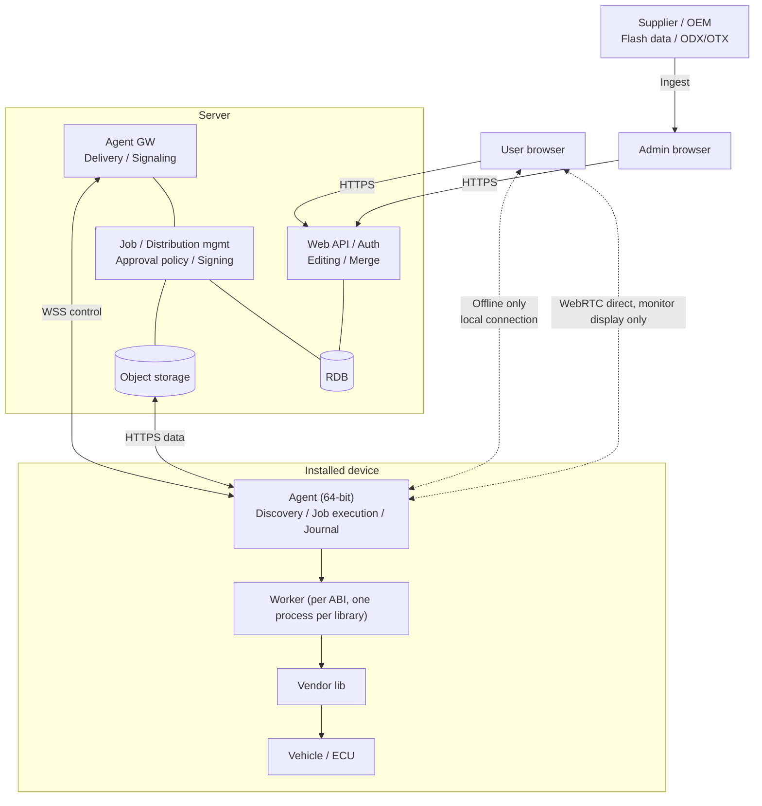
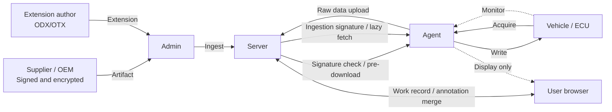
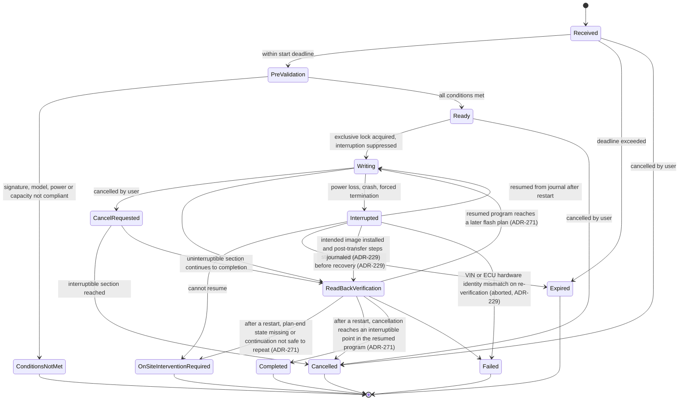
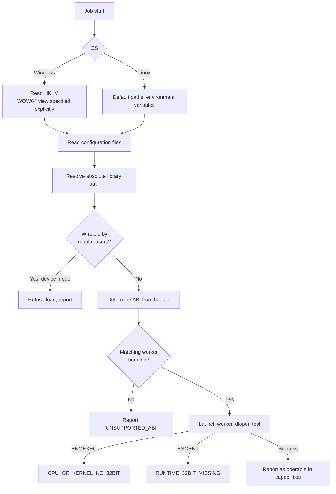
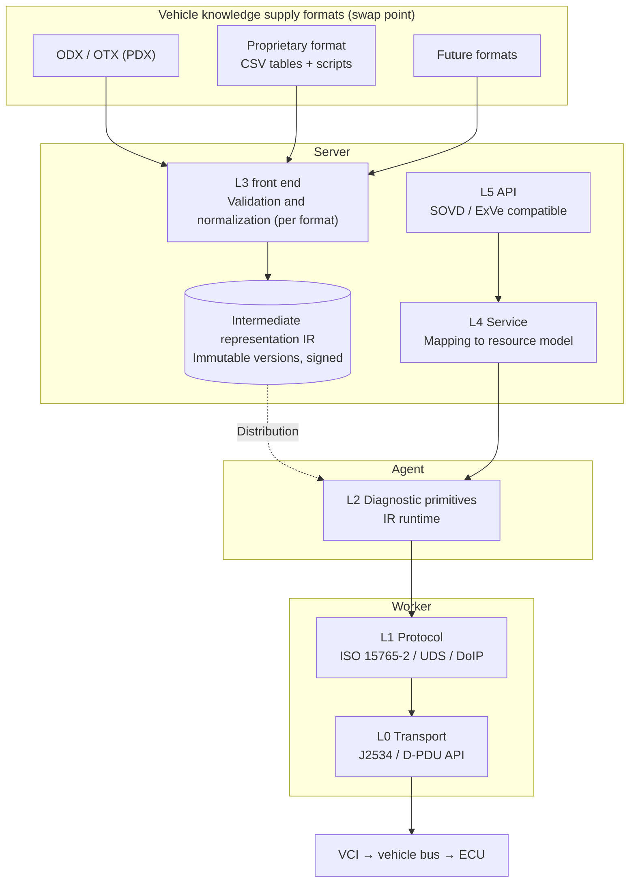
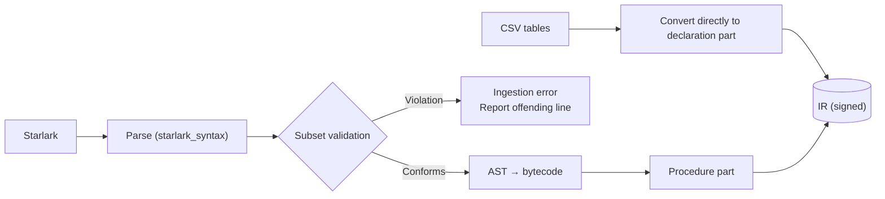

# Nekoguruma: Automotive Diagnostic Software Architecture Design Notes

Created: 2026-09-15 / Status: Under review (proposed architecture)

Project name: **Nekoguruma** (猫車, Japanese for "wheelbarrow"; literally "cat cart"). Short name: **NGR**, for *Networked Gateway for Remote diagnostics*. The full lowercase name `nekoguruma` is used for file system paths and configuration directories; `ngr` is used for the command name.

---

## 1. Background and Requirements

Diagnostic software for vehicles. It connects to a VCI through vendor-supplied shared libraries (J2534 PassThru / ISO 22900 D-PDU API) to read diagnostic data from the vehicle and write to ECUs (reprogramming and configuration values). The UI is delivered as a web app.

### Terminology

| Term | Definition |
|---|---|
| VCI | Vehicle communication interface hardware. The unit of exclusive locking and of vendor libraries |
| Vehicle | The target, identified by VIN. The unit of exclusive locking |
| ECU | The target of writes and diagnostics. The unit of variant identification |
| Agent | A resident process on the device that executes jobs |
| Worker | A separate process that loads a vendor library (one per ABI) |

"Device" is not used in this document in its generic hardware sense, being ambiguous; it always means the installed terminal (proper names such as the RFC 8628 Device Authorization Flow excepted).

D-PDU API and J2534 terms used by the worker crates are defined in `glossary.md`.

### Functional Requirements

| # | Requirement |
|---|---|
| R1 | Access VCIs and vehicles through each vendor's shared library |
| R2 | Obtain library locations from a configuration file. On Windows, obtain the configuration file location from the registry (HKLM) |
| R3 | Installation is acceptable on devices that read and write |
| R4 | Editing and redisplaying acquired data must be possible in an ordinary browser without installation |
| R5 | Take every possible measure to prevent unintended interruption during writes |
| R6 | For responsiveness, save locally first and synchronize with the server in the background |
| R7 | Acquired data may be edited concurrently by multiple users |
| R8 | Management is per user. Shared OS accounts are also permitted |
| R9 | Remote operation and operation of unattended devices are possible use cases |
| R10 | Real-time monitoring targets update intervals as fast as 10 ms |
| R11 | Also provide a configuration that runs entirely within localhost, for testing and personal use |
| R12 | Diagnostic sequences are implemented in-house. Layers are separated so they can be replaced |
| R13 | External interfaces are SOVD / ExVe compatible |
| R14 | Support ODX / OTX. The supply format must be replaceable, and proprietary formats (CSV tables + scripts, etc.) must also be supported. D-Server (MCD-3D) is out of scope |
| R15 | Implement as a framework. VCI-specific items and target vehicle/ECU definitions can be added freely without redistributing the core |
| R16 | Pre-fetched jobs can be started offline. However, operations requiring seed/key need to be online |
| R17 | The UI is usable offline (PWA caching, plus a local connection allowed only when offline) |
| R18 | Any interval during monitoring can be committed as acquired data by an after-the-fact operation |
| R19 | A single monitoring session can be subscribed to from multiple browsers |
| R20 | The UI provides a framework part and a reference implementation; business-specific screens and supported screen sizes are defined by the user |
| R21 | Work record fields can be extended as record templates and referenced from both procedures and screens |

### Assumptions

- Target OS: Windows / Linux. Linux hosts are x86_64 and aarch64 (with i686 and armhf workers for 32-bit vendor libraries, 7.3), on glibc-based distributions with glibc 2.17 or later and kernel 3.2 or later (ADR-232). On Linux, J2534 reuses the Windows API definitions as-is; only registration information such as library locations uses a definition specific to this software (7.1.1)
- Vendor library standards: J2534 (PassThru) and ISO 22900 (D-PDU API). Adapters are structured as two kinds, one per standard, plus absorption of vendor-specific quirks
- Vendor libraries may be a mix of 32-bit and 64-bit (J2534 DLLs are mostly 32-bit, so an x86 worker is required). ARM may also be included
- Whether and how vendor libraries communicate over the network is not our concern (outside the system's guarantees)
- No assumption is made about how vendor libraries pass data (callback / polling / blocking read)
- Data written to ECUs (firmware, configuration values) is ingested exactly as signed and encrypted by the supplier (OEM)
- The target is a three-level hierarchy: VCI -> vehicle bus -> ECU. Vehicle access may require OEM online authentication (security gateway)
- Vehicle knowledge primarily targets ODX / OTX, but the supply format is abstracted by an intermediate representation and is replaceable. D-Server (ISO 22900-3 / MCD-3D) is out of scope
- Devices are not necessarily under organizational management
- Always-online is the baseline, but disconnection during processing and slow environments must be handled. Offline start is allowed only for pre-fetched jobs; operations requiring seed/key and vehicles requiring OEM authentication must be online (5.7)

---

## 2. Overall Architecture

A **server-relay architecture** is adopted. Operations are performed in a web app (PWA) in an ordinary browser, and a resident agent with almost no UI is deployed on the device to which the VCI is connected. The agent maintains a persistent outbound connection to the server, and receives and executes jobs. Only when offline does the browser connect locally to the agent from cached screens (5.7.1).



### Design Principles

1. **Minimize the responsibilities of the dedicated application.** Leave in the agent only what can run only locally, and what cannot survive interruption unless it is local.
2. **Direct browser-agent interfaces are exceptions.** To avoid the attack surface of listening on localhost and the browser's local network access permission prompt, the server path is the default. There are two exceptions: WebRTC direct connection for monitoring (read-only, Chapter 10) and local connection when offline (5.7). Each requires that "the server path cannot substitute for it," and the accepted operations are restricted.
3. **Layer trust by what is signed (11.1).** ECU flash data is protected by the supplier signature verified by the ECU, extension packages by the operator's distribution key, and job instructions by the server's instruction key. The server is treated as "a path that only carries, and is not trusted."
4. **Confine scale- and environment-dependent decisions to replaceable points.**
5. **The core holds only standards and interruption countermeasures; individual facts are moved out as extensions.** Extensions are expressed as data, and code-based extensions are limited to the server side (Chapter 9).

---

## 3. Division of Responsibilities

### 3.1 Web App (Ordinary Browser)

This framework provides a UI framework and a reference implementation; business-specific screens are defined by the user (9.6). The following are the functions handled by the UI layer.

- Instructing acquisition, writing, monitoring, and procedure execution
- Redisplaying acquired data, and editing work records (judgments, manually entered values, findings)
- Saving edits to IndexedDB first, per operator, and synchronizing to the server via an Outbox
- Storing received monitoring data in a ring buffer and drawing it to Canvas / WebGL with `requestAnimationFrame`. A capture operation turns any interval into acquired data (4.6)
- Responding to HMI requests (confirmation, value input)
- Caching app assets and job packages as a PWA, and connecting locally to the agent when offline (5.7.1)
- Admin functions: ingesting and publishing artifacts and extension packages, policies, and managing who may use each agent

### 3.2 Server

- Authentication and authorization (6.8), job issuance (confirmation level, two-person approval, execution time window, start deadline)
- Artifact management: immutable versions, supplier signature verification, compatibility checks, staged rollout
- Ingesting extension packages and applying the ingestion signature (11.1), normalizing to IR via supply-format frontends (8.2)
- Acquired data: immutable chunk storage of raw data, merging annotations and work records, change-feed delivery, downsampling and derived-data computation
- Seed/key computation (keys are not placed on devices. 8.10)
- Issuing monitoring sessions and brokering WebRTC signaling
- Relaying HMI requests
- Audit logs (operator, agent, approval records)

### 3.3 Agent

- Discovery (re-run for each job, including ACL verification)
- Launching workers according to ABI
- IR runtime (executing procedures, verifying preconditions, issuing HMI requests)
- Resumable upload of acquired data
- Write jobs: signature verification -> pre-check -> write -> read-back verification -> resume via journal
- Monitoring: negotiating update intervals based on measurements and delivering frames, holding the ring buffer and capture (4.6)
- Holding offline job packages, and listening locally when offline (5.7.1)
- Reporting status and `capabilities`, approvals and notifications in the system tray, self-update (on hold while a job is running)

Each device's operating mode is fixed to exactly one of "user mode" or "device mode."

### 3.4 Worker

- One process per library, a dedicated thread per VCI
- Absorbs differences in libraries' data-passing methods and always outputs externally as a "timestamped sample sequence"
- Splits a single data source into a recording path that tolerates no loss and a monitoring path that drops old data when delayed
- Implemented in coarse-grained operation units (acquire / write / read-back verification)
- Many J2534 DLLs are not thread-safe, which matches the per-VCI thread design. L0 / L1 (transport and protocol) also reside in the worker
- Implementation: the worker binaries are the gRPC services `j2534-0404-service` (J2534 v04.04 libraries) and `iso22900-service` (D-PDU API libraries); their crates are described in `worker-crates.md`. Both expose the D-PDU API, so the agent drives either kind of library through one interface. One build per ABI (7.3)

---

## 4. Data Flows (4 Streams)

| Stream | Flow | Characteristics |
|---|---|---|
| ECU artifacts | Supplier -> Admin -> Server -> Agent -> ECU | One-way, not re-signed |
| Extension packages | Author -> Server (ingestion signature) -> Agent | One-way, lazy fetch |
| Acquired data | Vehicle (ECU) -> Agent -> Server (raw data) -> Browser | Bidirectional, concurrent editing |
| Monitoring | Vehicle (ECU) -> Agent -> Browser | Display only. Can become acquired data via a capture operation (4.5) |



### 4.1 ECU Artifacts (Firmware, Configuration Values)

- Versions are immutable. Updates are always published as a new version
- Packages signed and encrypted by the supplier are stored without changing a byte and identified by hash
- The system does not re-sign, repackage, or decrypt (11.1)
- Provide staged rollout and rollback to the previous version

**Scope of pre-download**: Not every device holds every version (that would be huge across vehicle models). Fetching is triggered in the following three cases.

| Trigger | Scope fetched |
|---|---|
| Job issuance | Versions used by that job (completed before writing starts) |
| Advance designation | Versions for vehicle models/ECUs designated by an admin or user (preparation for offline work. 5.7) |
| Standing designation | Only when "versions to always keep" are designated per device |

All are cached in an area that cannot be modified with user privileges. Deletion criteria are as follows.

- Versions under standing designation are not deleted
- Others are deleted by days since last use and a cache size limit (oldest first)
- Previous versions designated as rollback targets are excluded from deletion

### 4.2 Extension Packages

- IR, screen and report definitions, message text, unit systems (9.2)
- VCI profiles are not extension packages: they are installed on the device outside this software (9.3)
- The server verifies them on ingestion and signs them with the operator's distribution key (ingestion signature. 11.1)
- The agent lazily fetches only what it needs. The initial sync scope follows 9.4
- The delivery path is shared with ECU artifacts (HTTPS data channel), but re-signing and fetch scope differ

### 4.3 Acquired Data

Covers time-series data, snapshots, and self-diagnostic data.

**All values acquired from the vehicle are non-editable.** Diagnostic data is evidence of vehicle state, and a design that allows values to be rewritten afterward undermines its value as a record (also avoided from the standpoint of UNECE R156 record retention). Editing is limited to information entered by the operator.

| Data | Value correction | Annotation / judgment |
|---|---|---|
| DTC, self-test results | No | Yes |
| Freeze frame, ECU identification | No | Yes |
| Data stream (PID) | No | Yes |
| Work record (judgment, manually entered measurements, findings, attachments) | Yes | Yes |

- Raw data is immutable; annotations and work records are overlaid as separate layers
- Work record corrections are recorded as operations of `{target, base value, new value, reason, editor}`
- Annotations are independent records; additions never conflict with each other
- Only work records need three-way merge, so concurrent-edit conflicts are substantially reduced
- Time series are stored as the responses received from the vehicle (records: response bytes, monotonic timestamp, source), chunked by time; signals are decoded from them with the decode plans of the IR that produced the recording (8.2.2), and display data is downsampled by min/max from the decoded signals (ADR-236)
- Scale for the initial implementation: fastest period 10 ms per request, up to 64 KiB/s of response bytes per monitoring session or acquisition job, and up to 1 hour of time series per acquisition job (ADR-236)

**Retention period**: Determined from both business needs (the statutory retention period for maintenance records) and the personal-data nature of VINs. Statutory periods differ by jurisdiction, so the retention period is an operator setting per tenant and record kind, with no jurisdiction-specific defaults (ADR-237). For deletion requests, job execution records (audit logs) must be retained even if raw data is deleted, so a mechanism is provided to redact only the VIN-containing parts.

#### 4.3.1 Record Templates

Work record field definitions are embedded in neither IR nor screen definitions, and are held as **an independent extension point (record templates)**. This is because there are records tied to procedures (operation checks after reprogramming, measurements during routine execution) and records not tied to them (exterior inspection at intake, customer complaints, overall findings).

- **Structure**: A list of fields (identifier, label, type, unit, required flag, options, judgment criteria)
- **Types**: Limited to number, choice, boolean, text, attachment
- **Judgment criteria**: Hold upper/lower limits and pass/fail conditions, used for input validation and automatic judgment
- **Scope**: Both generic templates independent of vehicle model and vehicle-model-specific templates are allowed
- **Reference from IR**: Procedures have an instruction "request input of a record template" (treated as a kind of HMI request. 8.6)
- **Reference from screen definitions**: The same template can also be used for records without a procedure
- **Storage format**: Stored as template ID, field ID, value, and edit history

**Auto-fill from acquired values**: Values from acquired data may be filled into record fields automatically. Auto-filled values are **non-editable because they come from the vehicle**, and values the operator re-measures by hand are **recorded as a separate field**. Both are kept, and which one came from the vehicle is clear.

### 4.4 Synchronization

- The server is the source of truth; local storage is treated as "cache + outgoing queue"
- Outbox pattern. IDs are client-generated (UUIDv7), with idempotency keys attached
- Three-way merge using per-field versions. Applies only to work records and annotations (values acquired from the vehicle are non-editable. 4.3). The user resolves only on conflict
- `navigator.storage.persist()`, a single sync-owner tab via Web Locks, and a leave warning when unsynced

### 4.5 Acquisition Metadata

VCI model and serial, VIN, ECU address, part number and software version, the version of configuration values at acquisition time, versions of the vendor library, IR and agent, and the vehicle clock and PC clock and their offset.

The classification of acquired data corresponds to diagnostic data: time series are data streams (PID), snapshots are freeze frames and ECU identification, and self-diagnostic data are DTCs and self-test results. Making DTCs non-editable with annotations only fits their nature as diagnostic records.

### 4.6 Monitoring Capture

Monitoring is display-only, but to meet the need to "keep the waveform from the moment the symptom appeared," a **function to commit any interval as acquired data** is provided.

- **Extraction from ring buffer**: The agent holds the received records (4.3) during monitoring in a ring buffer for a fixed duration. When the user performs a capture operation, the interval going back from that moment is extracted as acquired data (the trigger can be applied after the fact)
- **Retention time**: The default retention time is determined from the VCI profile's minimum update period and the amount of memory, up to 10 minutes (ADR-236). Excess is discarded oldest first
- **Treated the same as acquired data**: The captured interval is immutable as raw data and uploaded via the same path as ordinary acquired data. Not editable; annotations only (4.3)
- **Metadata**: Records the capture operation time, the extracted interval, the path (WebRTC direct / via server), and the measured update interval. Because frames may be dropped on the display-only path, whether samples are missing is also recorded
- **Automatic capture**: A procedure definition (IR) can instruct capture when a condition is met (e.g., a threshold is exceeded)

Monitoring frames before capture are not treated as records and are not synchronized. This distinction is shown explicitly on screen.

---

## 5. Communication and Interruption Handling

### 5.1 Job Types

| Job | Required role | Default confirmation level | Offline start | Re-execution |
|---|---|---|---|---|
| Acquisition | Operator | Notification only | Yes | Safe |
| Monitoring session | Operator | Notification only | Yes | Safe |
| Capture of a monitoring interval | Operator | Notification only | Yes | Safe |
| Procedure execution (inspection, routines) | Operator | With grace period | Yes (to the extent preconditions are met) | Depends on procedure attributes |
| Configuration value write | Operator | With grace period | Conditionally (5.7) | Use caution |
| ECU reprogramming | Reprogrammer | On-site approval | Conditionally (not when seed-key / OEM authentication is required; 5.7) | Decide after checking state |

Section 6.3 is authoritative for confirmation level definitions and defaults; this table is a per-job-type summary for reference. Remote execution requires both the Remote Operator role and remote permission on the agent side (6.8). ECU reprogramming on unattended devices additionally requires two-person approval.

### 5.2 Communication Channels

| Purpose | Channel | Notes |
|---|---|---|
| Control | WSS (outbound, 443) | Commands and events only |
| Data | HTTPS | Resumable chunked transfer |
| Monitoring | WebRTC DataChannel | No ordering guarantee, no retransmission. Second and later subscriptions go through the server (10.4) |
| Offline operation | Loopback (HTTP / WebSocket) | Listens only while disconnected. Limited to starting pre-fetched jobs and retrieving progress (5.7.1) |

Channels are separated so that bulk transfers do not clog the control channel. Fallbacks such as long polling are provided for proxy environments.

### 5.3 Handling Disconnections

- Commands are idempotent. The agent ACKs receipt, records the job ID and the ownership generation (ADR-229) in the journal, and ignores duplicates: a command whose job ID it has recorded under the same or a later generation; recovery state is likewise journaled per job ID and generation, so a device that gets a job back recovers from the handover's checkpoint summary, not from its older journal
- Jobs have a start deadline; expired commands are not executed but reported
- Events are delivered reliably via a sequence-numbered Outbox; the server deduplicates by "agent ID + sequence number"
- On reconnection, the state of incomplete jobs is reconciled (not everything is resent; see 15.1 for scale-specific handling). Reconnection uses exponential backoff + jitter
- A disconnection is not treated as a job failure. The server never automatically reissues write jobs

### 5.4 Handling Low-Bandwidth Environments

- Events are split into "must-deliver" (completion, failure) and "may be thinned" (progress)
- Artifacts are fully fetched by the time the job is issued, so that line speed does not affect the start of writing (4.1)
- Upload bandwidth limiting. Timeouts are judged by "no progress for a set period", not total time
- Metadata and self-diagnostic data are sent first; time-series chunks are sent afterward

### 5.5 Device-Side Safeguards

- Windows: `SetThreadExecutionState`, `ShutdownBlockReasonCreate` (`PRESHUTDOWN` for services)
- Linux: logind inhibitor locks, `loginctl enable-linger`
- Exclusive locks on the VCI and vehicle (8.8)
- Preparation of all data before writing, journaling of each step, read-back verification. The journal is an append-only log per job and ownership generation, each record synced before the commit returns (ADR-244). It has one writer: whoever opens it for writing holds an exclusive OS lock on a sidecar file, which the OS releases if the process dies, so a second run of the same job cannot write it at the same time (ADR-255)

**Journal protection**: The journal and local cache contain VINs and diagnostic results. They are encrypted with a key protected by the OS credential store and bound to the device when a TPM is available. Once job completion and sync completion are confirmed, the body is deleted, leaving only the job ID and a result summary. If revocation of the agent key is detected, the local cache and journal are erased.

### 5.6 Write Job State Transitions



Procedure execution jobs additionally have an **awaiting HMI response** state. S3 keep-alive continues while waiting, and the wait is maintained during a disconnection. If the HMI timeout is reached, execution proceeds to an interruptible point and then stops (8.10.1). Unmet preconditions (8.9) end the job as ConditionsNotMet at the pre-validation stage.

After a restart, ReadBackVerification is the state check's match itself (the intended software version, and the interrupted pass's post-transfer steps journaled complete); the agent then resumes the program from the VM state journaled at the plan's end, provided every diagnostic primitive outside the program's flash plans is safe to repeat and outside any recovery-required section, and so is every step of the plan beginning at this plan's end up to its erase or its recovery-required point, which the continuation may run before that plan's first record, except that for a plan that allows a restart only a step unsafe to repeat counts, as in its replay (otherwise on-site intervention), and the job ends in Completed or Failed as the rest of the program decides, through Writing again if it reaches a later flash plan (ADR-271).

Cancellation by the user does not take effect immediately. In an uninterruptible section (8.10.1), the cancel request is held, and the job transitions to Cancelled once it reaches an interruptible point. For every terminal state, the result is finalized only by the agent's report. The server never treats a disconnection as a failure or automatically reissues a write job.

### 5.7 Starting Work Offline

Sites can have poor reception: workshop basements, inside metal structures, roadsides in suburban areas, and so on. Always-on connectivity is the baseline, but **offline start is permitted only for pre-fetched jobs**.

| Job type | Offline start | Conditions |
|---|---|---|
| Acquisition | Yes | Offline job package fetched in advance |
| Write (no seed-key) | Yes | Same as above, except vehicles requiring OEM authentication |
| Write (seed-key required) | **No** | The seed changes on every connection and cannot be precomputed, so online is mandatory |
| Operations on vehicles requiring OEM authentication | No | Gateway authentication requires an online connection |

**Offline job package**: While online, the signed job instruction, artifacts and IR are fetched together. The validity period is kept short; expired packages are not executed but reported (same mechanism as the start deadline in 5.3).

**Handling results**: Results of offline execution are kept in the journal and synced via the Outbox once connectivity is restored.

The web UI shows in advance whether the target vehicle and operation can be started offline, and if not, the reason (seed-key required, OEM authentication required).

#### 5.7.1 UI Path While Offline

Because the UI is a web app served by the server, the screen itself cannot be opened offline. The screen is made available through **PWA conversion (caching via Service Worker)**, and **only while offline does the browser connect locally to the agent**.

- **Service Worker cache contents**: app assets, fetched job packages, IR, vehicle and ECU definitions
- **Listener control**: The agent listens on loopback only while its connection to the server is down. When the connection is restored, it stops listening and returns to the normal server-mediated path
- **Restricted operations**: Only starting pre-fetched jobs and retrieving progress. Creating new jobs, changing settings and adding extensions are not accepted
- **Authentication**: An offline token is fetched together with the job package while online. Its validity period is kept short
- **Origin handling**: The PWA runs on the server's origin, so requests to `127.0.0.1` are cross-origin. The agent configures CORS and limits allowed origins to the PWA's serving origin. Connections from an HTTPS page to `http://127.0.0.1` are not mixed content, because loopback is treated as a secure context
- **Security**: Origin validation, Host header validation and CSRF protection are applied, and Origin is not used for authorization decisions (the cautions for local deployment in 13.3 apply as-is)
- **Permission prompt**: Granting permission once for the PWA's origin is sufficient. This is covered as part of the installation instructions
- **Result sync**: Execution results remain in the agent's journal and are synced via the Outbox once connectivity is restored. The browser is responsible only for display

**Rationale for this exception**: The purpose of design principle 2 is to avoid the attack surface of a localhost listener and the permission prompt, and while offline there is no server-mediated alternative. The risk is contained by restricting accepted operations and limiting listening to disconnected periods only.

If the decision is made to drop offline work from the requirements, this exception becomes unnecessary and is replaced operationally by providing mobile connectivity on site.

---

## 6. Identity and Authorization

### 6.1 Separation of Identities

| | Agent | Operator |
|---|---|---|
| Identified entity | Device x OS user (or device) | Person |
| Authentication | Agent key | Web login |
| Permissions | Receiving and reporting jobs only | All operation permissions |

The agent key proves only that "this is this execution environment on this device". Only operators logged in on the web can issue jobs, and jobs are authorized by the "operator x agent" combination. While offline, the only thing possible is starting jobs already issued while online; no new jobs can be issued (5.7). Even when OS accounts are shared, individuals can be identified from server-side logs.

### 6.2 Operating Modes

| | User mode | Device mode |
|---|---|---|
| Startup | At login or explicit start | At OS startup (service) |
| Registration unit | Device x OS user | Device |
| Keys and journal | User area | Device area |
| Execution account | Logged-in user | Dedicated low-privilege account |

Unattended devices use device mode. Each device is fixed to one mode, eliminating contention for the same VCI at configuration time.

**Expected use cases for unattended devices**: permanently installed devices on inspection lines, test benches, setups that stay connected to a vehicle for long-duration measurements, and so on. Used when remote operation is needed even with no user logged in. Typical workshop work devices are expected to use user mode.

### 6.3 Approval Levels

| Job | Default confirmation level |
|---|---|
| Acquisition | Notification only |
| Configuration value write | Auto-start with grace period |
| FW write | On-site approval |
| FW write to an unattended device | Two-person approval + execution time window |

Policies are set per "job type x agent" and cannot be looser than the organization defaults. Remote operation requires both the operator's remote operation role and remote permission on the agent side.

### 6.4 Credentials

- Registration via one-time code or device authorization flow (RFC 8628)
- The key pair is stored in the OS credential store (Windows: DPAPI, Linux: libsecret). A TPM is used where possible
- On shared accounts, the browser's edit cache is separated per operator ID, with automatic logout on inactivity and re-authentication before writes

### 6.5 Startup Method

The startup method is decided at installation per device type and, like the operating mode, is fixed per device.

| Device type | Mode | Startup |
|---|---|---|
| Personal / general use | User mode | Explicit start |
| Shared work device | User mode | Auto-start |
| Unattended device | Device mode | Auto-start (service) |

The reason for explicit start on general-use devices is that it directly addresses concerns about always-on connections, and "being running" serves as effective consent to remote operation. The following are provided as support.

- Launch from the web UI via a custom URL scheme (`nekoguruma://`)
- Continuous display of online status in the web UI (operation buttons disabled while offline)
- Jobs can be issued while offline and are executed at startup (stale instructions are not executed thanks to the start deadline)
- Attempts to exit during job execution are refused after confirmation

### 6.6 Connection Restriction Presets

On general-use devices, operations from anyone other than the device's user are blocked by default. Settings are presented as presets, and relaxing them requires action on that device (changing settings from the tray). They cannot be relaxed from the web UI alone.

| Preset | Contents |
|---|---|
| Personal only (default for general-use devices) | Owner only, remote denied, on-site approval required |
| Owner + remote | Owner only, remote allowed, writes require on-site approval |
| Shared | Managed by the allowed-user list |

Restrictions are layered, separating those that depend on the server from those the agent enforces on its own.

| Layer | Decided by | If the server is compromised |
|---|---|---|
| Limiting the allowed-user list to the owner | Server | Can be bypassed |
| Disabling remote permission | Agent | Effective |
| Requiring on-site approval | Agent | Effective |
| Explicit start | User | Effective |
| Operator ID matching | Agent | Effective |

**Operator ID matching**: The agent compares the operator ID in the job instruction against the owner's ID recorded at registration and rejects on mismatch. Even if the allowed-user list is rewritten, the guarantee that only the registered owner's instructions are executed is enforced entirely locally.

These protect against connections from other operators; anyone who can log in to the same device is out of scope. That falls under OS login management and disk encryption.

### 6.7 Installation and Initial Registration

The installer decides and configures the following. They are fixed per device; changing them requires reinstallation or re-registration.

| Item | Decided by | Timing |
|---|---|---|
| Operating mode (user / device) | Administrator or installer | At installation |
| Startup method (explicit / auto) | Same as above | At installation |
| Deployment profile (standard / local) | Same as above | At installation |
| Server URL and distribution key root | Bundled with installer | At installation |
| Per-device settings (drivers, udev rules, shared lock area, auto-start) | Run with administrator privileges | At installation |
| Per-user registration (key pair generation, agent registration) | The user (administrator in device mode) | At first startup |
| Connection restriction preset (6.6) | Default is "Personal only" | At registration |

On organization-managed devices, these can be distributed as a configuration file.

### 6.8 Unified Permission Model

Permissions consist of three axes, **evaluated in the order role -> agent acceptance settings -> confirmation requirements**. Any layer can deny on its own; none can relax.

**Axis 1: Operator role (decided by the server)**

| Role | Permissions |
|---|---|
| Viewer | View acquired data |
| Operator | Acquisition, configuration value writes, editing work records |
| Reprogrammer | ECU firmware writes |
| Remote Operator | Execution while not on site |
| Approver | Approving side of two-person approval |
| Administrator | Publishing artifacts, policy settings, agent registration |

Roles are granted per organization and can be scoped by vehicle model or OEM (e.g. Reprogrammer for a specific OEM).

**Axis 2: Agent-side acceptance settings (decided by the agent)**

Allowed-user list, remote permission, operator ID matching, connection restriction preset (6.6). This layer remains effective even if the server is compromised.

**Axis 3: Per-job confirmation requirements (decided by both)**

Confirmation level (6.3) and two-person approval. The server decides the requirements, and the agent determines whether on-site approval has been given.

---

## 7. Local Resource Access

### 7.1 Discovery

| Standard / OS | Chain |
|---|---|
| J2534 / Windows | Per-VCI key under `HKLM\SOFTWARE\PassThruSupport.04.04` -> `FunctionLibrary` (absolute path of the DLL). `Name` / `Vendor` are used for display |
| J2534 / Linux | Registration definition specific to this software (7.1.1) -> `FunctionLibrary` (absolute path of the .so) |
| ISO 22900 (D-PDU API) | Registry value `Root File` under `HKLM\SOFTWARE\D-PDU API` (Windows) / path fixed at build time, `/etc/pdu_api_root.xml` by default (Linux) -> root description file (XML) -> the `MVCI_PDU_API` entry whose `SHORT_NAME` matches -> `LIBRARY_FILE` (`file:` URI, absolute local path of the API library). The entry's module and cable description files (MDF, CDF) are referenced alongside and verified under 7.2, not followed to find the library |

- Specify the registry view explicitly with `KEY_WOW64_32KEY` / `KEY_WOW64_64KEY`
- Expand environment variables in `REG_EXPAND_SZ` according to the registry view's bitness
- Also follow and verify the chain of paths referenced by configuration files
- Redo discovery at every job start; no change-monitoring mechanism is kept
- A registration definition indicates where the library is. How that VCI is handled (capabilities, quirks, ABI overrides, COMPARAM mapping) is declared in the VCI profile (9.3)

#### 7.1.1 J2534 Registration Definition on Linux (Proprietary Specification)

J2534 on Linux **reuses the Windows API definitions as-is**. Function signatures and structures are common as per the standard; OS differences appear only in the discovery path. Since Linux has no common registration store equivalent to the registry, registration information is defined in a format specific to this software.

**Search path**: `/etc/nekoguruma/j2534/` only, written by the administrator, in both operating modes. Per-user locations (such as `$XDG_CONFIG_HOME`) are not supported. The directory is fixed at build time; a runtime override exists only in debug builds, for tests (ADR-228).

**Format**: One TOML file per VCI, with keys named as the Windows registry values (ADR-266). A single large file would have installers from multiple vendors editing the same file and conflicting, so the granularity matches the registry's one key per VCI.

**Fields**: Mapped to the Windows registry values, with field names matching the value names, so that discovery results map onto the same structure.

| Field | Content |
|---|---|
| `Name` | The VCI name a caller resolves; it stands for the Windows device's registry key name, which identifies the device there (the Windows `Name` value is for display) |
| `Vendor` | For display |
| `FunctionLibrary` | Absolute path of the .so |
| Supported protocols and capability flags | Correspond to the respective Windows values |
| `LongSize` | Width of `unsigned long` in the vendor implementation (see below) |
| `SearchPaths` | Additional search paths for resolving dependent libraries (optional) |

**Creating definition files**: There is no guarantee that vendor installers will write definitions specific to this software, so operation takes one of the following forms.

1. An administrator creates them manually
2. This software ships templates for known vendors
3. Vendors are asked to register in this format

The agent provides a generation helper, run with administrator rights. It actually `dlopen`s the specified .so, checks for the presence of J2534 symbols (`PassThruOpen` etc.), and then writes out the definition file.

**OS differences absorbed on the worker side**

- **Calling convention**: Windows uses `WINAPI` (`stdcall` on x86), Linux uses the standard C convention. They are identical on x86_64 but differ on x86 workers
- **Width of `unsigned long`**: The J2534 API uses `unsigned long` extensively. On Windows it is 32bit even on 64bit; on Linux x86_64 it is 64bit. Since vendor implementations interpret this differently, a definition file can state it with the optional `LongSize`; without it the ABI default of 7.1.2 applies
- **Structure alignment**: The packing of `PASSTHRU_MSG` etc. is specified explicitly on the worker side
- **Dependency resolution**: A .so depends on rpath / `LD_LIBRARY_PATH`. Handled via the additional search paths in the definition file

#### 7.1.2 ABI Interpretation Rules

J2534 (SAE J2534-1/-2) is a specification that assumes DLLs on Windows; the standard specifies none of Linux, 64bit, or ARM. ISO 22900-2 is an OS-neutral C API definition but does not specify an ARM-specific ABI. **Implementations on ARM are treated as inference without backing from the standard.**

Basis for the inference: AArch64's AAPCS64 matches x86_64's System V ABI in that `unsigned long` is 64bit (LP64), there is a single calling convention, and it is little-endian. Therefore AArch64 applies the x86_64 interpretation as-is, and armhf applies the x86 interpretation as-is.

| Architecture | `unsigned long` | Calling convention | Status |
|---|---|---|---|
| Windows x86 | 32bit | `stdcall` (`WINAPI`) | Standard-compliant |
| Windows x64 | 32bit | Single | Standard-compliant |
| Linux x86 | 32bit | Standard C (cdecl) | Proprietary definition |
| Linux x86_64 | 64bit | Single | Proprietary definition |
| Linux aarch64 | 64bit | Single | **Inferred** (treated as identical to x86_64) |
| Linux armhf | 32bit | Single | **Inferred** (treated as identical to x86) |

- The ABI interpretation is held as data, as a mapping table "architecture x bitness -> `long` width, calling convention, alignment", rather than scattering conditional branches through the code. This keeps the fix confined to one place if an inference turns out wrong. The table lives in `worker-host` (`Abi`: name, default `long_size`, interpretation source); the calling convention and packing are applied by each worker service's sys layer for the target it is built for
- If `LongSize` is not specified in the registration definition, the inferred value from this table is the default. ARM gets no special treatment; the same rule applies
- Structure layouts consist of `unsigned long`, pointers and fixed-length arrays, so they match if the widths are the same. However, armhf aligns 64bit integers to 8 bytes (i686 uses 4 bytes), so explicit packing specification is retained
- `long_size` can be overridden in the registration definition (`LongSize`), and `long_size`, calling convention and alignment in the VCI profile (9.3), so that vendors for which the inference is wrong can be supported by adding an extension alone, without modifying the core

### 7.2 Pre-load Verification

- Verify that configuration files, libraries and their folders are not writable by regular users (blocking privilege-escalation paths). Only system principals may own or modify the library, its own folder and the files that named it; further ancestor folders may let regular users add entries but not replace or remove them (ADR-270)
- In device mode, refuse to load if writable, and report the reason
- If an Authenticode signature is present, also verify the signer
- Load by absolute path (`LoadLibraryEx` / `dlopen`)

**Trusted locations**

On Windows, the basis for trust is that HKLM can be modified only by administrators. Linux gets the same premise by reading registration definitions only from `/etc/nekoguruma/j2534/` (7.1.1), in both modes. The locations of every file that decides which library is loaded (registration definitions, the D-PDU API root description file on Linux, the worker service's configuration file) are fixed at build time. They are not taken from environment variables or command-line arguments, so another process cannot redirect a worker to a different file; a runtime override is compiled into debug builds only, for tests (ADR-228).

**One resolver, checked where the library is loaded**

Resolving a VCI name to a library path, and the checks above, live in one shared crate used by both the agent and the worker services. The agent uses it for discovery and to report loadability in `capabilities` (9.5); the worker service resolves the name it was started with through the same code and runs the checks itself immediately before loading, so the file that is checked is the file that is loaded. The crate holds one module per standard and J2534 version (J2534 v04.04; ISO 22900-2 D-PDU API, whose root and module description files are in its installation clause and Annex F: 9.7 in the 2009 edition, 8.7 in the 2022 edition), each keeping the operating-system differences of that standard's discovery chain (7.1) behind one interface; the checks are shared by the standards (ADR-266).

### 7.3 ABI Detection and Worker Selection

Determine the ABI from the library header (PE Machine / ELF `EI_CLASS`, `e_machine`, `e_flags`) and launch the corresponding worker.



| Host | Bundled workers | Requirements for the 32bit side |
|---|---|---|
| x86_64 (Win/Linux) | x64 / x86 | IA32 compatibility + i386 glibc |
| aarch64 (Linux) | arm64 / armhf | CPU AArch32 support + armhf glibc |

- Providing a 32bit runtime environment is a prerequisite on the vendor library side; the agent only detects and reports
- Discovery results carry the distinction "ABI interpretation: standard-compliant / proprietary definition / inferred", reported via `capabilities` (7.1.2). This is the starting point for investigating issues on ARM environments
- Immediately after loading, the worker calls a side-effect-free function (`PassThruReadVersion` etc.) and checks that the return value is valid. ABI interpretation errors are detected at this point, aborting before communication with the vehicle begins
- Launch-test failures are classified by the `exec` error code (`ENOEXEC`: CPU/kernel not supported, `ENOENT`: dynamic loader missing)
- Results are reported in `capabilities` with reason codes
- Emulation of a different architecture is out of scope (Linux)
- The launch test runs through the worker service itself, not through a separate probe binary: the agent launches the service for the detected ABI, connects the module and calls `GetVersion`, which the j2534-0404 service answers with `PassThruReadVersion`. The test therefore exercises the same binary, FFI layer and `long_size` that the job will use, and each ABI ships one worker binary per library kind

**Implementation** (`crates/worker-host`): the agent starts a worker service with the VCI's library name only; the service resolves the path itself (7.2). To choose the build, the agent resolves the name the way each build would (its `config.toml` architecture key and registry view, with both views read explicitly on 64-bit Windows) and takes the first build whose library header matches its own ABI (`agent::launch`, used by `ngr-agent run`). `abi::detect_file` reads the header and returns the ABI name of the 7.1.2 table. Worker binaries are installed as `<workers>/<ABI name>/<service binary>`, and `WorkerLayout::find` reports a missing build as `UNSUPPORTED_ABI`. The J2534 `long_size` (the definition file's `LongSize`, else the 7.1.2 default from `Abi::default_long_size`; `agent::launch` reads no definition file and always passes the default) is passed to the j2534-0404 service in the `NGR_J2534_LONG_SIZE` environment variable; its sys layer converts between 32-bit and 64-bit structures at the FFI boundary.

### 7.4 IPC

Serialize in a format with fixed type widths (Protocol Buffers etc.). Sending structures as-is is not possible due to size differences in pointers, `size_t`, `long` and `time_t`.

The worker services use two channels:

| Channel | Format | Use |
|---|---|---|
| stdin / stdout | JSON-RPC 2.0, one document per line | Control: `set_auth_key`, `get_status` (gRPC endpoints), `stop`. Closing stdin stops the worker |
| Loopback TCP | gRPC (Protocol Buffers) | D-PDU API calls |

The gRPC calls are described in `rpc-api-guide.md`, and the mapping of the D-PDU API onto J2534 in `j2534-0404-architecture.md`. Design decisions of the worker crates are recorded as ADRs in `adr/` (index: `adr/INDEX.md`).

The agent generates a 32-byte key per worker instance and hands it over only through stdin. The gRPC listener accepts only bearer tokens signed with that key (HMAC-SHA256), so another local process cannot drive the worker even though the port is reachable. The agent's gRPC client mints a short-lived token from the key for every call, so the key itself is never sent over the socket.

---

## 8. Diagnostic Logic Layers and Interfaces

Diagnostic sequences are implemented in-house. The layers are separated so that the supply format of vehicle knowledge can be swapped. External interfaces are SOVD / ExVe compatible.

**D-Server (ISO 22900-3 / MCD-3D) is out of scope.** ODX / OTX are supported, but are interpreted by our own runtime without depending on the MCD-3D API.

### 8.1 Layer Structure

| Layer | Role | Placement | Unit of swapping |
|---|---|---|---|
| L0 Transport | J2534 / D-PDU API | Worker | Implementation per standard |
| L1 Protocol | ISO 15765-2, UDS (ISO 14229), DoIP in future | Worker | Protocol implementation |
| L2 Diagnostic primitives | RDBID, ReadDTC, RoutineControl, security access, reprogramming procedure building blocks | Agent | Shared implementation |
| L3 Vehicle knowledge | ECU variant definitions, service definitions, conversion formulas, procedure definitions; generic OBD as a standard package (ADR-237) | Distributed as data in intermediate representation | Front end per supply format |
| L4 Service | Mapping to the SOVD resource model | Server | Mapping implementation |
| L5 API | SOVD / ExVe compatible endpoints | Server | External contract |



### 8.2 Intermediate Representation (IR) and the Swap Point

The supply format of vehicle knowledge is abstracted by an intermediate representation (IR). **The swap point is the server-side front end**; the agent executes only IR regardless of format. The agent needs neither an ODX parser nor a script engine, which keeps its responsibilities minimal.

- **Server (at ingestion)**: A per-format front end validates syntax, referential integrity and the supported subset, and normalizes to IR. The IR is signed as an immutable version and distributed via the same path as artifacts
- **Agent (at runtime)**: Reads the IR and performs request encoding / response decoding, physical value conversion, ECU variant identification, and procedure execution

| Supply format | Front end | Positioning |
|---|---|---|
| ODX / OTX (PDX) | Standard-format parser and validator | Primary target |
| Proprietary format (CSV tables + Starlark) | CSV parser + Starlark->IR transpiler (8.4) | Swap target |
| Future formats | Additional implementation | Room for extension |

Even with the proprietary format, the generated IR and the agent-side runtime are shared. It is a design invariant that format differences must not leak into L2 or below.

A PDX can reach several hundred MB for a single vehicle model. Since only IR is distributed to agents, the impact on delivery is limited, but server-side ingestion time and storage should be estimated.

#### 8.2.1 IR Structure

| Element | Contents | Required properties |
|---|---|---|
| Declaration part | ECU variants, service definitions, request / response layouts, DOPs and conversion formulas, DTCs, COMPARAMs, flash descriptions | Fast decoding, partial loading, small memory footprint |
| Procedure part | Procedure control flow, waits, branches, HMI requests, retries | State serialization, determinism, auditability |
| Package | Manifest, per-variant splitting, signature, dependencies | Content addressing, differential delivery |

#### 8.2.2 Declaration Part

**FlatBuffers is adopted.** It allows zero-copy partial loading and leaves room to write future tools in other languages. If speed is the top priority and we can commit to using only Rust, `rkyv` is also a candidate. A conversion tool that outputs the same content as JSON is provided for debugging.

- **Pre-expanded decode plans**: At ingestion, everything about an ODX layout that is known in advance is expanded into flat arrays of "bit offset, width, endianness, conversion method". Monitoring sets are always fully flat, so for 10ms-interval monitoring physical values are obtained simply by walking the array. Other requests and responses may in addition refer to nested layouts (next item), which the general decoder follows at runtime
- **Shapes known only at runtime**: Variable-length fields (length from another field, a leading length prefix, a terminator, or the rest of the message) stay in the flat array, and a field can be placed after the previous one instead of at a fixed offset. Repetitions whose count comes from the message, layouts selected by a key (DID tables, nested DIDs, multiplexers) and structures placed or sized at runtime refer to nested layouts. Monitoring sets use only the flat, fixed form (ADR-242)
- **Conversion formulas (COMPU-METHOD)**: Identical, linear and scale-linear are held as coefficients; text tables and interpolation as arrays. No general-purpose expression evaluator is needed. Only procedural conversions such as COMPUCODE are compiled into a small expression bytecode (an instruction subset of the procedure part VM)

#### 8.2.3 Procedure Part: Custom Bytecode VM (Recommended Approach)

The procedure part adopts a **custom bytecode VM**. WASM and embedded script engines are not adopted.

| | Custom bytecode VM | WASM | Embedded scripting |
|---|---|---|---|
| State serialization | Can be guaranteed by design | Difficult (entire linear memory) | Mostly impossible |
| Suspend / resume | At any instruction boundary | Limited to section boundaries | Limited to section boundaries |
| Sandbox | Instructions do not exist = structurally safe | Strong with standard features | Depends on configuration |
| Audit / reproducibility | Instruction sequence recorded as-is | Coarse granularity | Difficult |
| Implementation cost | VM + transpiler | Easy to embed | Minimal |
| External dependencies | None | Fairly large | Medium |

Reasons for adoption:

1. **Fit with suspend / resume**: The program counter, operand stack and local variables can be written to the journal in their entirety. The resume requirements in 8.2.5 demand complete restoration of execution state, which makes this the deciding factor
2. **Consistency with the security policy**: There are no file access or network instructions, so there is no room to forget to configure a sandbox (structurally consistent with "limited enumeration of instructions")
3. **Audit**: The executed instruction sequence can be recorded as-is and used for the record retention required by UNECE R156
4. **IR stability**: No need to track specification changes in an external runtime. Operation for 10+ years is assumed

Accepted drawbacks: maintaining the VM, transpiler, debugger and test infrastructure in-house; learning cost for new developers; a transpiler is needed for each new supply format.

**Room for future extension**: Leave room to call WASM only for complex processing that completes within a section. To that end, fix the L2 diagnostic primitive API as the boundary. It is not implemented at this time, however.

#### 8.2.4 Instruction Set

Approximately 50-80 instructions are expected.

| Category | Instructions |
|---|---|
| Stack operations | push / pop / dup / swap |
| Arithmetic, logic, comparison | Integer and floating-point arithmetic, bitwise operations, comparison |
| Control | Branch, conditional branch, subroutine call and return |
| Variables | Local and global read/write, array access |
| Diagnostic primitives | Service execution, DTC read, routine control, security access request, flash transfer, wait, HMI request, record template input request (4.3.1), monitoring section capture (4.6), log output |

No instructions are defined that correspond to external access (files, network, process launch, dynamic code generation).

Each instruction is atomic: it either completes or leaves the VM state unchanged, and a failed diagnostic primitive leaves the state on that primitive, so the resume origins in 8.2.5 hold at every instruction boundary. A wait for the server (seed-key, HMI including record template input) or for a `Wait` instruction's time is reported as a waiting outcome without changing the state, so the runner stays responsive. The VM holds no resume policy and writes no journal; the job runner decides whether a primitive may be repeated and journals around each step. Types are strict and integer arithmetic is checked. The full semantics are in ADR-233.

The agent runs the VM on a blocking thread per job, on a link set up before the first instruction. Its host sends the primitives that reach the ECU as calls on the worker's D-PDU API (7.4). For now these are only read-only requests, except that a debug build may send any request, run routines and transfer data on the simulated VCI (ADR-247, ADR-250; the host derives the TransferData block counter from its own count of confirmed blocks); security access, HMI requests, record input and monitor capture are not supported yet, and `Wait` is timed by the agent itself. `ServiceRequest` names the UDS service identifier and returns the whole final response; a negative response is a result for the procedure, and a response pending (0x78) is absorbed by the worker. That contract is in ADR-235.

#### 8.2.5 Resume Model

For each cause of interruption, the resume origin and whether resumption is possible are defined (corresponding to the interruption countermeasures in chapter 5).

| Interruption type | VM state | Resume origin | Notes |
|---|---|---|---|
| Loss of communication with server | Retained | Continue (wait only) | Seed-key computation, OEM authentication and HMI requests enter a wait state. S3 keep-alive continues |
| Worker crash | Retained | From the diagnostic primitive instruction | Worker restart, reload, vehicle reconnection. Reads are resent. A flash transfer that had started is not resumed from its block: it is redone from its RequestDownload in the order below (ADR-229) |
| Agent crash / PC restart | Lost | Latest checkpoint in the journal | Before writing starts, from the start of the procedure. During transfer, query the ECU state to decide; a transfer that has started is redone from its RequestDownload (below) |
| Logoff / shutdown | Lost | Same as above | Prevented by suppression measures, but forced termination cannot be prevented. Device mode is unaffected by logoff |
| Loss of the device's own power | Lost | Same as agent crash | As agent crash; the restarted agent takes its locks again (ADR-229) |
| Vehicle or ECU power loss, cable or VCI disconnection, low voltage | Retained | From the diagnostic primitive instruction, but ECU-side feasibility is a separate issue | The agent and its job survive and keep their locks (ADR-229). A transfer that had started is redone from its RequestDownload (below). Rewrite possible if the bootloader is intact. If corrupted, on-site intervention (the reason the power supply unit is checked as a precondition) |

**Cases where resumption must not occur**

- The start deadline has passed (terminate as "expired", since another vehicle may be connected)
- VIN mismatch on re-verification before resuming (abort)
- The number of resumes at the same stage has reached the limit (avoid infinite loops; escalate to on-site intervention)

**Key design points**

- **Checkpoint granularity**: As a guideline, per block for flash transfers and per diagnostic primitive call otherwise. Too fine and journal writes hurt performance; too coarse and rollbacks become large. Block checkpoints record progress (for display and for the handover summary below); they are not a resume origin
- **Interrupted transfers restart from RequestDownload** (ADR-229): ISO 14229-1 has no standard way to continue a download after the ECU has reset or left its programming session. Its TransferData block sequence counter (14.4) only lets the ECU recognize a block repeated after a lost response, and it starts over with every RequestDownload. A transfer interrupted by an agent crash, power loss, worker crash or VCI disconnect is therefore redone from its erase and RequestDownload, provided the procedure's interruptibility attribute allows automatic resumption at that point (8.10.1; the point is the later of the last confirmed step and the request guarded by the newest write-ahead intent marker, so a lost response cannot move it earlier; besides the erase and RequestTransferExit markers, the journal writes an intent ahead of the first diagnostic primitive at or past a flash session's recovery-required point, ADR-253); in a section marked "recovery required on interruption" the job ends in OnSiteInterventionRequired instead. Because the ECU may still hold the old download when the agent reconnects within the session timer, a restart runs in a fixed order: checks that need no ECU service (start deadline, resume limit, supply voltage), after which the per-stage resume count is incremented and committed to the journal and the attempt is reserved atomically on the server against the limit (idempotently, under a key journaled for the attempt, so a lost response can be retried; the confirmed reservation is journaled before the first ECU request, after which the key is never reused), the reservation being refused to any device other than the job's owner on the server, which changes to the receiving device only when the operator confirms the failed device is disconnected from the vehicle, after which job-scoped messages (job state, progress, HMI requests, checkpoint summaries, reservations) are accepted only from the current owner under the current ownership generation, which the signed instruction and every such message carry and the former owner's late messages are kept as audit data only (a false confirmation is not prevented: simultaneous access that gets past the framework's guards is left to operator procedures and vehicle-side defences, and misuse is made detectable by administrator-only audit records of the handover, of every VIN and hardware identity read, and alerts on a job reporting more than one VIN or on any activity from a former owner, which a prefetched offline job the former owner had not started can still produce, ADR-229); before any of this the agent takes the per-VCI lock and the device's reprogramming slot again after an agent crash or a loss of the device's own power (after a worker crash, VCI disconnect or a loss of the vehicle's or ECU's supply alone, the surviving job keeps the guards it holds); it holds the per-VCI lock for the VIN read and promotes to the per-vehicle lock immediately after a VIN read first matches, in step 2 or the step 3 fallback, before any further ECU traffic (8.8) (if a configured server cannot be reached before the start deadline passes, the job expires; an agent deployed without a server has no handover and relies on the journal count alone); a VIN read and a read of the target ECU's hardware identity (8.9.1: hardware part number, recorded in the journal before the erase; not the software version, which an erased application may no longer report), then teardown with an ECUReset only once the VIN and the hardware identity match, the journal does not show a RequestTransferExit whose post-transfer steps (such as CheckMemory) are unfinished (the journal commits an intent marker before RequestTransferExit is sent, so a crash before its response is recorded cannot hide this case; a transfer-start marker committed before the first erase or RequestDownload request likewise makes a crash at that boundary count as an interrupted transfer, and committing it clears the previous attempt's RequestTransferExit marker and post-transfer progress), and the journal does not record the post-transfer steps as complete (then no reset is sent; the agent confirms the default session, and if the ECU reports a non-default session or does not answer or refuses F186 it waits out the session timeout and confirms once more), and the declared safety preconditions (engine off, vehicle stopped, ignition state, supply voltage and external power supply) hold (a decoded VIN that differs aborts the job), or, if the ECU does not answer, answers with a negative response, its hardware identity differs from the journal's, a safety precondition fails or cannot be established, the ECU refuses the reset or its outcome is unknown, waiting out the session timeout and the margin the procedure declares (in every case, passive teardown and the completed path included since a teardown or post-transfer ECUReset may have been accepted while the ECU is still restarting, first the declared ECU startup time and then the confirmation retry window); in every case a confirmation that the ECU is back in its default session, read from the active-session data identifier F186, the only confirmation query the reference implementation uses, and given only by a response naming the default session (otherwise on-site intervention; after an accepted reset, as on the completed path, a failed confirmation is first followed by waiting out the session timeout and one more confirmation, ADR-265); a positive VIN and hardware identity match (any outcome other than decoded, equal values stops the job) and the ECU state check (if the software version shows the intended image is already installed and the journal records the procedure's post-transfer steps as complete for the interrupted pass (a step back into the plan after the completion starts a new pass, ADR-269), the job goes straight to read-back verification, which is that match itself, and resumes the program from the VM state journaled at the plan's end when every primitive outside the program's flash plans is safe to repeat and outside any recovery-required section, and so are the steps of the plan beginning at this plan's end up to its erase or its recovery-required point (for a plan that allows a restart, only a step unsafe to repeat counts), otherwise on-site intervention (ADR-271), and none of the steps below runs; the intended version without those steps recorded is not treated as validated and the transfer is redone, (when the pre-erase and intended versions are the same, only the journal's record decides); the pre-erase version, or a response the procedure declares to mean that no valid application is present, means the transfer is redone (no answer, another negative response or a positive response whose version cannot be decoded is retried and otherwise ends in on-site intervention); any other version ends in on-site intervention); and only then, when the state check calls for redoing the transfer, a validation of every 8.9 precondition the procedure declares (except the 8.9.1 current-software-version match, which the state check's version rules replace during a restart) (a failure ends in on-site intervention before any setup step is replayed), a replay of the procedure's steps leading up to the erase, from the recovery entry boundary the flash session's recovery plan declares (in the procedure part, ADR-245) (programming session, security access and any pre-programming steps it defines), a second check of the preconditions that can change meanwhile (voltage, external supply, ignition, engine and vehicle-speed states, each from a source the procedure declares usable in the programming session, while the first full check uses a source usable in the default session; the VIN and hardware identity are not read again) (a failure ends in on-site intervention without erasing), the erase and RequestDownload. Continuing from a later address is ECU-specific; a framework user who needs it writes it as their own procedure on top of the same journal and state check
- **Idempotency attribute**: Each diagnostic primitive carries an attribute indicating "whether re-execution is safe" (reads are safe, routine control depends on content, transfer start requires care). The job runner that drives the VM follows this attribute to decide whether to re-execute or to decide based on a state query (the VM itself holds no resume policy, ADR-233)
- **Resume always checks the ECU state before acting on the record**: Do not blindly continue from the recorded position; ask the ECU for its current state and reconcile it with the record before any step that changes the ECU. For an interrupted transfer, the checks that need no ECU service and the teardown of the old transfer come first, and the state check follows (ADR-229)
- **Handover to another device**: Since the journal is local to the device, resumption on the same device is impossible if the device fails. A checkpoint summary (job ID, stage reached, target VIN and ECU, version being written, the ECU hardware part number and pre-erase software version recorded before the erase, the transfer-start and RequestTransferExit intent markers and post-transfer progress, the server-reserved attempt key it was written under (none for the original run), and the number of resumes already made per stage, which every recovering agent, the failed device included, reserves atomically on the server before each recovery so the resume limit holds across devices, which the ADR-229 identity and state checks compare against) is sent to the server so that an agent on another device can take over. Handover follows the same order as a resume, except that the receiving agent never sends the teardown ECUReset and always tears down passively unless the summary records the post-transfer steps as complete and belongs to the job's latest reserved attempt (a summary naming an attempt older than the failed device's last reservation before the handover is stale, and its completed progress is not trusted; the receiver's own reservation does not make it stale), because the summary can lag behind the failed device's journal (ADR-229); this includes the teardown of an interrupted transfer before the state check (ADR-229), the receiving agent takes its own per-VCI lock and reprogramming slot before anything goes through its VCI, a summary that lacks the recorded hardware part number or pre-erase software version ends in OnSiteInterventionRequired before anything is sent to the ECU, and a VIN match is mandatory
- The hardest case to judge is an interruption "after transfer completion but before checksum verification". The software version alone does not decide it: the transfer counts as complete only when the journal records the procedure's post-transfer steps (such as CheckMemory) as complete for the interrupted pass (ADR-269) and the read-back version is the intended one; otherwise the transfer is redone only when the version read shows the pre-erase version, the intended version without that record, or the declared no-application response, and any other outcome ends in on-site intervention (ADR-229)

#### 8.2.6 Packaging and Distribution

- **Unit of splitting**: One file per ECU variant
- **Content addressing**: Each file is identified by its hash. Definitions shared across vehicle models are naturally deduplicated, which also provides differential delivery
- **Lazy fetching**: The agent fetches and caches only the manifest and the target variants
- **Unit of signing**: The manifest is signed, and the manifest holds the hash of each file (the same structure as artifacts)
- **Version compatibility**: The IR carries a schema version, and the agent reports supported versions in `capabilities`. The runtime also checks the version, preventing accidents where an old agent executes new IR

### 8.3 Declaration of the Supported Subset

Because ODX / OTX are large specifications, the supported subset is declared in documentation, and definitions containing out-of-scope elements are **rejected at ingestion**. This avoids discovering unsupported elements at runtime.

| Standard | Supported | Excluded |
|---|---|---|
| ODX | DIAG-LAYER-CONTAINER, ECU-VARIANT, DIAG-SERVICE, REQUEST / POS-RESPONSE / NEG-RESPONSE, DATA-OBJECT-PROP, COMPU-METHOD, DTC-DOP, TABLE, ECU-VARIANT-PATTERN, COMPARAM, flash description (ODX-F) | SINGLE-ECU-JOB (because it presupposes Java job execution on a D-Server. Equivalent processing is written in procedure definitions) |
| OTX | Core, DiagCom, Flash, HMI, Quantities, Logging, EventHandling, i18n | Extensions for external program calls and Java calls (because they contradict the "limited enumeration of instructions" policy) |

OEM-specific extensions and variations in specification interpretation (dialects) are absorbed by adding or updating supply format front ends (9.2). The operating practice is to detect them via ingestion-time validation and provide a corresponding front end.

### 8.4 Conversion from Starlark to IR

The proprietary format (CSV tables + Starlark) is **converted to IR on the server side**. No script engine is shipped in the agent.

Procedures are written in Starlark (ADR-254), a deterministic Python dialect whose base language already has no unbounded loops, no recursion, no exceptions, no classes and no access to files, the network or the clock. Those are the constraints the procedure-part VM imposes (8.2.3, 8.2.4), so the subset removes only the constructs the VM cannot represent rather than most of a general-purpose language.



**Two conversion stages**

1. **CSV tables**: Converted directly to the declaration part. Most vehicle model definitions are covered at this stage
2. **Starlark**: Converted to bytecode by a transpiler restricted to a subset. One file is one procedure, entered at `def main()`

**Supported subset**

| Supported | Excluded (error at ingestion) |
|---|---|
| Assignment, arithmetic, logic, comparison | `lambda`, nested `def` (closures), functions as values |
| `if` / `elif` / `else`, `for` over a finite sequence, `break` / `continue` | `while` and recursion (not in base Starlark) |
| Top-level `def` and calls to it | `load` (one file per procedure) |
| Bytes literals; constant lists; dict literals as API parameters and literal-key access to responses | Comprehensions, `None`, `*args` / `**kwargs`, keyword and default parameters |
| Diagnostic primitive API calls | `fail`, `print` and reflection built-ins (replaced by `diag.fail` and `diag.log`) |
| Built-in string, number and bytes functions (limited list) | Type annotations (not base Starlark), `set` |

**Conversion rules**

- **Static resolution**: Function calls are limited to those that can be resolved statically. Unresolvable calls are errors
- **Loop limits**: A loop over a range or value whose length is not known at ingestion gets a runtime iteration limit embedded
- **Determinism**: Dependence on current time, random numbers or external state is impossible in Starlark itself. Where needed, it goes through the diagnostic primitive API so that execution can be reproduced from the audit log
- **Diagnostic primitive API**: Written as plain synchronous calls and mapped in bytecode to instructions that involve waiting
- **Numbers**: Starlark integers map to the IR's checked 64-bit integers, so a value outside that range is a run-time error. Floor division and remainder keep Starlark's semantics; the transpiler corrects the IR's truncating division (ADR-233) for operands of different signs
- **Error reporting**: Violations are reported with the line and column in the source file. Once a file parses, all subset violations are enumerated at ingestion rather than stopping at the first; a syntax error is reported on its own, because the parser stops at the first one
- **Source maps**: The IR includes a mapping table from bytecode back to the original Starlark positions. Needed for readability of execution traces and audit logs

The detailed subset, the API and the annotations for section attributes are in `crates/diag-frontend/docs/starlark-subset.md`.

**Verification**: Provide a differential test that ingests the same definition via ODX and via the proprietary format and confirms the generated IR matches. This verifies swappability itself.

The scope of the subset can be broadened by updating the supply format front end (9.2). As long as the agent-side runtime and the IR schema do not change, no redistribution of the core is needed.

### 8.5 COMPARAM Mapping

ODX COMPARAMs (communication parameters) are defined with the D-PDU API in mind. When used via J2534, a mapping table is needed to convert them into `PassThruConnect` flags and `PassThruIoctl` parameters. This mapping absorbs differences between L0 / L1 standards, so it resides on the worker side. The table is held as data in `j2534-defs` (`comparam` module), and only contains values, never structure layouts, so it is independent of the ABI interpretation (7.1.2).

### 8.6 HMI Request Path

OTX HMI elements (confirmation, value input) are relayed via the server, because execution is on the agent and the screen is in the browser. This is realized by adding one type of "inquiry event" to the existing job model.

- Since this waits on human interaction, round-trip time is not an issue. S3 keep-alive continues while waiting
- If the connection drops while waiting for HMI, a timeout transitions to a safe abort point

### 8.7 External Interfaces (SOVD / ExVe)

| SOVD resource | Correspondence with existing design |
|---|---|
| components | VCI → vehicle → ECU hierarchy |
| data | Data streams, ECU identification (derived from IR data objects) |
| faults | DTCs (not editable, annotations only; derived from IR DTC definitions) |
| operations | Acquisition jobs, routine execution, procedure execution |
| updates | Firmware write jobs |
| modes | Session control, power and ignition state |
| bulk-data | Raw data chunks, freeze frames, captured sections (4.6) |

- SOVD operations / updates follow an asynchronous "start execution -> get status -> complete" model, so the existing job model maps onto them directly
- SOVD presupposes OAuth2, which is consistent with adopting OIDC
- 10ms-interval monitoring cannot be achieved by polling SOVD data resources. Direct WebRTC connection is positioned as a proprietary extension, and the SOVD-compliant and extension parts are clearly separated in the specification
- ExVe (ISO 20077 / 20078) is vehicle data access via OEM backends. Both consumer and provider sides are confined to L5 and do not affect the agent

### 8.8 Vehicle Hierarchy and Exclusive Control

The targets form 3 tiers: VCI (communication interface) -> vehicle bus -> ECU.

- Metadata of acquired data includes VIN, ECU address, part number and software version

**Exclusive control means "detect and fail safe", not "prevent"**. There is no means to stop third-party tools or OBD dongles from connecting, so complete exclusivity is impossible in principle.

| Layer | Means | Limitation |
|---|---|---|
| Same PC | OS-level exclusive lock (a file lock in a device lock directory, ADR-256) | Same PC only |
| Server | Per-VIN soft lock (recording running jobs and warning) | Does not work offline |
| Vehicle | Check session state and bus conditions on connection | Detection, not prevention |

- **Two-stage locking**: First take a per-VCI lock, then after reading the VIN, promote to a per-vehicle lock. Before the VIN is obtained, only the per-VCI lock is effective (addresses the ordering problem that the lock target cannot be identified yet). Every agent job holds the per-VCI lock, and a job that writes also the device's reprogramming slot (8.8.1), as OS locks on files in a device lock directory, which the OS releases when a process dies, taken in that order before the link opens and kept past a link close that cannot be confirmed until the worker process that held the link has ended (ADR-256, ADR-257; ADR-258 names the residual cases, such as an agent killed without its exit path); a per-vehicle lock file must not carry a recoverable VIN, since lock files stay on the device, so the per-vehicle lock is one of 4096 fixed bucket files chosen by a hash of the VIN, created only by a sweep over all 4096 whichever VIN triggered it, so that which files exist never depends on a VIN, and taken after the slot (ADR-262)
- **Monitoring during writes**: Response timeouts and bus anomalies during flash transfer are treated as signs of interference from another tool, and the job is aborted at an interruptible position

#### 8.8.1 Concurrent Work with Multiple VCIs and Multiple Vehicles

Operation with multiple VCIs connected to a single device, handling multiple vehicles simultaneously, is assumed.

- **Worker assignment**: One process per library, a dedicated thread per VCI. Multiple VCIs from the same vendor become separate threads in the same worker, so the VCI profile declares whether the library supports opening multiple devices simultaneously. If not, a separate worker is used per VCI
- **Lock units**: Per-VCI and per-vehicle locks are managed independently. A configuration where, on the same device, VCI-A handles vehicle X and VCI-B handles vehicle Y is allowed; only when the two VINs fall into the same per-vehicle lock bucket (about once in 4096 pairs, ADR-262) does one job wait for the other
- **Concurrent job execution**: The agent can execute multiple jobs in parallel. However, ECU reprogramming is limited to 1 at a time per device (because power, bandwidth and operator attention would be divided)
- **Resource contention**: The high-resolution timer for monitoring and the CPU consumption of concurrent acquisition jobs can interfere. During monitoring, the measured update interval is re-evaluated, and if it cannot be achieved, the value is lowered and reported
- **UI display**: The screen explicitly shows the VCI-to-vehicle correspondence to prevent operating on the wrong target

### 8.9 Execution Preconditions and Safety Guards

Procedure definitions in the IR declaratively carry **execution preconditions**, which the runtime verifies before execution. Each precondition names the values that satisfy it and its source (an ECU service field or a runtime input) for the default session, plus one for the programming session when a restart can check it again there, in the procedure part (ADR-245). If they are not met, execution does not proceed and the reason is displayed. Since conditions are part of the sequence definition, they can be added per vehicle model via extensions.

- Zero vehicle speed, park state, engine off, minimum battery voltage, etc.
- Compliance with SAE J3138 (guidelines on the impact of diagnostic tools on vehicle networks) is ensured here

#### 8.9.1 Preconditions for ECU Reprogramming

Because a failure can render an ECU unable to boot, precondition checks are strengthened.

- Battery voltage, connection of a power supply unit, ignition state
- Matching of VIN, part number and current software version via ECU variant identification (equivalent to ODX ECU-VARIANT-PATTERN)
- Firmware version of the VCI itself (updates are left to the vendor's genuine tools; this system only checks it and gives guidance when incompatible)
- Correspondence between the session configuration indicated by the flash description (equivalent to ODX-F) and the OEM-signed binary. The premise that the binary itself is "ingested exactly as provided" is maintained
- The signature of OEM-provided flash data is normally verified by the ECU itself (falls under "verifiable only by the ECU" in 11.3). Since the agent cannot pre-verify it, this is supplemented by hash matching, and it is confirmed that the ECU does not apply partially transferred data
- If recovery from an interruption requires bootloader operations, it cannot be completed remotely. An on-site contact is a mandatory input when issuing the job

### 8.10 Security Access and OEM Authentication

- **Seed-key computation**: The algorithm is not placed on the device. The agent sends the seed to the server, and the server (or HSM) returns the key. Since S3 keep-alive can be sent while waiting, round-trip time is not an issue. **Operations requiring seed-key are online-only** (because the seed changes on every connection and cannot be precomputed. 5.7)
- **Security gateway**: Recent vehicles require OEM online authentication for access to the diagnostic bus. In this case, an internet connection is mandatory during work not only for writes but also for acquisition, which breaks the premise that "after starting, the agent completes on its own"

#### 8.10.1 Interruptibility Section Attributes

Each section of a procedure carries interruptibility as an attribute, structurally defining behavior on authentication expiry or network loss. It is expressed with the same mechanism as the idempotency attribute of the resume model (8.2.5).

| Attribute | Meaning | Example |
|---|---|---|
| Interruptible | Can be safely stopped at any point | Reading identification information, reading DTCs |
| Uninterruptible | Must continue until completion | From start of flash erase to completion of write |
| Recovery required on interruption | Stopping requires on-site intervention | Incomplete state after transition to the bootloader |

**Operating rules**

- Before entering an uninterruptible section, confirm that the remaining validity of the OEM authentication exceeds the section's expected duration. If insufficient, renew the authentication before entering the section
- If it expires during the section, do not stop communication; attempt to continue until the section completes (because ECU sessions that have already passed the gateway are often maintained). After completion, renew the authentication and proceed to the next section
- If renewal is not possible, proceed to an interruptible position, then stop and report "on-site intervention required"

---

## 9. Extension Model (Framework Design)

This software is implemented as a framework. VCI-specific items, target vehicle and ECU definitions, and the composition of screens and reports must be addable without redistributing the core.

**Principle: extensions are expressed as data. Code extensions are limited to the server side.** The more extensions involve code, the more signing, sandboxing and ABI compatibility issues arise, so they are kept within the range that preserves the policies of "a closed enumeration of instructions" and "minimal agent responsibility".

### 9.1 Boundary Between Core and Extensions

| | Scope |
|---|---|
| Core | J2534 / D-PDU API calls, UDS and other protocol processing, IR runtime, jobs and suspend/resume, sync and delivery |
| Extension | Individual facts (which VCI, which vehicle model, how to present it) |

The core has no knowledge whatsoever of specific VCIs or vehicle models.

### 9.2 Extension Points

| Extension point | Form | Location | When added |
|---|---|---|---|
| VCI profile | Data (declarative) | Agent (installed outside this software; 9.3) | No redistribution needed |
| Vehicle/ECU definitions (IR declaration part) | Data | Agent | No redistribution needed |
| Procedure definitions (IR procedure part) | Data | Agent | No redistribution needed |
| Screen/report definitions | Data | Server | No redistribution needed |
| Record templates (field definitions for work records) | Data | Server | No redistribution needed |
| Unit system (metric / US customary) | Data | Server | No redistribution needed |
| Message text and localization | Data | Server | No redistribution needed |

Report output as a maintenance record (PDF, etc.) is generated from screen/report definitions. The unit system is held as an operator setting and does not affect raw data (raw data keeps the raw values as captured).
| Supply-format frontend | Code | Server | Server update |
| OEM authentication provider (including access schemes for security-related functions such as SERMI; ADR-237) | Code | Server | Server update |
| Transport standard (new API) | Code | Worker | Agent update |

### 9.3 VCI Profile

VCI-specific differences are expressed declaratively. Whereas the registration definition in 7.1 covers where the library is located, this describes **how to handle that VCI**.

| Item | Content |
|---|---|
| Conformance | J2534-1 / -2 version, D-PDU API |
| ABI interpretation overrides | `long_size`, calling convention, alignment (overrides the values inferred in 7.1.2) |
| Capabilities | Supported protocols, baud rates, number of concurrently connectable channels, whether button events can be obtained (10.4) |
| COMPARAM mapping | Mapping table to `PassThruConnect` flags and `PassThruIoctl` parameters (8.5) |
| Known quirks | Initialization order, wait times required after specific API calls, unsupported APIs and workarounds |
| Constraints | Threading constraints, whether multiple devices can be opened concurrently (8.8.1), minimum monitoring period (measured), default ring buffer retention time (4.6) |
| Operational info | Whether it works in device mode, who performs signature verification (11.2) |

**Distribution**: VCI profiles are not distributed through extension packages (9.4) and are not written by the agent. They are local files at fixed, administrator-only locations (7.2), installed and updated outside this software, for example by a package management or software distribution service. This covers both the profile data the agent reads and the per-library settings the worker services read from their own configuration file (for example the CAN channel mode and vendor IOCTL layouts). Their trust rests on the location being writable by administrators only, not on the ingestion signature (11.1) (ADR-228).

Whether this can be turned into data determines the success of the framework approach. When a quirk is found that requires code to handle, first consider whether it can be generalized as a profile item.

### 9.4 Common Extension Package Format

Even across different kinds, a single distribution mechanism is used.

- **Structure**: extension manifest (ID, version, supported core version range, dependencies, hash of each file) + content files. This is distinct from the ECU artifact manifest (11.2) and the IR manifest (8.2.6); where the text needs to distinguish them, a qualifier is added
- **ID**: namespaces are separated using reverse-domain notation (`com.example.ir.xyz`)
- **Signing**: the manifest is signed with the operator's distribution key (ingestion signature; 11.1). Individual author keys are not registered on the agent
- **Compatibility**: the core reports its schema versions and supported features via `capabilities`, and does not load out-of-range extensions, reporting the reason instead
- **Conflict resolution**: the priority when multiple extensions apply to the same target (organization-defined > bundled, etc.) is documented explicitly
- **Initial sync scope**: right after new registration, data for all vehicle models is not delivered; only manifests and common definitions are fetched. Model-specific IR is lazily fetched once the target is determined. When offline work is planned, targets are specified in advance and prefetched (5.7)
- **License records**: the manifest records the origin and license scope (organization-internal only / redistributable, etc.). License terms themselves are a matter of individual contracts; the system's requirement is that "the redistribution scope of ingested data can be controlled". A setting restricts distribution to within the tenant, and origin and license at ingestion time can be audited

### 9.5 capabilities (Contract Between Agent and Server)

The capability information reported by the agent is defined in one place. Based on it, the server does not deliver jobs to agents that cannot execute them.

| Category | Content |
|---|---|
| Platform | OS, host architecture, whether under emulation (7.1.2), operating mode (user / device) |
| Worker | Available ABIs, whether a 32-bit runtime is available and the reason code |
| VCI | Detected VCIs, conformance, ABI interpretation category (standard-conformant / proprietary / inferred), loadability and reason, who performs signature verification |
| Schema versions | IR schema version, extension package schema version, protocol version |
| Features | Whether direct monitoring connection is possible, measured minimum update period, whether offline execution is possible |
| State | Offline job packages held, versions of cached extensions |

**Compatibility policy**: the server accepts agents of the current generation and one generation back (N-1). Older agents are prompted to update and receive no jobs. For ECU reprogramming, the server can specify a minimum agent version and does not deliver to agents below it.

### 9.6 Scope of UI Provided

What this framework provides is **the UI framework and screens directly tied to safety and regulatory compliance**; business-specific screens are provided as a **reference implementation**. Production business screens are defined by framework users.

**Classification criterion**: whether replacing it would compromise safety or regulatory compliance.

| Screen/function | Category |
|---|---|
| Authentication, agent connection, job issuance and monitoring, monitoring subscription (10.4), offline operation (5.7.1), sync and conflict resolution | UI framework |
| Ingestion and publication of artifacts and extension packages | Framework-provided (not replaceable) |
| Policy settings (approval levels, roles, remote permission) | Framework-provided (not replaceable) |
| Agent registration, management and revocation | Framework-provided (not replaceable) |
| Tenant and user management | Framework-provided (not replaceable) |
| Audit log viewing | Framework-provided (not replaceable) |
| Vehicle selection, job execution, waveform display, work records | Reference implementation (replaceable) |
| Report output | Reference implementation (replaceable) |

Non-replaceable screens are shown from the user's UI via a separate route or by embedding.

**Delivery method**: the server serves UI assets from a static directory specified in configuration, and serves the bundled reference implementation if none is specified. Users can deploy the UI without rebuilding the server. The personal deployment uses only the bundled UI, preserving the advantage of a single binary.

Per-tenant UI bundle uploads are not adopted, because the server would then serve arbitrary JavaScript, blurring responsibility for CSP management and XSS. If per-tenant UIs are required, separate servers are deployed.

**UI-server contract**: types generated from OpenAPI / AsyncAPI and the UI framework package (npm) are provided to users. The compatibility policy is up to N-1 generations, as for agents (9.5).

- **Screen sizes and device support are defined by the user**. Even in a configuration where monitoring is subscribed from mobile devices (10.4), the user designs those screens. The framework guarantees only the subscription and data delivery mechanisms
- Screen/report definitions (9.2) are maintained as a data extension point usable from both the reference implementation and user implementations

### 9.7 Handling Code Extensions

- **Server side (frontends, OEM authentication providers)**: since the server is under management control, dynamic loading via a separate process or WASM is practical
- **Worker side (new transport standards)**: treated as core updates, not dynamic extensions, so that paths running third-party code in-process are not extended beyond vendor libraries

### 9.8 SDK and Conformance Testing

The following are provided for extension authors.

- The UI framework package (npm) and type definitions generated from OpenAPI / AsyncAPI
- Schema definitions and templates, and a CLI for local validation before ingestion
- A conformance test suite using a mock VCI and a vehicle simulator (sharing the simulator adapter from Chapter 13)
- IR dry runs (execution with vehicle access mocked)
- The verification status of extensions is shown on screen as "conformant" or "unverified". Use of unverified extensions is made explicit

---

## 10. Real-Time Monitoring

### 10.1 Path

- WebRTC DataChannel (unordered, no retransmission). Connects directly on the same PC / same LAN; if that cannot be established, it automatically falls back to relaying via the server with a reduced update rate
- Connection information is exchanged via the authenticated server. Mutual fingerprint verification prevents impersonation by port hijacking
- The direct path is read-only. It accepts no commands at all
- If the user denies the browser's local network access permission, display continues via the server

### 10.2 Absorbing Data Delivery Styles

| Library style | How the worker receives | Timestamping |
|---|---|---|
| Callback | Only copies into the ring buffer and returns immediately | Vehicle-side time, otherwise receive time |
| Polling | Periodic calls driven by a high-resolution timer | Time immediately after the call |
| Blocking read | Continuous reads on a dedicated thread | Sample number x period |

The adapter statically declares its delivery style, whether vehicle-side time is available, nominal sampling period and threading constraints. Since vendor libraries are often not thread-safe, calls are funneled into a dedicated thread per VCI.

### 10.3 Performance Targets

- The fastest 10 ms interval is a **target**, not a guarantee. Data arrival interval and display latency are evaluated at the 99th percentile
- At session start, a few seconds of measurement are taken and the agent returns the achievable update interval. The screen shows both the target and the measured value
- The measured value depends not only on VCI performance but also on the vehicle's bus load and ECU responsiveness, so it varies by vehicle even with the same VCI. The minimum period in the VCI profile is an upper-bound guide; the measured value is authoritative
- Windows: high-resolution waitable timer (`CREATE_WAITABLE_TIMER_HIGH_RESOLUTION`), MMCSS, disabling power throttling during monitoring
- Time is taken from a monotonic clock (QPC / `CLOCK_MONOTONIC`), and its correspondence to wall-clock time is recorded only once at session start
- Each frame carries a sequence number, timestamp and time source
- When sending backs up, old frames are dropped and the latest values take priority
- A session is limited to 64 KiB/s of response bytes (ADR-236). When the requested signals exceed it, the agent reports the longer intervals (lower sampling rates) it will use together with the measured achievable interval

### 10.4 Subscription from Multiple Browsers and Capture Operations

Assuming the technician is in the driver's seat or under the vehicle and not in front of the PC, **a single monitoring session can be subscribed to from multiple browsers**. Waveforms can be checked from a mobile device and a capture (4.6) can be triggered.

- **Subscription topology**: since a WebRTC direct connection is 1:1, only the first subscriber connects directly. The second and subsequent subscribers are served via the server at a reduced update rate
- **Session binding**: multiple browsers subscribe to the same monitoring session ID. Authorization follows the existing roles and allowed-user list (6.8)
- **Capture path**: the direct path remains read-only; capture instructions are sent to the agent via the server. The round-trip delay is absorbed by the ring buffer's **post-trigger scheme** (4.6). The lookback window (previous 10 s / 60 s, etc.) is selectable by the user, capped at the ring buffer's retention time
- **Offline constraints**: since multiple subscriptions and capture operations go via the server, they do not work offline. The offline local connection (5.7.1) is limited to a browser and agent on the same PC. Offline work uses operations from the PC screen or automatic capture (an IR condition being met)
- **Trigger means**: automatic capture (an IR condition being met) and manual operation from a browser are the baseline. Since J2534 / D-PDU API do not specify VCI hardware buttons, this is an extension point: the VCI profile declares "whether button events can be obtained", and it is enabled only on supported models

---

## 11. Artifact Ingestion and Trust Model

There are two kinds of ingestion targets, with different paths and handling.

| Target | Examples | Re-signing | Distribution to agent |
|---|---|---|---|
| ECU artifacts | Flash data, configuration values | No (bytes are not modified) | Prefetched at job issuance or by advance designation (4.1) |
| Extension packages | IR, screen/report definitions, message text, unit systems | Yes (ingestion signature) | Only what is needed, lazily fetched (9.4) |

Both are ingested by the server and managed as immutable versions. Below, 11.1 covers the trust model common to both, and 11.2 covers ingestion processing specific to ECU artifacts. For the extension package format and manifest, see 9.4.

### 11.1 Three Layers of Trust

Each signed object differs in what is guaranteed, the basis of trust and the revocation path.

| Signed object | Signer | Agent's basis of trust | What is guaranteed | Key rotation |
|---|---|---|---|---|
| ECU flash data | OEM (provider) | Verified by the ECU itself | Authenticity of the data | OEM-managed |
| Extension packages (IR, screen definitions, message text) | System operator's distribution key | Root key embedded in the agent | Provenance (ingested under the operator's control and not tampered with) | Agent update |
| Job instructions | Server's instruction key | Key received at registration | Target VCI, vehicle, approval record, expiry | Re-registration |

**Ingestion signature**: having extension authors (VCI vendors, OEMs, organizations) sign with their own keys would make the set of keys to register on agents grow without bound, breaking the key distribution principle. Therefore, extensions received from authors are verified on the server side and then **re-signed with the operator's distribution key**.

What this re-signing guarantees is **provenance**, not authenticity. Flash data written to ECUs is excluded from re-signing; it is carried without modifying its bytes and verified by the ECU itself (11.3).

**Key hierarchy**: the distribution key root is embedded in the agent and stored offline. Day-to-day signing uses an intermediate key, enabling key rotation. Root key updates go through agent updates.

- Separating the key update path from the server prevents a compromised server from sending "a fake key and a fake package" together
- The agent verifies on its own immediately before writing and does not trust the server's judgment
- Encrypted data is not decrypted by the system. Decryption is done by the ECU or the vendor library

### 11.2 ECU Artifact Ingestion

- Versions are immutable. Ingested files are stored without modifying their bytes and identified by hash
- Since manifest formats differ by provider, metadata is read by vendor-specific parsers. If there is no manifest, an administrator enters the target models etc., and this is recorded as "based on administrator declaration"
- Staged rollout and rollback to the previous version are provided

### 11.3 Who Performs Signature Verification

| Method | Agent behavior |
|---|---|
| Library has a verification API | Calls that API before writing |
| Signature format is public | The adapter verifies on its own |
| Only the ECU can verify | No prior verification possible. Compensated by hash comparison against the manifest |

When only the ECU can verify, the hash the agent compares against comes from the manifest. Since the manifest itself is signed with the distribution key, provenance is guaranteed. However, the final guarantee that "this is genuine data signed by the OEM" lies with the ECU, and the system does not substitute for it. The verification method is declared in the VCI profile (9.3) and also shown in the web UI. The method is confirmed on real hardware for each vendor.

---

## 12. Implementation Technologies

Everything is unified on Rust, organized as a single Cargo workspace.

```
shared-proto     commands, events, capabilities, frame formats
shared-crypto    provider signature verification, ingestion signing and verification with the distribution key, root key verification, job instruction signing, hash computation
vendor-manifest  per-vendor manifest parsers
diag-ir          IR schema, bytecode definition, VM (shared by server and agent)
diag-frontend    ODX/OTX parser, CSV + Starlark→IR transpiler (server only)
j2534-defs       ABI-independent J2534 values: status codes, protocol IDs, config/IOCTL IDs, COMPARAM mapping (sim-vci)
vci-discovery    discovery of J2534 devices and D-PDU API implementations (agent)
worker-host      ABI detection, worker service launch and control channel (agent)
iso22900*        D-PDU API FFI, safe wrapper, discovery, mock, gRPC worker service
j2534-0404*      J2534 v04.04 FFI (unsigned long width facade), safe wrapper, discovery, mock, gRPC worker service
vci-service-*    gRPC interface, service launcher (stdio control, bearer tokens), service config
server / agent
```

Signature verification is needed on both server and agent, and is consolidated in a shared crate to avoid inconsistencies from duplicate implementations. Verification logic for all three trust layers (11.1) lives here.

| Area | Choice |
|---|---|
| Web framework | axum |
| DB | PostgreSQL (sqlx). Also bundled for personal deployments, for uniformity |
| Job queue | PostgreSQL `SELECT ... FOR UPDATE SKIP LOCKED` |
| Object storage | S3-compatible storage abstracted behind a trait, swappable with a local file implementation |
| Authentication | OIDC (`openidconnect`). Personal deployments use bundled simple authentication |
| WebRTC | `webrtc-rs` (agent side) |
| Agent local listener | axum (enabled only when offline; 5.7.1) |
| Web assets | Serves the static directory specified in configuration. If none is specified, serves the reference implementation bundled via `rust-embed` (9.6) |
| Frontend | TypeScript + React/Svelte; waveforms with uPlot / WebGL-Plot. The UI framework and the reference implementation are distributed separately (9.6) |
| PWA | Service Worker (Workbox, etc.). Caches app assets and job packages, and switches to the local connection when offline (5.7.1) |
| Schema | Type generation from OpenAPI / AsyncAPI |
| IR declaration part | `flatbuffers` (alternative: `rkyv`) |
| IR procedure part | Custom bytecode VM (`diag-ir`) |
| VM state serialization | `postcard` (written to the journal) |
| ODX / OTX parsing | `quick-xml` (server only) |
| Starlark->IR conversion | Obtain the AST with `starlark_syntax` (the parser of `starlark-rust`), validate the subset, then convert to bytecode |

### 12.1 Implementation Notes

- Catch panics with `catch_unwind` so they do not cross the FFI boundary
- Workers are cross-built on Linux for 6 targets (Windows: x64 / x86 as `*-pc-windows-gnullvm` with llvm-mingw, ADR-227; Linux: x86_64 / i686 / arm64 / armhf, linked against glibc 2.17 with `cargo-zigbuild`'s target suffix, ADR-232)
- 32-bit workers statically link libstdc++ / libgcc and dynamically link only glibc (fully static linking is impossible because of `dlopen`)
- Do not declare dependencies on i386 / armhf packages
- The `diag-ir` VM also runs on the server side, validating procedure definitions at ingestion with a dry run (execution with vehicle access mocked)
- IR golden tests (known definition -> generated IR -> expected request bytes and decode results) are kept as regression tests. Fuzzing against malformed IR is also performed

---

## 13. Deployment Profiles

The same code is switched by configuration. Profile differences are limited to swapping interface implementations and are not scattered as code branches.

| Component | Standard deployment | Local deployment (testing / personal use) |
|---|---|---|
| Web delivery / API | Server | Local service on 127.0.0.1 |
| RDB | PostgreSQL | Bundled PostgreSQL |
| Object storage | S3-compatible | Local files |
| Authentication | OIDC | Local users |
| TURN | coturn as needed | Not required |
| Distribution form | Container | OS service |

### 13.1 Functional Limitations of the Personal Deployment

| | Details |
|---|---|
| Can do | Use VCIs, capture, view data, edit work records and annotations, write configuration values to vehicles that do not require OEM authentication |
| Cannot do | Operations requiring seed-key computation (server-side keys are needed), operations on vehicles requiring OEM authentication, operations requiring two-person approval |

Such operations are hidden in the UI from the outset and are also stated explicitly in the documentation.

### 13.2 Advantages of the Local Deployment

- Both the page and the agent are on loopback, so the browser's local network access permission prompt does not apply
- `127.0.0.1` / `localhost` are treated as secure contexts, so no certificate is needed
- Monitoring stays within the PC, making the 10ms target easier to achieve
- Since everything is always local, the offline path of 5.7.1 (PWA + listening only while disconnected) is not needed. This is where it differs from the standard deployment

### 13.3 Caveats for the Local Deployment

- Listen on `127.0.0.1` only. Perform Host header validation, WebSocket Origin validation and CSRF protection
- Other OS users on the same PC can also connect, so login is mandatory
- `localhost` and `127.0.0.1` are treated as different origins, so pin one and redirect to it
- In the personal deployment, backup is the user's responsibility, so provide an export function

### 13.4 Testing Use

- **Simulator adapter (VCI side)**: supports the 3 data-passing methods, 32-bit/64-bit builds, and injection of delays, disconnects, crashes and write failures
- **Vehicle simulator (ECU side)**: simulates responses to UDS services, negative response codes, flash session state transitions (a verified download changes the reported software version from the next ECU restart on, so the 8.2.5 state check can tell a restart before verification from one after it), response delays, response pending (NRC 0x78) chains and no-response, security access seed generation, and the diagnostic session timeout (S3) and security access delay timers. Its state can be kept in a file across restarts of the process that loads the VCI-side simulator, so a worker crash can be tested against an ECU that keeps its state (ADR-241). Essential for interruption/resume testing. Combined with the VCI-side simulator, CI runs without real hardware
- **Network fault injection**: reproduce disconnects and slow links with Toxiproxy or similar
- **Clock substitution**: for testing start deadlines and execution time windows, and the vehicle simulator's timers, which run on an injectable clock (ADR-239)
- **CI matrix**: OS x worker ABI x operating mode

---

## 14. Cloud Deployment

The server is a single Rust binary whose only dependencies are PostgreSQL and S3-compatible storage. It is deployed to a service that can run containers as-is. It does not depend directly on cloud-specific managed services; these are abstracted behind interfaces to remain compatible with on-premises and local deployments (OIDC for authentication, S3-compatible for storage, PostgreSQL for queues).

| Purpose | AWS | Azure |
|---|---|---|
| Runtime platform | ECS on Fargate | Container Apps |
| Load balancer | ALB (extended idle timeout) | Same as left |
| DB | RDS for PostgreSQL | Database for PostgreSQL |
| Artifacts / raw data | S3 | Blob Storage (swapped implementation) |
| Authentication | Cognito | Entra ID |
| TURN | coturn on EC2 | coturn on a VM |

Serverless functions are not used because they are unsuited to maintaining persistent connections.

### 14.1 Caveats for Maintaining WebSockets

- Extend the load balancer's idle timeout and send heartbeats from the application
- When containers are replaced, all connected agents are disconnected. Absorb this with exponential backoff + jitter and state reconciliation on reconnection. Allow a longer grace period before shutdown
- Scale on connection count, not CPU
- With multiple instances, job delivery is by default done by each instance polling the DB and delivering only to its own connections (where a delay of a few seconds is acceptable)

### 14.2 Serving UI Assets

The UI is served as a static directory (9.6), so it is by default served from object storage + CDN, not via the application container. To keep the Service Worker cache from holding stale versions, assets use hashed filenames, and the switch-over policy on update (immediate or on reload) is defined.

### 14.3 Large Data

Uploads of captured data and downloads of artifacts go directly to storage via pre-signed URLs, not via the application container. URL expiry is kept short. Uploads are resumable with S3 multipart.

### 14.4 Devices over the Internet

The agent uses only outbound 443, so no inbound firewall rule is needed on the device.

- Do not separate endpoints for the corporate network and the internet; consolidate on a single public endpoint (considering devices taken off-site)
- Place WAF / DDoS protection in front of the load balancer. Note that WAF cannot inspect WebSocket payloads
- Do not restrict by source IP; protect with authentication
- Registration one-time codes have a short expiry and limited attempts. Connection rate is also limited
- To handle lost or stolen devices, allow immediate revocation per agent
- mTLS (using the agent key as a client certificate) is an additional option. Revocation management and the TLS termination setup need to be checked
- Certificate pinning makes connection impossible behind TLS-decrypting proxies, so decide based on the environment
- In case the agent cannot connect, provide a feature for it to self-diagnose and display the connection path

### 14.5 Backup and DR

| Target | Objective |
|---|---|
| Raw captured data | RPO close to 0 (protected once upload completes) |
| Artifacts / extension packages | Re-obtainable (can be re-acquired from the provider) |
| Audit logs | Must not be lost (regulatory compliance). Also consider append-only storage for tamper resistance |
| Annotations / work records | Daily backup |

### 14.6 Monitoring and Paths

A direct WebRTC connection is established only when the browser and agent are on the same PC or the same LAN. Remote monitoring goes via TURN and the 10ms target cannot be met, so the display switches to a reduced update rate. TURN cost scales directly with relayed data volume, so introduce it only after confirming the need for remote real-time monitoring.

---

## 15. Configuration by Scale

The deciding factors are the number of agents and, significantly, job frequency (how many captures/writes per device per day). Thresholds are guidelines that assume confirmation by load testing.

| | S (up to 100 units) | M (up to 1,000 units) | L (up to 10,000 units) | XL (over 10,000 units) |
|---|---|---|---|---|
| App | 1-2 instances | 2-4 instances | 5-20 instances | API/GW split |
| DB | Single | Single + read replica | Pooler + replicas | Sharding / partitioning |
| Queue | DB polling | DB polling | LISTEN/NOTIFY | Dedicated MQ |
| Job delivery | Within same instance | DB polling | Inter-instance forwarding | Connection registry |
| Event recording | All in DB | Must-deliver only in DB | Must-deliver only + async | Streaming platform |
| Audit log | Single table | Retention period set | Partitioned | Separate store |

### 15.1 Main Measures per Stage

- **M**: autoscaling by connection count, no DB updates on heartbeat (held in memory + periodic batch writes), jitter in reconnection backoff, retention periods for audit logs and change feeds
- **L**: queue moved to `LISTEN/NOTIFY`, PgBouncer and read replicas for read paths, partitioned audit logs, inter-instance forwarding using the recorded connected instance, caps on concurrent jobs and connection acceptance rate limiting
- **XL**: service split into Web API / agent gateway / job execution, dedicated message broker, offloading progress events to a time-series store, per-tenant partitioning

### 15.2 Included in the Initial Implementation Regardless of Scale

1. Keep the app stateless (hold no state in memory other than connection information)
2. Include the tenant ID in the schema from the start
3. Abstract delivery and queues behind interfaces
4. Set retention periods on ever-growing tables (audit logs, change feeds, events)
5. Measure connection counts, job counts and DB query counts

### 15.3 Other Load Factors

- Writes to ECUs consume bandwidth, so cap concurrency per tenant and per artifact version (staged rollouts also help smooth load)
- Uploads of captured data go directly to storage and do not load the app, but can saturate site links. Address with time-of-day distribution and agent-side bandwidth limits
- When many users open the same dataset, aggregate change feed delivery per subscription
- Cap the number of concurrent sessions for monitoring via TURN
- Right after a new vehicle model definition or artifact is published, many devices may fetch it simultaneously. Serve via CDN or directly from object storage, not via the application container. Add jitter to publication notifications to avoid fetch spikes

---

## 16. Legal and Security Considerations

### 16.1 Demarcation of Responsibility

Since this is provided as a framework, the scope of responsibility is made explicit.

| Scope | Responsibility |
|---|---|
| Core, UI framework, non-replaceable admin screens, signing and key management | Framework provider |
| Correctness of extension package contents (IR, vehicle definitions) | Author. The operator is responsible only up to ingestion validation and provenance assurance (11.1) |
| VCI profiles and their installation on devices (9.3) | Author for the contents; the operator's package management or software distribution service for delivery and updates |
| Business screens and operational flows | Framework user |
| Write and recovery procedures used in production (ECU-specific programming sequences, resume strategies) | Framework user. The framework provides the journal, the state check before resuming, the idempotency and interruptibility attributes (8.2.5, 8.10.1) and the guarantee that a write job ends in a defined state (5.6); its own write and recovery procedures are a reference implementation (ADR-229) |
| UNECE R156 processes (SUMS) | System operator. The framework provides mechanisms for recording, version management and auditing, but does not operate the process |
| Regulatory certification, approval and registration (inspection-tool certification, SERMI approval of businesses and authorisation of employees, registration of a product with makers' secure gateways), statutory retention periods and data-recipient duties under the EU Data Act | System operator; the framework user for registering its product with makers. The framework is not certified as an inspection tool; it provides the OEM authentication provider extension point and configurable retention periods (ADR-237) |
| Authenticity of ECU flash data | OEM (verified by the ECU) |

A configuration that is always connected and acts on remote instructions may raise the same concerns as monitoring software or remote administration tools. Legal treatment varies by jurisdiction and contract form, so the following is an organization of issues; final judgment requires review by legal counsel.

### 16.2 Legal Issues

- **Consent and transparency**: state in the terms what is sent (captured data and metadata only) and what is not (registry and configuration file contents), and keep the implementation consistent with it
- **Personal data**: operator, device name, OS user name and IP address may be treated as personal data. Confirm retention periods, handling of deletion requests and cross-border transfer (region selection)
- **Unattended devices / remote operation**: requires a basis in contracts or internal rules. Two-person approval and audit logs provide the supporting evidence
- **Labor concerns**: may be perceived as employee monitoring. State explicitly that "only business operations are recorded; screens and user activity are not monitored", and do not exceed that scope in the implementation. Some countries require labor-management consultation
- **Log retention**: determine periods based on both business necessity and personal data minimization
- **Troubleshooting logs**: agent logs contain VINs and diagnostic content. Sending is limited to explicit user action, the scope (period, target jobs) is shown, and a retention period is defined. Automatic sending is limited to data with identifiers anonymized
- **Licensing**: the design does not bundle vendor libraries, so redistribution issues do not arise

#### Automotive-Specific Issues

- **UNECE R156 (SUMS)**: requires a software update management process and record retention. The design of version pinning, audit logs and rollback is aligned with this requirement
- **UNECE R155 / ISO/SAE 21434**: cybersecurity management process
- **Handling of VINs**: a VIN may be considered personal data. Since it is included in captured data metadata, it is covered by retention periods and deletion requests. Audit logs must be retained even on deletion, so only the VIN portion is anonymized (4.3)
- **Rights to vehicle model definition data**: licensing and redistributability of OEM-supplied ODX / PDX depend on individual contracts. The system responds by recording the licensed scope and restricting distribution targets (9.4)
- **SAE J3138**: guidelines on the impact of diagnostic tools on vehicle networks

#### Regulatory Scope

Vehicle regulations place their obligations on vehicle makers and on repair and inspection businesses, and on a tool maker only when it seeks approval as a regulated inspection tool, which this decision excludes. The system uses the access routes those regulations require makers to open, and is not certified as a regulated inspection tool (ADR-237).

| Regulation | Obligation on | How the system relates |
|---|---|---|
| US CARB / EPA OBD (SAE J1979, J1979-2) | Vehicle makers | Generic OBD reads are a standard vehicle-knowledge package (8.1). Certification as a CARB OBD test tool is out of scope |
| US CARB service information rules, state right-to-repair laws | Vehicle makers | Makers offer reprogramming through J2534 pass-thru devices. The system's own jobs use VCIs through its workers; it is not a J2534 library for a maker's application (8.8 only detects such use). TMC RP1210 is out of scope |
| EU Regulation 2018/858 Annex X (OBD and RMI access) | Vehicle makers | Same generic OBD and pass-thru routes as above |
| EU Delegated Regulation 2026/699 (secure access to OBD and RMI) | Vehicle makers, who may authenticate tools, their manufacturers, operators and employees within set limits | Secure-gateway authentication goes through the OEM authentication provider (9.2, 8.10). The framework user that ships a product registers it with makers; its tool credentials are server-side keys |
| EU SERMI (security-related RMI) | Businesses (approval) and their employees (authorisation) | Handled by the OEM authentication provider (9.2, 8.10). The credential stays with the authorised employee, who presents it to the maker's portal; the provider shows the portal's prompt to the operator in the web UI (server-originated, not the agent's HMI request path of 8.6) and never holds the credential. The audit log records the operator and the authorization reference |
| Japan OBD inspection | Inspection businesses, with the government-provided inspection application and qualifying scan tools | Out of scope as an inspection tool |
| Japan specified maintenance (tokutei seibi) | Repair businesses (certification) | No requirement on the system; maintenance records are kept under operator-set retention periods (4.3) |
| EU Data Act (applicable since September 2025) | Vehicle makers (data holders) and the third parties that receive data at the user's request | An operator receiving data that way carries the recipient's duties (purpose limitation, onward disclosure, security); the framework supports them with access control, audit and retention (4.3) |
| EU Euro 7 | Vehicle makers | No tool requirements yet; revisited when there are |

### 16.3 Security Issues

- **Server compromise is the greatest risk**: it would allow instructions to be issued to all devices. Because the root of trust is the provider's signature, unsigned malicious data cannot be written. Separating the job instruction signing key from the server and keeping it in an HSM or a dedicated signing service makes this stronger still
- **Auto-update is the largest attack vector**: signing of update packages is mandatory, and the signing key is kept separate from the job instruction key
- **Agent privileges**: running with least privilege, worker isolation and ACL verification before loading prevent privilege escalation
- **Agent key protection**: make it non-exportable with the TPM and individually revocable
- **Enumerated instructions only**: limit the kinds of instructions the server can send to the agent. Do not build general-purpose mechanisms that allow arbitrary command execution or access to arbitrary paths
- **Audit log timestamps**: the device clock can be changed by the user, so the server receive time is authoritative for audit logs, with device time recorded alongside for reference. For offline executions, both sync time and device time are recorded
- **Visibility**: provide a way for users to check connection status and disconnect temporarily (not allowed while a write job is running). Display a list of what is sent and recent communication history
- **Supply chain**: vendor libraries amount to running third-party code in-process. Process isolation is meaningful from this standpoint as well

---

## 17. On Hold / Undecided Items

Items listed here are limited to those that **cannot be resolved by extension packages and require core design decisions**. Matters that can be handled by adding or updating extension points (9.2) are handled operationally, not as undecided items.

| # | Item | Impact | Notes |
|---|---|---|---|
| P2 | Support for Windows on ARM | Adding a worker ABI | Adding a worker build target requires a core update. Availability of vendor ARM64 native drivers is a prerequisite |
| P4 | Whether there are quirks VCI profiles cannot absorb | Premise of the extension model | If a quirk that cannot be expressed declaratively is found, a core change is needed. First consider whether it can be generalized as a profile item (9.3) |
| P5 | Quantifying non-functional requirements | Entire system | Availability target, screen response time and concurrency caps are undecided. Configuration by scale (Section 15) only shows the approach |
| P6 | Tenant / contract management | Server | Commercial offering requires contract plans, usage limits and billing. Currently only the existence of a tenant ID is specified |

### Matters Handled by Extensions (Excluded from Undecided Items)

| Matter | Corresponding extension point |
|---|---|
| When ABI interpretation on ARM does not match the assumption | ABI override in the VCI profile (9.3) |
| ODX dialects / OEM-specific extensions | Supply-format frontend (9.2) |
| Widening the scope of the Starlark subset | Supply-format frontend (9.2) |
| Adding new VCIs, vehicle models or ECUs | VCI profile, IR (9.2) |

### Items to Confirm Early (per Vendor)

- Supported standards (J2534 version / D-PDU API) and provided platforms
- Width of `unsigned long` and struct packing in Linux J2534 libraries
- ABI when ARM libraries are provided (whether it matches the assumption in 7.1.2)
- Whether OEM security gateway authentication is required, and the authentication expiry and behavior on revocation
- Recovery procedure when ECU reprogramming is interrupted (whether bootloader operations are needed)
- Data-passing method and threading constraints of the shared library, and whether multiple devices can be opened concurrently
- Whether the same write can be re-executed and whether write results can be read back for verification (determines feasibility of the recovery design)
- Whether it works in device mode (as a service) (whether an interactive session is required, whether there is per-user licensing)
- Which party can perform provider signature verification
- Availability of 32-bit Linux libraries, and target distributions
