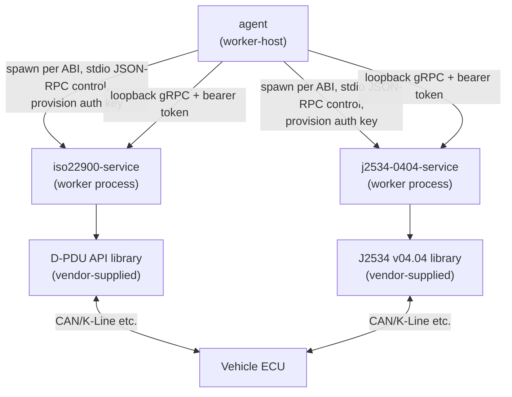
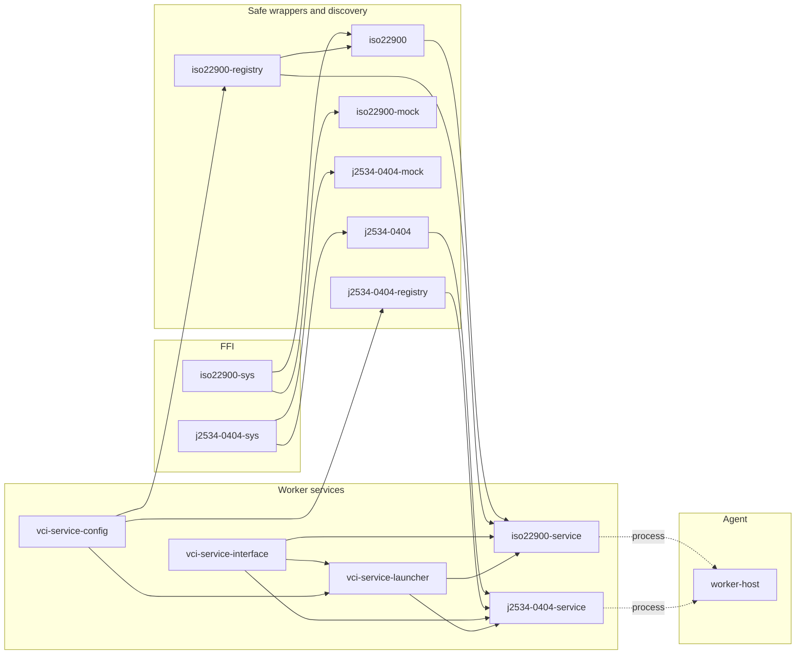
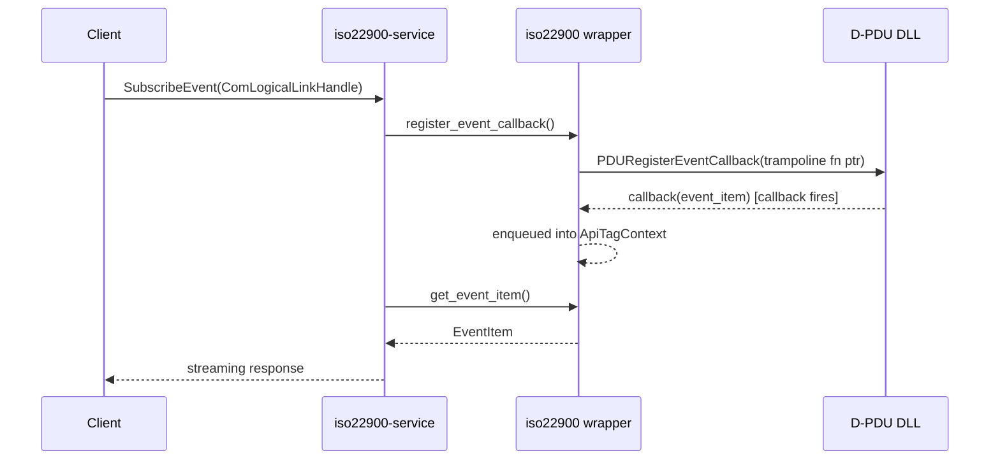

# Worker Crates

The crates that give the worker (design 3.4 / 7.3) access to vendor libraries: J2534 v04.04 and
ISO 22900 D-PDU API FFI bindings, safe wrappers, library discovery, and the two gRPC services
that run as worker processes. Both services expose the D-PDU API, so the agent drives either kind
of library through one interface (`rpc-api-guide.md`).



The agent starts one service process per library, built for the library's ABI (design 7.3), and
hands it a per-instance key over stdin. The gRPC listener binds to loopback only and accepts only
bearer tokens signed with that key (ADR-052, ADR-221). The agent's client (`worker-host`'s
`client` module) mints a fresh token from the key for every call; the token format is defined once
in `vci-service-interface` (`token` module), which both the client and the listener use (ADR-231).

| Layer | ISO 22900 | J2534 v04.04 | Shared |
|---|---|---|---|
| gRPC service (worker binary) | `iso22900-service` | `j2534-0404-service` | `vci-service-launcher`, `vci-service-interface`, `vci-service-config` |
| Discovery | `iso22900-registry` | `j2534-0404-registry` | |
| Safe wrapper | `iso22900` | `j2534-0404` | |
| FFI bindings | `iso22900-sys` | `j2534-0404-sys` | |
| Test double | `iso22900-mock` | `j2534-0404-mock` | |

Related documents:

| Document | Content |
|---|---|
| `rpc-api-guide.md` | gRPC interface of the worker services (`vci-service-interface`), call by call |
| `j2534-0404-architecture.md` | How `j2534-0404-service` maps the D-PDU API onto J2534 v04.04 |
| `j2534-2-support-plan.md` | J2534-2 feature areas covered, per phase and protocol family |
| `glossary.md` | D-PDU API / J2534 terms |
| `adr/` | Design decisions, cited from code and documents as `ADR-NNN` (`adr/INDEX.md` lists them by theme) |
| `crates/<crate>/docs/` | Per-crate implementation notes and detailed designs |

Spec references: ISO 22900-2 (2009 and 2022) and SAE J2534-1 / J2534-2 are cited by clause
number and paraphrased; the converted texts are in the `vehicle-comm-specs` repository. Never
copy spec text verbatim into code, documents or commit messages (the standards are copyrighted).

Notes, code comments and ADRs often record where a change came from (PR numbers, review rounds,
"Codex review", "edge-case-hunter" and similar). These refer to the earlier development history
of these crates, which is not part of this repository; read them as provenance only. Mentions of
"the backlog" or "Prioritized Backlog" likewise mean the list of open items for these crates,
which is kept with the project's working material rather than in the design documents.

---

## Crate Details

### ISO 22900

#### `iso22900-sys`
| Item | Description |
|------|------|
| Role | FFI bindings for the ISO 22900 D-PDU API native DLL |
| Responsibility | Dynamic loading via `libloading`, C function pointer definitions |
| Key types | `DPduApiSys` (aggregate of function pointers) |
| Notes | Can be regenerated from headers when the `bindgen` feature is enabled |

#### `iso22900`
| Item | Description |
|------|------|
| Role | Type-safe safe layer (Safe Wrapper) for the D-PDU API |
| Responsibility | Handle management, parameter abstraction, event callback registration, IOCTL |
| Key types | `DPduApi`, `ModuleHandle`, `ComLogicalLinkHandle`, `ComPrimitiveHandle`, `ComParam`, `EventItem`, `IoCtl*Data` |
| Dependencies | `iso22900-sys`, `iso22900-registry`, `roxmltree`, `url`, `winreg` |

#### `iso22900-mock`
| Item | Description |
|------|------|
| Role | D-PDU mock implementation for testing/CI |
| Responsibility | Fake implementation of C-ABI-compatible PDU functions, call-count counters, event queue |
| Build artifacts | `cdylib` (native DLL) + `rlib` |

#### `iso22900-registry`
| Item | Description |
|------|------|
| Role | Discovery/parsing of installed D-PDU libraries |
| Responsibility | XML metadata parsing, Windows registry lookup, architecture selection, `library_path` setting lookup in `config.toml` |
| Key types | `PduLibraryInfo` (includes `source: LibrarySource`), `LibrarySource`, `LibraryArch`, `RegistryViewMode` |
| Key functions | `find_library_path(arch, lib)`, `find_pdu_libraries(name)`, `resolve_library_path(arch, lib)`, `list_configured_libraries()`, `enumerate_libraries(mode)` — `find_library_path`/`list_configured_libraries` are thin wrappers that delegate to `vci-service-config` (with the api name fixed to `"iso22900"`). `resolve_library_path` is an integration function for callers (ADR-035) that prefers `find_library_path` and falls back to `find_pdu_libraries`'s RDF-based resolution only when that returns `None`. `enumerate_libraries` is an enumeration function that returns a `Vec<PduLibraryInfo>` merging RDF-based auto-discovery with `config.toml`'s `library_path` settings (both at the api level and the arch level), used for discovery (ADR-036) |
| Dependencies | `roxmltree`, `url`, `vci-service-config`, `winreg` (Windows), `tracing` |
| Notes | The Root Description File path is resolved from the Windows registry (`HKLM\SOFTWARE\D-PDU API\Root File`) or, on non-Windows platforms, the fixed path `/etc/pdu_api_root.xml` (overriding via an environment variable has been removed). The `library_path` setting in `config.toml` is loaded via `vci-service-config` (ADR-034). `enumerate_libraries` falls back to `Vec::new()` on RDF-side auto-discovery errors, so libraries defined only in `config.toml` are always enumerated even if the RDF is broken or missing (ADR-036) |

#### `iso22900-service`
| Item | Description |
|------|------|
| Role | Exposes the D-PDU API as a gRPC service |
| Responsibility | RPC handlers, Proto ↔ Rust type conversion, event streaming, session management |
| Submodules | `convert`, `events`, `handles`, `ioctl`, `rpc`, `rpc_link`, `rpc_misc`, `rpc_module`, `rpc_primitive` |
| Dependencies | `iso22900`, `iso22900-registry`, `vci-service-launcher`, `vci-service-interface`, `tonic`, `tokio` |
| Notes | Library path resolution is consolidated into a single `iso22900_registry::resolve_library_path()`. If a `[config.apis.iso22900.libs.<lib>].library_path` setting exists in `config.toml`, that result takes priority; otherwise it falls back internally to RDF-based resolution (ADR-034, ADR-035) |

---

### J2534 v04.04

#### `j2534-0404-sys`
| Item | Description |
|------|------|
| Role | FFI bindings for J2534 v04.04 |
| Responsibility | Dynamic loading via `libloading`, C type definitions |
| Notes | `abi.rs` wraps the generated API in a facade that converts the `unsigned long` width at run time (see `unsigned long` width below) |

#### `j2534-0404`
| Item | Description |
|------|------|
| Role | Type-safe safe layer for J2534 |
| Key types | `DeviceId`, `ChannelId`, `PeriodicMessageId`, `MessageFilterId`, `StatusCode`, `PassThruMessage` |
| Notes | ISO-TP flow control is supported via the `iso15765` submodule |

#### `j2534-0404-mock`
| Item | Description |
|------|------|
| Role | J2534 v04.04 mock implementation for testing/CI |
| Responsibility | Fake implementation of C-ABI-compatible PassThru functions |
| Build artifacts | `cdylib` (native DLL) + `rlib` |
| Notes | On Windows the DLL pins itself (`GetModuleHandleExW` with `PIN`) before starting a repeat-message worker thread, because tests unload the library while that thread may still run. Both mocks look for the built library in the nearest ancestor `target/` directory. It stays separate from `sim-vci`, the simulated VCI the agent's end-to-end tests load: the two differ in `unsigned long` width, response model, test control and CI scope (ADR-260, `crates/sim-vci/docs/simulated-vci.md`) |

#### `j2534-0404-registry`
| Item | Description |
|------|------|
| Role | Discovery of installed J2534 v04.04 libraries |
| Responsibility | Enumeration of the Windows registry key `SOFTWARE\PassThruSupport.04.04`, `library_path` setting lookup in `config.toml` |
| Key types | `J2534DeviceInfo` (includes `source: LibrarySource`), `LibrarySource`, `LibraryArch`, `RegistryViewMode` |
| Key functions | `find_library_path(arch, lib)`, `find_j2534_device(name)`, `resolve_library_path(arch, lib)`, `list_configured_libraries()`, `enumerate_libraries(mode)` — `find_library_path`/`list_configured_libraries` are thin wrappers delegating to `vci-service-config` (api name fixed to `"j2534-0404"`). `resolve_library_path` is an integration function for callers (ADR-035) that prefers `find_library_path` and falls back to `find_j2534_device`'s registry-based resolution only when that returns `None`. `enumerate_libraries` is an enumeration function returning a `Vec<J2534DeviceInfo>` that merges registry auto-discovery with `config.toml`'s `library_path` settings (both api-level and arch-level), used for discovery (ADR-036) |
| Dependencies | `tracing`, `vci-service-config`, `winreg` (Windows) |
| Notes | Library path resolution is consolidated into a single `j2534_0404_registry::resolve_library_path()`. `j2534-0404-service` falls back internally to registry enumeration only when there's no `library_path` setting in `config.toml`. The `library_path` setting itself is loaded via `vci-service-config` (ADR-034, ADR-035). `enumerate_libraries` falls back to `Vec::new()` on registry-side auto-discovery errors (e.g. `RegistryUnsupported` on non-Windows), so libraries defined only in `config.toml` are always enumerated regardless of platform (ADR-036) |

#### `j2534-0404-service`
| Item | Description |
|------|------|
| Role | J2534 v04.04 gRPC service (D-PDU API → J2534 adapter) |
| Responsibility | RPC handlers, protocol name/ComParam resolution, physical channel sharing, event polling, CAN channel operating-mode control |
| Submodules | `rpc_module`, `rpc_link`, `rpc_primitive`, `rpc_misc`, `events`, `names`, `comparam_support`, `can_mode`, `isotp` |
| Dependencies | `j2534-0404`, `j2534-0404-registry`, `vci-service-launcher`, `vci-service-interface`, `tonic`, `tokio`, `portable-atomic` |
| Notes | Channel assignment for CAN-bus-family protocols can be selected via `config.toml`'s `can_channel_mode` (`single-channel` (default) / `dual-channel` / `software-isotp` / `auto`). `auto` attempts to also open a companion CAN channel on the first ISO15765-family CLL connect, falling back to `dual-channel`/`single-channel`-equivalent behavior depending on success (it never auto-transitions to `software-isotp`). Under `software-isotp`, the service-side `isotp` module performs ISO 15765-2 USDT processing (segmented send, flow control, reassembly, supporting both normal and extended addressing) (ADR-046, ADR-047). `device_epoch`'s `AtomicU64` comes from `portable-atomic`, not `std` — `std::sync::atomic::AtomicU64` doesn't exist on `armv5te-unknown-linux-gnueabi` (ADR-107 addendum (h)). `examples/` holds pure-gRPC-client demo binaries (connecting to an already-running service process, unlike `tests/live_grpc_flow.rs`'s embedded-server harness) with shared connect/lifecycle boilerplate in `examples/common/mod.rs`; covers all 14 non-`ANALOG_IN` J2534 protocol families: `grpc_can`/`grpc_iso15765`/`grpc_iso9141`/`grpc_iso14230`/`grpc_j1850vpw`/`grpc_j1850pwm`/`grpc_sci`/`grpc_uart_echo_byte`/`grpc_honda_diagh`/`grpc_j1708`/`grpc_j1939`/`grpc_tp2_0`/`grpc_gm_uart`/`grpc_ethernet_ndis` |

---

### Common Infrastructure

#### `vci-service-interface`
| Item | Description |
|------|------|
| Role | Single Source of Truth for the gRPC service definition |
| Responsibility | Defines 30+ RPC methods in `service.proto`, code generation via prost |
| Key RPCs | Module management, logical links, com primitives, parameters, events, IOCTL, timestamps |
| Notes | Uses bidirectional streaming RPC for event subscription. `src/rich_error.rs` implements the rich gRPC error model (`status_with_error_detail`/`error_detail_from_status`), hand-writing minimal `google.rpc.Status`/`google.protobuf.Any` prost messages rather than vendoring a second `.proto` compilation unit (ADR-105) |

#### `vci-service-config`
| Item | Description |
|------|------|
| Role | Loading `config.toml` (logging config, `library_path` overrides, `can_channel_mode`, J2534 v04.04 module selection, vendor STRUCTFIELD entry sizes, vendor IOCTL native contracts) |
| Responsibility | Config file path resolution (`config-root-*` feature, build-time `VCI_CONFIG_PATH` default `nekoguruma/config.toml`, debug-build-only runtime override), the fixed J2534 registration-definition directory (`/etc/nekoguruma/j2534`, ADR-228), the fixed D-PDU API root description file on Linux (build-time `NGR_PDU_API_ROOT_FILE`, default `/etc/pdu_api_root.xml`, ADR-228), TOML parsing, priority-ordered lookup, flat `[config.manager]` lookup |
| Key functions | `find_logging_config()`, `find_library_path()`, `find_can_channel_mode()`, `find_modules()`, `find_vendor_struct_type_size()`, `find_vendor_ioctls()`, `list_configured_libraries()`, `list_configured_library_paths()`, `manager_config()`, `j2534_definition_dir()`, `pdu_api_root_file()`, `system_config_dir()` |
| Dependencies | `serde`, `toml` (`windows-sys` on Windows only). Does not depend on `tonic`/`tokio`/`vci-service-interface` |
| Notes | Extracted as an independent crate from config-loading logic that originally lived inside `vci-service-launcher` (ADR-033). `vci-service-launcher` re-exports it via `pub use vci_service_config as config;`, so existing `vci_service_launcher::config::*` calls (logging config) continue to work unchanged. `library_path` lookup is exposed by `iso22900-registry` / `j2534-0404-registry` as thin wrappers each with a fixed API name (ADR-034; see `crates/vci-service-config/docs/logging-config.md` for details). `manager_config()` reads a flat `[config.manager]` table (`bind`/`root_path`, ADR-073) that the worker services do not use. `find_modules()` resolves the `[[config.apis.j2534-0404.libs."<lib>".modules]]` array-of-tables (`ModuleConfigEntry{label,pname}`) that `j2534-0404-service` uses to pre-declare connectable modules and their `PassThruOpen` `pName` connection-target strings, since J2534 v04.04 has no runtime device-enumeration API (ADR-107). `find_vendor_struct_type_size()` resolves the `[config.apis.iso22900.libs."<lib>".vendor_struct_types]` table (keyed by `"0x<8 lowercase hex digits>"`, matching the gRPC `type_url` grammar) that `iso22900-service` consults as the sole source of its vendor STRUCTFIELD ComParam entry-size resolution, for both `GetComParam`/`GetUniqueRespIdTable` reads and `SetComParam`/`SetUniqueRespIdTable` writes (ADR-218, as amended to remove a process-lifetime write cache found to be a local heap-disclosure vector). `find_vendor_ioctls()` returns the whole `[config.apis.j2534-0404.libs."<lib>".vendor_ioctls]` table (keyed the same way, each entry a `VendorIoctlConfigEntry{shape,input_bytes,output_bytes}`) that `j2534-0404-service` loads and fail-fast validates once at startup as the sole source of each vendor IOCTL command's native buffer shape/sizes — required for any vendor IOCTL carrying a non-NULL buffer, since neither the client-selected raw-vs-`SBYTE_ARRAY` shape nor a fixed capacity cap is safe to trust for that (ADR-219, as amended) |

#### `vci-service-launcher`
| Item | Description |
|------|------|
| Role | Common startup template for services |
| Responsibility | Takes a `VciServer` trait implementation and starts the gRPC + JSON-RPC server |
| Key functions | `start_service::<T: VciServer>()`, `config::find_logging_config()` (re-export of `vci-service-config`) |
| Dependencies | `vci-service-config`, `vci-service-interface`, `tonic`, `tokio` |
| Notes | gRPC starts over the network, JSON-RPC over stdio, simultaneously. `config::find_library_path()` is also re-exported, but since ADR-034 `j2534-0404-service` and `iso22900-service` no longer call it directly — instead they call `resolve_library_path()` on `j2534-0404-registry` / `iso22900-registry` (an integration function that folds in config-first-then-auto-discovery-fallback) (ADR-035; see `crates/vci-service-config/docs/logging-config.md` for details) |

---

## Target ABIs

Both `-sys` crates carry pre-generated bindings (`src/bindings/{target}.rs`) for every target a
worker is built for:

| Target | Notes |
|---|---|
| `x86_64-pc-windows-gnullvm`, `i686-pc-windows-gnullvm` | Windows workers (LLP64), LLVM/MinGW toolchain, cross-built on Linux (ADR-227) |
| `x86_64-pc-windows-msvc`, `i686-pc-windows-msvc` | Bindings only; not a worker target (ADR-227) |
| `x86_64-unknown-linux-gnu`, `aarch64-unknown-linux-gnu` | LP64 Linux (see `unsigned long` width below) |
| `i686-unknown-linux-gnu`, `armv7-unknown-linux-gnueabihf`, `armv5te-unknown-linux-gnueabi` | 32-bit Linux |

Regenerate with `cargo build -p <crate> --features bindgen --target <target>` after a header
edit (libclang 18; a cross Linux target needs its libc headers, for example
`BINDGEN_EXTRA_CLANG_ARGS_aarch64_unknown_linux_gnu=--sysroot=/usr/aarch64-linux-gnu` with
Ubuntu's `libc6-dev-*-cross` packages (the variable's suffix is the target with `-` replaced by
`_`), or `BINDGEN_EXTRA_CLANG_ARGS=-ffreestanding` without a sysroot).
`Cargo.lock` resolves bindgen's `syn` to 2.x, the major version `prettyplease` 0.2 uses; if a
lockfile update moves bindgen to `syn` 3, the `bindgen` feature no longer compiles (the normal
build, which uses the committed files, is unaffected). Without the feature the build expects the
committed file and fails if it is missing. CI builds both services for six of these targets.

D-PDU API enums (`E_PDU_*` newtypes) are `c_int` on `*-windows-msvc` and `c_uint` elsewhere
(ADR-108), so code and tests must not assume one signedness; literals such as `0x8000_xxxx` are
cast through `u32`.

### `unsigned long` width

The J2534 header declares `unsigned long` as a 32-bit integer. That matches Windows and 32-bit
Linux, but an LP64 Linux library built with the native type uses 8 bytes (design 7.1.2).
`j2534-0404-sys/src/abi.rs` provides `J2534Api0404`, a facade with the same `u32`-based method
signatures as the generated binding, which `j2534-0404` uses in its place:

- `NGR_J2534_LONG_SIZE` (`LONG_SIZE_ENV`) selects the width per process: unset or `4` calls the
  library directly; `8` (64-bit non-Windows targets only) loads it through 64-bit shadow
  structures and converts every argument at the FFI boundary. The agent sets it when it
  launches the worker (`worker-host`).
- In 64-bit mode, `PassThruIoctl` converts the structures of every IOCTL ID defined by J2534-1
  and J2534-2. A vendor-specific IOCTL ID passes only when both data pointers are null;
  otherwise it returns `ERR_NOT_SUPPORTED`, because its layout is unknown.

## Crate Dependencies



`worker-host` has no build dependency on the services: it starts their binaries and talks to them
over stdio and gRPC.

---

## Event Notification Flow

D-PDU events (such as com primitive completion) are notified asynchronously via callbacks.



---

## Design Patterns

### Sys / Wrapper Separation Pattern
Each protocol is split into a `-sys` crate (unsafe FFI) and a higher-level safe wrapper crate.
- unsafe code is concentrated in `-sys`; every layer above it is safe Rust
- bindings can be regenerated from header files via the `bindgen` feature
- testability is ensured by swapping in mocks

### Opaque Handle Pattern
```rust
pub struct ModuleHandle(UNUM32);
pub struct ComLogicalLinkHandle(UNUM32);
```
Handles are wrapped in newtypes to achieve type-safe ID management.

### Service Bootstrap Template
`vci-service-launcher::start_service::<T: VciServer>()` uniformly starts the gRPC + JSON-RPC server.
A new protocol's service can be added simply by implementing the `VciServer` trait.

### Process Isolation
Each library runs in its own service process, built for the library's ABI. A crash or an ABI
mismatch in a vendor library stays inside that process (design 3.4, 7.3).
The agent (`worker-host`) launches and stops these processes itself; there is no separate
service manager process. Only J2534 v04.04 and the D-PDU API are covered; J2534 v05.00 is not.
